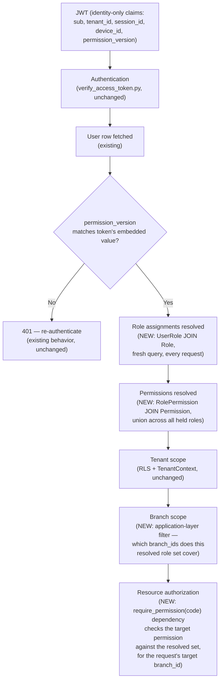

# RestaurantOS — RBAC Foundation Architecture

**Document type:** Pre-implementation architecture (Sprint 5, Step 2 planning)
**Status:** Planning only — no production code, no migrations, no database tables, no API endpoints exist yet as a result of this document
**Branch:** `feature/restaurant-platform`
**Supersedes/extends:** [Product Blueprint](product-blueprint.md) · [Technical Architecture v2.0](technical-architecture-v2.md) · [Data Architecture v2.0](data-architecture-v2.md) · [Data Architecture v1.0 (superseded, base entity catalogue)](superseded-data-architecture-v1.md) · [`RestaurantOS_Restaurant_Platform_Architecture.md`](RestaurantOS_Restaurant_Platform_Architecture.md) · [`docs/AI_HANDOFF.md`](../AI_HANDOFF.md)

---

## 0. How This Document Was Produced

Read in full or targeted against specific sections, per the same "use the actual codebase as truth" discipline as the prior planning pass:

1. **Product Blueprint** — personas (§3), business rules (§13, especially BR-3/BR-5/BR-10/BR-14/BR-18 — every one of them is an authorization rule with no schema behind it yet), Screen Inventory §7.10 (Roles & Permissions, Audit Log Viewer).
2. **Technical Architecture v2.0 Group C** — permission versioning and session revocation, re-read in full: identity-only JWT claims, the `permission_version` Redis-propagation design, PIN lockout, device binding.
3. **Data Architecture v2.0 Group F** — the exact `UserRole`/`RolePermission` uniqueness fix (`UNIQUE NULLS NOT DISTINCT (user_id, role_id, branch_id)`) this document applies rather than reinvents.
4. **`RestaurantOS_Restaurant_Platform_Architecture.md`** — §12 (this exact gap, first identified there), §4.4 (branch authorization's "application-layer, not RLS" reasoning, reused unchanged here), §2.1 (module ownership).
5. **`docs/AI_HANDOFF.md`** — Decision C's full text, and the disclosed scope boundary: "`VerifyAccessTokenUseCase`'s `permission_version` check is a direct PostgreSQL read, not the Redis-cached version Technical Architecture v2.0 Group C envisions at scale."
6. **Existing Identity Platform implementation, read directly:**
   - `modules/identity/application/use_cases/verify_access_token.py` — the exact authentication + `permission_version` check, in full.
   - `modules/identity/presentation/dependencies.py` — `require_authenticated_user`, `require_platform_admin`, and the DI pattern every new dependency in this document follows.
   - `modules/identity/infrastructure/security/jwt_token_service.py` — the actual JWT claim set: `sub`, `tenant_id`, `session_id`, `device_id` (optional), `permission_version`. **`token_family` (named in Technical Architecture v2.0 Group C's prose) is not actually implemented** — disclosed here rather than assumed present.
   - `modules/identity/README.md` — contains a direct, load-bearing quote (§2 below).
7. **Existing authorization checks** — `require_platform_admin` is the only one that exists; it is a single boolean check, not a role/permission lookup.
8. **Existing database model** — `grep`-verified: no `roles`, `permissions`, `role_permissions`, or `user_roles` table exists. `users.permission_version` and `users.is_platform_admin` both exist and are both live, checked columns (not aspirational).
9. **ADRs** — `docs/architecture/adr/` confirmed empty; no prior ADR to reconcile against.
10. **Migrations** — `0001`, `0002` exist. The prior planning document assumed Restaurant Platform's own schema would be `0003`; **this document changes that** — see §15.

---

## 1. Executive Summary

This is a documentation-only design pass closing the one Critical dependency the Restaurant Platform architecture pass identified: **no RBAC exists in the codebase.** `users.is_platform_admin` is a single boolean that correctly solved Tenant Administration's one-role problem (Sprint 4.1 Decision C) but structurally cannot express Waiter vs. Branch Manager vs. Restaurant Manager vs. Kitchen Staff, each with a different, sometimes branch-specific, scope.

This document designs `Role`, `Permission`, `RolePermission`, `UserRole` — the exact four entities the base Data Architecture catalogue already reserved for this purpose (confirmed via a direct quote from the identity module's own README, written during Sprint 3, before Restaurant Platform existed as a concept: *"`UserRole`'s optional branch-scoping depends on the Restaurant module's `branches` table, which doesn't exist yet; RBAC (authorization) has no consumer until a protected, non-auth route exists. Tracked as a follow-up PR."* — this document is that follow-up).

**Everything in this design reuses existing infrastructure.** Permission changes take effect without a new propagation mechanism because they reuse `permission_version` and `UserRepository.bump_permission_version` (both already implemented). Authorization decisions reuse the existing `Depends()`-based dependency pattern (`require_platform_admin`'s exact shape). Branch-level authorization reuses the "application-layer, not RLS" reasoning the prior document already established. No new isolation layer, no new token format, no new caching mechanism is introduced.

**`is_platform_admin` is not removed or touched.** It continues to gate the existing Tenant Administration surface exactly as today. A migration path toward eventually folding it into RBAC as a true platform-wide role is proposed, but explicitly deferred — see §10.

---

## 2. Current Authorization State (verified against the codebase, not assumed)

| Mechanism | Status | Evidence |
|---|---|---|
| JWT-based authentication | **Implemented** | `jwt_token_service.py`, `verify_access_token.py` |
| `permission_version` staleness check | **Implemented** | `verify_access_token.py:72-73` compares `user.permission_version` against the token's embedded value on every request |
| `UserRepository.bump_permission_version` | **Implemented** | Confirmed via `modules/identity/README.md`: "the schema column and the bump mechanism exist" |
| Redis-cached `permission_version` propagation (Technical Architecture v2.0 Group C's sub-second guarantee) | **Not implemented** | Same README: "the Redis cache-aside layer in front of it is an independent, addable-later optimization" — the check today is a direct Postgres read, correct but not the eventual performance target |
| `is_platform_admin` boolean gate | **Implemented** | `dependencies.py`'s `require_platform_admin`, gates every `admin_tenant_router.py` route |
| `Role` / `Permission` / `RolePermission` / `UserRole` tables | **Not implemented** | `grep -rn "class.*Role\|class.*Permission"` across `modules/identity/` returns nothing |
| Any authorization check finer than "is this user the platform admin" | **Not implemented** | No consumer exists — confirmed by the README quote in §1 |
| `devices` table / device-level authorization (Technical Architecture v2.0 Group L) | **Not implemented** | No `devices` table exists; `device_id` is an optional JWT claim only, not yet cross-checked against a device registry |
| `platform/audit/` (AuditEvent persistence) | **Not implemented** | Confirmed in the prior planning document (§11) and unchanged since |

---

## 3. RBAC Goals

1. Express the Blueprint's named roles (Owner, Restaurant Manager, Branch Manager, Waiter, Cashier, Kitchen Staff, Bartender) as real, checkable grants — not a boolean.
2. Support the exact scoping shape the user's instruction demonstrated: one user holding a tenant-wide role and multiple branch-specific roles simultaneously.
3. Make permission changes effective without waiting for token expiry, using the mechanism already built for this (`permission_version`), not a new one.
4. Keep `is_platform_admin` working, unmodified, while opening a path to eventually retire it.
5. Extend, not duplicate, every existing pattern: mixins, RLS, the `Depends()` authorization chain, the Outbox/event contract, the migration discipline.
6. Do not block Restaurant Platform's own implementation on anything beyond what RBAC itself strictly needs.

---

## 4. Domain Model

Every entity composes the existing mixins (`ULIDPrimaryKeyMixin`, `TimestampMixin`, `SoftDeleteMixin`) plus `TenantScopedMixin` **where applicable** — one entity in this model (`Permission`) deliberately does not carry `tenant_id` at all, for a specific, stated reason (§4.2).

### 4.1 Role

| Field | Purpose / Owner / Relationship |
|---|---|
| Purpose | A named, grantable bundle of permissions (base catalogue, Data Architecture v1.0 §3.1, unchanged in shape). |
| Ownership | Identity Platform (RBAC is authorization, which belongs alongside authentication — the prior document's own boundary rule, applied to itself). |
| Tenant relationship | `tenant_id` **nullable** — `NOT NULL` for a tenant's own roles (system-seeded defaults or tenant-custom roles the Blueprint's "Roles & Permissions" screen lets an Owner create); `NULL` for a platform-wide role. **No platform-wide `Role` row is created by this pass** — `is_platform_admin` remains the sole platform-level mechanism for now (§10). The nullable column exists so that path is open later without a schema change. |
| Branch relationship | None on `Role` itself — a role's grantable scope (tenant-wide vs. branch-specific) is expressed at grant time by `UserRole.branch_id`, not declared on the role definition. `Role.default_scope` (below) is an informational hint only, not a structural constraint — see §7's reasoning for why. |
| Lifecycle | `created (system-seeded or tenant-custom) → edited → retired`. |
| Required fields | `name`, `default_scope` (`'tenant'` \| `'branch'`, informational), `is_system` (boolean — distinguishes the 7 Blueprint-named default roles, seeded per tenant at onboarding, from a tenant's own custom roles, matching the Blueprint's own "Create custom role" action). |
| Relationships | `Tenant ||--o{ Role` (optional, nullable FK); `Role ||--o{ RolePermission}`; `Role ||--o{ UserRole}`. |
| Unique constraints | `UNIQUE NULLS NOT DISTINCT (tenant_id, name)` — a tenant cannot have two roles with the same name; two platform-wide roles (both `tenant_id IS NULL`) cannot share a name either, which plain `UNIQUE` would not catch (Postgres treats two `NULL`s as distinct by default) — the exact same reasoning Data Architecture v2.0 Group F already applied to `UserRole`'s own uniqueness, reused here for a different column pair. |
| Foreign keys | `tenant_id → tenants.id`. |
| ON DELETE | `RESTRICT` — a `Role` referenced by any `UserRole`/`RolePermission` must not disappear out from under an active grant; retirement is soft-delete, matching Data Architecture v2.0 Group G's "Soft-lifecycle reference/config row referenced by any historical fact → RESTRICT." |
| Soft delete | `Soft`. |
| Audit | `role.created`, `role.updated`, `role.retired` — see §12. |
| RLS | **Adjusted, not standard** — see §14.2 for why the usual `tenant_id = current_setting(...)` predicate alone would hide every platform-wide role from every tenant-scoped query. |

### 4.2 Permission

| Field | Purpose / Owner / Relationship |
|---|---|
| Purpose | A single, granular, platform-defined capability — never tenant-editable (base catalogue, unchanged). |
| Ownership | Identity Platform. |
| Tenant relationship | **None — no `tenant_id` column at all.** `Permission` is pure platform reference data, exactly like `Currency` (which also has no `tenant_id`) — a permission code means the same thing for every tenant; there is no tenant-scoped variant of "can manage a branch." |
| Branch relationship | None. |
| Lifecycle | `defined at platform level, versioned with releases` (base catalogue, unchanged) — `is_active` (below) allows retiring a permission code without breaking historical `RolePermission` rows, since `ON DELETE RESTRICT` would prevent hard-deleting one that's still granted anyway. |
| Required fields | `code` (primary key — see below), `module` (`restaurant` \| `pos` \| `inventory` \| … — for the future Roles & Permissions screen's grouping/filtering), `description`, `is_active`. |
| Relationships | `Permission ||--o{ RolePermission}`. |
| Unique constraints | `code` is itself the primary key (see below), inherently unique. |
| Foreign keys | None (it is the referenced side of every FK pointing at it). |
| ON DELETE | N/A (nothing deletes a `Permission` in the normal product flow — `is_active = false` is the retirement path). |
| Soft delete | `N/A` — platform reference data, matches the base catalogue's own `Permission` classification exactly (`N/A (platform reference data)`), not `Soft`. |
| Audit | Permission catalogue changes ship with code releases (a migration), not a runtime admin action — no `AuditEvent` needed for creation; **granting/removing a permission to/from a Role** is audited (§12), which is a different, runtime event. |
| RLS | **None** — no `tenant_id` column means RLS is not applicable, exactly like `currencies` today. |

**A deliberate deviation from the universal `ULIDPrimaryKeyMixin` convention:** `Permission.code TEXT PRIMARY KEY` (e.g. `"branch.manage"`), not a ULID. This mirrors the one other precedent for a human-referenced, code-as-primary-key reference table already in this schema — `ChartOfAccount.account_code` (Data Architecture v2.0 Group I) — for the identical reason: permission codes are referenced directly in application code (`require_permission("branch.manage")`), not looked up by an opaque generated id, and a small, fixed, platform-seeded set gains nothing from ULID's time-sortability (which exists specifically for high-volume, client-mintable, offline-originated rows — the opposite of what `Permission` is).

### 4.3 RolePermission

| Field | Purpose / Owner / Relationship |
|---|---|
| Purpose | Join table granting a `Permission` to a `Role` (base catalogue, unchanged). |
| Ownership | Identity Platform. |
| Tenant relationship | None directly — implicitly scoped via `role_id`'s own `tenant_id` (nullable, per Role). No `tenant_id` column on this table itself, to avoid a redundant, potentially-inconsistent denormalization for a low-cardinality join table that's always reached via its `Role`. |
| Branch relationship | None. |
| Lifecycle | `created/removed as role definitions change` (base catalogue, unchanged). |
| Required fields | `role_id`, `permission_code`. |
| Relationships | `Role ||--o{ RolePermission}`, `Permission ||--o{ RolePermission}`. |
| Unique constraints | `UNIQUE (role_id, permission_code)` — Data Architecture v2.0 Group F, applied exactly as originally specified, no change. |
| Foreign keys | `role_id → roles.id`, `permission_code → permissions.code`. |
| ON DELETE | `role_id`: `CASCADE` (pure join row, no independent audit value beyond the `Role` it represents — Group G's own stated rule for exactly this shape of table). `permission_code`: `RESTRICT` (a `Permission` referenced by an active grant must not silently vanish — matches `Permission.is_active` being the actual retirement mechanism). |
| Soft delete | `Hard` — matches the base catalogue's own classification for `RolePermission` ("pure join row, no independent audit weight — the Role edit itself is audited"). |
| Audit | `permission.granted_to_role`, `permission.removed_from_role` — see §12 (the audit lives at the *action* level, not the row's own lifecycle, per the base catalogue's own stated reasoning). |
| RLS | Not directly applicable (no `tenant_id` column) — access is gated by the API layer resolving through `role_id`'s own tenant scope, not a database policy on this table. |

### 4.4 UserRole

| Field | Purpose / Owner / Relationship |
|---|---|
| Purpose | Join table assigning a `Role` to a `User`, optionally scoped to a specific `Branch` (base catalogue, unchanged) — **this is the entity that makes the user's exact example possible**, one row per (role, scope) pair. |
| Ownership | Identity Platform. |
| Tenant relationship | `tenant_id`, **required**, denormalized (matching every other branch-adjacent table's own denormalization pattern established in the Restaurant Platform document) — even though it's derivable transitively via `user_id`, an explicit column keeps this table's RLS policy identical in shape to every other tenant-scoped table, rather than a special case requiring a join to enforce isolation. |
| Branch relationship | `branch_id`, **nullable** — `NULL` = tenant-wide grant; set = branch-specific grant. This single nullable column is the entire mechanism behind the user's example: three `UserRole` rows for one user, one with `branch_id IS NULL` (Tenant Owner) and two with distinct `branch_id` values (Branch Manager at Branch A, Waiter at Branch B). |
| Lifecycle | `assigned → revoked` (base catalogue) — revocation triggers a `permission_version` bump (§9), exactly as the base catalogue already anticipated ("revocation triggers Group C's `permission_version` bump"). |
| Required fields | `tenant_id`, `user_id`, `role_id`, `branch_id` (nullable), `granted_at`, `granted_by_user_id` (nullable). |
| Relationships | `User ||--o{ UserRole}`, `Role ||--o{ UserRole}`, `Branch ||--o{ UserRole}` (optional — and, notably, **not yet enforceable this sprint**, since `branches` doesn't exist until Restaurant Platform's own migration lands; see §15 for the resulting ordering decision), `User ||--o{ UserRole}` (as granter, optional). |
| Unique constraints | `UNIQUE NULLS NOT DISTINCT (user_id, role_id, branch_id)` — Data Architecture v2.0 Group F, applied exactly as originally specified. This is what prevents a duplicate grant of the *same* role at the *same* scope, while correctly allowing the *same* role at *different* scopes (two rows, two different `branch_id` values, both distinct under `NULLS NOT DISTINCT` semantics since neither is the literal duplicate the constraint targets) and *different* roles at the *same* scope. |
| Foreign keys | `tenant_id → tenants.id`, `user_id → users.id`, `role_id → roles.id`, `branch_id → branches.id` (nullable), `granted_by_user_id → users.id` (nullable). |
| ON DELETE | `user_id`: `CASCADE` (Group G: "dependent child data with no standalone retention requirement... when their owning User is hard-purged" — matches `Session`/`ApiKey`'s existing treatment exactly; the *normal* revocation path is soft-delete, this only governs the rare GDPR-hard-purge case). `role_id`: `RESTRICT` (a `Role` must not vanish while actively granted). `branch_id`: `RESTRICT` (matches the Restaurant Platform document's own §9.4 treatment of every other FK into `branches` — branches are essentially never hard-deleted in the normal product flow, so `RESTRICT` is the safer, consistent default, not `CASCADE`). `granted_by_user_id`: `SET NULL` (mirrors `orders.customer_id`'s existing precedent — the grant record survives; only the identifying "who granted this" link is severed on a hard-purged granter). |
| Soft delete | `Soft` — base catalogue: "revocation recorded, not deleted, for audit of 'who had what access when.'" |
| Audit | `user_role.assigned`, `user_role.revoked` — see §12. |
| RLS | Standard tenant-level RLS (unlike `Role`, this table has no nullable-tenant wrinkle — every `UserRole` row genuinely belongs to exactly one tenant). |

### 4.5 Additional entities evaluated and *not* introduced

- **A `PermissionGroup`/category table** for organizing the permission catalogue in a future admin UI — `Permission.module` (a plain text column) already gives the future Roles & Permissions screen enough to group/filter by; a full separate entity is unwarranted complexity at foundation depth.
- **A dedicated `RoleAssignmentAudit` entity** — the existing `AuditEvent` mechanism (once built, §12) already covers this; a parallel audit table would duplicate it.
- **A `BranchStaffAssignment` entity** (the original Restaurant Platform candidate list's proposal) — explicitly rejected again here, for the same reason the prior document gave: `UserRole.branch_id` **is** that mechanism.
- **A `restaurant_id` scoping column on `UserRole`** (a third granularity between tenant-wide and branch-specific) — considered and rejected; see §7's explicit reasoning.

---

## 5. Role Model — Scope

### 5.1 Three scope levels, expressed by two mechanisms

| Level | Mechanism |
|---|---|
| Platform-wide | `is_platform_admin` boolean today (unchanged, §10); a future `Role` with `tenant_id IS NULL` if/when migrated |
| Tenant-wide | `UserRole.branch_id IS NULL` |
| Branch-specific | `UserRole.branch_id` set |

**No role is hard-coded to one level.** The same `Role` row (e.g., "Branch Manager") is always granted branch-specifically in practice, but nothing in the schema *forces* that — `Role.default_scope` is a UI/validation hint (§4.1), not a `CHECK` constraint, because a `CHECK` constraint cannot reference another table's row without a trigger, and this document deliberately keeps that judgment at the application layer rather than adding trigger complexity for a rule that's genuinely about UX guidance, not data integrity (unlike, say, `BillAdjustment`'s approval-threshold trigger in Data Architecture v2.0 Group B, which *is* a real integrity rule).

### 5.2 The user's exact example, realized

```mermaid
erDiagram
    USER ||--o{ USER_ROLE : holds
    ROLE ||--o{ USER_ROLE : granted_via

    USER { text id PK, text tenant_id FK }
    ROLE { text id PK, text tenant_id FK "nullable", text name }
    USER_ROLE { text id PK, text user_id FK, text role_id FK, text branch_id FK "nullable" }
```

For one `User`, three `UserRole` rows:

| `user_id` | `role_id` | `branch_id` | Meaning |
|---|---|---|---|
| U1 | Tenant Owner | `NULL` | Tenant-wide |
| U1 | Branch Manager | Branch A | Scoped to Branch A only |
| U1 | Waiter | Branch B | Scoped to Branch B only |

All three coexist without conflict under `UNIQUE NULLS NOT DISTINCT (user_id, role_id, branch_id)` — each triple is genuinely distinct.

---

## 6. Permission Model

### 6.1 Naming convention

`{module}.{action}` — `module` matches `Permission.module`'s own grouping column; `action` is one of a small, fixed vocabulary (`read`, `manage` — a single "manage" action covering create/update/delete/lifecycle-transition, rather than a separate permission per verb, since the Blueprint's own persona table never names a role that can, say, create a branch but not edit one — every role that can mutate a resource at all needs the full mutate surface for it). One deliberate exception: `billing.refund`, kept separate from `billing.manage` because Blueprint BR-3 singles out refunds as requiring approval regardless of a role's general billing access.

### 6.2 Derived catalogue — needed now vs. reserved for future modules

**Needed now (seeded by this document's migration, §15) — Restaurant Platform's own requirements, from `RestaurantOS_Restaurant_Platform_Architecture.md` §7/§8:**

| Code | Module | Covers |
|---|---|---|
| `restaurant.read` / `restaurant.manage` | `restaurant` | Restaurant Setup screen |
| `branch.read` / `branch.manage` | `restaurant` | Branch List/Details, close/reopen |
| `table.read` / `table.manage` | `restaurant` | TableZone, Table, QRCode |
| `menu.read` / `menu.manage` | `restaurant` | MenuCategory, MenuItem, Modifier*, branch pricing/availability overrides |
| `reservation.read` / `reservation.manage` | `restaurant` | Reservation foundation CRUD |
| `roles.assign` | `identity` | Granting/revoking `UserRole` — its own permission, not folded into `branch.manage`/`restaurant.manage`, because "can edit this branch's tables" and "can grant someone else access to this branch" are different-severity actions (§16's privilege-escalation threat) |

**Reserved — named for catalogue completeness (per instruction: derive from Product Blueprint + future POS/KDS/Inventory/Liquor/Reporting), *not* seeded by this migration:**

| Code | Module | Future owner |
|---|---|---|
| `order.read` / `order.manage` | `pos` | POS/Kitchen Platform |
| `billing.read` / `billing.manage` / `billing.refund` | `pos` | POS/Billing Platform (Blueprint BR-3's refund-approval rule) |
| `kitchen.read` / `kitchen.manage` | `kitchen` | Kitchen Platform (KDS) |
| `bar.read` / `bar.manage` | `kitchen` | Bar Display |
| `inventory.read` / `inventory.manage` | `inventory` | Inventory Platform |
| `liquor.read` / `liquor.manage` | `inventory` | Liquor Inventory |
| `purchasing.read` / `purchasing.manage` | `inventory` | Supplier/PurchaseOrder |
| `employee.read` / `employee.manage` | `employees` | Employee Management (distinct from `roles.assign` — HR records vs. authorization grants) |
| `payroll.read` / `payroll.manage` | `employees` | Payroll Export |
| `customer.read` / `customer.manage` | `crm` | CRM Platform |
| `loyalty.read` / `loyalty.manage` | `crm` | Loyalty program |
| `report.read` | `reporting` | Reporting (read-only by nature — no "manage" verb for a report) |
| `expense.read` / `expense.manage` | `finance` | Expense Tracking |
| `device.manage` | `pos` | Terminal/Device pairing |
| `audit.read` | `identity` | Audit Log Viewer |

**Why reserved permissions are not seeded now:** each future module should introduce its own permission rows in its own migration, when it actually exists — pre-seeding 20+ permission codes for modules that don't exist yet would make this RBAC migration implicitly "own" knowledge of every future bounded context, which is exactly the kind of coupling the module-boundary rule (Technical Architecture v2.0 Group E) exists to prevent. The catalogue above is a **design reference**, not a seed list.

### 6.3 Default role → permission mapping (seeded per tenant at onboarding, §15)

| Role | Grant |
|---|---|
| Tenant Owner | All 11 "needed now" permissions, tenant-wide (`branch_id IS NULL` on their own `UserRole` grant) |
| Restaurant Manager | `restaurant.read`, `restaurant.manage`, `branch.read`, `branch.manage`, `table.*`, `menu.*`, `reservation.*` — granted **per branch** (one `UserRole` row per branch under their restaurant), *not* `restaurant.manage`-implies-all-branches, because `UserRole` has no `restaurant_id` scoping level (§7) |
| Branch Manager | `branch.read`, `table.*`, `menu.read` (not `menu.manage` — menu governance is Blueprint BR-10's Owner/Admin-or-tolerance-band concern, not a plain Branch Manager action), `reservation.*` |
| Waiter | `table.read`, `menu.read`, `reservation.manage` |
| Cashier | `table.read`, `menu.read` |
| Kitchen Staff | `menu.read` (availability/86-status only, in practice enforced by which screens consume it — this document does not invent a finer-grained `menu.read.availability_only` permission for one Blueprint-implied UI restriction) |
| Bartender | Same as Kitchen Staff, for the drink-menu subset |

**A deliberate, disclosed limitation:** new permissions added by future modules do **not** automatically flow to Tenant Owner. Each future module's own migration must explicitly re-grant its new permissions to the existing "Tenant Owner" role definition (a `RolePermission` insert against the already-existing row) — stated explicitly here so the next engineer doesn't assume Owner is an implicit wildcard. This trades a small amount of recurring migration work for avoiding invisible privilege escalation via schema change.

---

## 7. Tenant/Branch Scoping — the granularity decision, made explicitly

The base catalogue's `UserRole` design only ever specified two scoping levels: tenant-wide (`branch_id IS NULL`) or branch-specific (`branch_id` set) — **no `restaurant_id` level.** This document considered adding one (a "Restaurant Manager, scoped to all of Restaurant A's branches, automatically including future branches" use case) and **rejected it**, for three reasons:

1. It would deviate from an already-fixed base-catalogue design (`UserRole`'s shape) without a Blueprint requirement forcing the deviation — the user's own worked example only demonstrated two levels.
2. The functional need is still fully satisfiable without it: a Restaurant Manager over Restaurant A's three branches gets **three `UserRole` rows** (same `role_id`, three different `branch_id` values) — more rows, identical end behavior.
3. Adding a third scoping column now, before Restaurant Platform's own schema exists to reference it meaningfully, risks designing it wrong and needing a second change once real usage patterns are known.

**The one real trade-off, disclosed rather than hidden:** a Restaurant Manager's access does not automatically extend to a *newly created* branch under their restaurant — granting them access to a new branch requires one more explicit `UserRole` row. This is captured as a Medium risk (§18) and an explicit future extension point, not a silent gap.

---

## 8. Authorization Flow



### 8.1 Where authorization is evaluated

- **Authentication** (is this a valid, non-stale token) — unchanged, `verify_access_token.py`.
- **Role/permission resolution** — new, but reuses the exact repository-factory-per-request DI pattern already used everywhere else in this codebase. A new `UserRoleRepository`/`RolePermissionRepository` pair, and a new use case (`ResolveUserPermissionsUseCase` or an extension folded into `VerifyAccessTokenUseCase` — this document recommends keeping it **separate**, so the auth check stays focused on "is this token valid," matching the existing file's own stated single-responsibility reasoning for why authentication and tenant-validation are one check but nothing else is folded in).
- **Tenant scope** — unchanged, RLS + `TenantContext`.
- **Branch scope** — new, application-layer only (§4.4's `Restaurant Platform` document reasoning, restated: a Tenant Owner's legitimate cross-branch access means this can never be a fixed RLS predicate).
- **Resource authorization** — a new `require_permission(code: str)` dependency **factory** (returns a dependency, since the required permission code varies per route — unlike `require_platform_admin`, which needs no parameter), composed on top of `AuthenticatedPrincipalDep` exactly the way `require_platform_admin` already composes on top of it today.

### 8.2 What is *not* in the JWT

Per explicit instruction: **no role or permission list is ever embedded in the JWT.** The token carries only `permission_version` — a single integer, unchanged from today. Every request re-resolves the actual role/permission set fresh from Postgres. This is not a new decision this document invents; it is the *existing* stated design (`modules/identity/README.md`: "A caller's current permission set is meant to be resolved per-request against the live `permission_version`, not trusted from the token") — RBAC simply becomes the first real implementation of what was already specified.

---

## 9. `permission_version` Interaction — reusing, not extending, the existing mechanism

**The key realization this document makes explicit:** because no permission cache exists anywhere yet (§2), an RBAC change (a `UserRole` grant/revoke, a `RolePermission` change) is visible on the **very next request** regardless of `permission_version`, simply because nothing caches the old value anywhere — the resolution query in §8 always reads current data. `permission_version`'s actual job is a different, adjacent one: invalidating the **token itself** (forcing re-authentication), which matters for session-revocation-shaped events (deactivation, a security-sensitive role change) more than for routine permission propagation.

**This document's design still bumps `permission_version` on every RBAC-affecting mutation** (`UserRole` grant/revoke, a `RolePermission` change to a role a user actively holds) — not because propagation requires it today, but for two disclosed reasons:
1. **Consistency with the existing pattern** — every other Sprint 4.1 "this changes what a user can do" event (deactivation, role change via `is_platform_admin`) already bumps it; RBAC changes are the same category of event and should behave identically, not introduce a second convention for "sometimes we bump, sometimes we don't."
2. **Future-proofing** — the moment a permission cache (Redis, matching Technical Architecture v2.0 Group C's original intent) is eventually built, its invalidation trigger is already correctly wired, with zero additional design work, because this bump was already happening.

**Mechanically:** every RBAC mutation use case (§13) calls the existing `UserRepository.bump_permission_version(user_id)` in the **same transaction** as the `UserRole`/`RolePermission` write, exactly the same transactional-outbox-adjacent discipline already used for tenant suspension/reactivation (Sprint 4.1). No new mechanism is designed — this section's entire content is "apply the existing one here too," stated explicitly so it isn't missed during implementation.

---

## 10. Platform Admin Migration Strategy

### 10.1 The three options evaluated

| Option | Verdict |
|---|---|
| **A. Temporary compatibility mechanism**, migrated away once RBAC is proven | Rejected as the *near-term* plan — "temporary" with no forcing function tends to become permanent by default, and there is no urgent reason to destabilize a working, simple, well-tested mechanism |
| **B. Permanent platform-level privilege**, coexisting with RBAC indefinitely | Rejected as the *long-term* plan — it leaves the platform with two authorization mechanisms forever, which is exactly the "duplicate authorization" pattern this whole design effort exists to avoid; acceptable as a *medium-term* state, not a destination |
| **C. Eventual migration into RBAC**, as a true platform-wide `Role` (`tenant_id IS NULL`, matching §4.1's reserved nullable column) | **Recommended**, on a deliberately unhurried timeline |

### 10.2 The recommended path

1. **Now (this pass):** `is_platform_admin` untouched. `Role.tenant_id` stays nullable specifically so this path remains open, but no platform-wide `Role` row is created yet.
2. **Once RBAC is live and proven** (post-Sprint-5-Step-2, no earlier): introduce a platform-wide `Role` named `"Platform Admin"` (`tenant_id = NULL`), granted the full "needed now" permission set plus whatever platform-operator-specific permissions exist by then (tenant lifecycle management is already its own thing, outside this document's "needed now" list — Tenant Administration's own routes stay gated by `require_platform_admin` in this phase too).
3. **Dual-check transition period:** `require_platform_admin` is extended (not replaced) to accept *either* `principal.is_platform_admin == True` *or* a resolved `"Platform Admin"` role grant — both valid, neither breaking the other. Existing platform-admin users keep working unchanged.
4. **Backfill:** every user with `is_platform_admin = True` gets a corresponding `UserRole` row granting the new `"Platform Admin"` role — an idempotent, reviewable migration script, not a silent behavioral change.
5. **Only after** every platform-admin user has both the boolean and the role grant, and this has been observed correct in practice, does a *future*, separately-approved migration drop the `is_platform_admin` column. **This document does not schedule step 5** — it is explicitly out of scope, a decision for a later session once RBAC itself has track record.

---

## 11. Offline Authorization (documented only — not implemented)

`apps/admin-web` (where every RBAC-gated screen in the Restaurant Platform document lives) is a **Connected** app — this section describes the design for *future* Edge apps (POS, waiter handheld, KDS), which do not exist yet, exactly mirroring the prior document's own offline-first section's scope discipline.

| Concept | Design |
|---|---|
| **Permission snapshot** | A server-computed, flat set of permission codes for the authenticated user, scoped per branch context — resolved server-side (§8), never computed by the Edge device itself, matching the "server is always authoritative" principle already established for menu/table configuration data. |
| **Permission version** | The snapshot is tagged with the `permission_version` it was resolved at — the existing column, no new versioning scheme. |
| **Device authorization state** | Piggybacks on the *already-architected, not-yet-built* `Device.status` (Technical Architecture v2.0 Group L / Data Architecture v2.0 Group L) — a `lost`/`revoked` device is blocked from syncing or authenticating regardless of the user's own permissions. This document does not build `devices`; it notes the dependency. |
| **Revocation behavior while offline** | A revoked permission cannot be pushed to a disconnected device. The device continues operating on its last cached snapshot until it reconnects — an inherent, disclosed limit of any offline-first design (the same framing Data Architecture v2.0 Group L already used for lost-device data: "explicitly does not (and cannot) recover... an inherent, acknowledged limit"), not a defect specific to this RBAC design. |
| **Offline expiration** | The cached snapshot carries a maximum offline-validity window (illustrative: 24–72 hours, mirroring the Redis Streams retention window precedent, Technical Architecture v2.0 Group D) — past that window, the Edge app refuses further privileged actions until it reconnects, a "fail closed after bounded staleness" policy consistent with Group C's own stated preference ("a Redis outage must fail closed... rather than open"). |
| **Synchronization behavior** | On reconnect, the existing `/sync/push`/`/sync/pull` protocol (Technical Architecture v2.0 Group A, not yet built) includes a permission-snapshot refresh. **Every queued offline write is re-validated server-side against the user's *current* permissions at apply time** — the client's local permission check is UX-only (hiding an action the user can't perform), never the actual authorization decision, exactly the same trust boundary every other client-side check in this system already respects. |

No sync engine, no local permission cache, and no device registry are built by this pass — this section is a design contract for whoever builds `modules/sync/`, matching the exact precedent the Restaurant Platform document already set for its own offline-first section.

---

## 12. Audit Requirements

Using the **not-yet-built** `AuditEvent`/`platform/audit/` mechanism (Technical Architecture v2.0 Group F, disclosed as absent in both this and the prior document) — every event below is a design requirement for whenever that module lands, not something this pass implements:

| Event | `action_code` | Notes |
|---|---|---|
| Role created | `role.created` | |
| Role modified | `role.updated` | |
| Role retired | `role.retired` | |
| Permission granted to a role | `permission.granted_to_role` | |
| Permission removed from a role | `permission.removed_from_role` | |
| User assigned a role | `user_role.assigned` | Includes `branch_id` (nullable) in the audit metadata — this *is* the "branch scope changed" event the instructions separately name; a scope change is modeled as a revoke-and-reassign pair, not a third event type, since `UserRole`'s scope is immutable-per-row (changing scope means a new row) |
| User removed from a role | `user_role.revoked` | |
| User deactivated | `user.deactivated` | Pre-existing concern (Sprint 3's `users.status`), not new to RBAC — noted here because it's adjacent, not claimed as newly implemented; whether a dedicated deactivation use case already exists was not exhaustively re-verified in this pass and should be confirmed, not assumed, before implementation |

Every one of these is a security-relevant, `actor_ref`-attributed fact — matching the same immutable Financial/Action-Fact-plus-erasable-Directory split (Technical Architecture v2.0 Group F) every other audited action in this system already uses. No new audit *shape* is introduced.

---

## 13. Database Design

### 13.1 Representative DDL

```sql
CREATE TABLE permissions (
    code            TEXT PRIMARY KEY,
    module          TEXT NOT NULL,
    description     TEXT NOT NULL,
    is_active       BOOLEAN NOT NULL DEFAULT true,
    created_at      TIMESTAMPTZ NOT NULL DEFAULT now(),
    updated_at      TIMESTAMPTZ NOT NULL DEFAULT now()
);

CREATE TABLE roles (
    id              TEXT PRIMARY KEY CHECK (id ~ '^[0-9A-HJKMNP-TV-Z]{26}$'),
    tenant_id       TEXT REFERENCES tenants(id) ON DELETE RESTRICT,  -- nullable
    name            TEXT NOT NULL,
    description     TEXT,
    default_scope   TEXT NOT NULL DEFAULT 'branch' CHECK (default_scope IN ('tenant','branch')),
    is_system       BOOLEAN NOT NULL DEFAULT false,
    created_at      TIMESTAMPTZ NOT NULL DEFAULT now(),
    updated_at      TIMESTAMPTZ NOT NULL DEFAULT now(),
    deleted_at      TIMESTAMPTZ,
    CONSTRAINT uq_roles_tenant_id_name UNIQUE NULLS NOT DISTINCT (tenant_id, name)
);
CREATE INDEX ix_roles_tenant_id ON roles(tenant_id);

CREATE TABLE role_permissions (
    id              TEXT PRIMARY KEY CHECK (id ~ '^[0-9A-HJKMNP-TV-Z]{26}$'),
    role_id         TEXT NOT NULL REFERENCES roles(id) ON DELETE CASCADE,
    permission_code TEXT NOT NULL REFERENCES permissions(code) ON DELETE RESTRICT,
    created_at      TIMESTAMPTZ NOT NULL DEFAULT now(),
    CONSTRAINT uq_role_permissions_role_id_permission_code UNIQUE (role_id, permission_code)
);
CREATE INDEX ix_role_permissions_role_id ON role_permissions(role_id);

CREATE TABLE user_roles (
    id                  TEXT PRIMARY KEY CHECK (id ~ '^[0-9A-HJKMNP-TV-Z]{26}$'),
    tenant_id           TEXT NOT NULL REFERENCES tenants(id) ON DELETE RESTRICT,
    user_id             TEXT NOT NULL REFERENCES users(id) ON DELETE CASCADE,
    role_id             TEXT NOT NULL REFERENCES roles(id) ON DELETE RESTRICT,
    branch_id           TEXT REFERENCES branches(id) ON DELETE RESTRICT,  -- nullable
    granted_at          TIMESTAMPTZ NOT NULL DEFAULT now(),
    granted_by_user_id  TEXT REFERENCES users(id) ON DELETE SET NULL,
    created_at          TIMESTAMPTZ NOT NULL DEFAULT now(),
    updated_at          TIMESTAMPTZ NOT NULL DEFAULT now(),
    deleted_at          TIMESTAMPTZ,
    CONSTRAINT uq_user_roles_user_id_role_id_branch_id
        UNIQUE NULLS NOT DISTINCT (user_id, role_id, branch_id)
);
CREATE INDEX ix_user_roles_tenant_id ON user_roles(tenant_id);
CREATE INDEX ix_user_roles_user_id ON user_roles(user_id);
CREATE INDEX ix_user_roles_role_id ON user_roles(role_id);
CREATE INDEX ix_user_roles_branch_id ON user_roles(branch_id);
```

### 13.2 A trigger-level integrity check worth calling out explicitly

`user_roles.branch_id`'s tenant must match `user_roles.tenant_id` — not enforceable by a plain `CHECK` (which cannot reference another table), so this document recommends a trigger, following the exact precedent Data Architecture v2.0 Group B already established for `BillAdjustment`'s approval-threshold rule ("implemented as a trigger, since a `CHECK` alone cannot reference another table"). This closes the confused-deputy threat named in §16 at the database layer, not only the application layer.

### 13.3 Duplicate role assignment — handled at the constraint level, not just application validation

Per instruction, this is deliberately **not** left to application-layer validation alone: `uq_user_roles_user_id_role_id_branch_id` (§13.1) is the actual, enforced guarantee — an attempted duplicate grant fails with a Postgres `IntegrityError` regardless of whether the application code that issued it has a bug, matching this codebase's own established preference (Data Architecture v2.0 Group F's own stated reasoning) for constraint-level enforcement over trust in application discipline alone.

---

## 14. RLS Design

### 14.1 Standard tables

`user_roles` gets the identical RLS policy shape every other tenant-owned table already has:

```sql
ALTER TABLE user_roles ENABLE ROW LEVEL SECURITY;
CREATE POLICY user_roles_tenant_isolation ON user_roles
    USING (tenant_id = current_setting('app.tenant_id', true));
```

### 14.2 `roles` — the one adjusted policy, explained

A naive copy of the standard policy would silently make every platform-wide role (`tenant_id IS NULL`) invisible to every tenant-scoped query, because SQL's `NULL = anything` evaluates to `NULL` (falsy) — **this is a real, non-obvious correctness trap** this document flags explicitly rather than letting an implementer discover it as a bug:

```sql
ALTER TABLE roles ENABLE ROW LEVEL SECURITY;
CREATE POLICY roles_tenant_isolation ON roles
    USING (tenant_id = current_setting('app.tenant_id', true) OR tenant_id IS NULL);
```

This is **not** a second isolation mechanism or a weakening of tenant isolation — it is the same mechanism, with a deliberately-widened predicate for the one table in this design that legitimately holds both tenant-owned and platform-shared rows simultaneously (no other table in this document, or in the Restaurant Platform document, has this property — `roles` is the single, intentional exception, and is documented as such precisely so it isn't copy-pasted as a new default elsewhere).

### 14.3 `permissions` and `role_permissions`

No RLS — `permissions` has no `tenant_id` column at all (§4.2, matches `currencies`' existing precedent of zero tenant scoping for pure platform reference data). `role_permissions` has no `tenant_id` column either (§4.3) — access control for it is enforced entirely at the API/application layer, gated by the `role_id`'s own resolved tenant scope, not a database policy.

---

## 15. Migration Strategy — not created this sprint

- **Migration number:** `0003_rbac_foundation.py`. **This changes the prior planning document's assumption** — that document expected Restaurant Platform's own schema to be `0003`; this document's Step 2 (§18) is now sequenced *before* Restaurant Platform's database work, so Restaurant Platform's migration becomes `0004`, not `0003`. Flagged explicitly so the two documents don't silently disagree.
- **Upgrade path:** four new tables (`permissions`, `roles`, `role_permissions`, `user_roles`), zero modification to any existing table. `user_roles.branch_id`'s FK target (`branches.id`) **does not exist yet** — this table's own FK constraint therefore cannot be added until Restaurant Platform's `0004` migration creates `branches`. **Resolution:** `0003` creates `user_roles.branch_id` as a plain, unconstrained `TEXT` column (nullable, no FK); `0004` (Restaurant Platform, once it creates `branches`) adds the FK constraint in an `ALTER TABLE ... ADD CONSTRAINT` step, once the referenced table exists. This is disclosed as a genuine sequencing dependency between the two migrations, not smoothed over.
- **Seed data:**
  - `permissions`: the 11 "needed now" rows (§6.2), seeded directly in `0003`.
  - `roles`/`role_permissions` (the 7 default role definitions, §6.3): **not** seeded globally in `0003` — seeded **per tenant**, by extending the existing `TenantProvisioningService.provision()` flow (already the single place tenant-scoped seed data is created; the base catalogue's own §4.5 already anticipated this: "default Role/Permission seed data... is applied" as part of provisioning). This is a small, additive change to an existing, already-reused service — not a new seeding mechanism.
  - `user_roles`: no seed data — the first `UserRole` grant for any given tenant (their Tenant Owner) is created by `TenantProvisioningService` at onboarding time, for the same reason.
- **Existing-user migration (the genuine open question, disclosed rather than assumed away):** tenants created *before* this migration lands (i.e., every tenant currently seeded in this development environment) will have **no** default `Role`/`UserRole` rows, because `TenantProvisioningService` only runs at onboarding. A backfill script is needed — but backfilling *which* existing user becomes "Tenant Owner" for a pre-existing tenant is **not mechanically derivable** from anything in today's schema (there is no existing "owner" flag distinct from `is_platform_admin`). This document does not resolve that ambiguity — it states it plainly as a decision that needs a human answer (likely: "there are no real production tenants yet, only development/test seed data, so this is a non-issue in practice" — but that is a judgment call for whoever implements this, not asserted as fact here).
- **Rollback strategy:** drop in dependency order (`user_roles`, `role_permissions`, then `roles`, `permissions`) — purely additive, no existing table touched, low risk, matching `0001`/`0002`'s own established discipline.

---

## 16. API Boundary (documented, not implemented)

| Method | Path | Notes |
|---|---|---|
| `GET` | `/api/v1/admin/roles` | Tenant-scoped list, includes platform-wide roles per §14.2's visibility rule |
| `POST` | `/api/v1/admin/roles` | Create a tenant-custom role; requires `roles.assign` |
| `GET`/`PATCH` | `/api/v1/admin/roles/{id}` | |
| `PUT` | `/api/v1/admin/roles/{id}/permissions` | Replace the role's full `RolePermission` set |
| `POST` | `/api/v1/admin/users/{user_id}/roles` | Grant — body: `{role_id, branch_id?}`; requires `roles.assign`, and (§16.1 below) the granter's own scope must cover the requested grant |
| `DELETE` | `/api/v1/admin/users/{user_id}/roles/{user_role_id}` | Revoke |
| `GET` | `/api/v1/me/permissions` | **New, self-service** — returns the caller's own resolved permission set, per branch — this is what `apps/admin-web` uses to decide what to render, since nothing is trusted from the JWT (§8.2) |

### 16.1 Privilege-escalation guard, stated as an API-layer rule

A granter can only issue a `UserRole` grant at a scope **at or below** their own highest held scope for the target role's permissions — a Branch Manager (branch-scoped) must never be able to grant a tenant-wide role, even via a direct API call, regardless of what the UI otherwise prevents. This is enforced server-side in the grant use case, not assumed from frontend behavior — see §17's threat model.

---

## 17. Testing Strategy

| Category | Scenario |
|---|---|
| Platform Admin | Existing `require_platform_admin` behavior unchanged and still passing (regression, not new) |
| Tenant Owner | Tenant-wide read/write across every Restaurant Platform resource; can grant/revoke roles |
| Restaurant Manager | Access to their restaurant's branches (multiple `UserRole` rows, §7) confirmed; denied on a different restaurant's branch |
| Branch Manager | Full access to their one branch; 403 on any other branch, including another branch of the *same* restaurant |
| Waiter | Read-only Table/Menu, manage Reservation; 403 on Branch/Menu mutation |
| Cashier | Read-only Table/Menu; 403 on everything else |
| Kitchen Staff | Read-only Menu (availability); 403 on Table/Reservation |
| Bartender | Same shape as Kitchen Staff, drink-menu subset |
| **Tenant isolation** | Extends the existing unprivileged-RLS-role harness (`tests/integration/conftest.py`) to `roles`/`user_roles` — a query under Tenant A's context never returns Tenant B's rows, **and** correctly *does* return platform-wide (`tenant_id IS NULL`) roles under §14.2's adjusted policy — both directions tested explicitly |
| **Branch isolation** | New category (matches the Restaurant Platform document's own precedent) — a Branch-Manager-scoped principal cannot read/write a different branch's resources even within the same tenant |
| **Permission denial** | 403 (not 404 — consistent with this codebase's existing "don't leak resource existence" posture) for every permission-gated route when the resolved set lacks the required code |
| **Role assignment / removal** | Grant succeeds and is immediately effective on the *next* request (no re-login needed, §9); revoke likewise |
| **Permission changes** | Adding/removing a `RolePermission` row changes effective access on the next request for every user holding that role — verified live, not just at grant time |
| **Session revocation** | Existing mechanism (Sprint 3), reused — a `UserRole` revocation also bumps `permission_version`, confirmed to force the *existing* access token to fail on its very next use |
| **`permission_version`** | The existing check (`verify_access_token.py:72-73`), confirmed to fire correctly for RBAC-triggered bumps specifically, not only the pre-existing deactivation path |
| **RLS** | Both `roles`' adjusted policy (§14.2) and `user_roles`' standard policy, run against the real unprivileged DB role, not mocked — matching this codebase's own established RLS-test discipline exactly |
| **Duplicate role assignment** | Attempting the identical `(user_id, role_id, branch_id)` grant twice raises `IntegrityError`, caught and mapped to a clean 409, matching the existing conflict-response pattern already used elsewhere (e.g., duplicate legal name on tenant onboarding) |
| **Offline authorization behavior** | **Not testable this pass** — no sync engine exists (§11). Explicitly named as a known test gap to close once `modules/sync/` is built, matching the Restaurant Platform document's own identical disclosure for its own offline scenarios — not silently skipped. |

---

## 18. Security Threats

| Threat | Mitigation |
|---|---|
| **Privilege escalation** — a lower-scoped principal grants themselves or another user a higher-scoped role | §16.1's server-side scope-ceiling check on every grant; tested explicitly (§17) |
| **Cross-tenant Role leakage via the NULL-`tenant_id` RLS wrinkle** (§14.2) | The widened predicate only ever exposes rows that are *genuinely* platform-wide by design (no such row is created by this pass at all, §10.1) — tested for both directions (isolation holds for real tenant rows; visibility holds for platform rows) |
| **Confused deputy** — a `UserRole.branch_id` referencing a branch outside the grant's own tenant | §13.2's trigger-enforced cross-table integrity check, not left to application code alone |
| **Stale offline permission snapshot** authorizing an action after a revocation, before the device reconnects | §11's bounded offline-expiration, fail-closed policy — an inherent, disclosed limit, not eliminated but bounded |
| **JWT permission-list tampering** | Structurally impossible — no permission list is ever in the JWT (§8.2); nothing to tamper with |
| **Enumeration of role/permission names via error messages** | Every permission-denial response is a uniform 403 with no detail about *which* permission was missing or what the caller's actual role set is — matching this codebase's existing "don't leak detail" posture (e.g., `GET /admin/tenants/{unknown-id}` returning a uniform 401, disclosed as an existing, deliberate design quirk in `docs/AI_HANDOFF.md`) |
| **`roles.assign` itself becoming a privilege bottleneck/single point of failure** if only one Tenant Owner exists and is locked out | Out of scope for this pass — account-recovery/break-glass procedures are an operational, not architectural, concern; noted here so it isn't forgotten, not solved |

---

## 19. Risks

| Severity | Risk |
|---|---|
| **Critical** | None remaining *after* this design — this document exists specifically to close the one Critical risk the prior planning pass identified. |
| **High** | The `user_roles.branch_id` FK-deferred-to-`0004` sequencing (§15) is a real, if manageable, cross-migration dependency — if Restaurant Platform's `0004` migration is delayed or reworked, `user_roles.branch_id` remains an unconstrained column for longer than intended, a real (if low-severity-in-practice) integrity gap during that window. |
| **High** | The existing-user backfill ambiguity (§15) — deploying this migration against any environment with real, pre-existing tenants requires a human decision this document does not make. |
| **Medium** | No `restaurant_id`-level scoping (§7) — the disclosed trade-off (new branches under a restaurant don't automatically inherit a Restaurant Manager's access) is a real, if minor, operational friction once multi-restaurant tenants exist in practice. |
| **Medium** | `platform/idempotency/` and `platform/audit/` both remain unbuilt (§2, §12) — RBAC's own mutating endpoints (§16) inherit the exact same pre-existing gap the Restaurant Platform document already flagged for its own endpoints; this document does not close it, only re-confirms it applies here too. |
| **Low** | The Redis-cached `permission_version` propagation gap (§2) — correctness is unaffected (§9's reasoning), only the eventual sub-second-at-scale performance target from Technical Architecture v2.0 Group C remains unmet, exactly as already disclosed for the pre-existing deactivation path. |
| **Low** | Migration complexity — 4 new tables, small in absolute terms, following established patterns throughout (§13). |

---

## 20. Implementation Sequence

This document *is* Sprint 5, Step 2 (per the prior planning document's own sprint breakdown). Its own internal implementation, once approved, breaks down as:

| Sub-step | Deliverable | Depends on |
|---|---|---|
| 2a | `0003_rbac_foundation.py` migration (4 tables, RLS, seed `permissions`) | This document's approval |
| 2b | `Role`/`Permission`/`RolePermission`/`UserRole` domain entities + repositories, `modules/identity/domain`/`infrastructure` | 2a |
| 2c | `ResolveUserPermissionsUseCase`, `require_permission()` dependency factory, `GET /api/v1/me/permissions` | 2b |
| 2d | Grant/revoke use cases + `POST`/`DELETE` endpoints, including §16.1's scope-ceiling check | 2b |
| 2e | Extend `TenantProvisioningService` to seed default roles + the initial Tenant Owner grant | 2b, 2d |
| 2f | Full test matrix (§17) | 2a–2e |
| 2g | Existing-user backfill script (if needed — depends on §15's human decision) | 2e |

Only after 2a–2g land does Restaurant Platform's own `0004` migration and backend work (the prior document's Steps 3+) begin — including the FK-constraint completion step for `user_roles.branch_id` noted in §15.

---

## 21. Acceptance Criteria

- [x] Current authorization state verified directly against the codebase, not assumed (§2), including one correction to the prior document's implicit assumption (migration numbering, §15).
- [x] `Role`/`Permission`/`RolePermission`/`UserRole` fully specified per the required 12-point structure (§4), with additional candidate entities evaluated and explicitly rejected with reasoning.
- [x] Role scope (platform/tenant/branch) designed to support the exact multi-role, mixed-scope example given, verified structurally against the `UNIQUE NULLS NOT DISTINCT` constraint (§5).
- [x] Permission catalogue derived from the Blueprint and every named future module, with "needed now" vs. "reserved" explicitly separated (§6).
- [x] Authorization flow diagrammed end-to-end, JWT-to-resource, with an explicit statement of where each check runs (§8).
- [x] `permission_version` reused, not replaced or extended with a new mechanism — the reasoning for *why* this alone suffices is made explicit, not just asserted (§9).
- [x] `is_platform_admin` untouched; three coexistence options evaluated; one recommended with a concrete, phased, explicitly-not-yet-scheduled migration path (§10).
- [x] Offline authorization designed to the same documentation-only depth as the prior pass's own offline section, with no mechanism implemented (§11).
- [x] Audit events enumerated against the existing (unbuilt) `AuditEvent` shape, no new audit pattern invented (§12).
- [x] Database design uses Postgres constraints (not application-only validation) for duplicate-grant prevention and cross-table integrity, per instruction (§13).
- [x] RLS design includes the one genuinely non-obvious wrinkle (`roles`' nullable-tenant visibility) explained rather than silently handled (§14).
- [x] Migration strategy specified, not executed; a real cross-document sequencing conflict (migration numbering) caught and corrected rather than left inconsistent (§15).
- [x] API boundary documented to existing conventions (§16).
- [x] Test strategy covers every named role plus tenant isolation, branch isolation, and the RBAC-specific scenarios instructed, with the one genuine gap (offline) disclosed rather than hidden (§17).
- [x] Security threats enumerated with concrete mitigations, not generic statements (§18).
- [x] Risks disclosed by severity, explicitly noting the Critical risk from the prior document is now closed by this one (§19).
- [x] Implementation sequence broken into sub-steps with dependencies (§20).

**This document does not constitute approval to write RBAC code.** No migration, entity, repository, use case, or endpoint has been created. Per the explicit instruction, implementation waits for a separate, explicit go-ahead.

---

*End of document — RestaurantOS RBAC Foundation Architecture*
