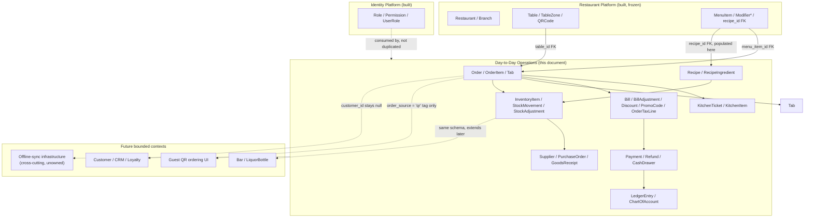

# RestaurantOS — Day-to-Day Operations Architecture (Sprint 7 Planning)

**Document type:** Pre-implementation architecture & sprint plan
**Status:** Planning only — no production code, no migrations, no database tables, no API endpoints exist yet as a result of this document
**Branch:** `feature/restaurant-platform` (HEAD `066f8bc` at the time of writing — Sprint 6 Step 6.4 complete, Restaurant Platform frontend feature-complete)
**Supersedes/extends:** [Product Blueprint](product-blueprint.md) · [Technical Architecture v2.0](technical-architecture-v2.md) · [Data Architecture v1.0 (superseded, base entity catalogue)](superseded-data-architecture-v1.md) · [Data Architecture v2.0 (remediation, current)](data-architecture-v2.md) · [Restaurant Platform Architecture](RestaurantOS_Restaurant_Platform_Architecture.md) · [`docs/AI_HANDOFF.md`](../AI_HANDOFF.md)
**Scope discipline:** This document does not redesign anything already fixed by the documents above. `Order`, `OrderItem`, `Bill`, `Payment`, `Recipe`, `InventoryItem`, and everything else in scope below were **already catalogued** — sometimes down to column-level DDL — by Data Architecture v1.0/v2.0. This document's job is to confirm that catalogue is still correct against the *actually-built* Restaurant Platform it now sits on top of, resolve the handful of things the catalogue genuinely left open (module decomposition, RBAC permission names, offline-sync sequencing), and turn it into a sprint plan. New decisions are called out explicitly, in the same style §12 of the Restaurant Platform doc used for its own RBAC finding.

---

## 0. How This Document Was Produced

Per the user's own explicit framing for this step ("Scope Day-to-Day Operations — design only, not implementation"), the following were read before any design decision was made:

1. **Product Blueprint** — targeted re-read of §3 (personas: Cashier, Kitchen Staff, Bar Staff, Inventory Manager, Accountant), §4 (user stories for Kitchen/Inventory/Accounting), §6 (module table: POS Billing, QR Ordering, Order Management, KDS, Bar Display, Food/Liquor Inventory, Recipe Management, Automatic Stock Deduction, Purchase Management), and §7 (screen inventory for POS, Kitchen/Bar, Inventory/Purchasing/Recipes) — this is where the *product* requirements for this bounded context live; this document does not re-derive them, it reads them and maps them onto the already-catalogued data model.
2. **Data Architecture v1.0 (superseded, base catalogue)** — full targeted read of §3.5–3.9 (Orders, Kitchen, Billing & Payments, Inventory, Purchasing entity catalogues), §5.1 (common column set), §5.4/§5.5/§5.7/§5.8/§5.9 (representative DDL for `orders`, `order_items`, `recipes`/`recipe_ingredients`, `inventory_items`/`stock_movements`, `payments`), §6.1 (SQLAlchemy mixin conventions), §8 (offline-first data model — Command vs. Operation, idempotency-as-operation-id, Conflict Resolution Registry), §9 (event-driven data — outbox, event naming, event catalogue), and §14.4–14.8/§15.5–15.7 (ER diagrams and lifecycle/flow diagrams for this exact scope).
3. **Data Architecture v2.0 (remediation, current)** — full targeted read of Group B (financial domain — `Discount`/`PromoCode`/`BillAdjustment`, tips as adjustments), Group C (`OrderTaxLine`), Group D (liquor integration *and*, more importantly for this scope, the generic negative-inventory-enforcement trigger it establishes), Group E (`Tab`, the `Bill` order/tab XOR redesign), Group I (`LedgerEntry`/`ChartOfAccount`), and the load-bearing-but-easy-to-miss deltas: Group H (ULID-as-`TEXT`, already live), Group G (`ON DELETE` policy per lifecycle class), Group J (`recipe_cost_snapshot`, `MenuItemBranchPrice` — already absorbed into the live Restaurant Platform), Group K (audit-event coverage for `BillAdjustment`/`Tab`).
4. **Restaurant Platform Architecture** (this session's own prior planning document, Sprint 5) — read in full for precedent: its §2.1 ownership table already pre-assigns `Order`/`OrderItem`/`KitchenTicket`/`KitchenItem` to "Future POS/Kitchen Platform," `Bill`/`Payment`/`Refund`/`Tab`/`BillAdjustment`/`Discount`/`PromoCode`/`OrderTaxLine`/`LedgerEntry`/`ChartOfAccount` to "Future POS/Billing Platform," and `Recipe`/`RecipeIngredient`/`InventoryItem`/`StockMovement`/`LiquorBottle`/`Supplier`/`PurchaseOrder`/`PurchaseOrderItem`/`GoodsReceipt` to "Future Inventory Platform" — **this document is where those three "future" platforms stop being future.** Its own §4 (multi-tenancy), §9 (database design/mixins), §11 (events), §12 (RBAC), §13 (test strategy), §14 (migration strategy), and §15 (sprint breakdown) sections are the direct format/rigor template for this document's equivalent sections.
5. **The live backend, read directly, not assumed** (`services/api/src/restaurant_os_api/`) — confirmed the exact module layout the built `modules/restaurant/` bounded context uses (domain/application/infrastructure/presentation, one file per entity/use-case); confirmed `platform/database/mixins.py`'s live mixin set (`ULIDPrimaryKeyMixin`, `TenantScopedMixin`, `TimestampMixin`, `SoftDeleteMixin`, `BranchScopedMixin`, `SyncVersionedMixin`) already reflects the Group H ULID-as-`TEXT` fix; confirmed `platform/idempotency/` exists and is reusable as-is; confirmed the RBAC permission-check dependencies (`require_permission`, `require_branch_permission`, `require_permission_at_any_scope`) this document's own §10 will reuse; confirmed the current Alembic head is `0006_qr_resolution_rate_limiting.py`, so this document's eventual implementation migration is `0007`; and — the material finding — confirmed by direct `grep` that **`Order`, `Bill`, `Payment`, `Recipe`, `InventoryItem`, and every other entity this document scopes do not exist anywhere in the live codebase yet.** This bounded context is confirmed genuinely unstarted, exactly as the session's framing assumed, not partially built and forgotten.
6. **`docs/AI_HANDOFF.md`** — read for current state: Restaurant Platform backend frozen at 73 operations/985 tests; Restaurant Platform frontend (`apps/admin-web`) now feature-complete through Sprint 6 Step 6.4 across Restaurant/Branch/TableZone/Table/QRCode/MenuCategory/MenuItem/ModifierGroup/Modifier/Reservation; no offline-sync infrastructure, no RBAC-Redis permission-version propagation, and no event-relay/consumer infrastructure exist anywhere yet (all three disclosed as open gaps by the Restaurant Platform Architecture doc's own §11/§16 and never subsequently closed).

**One finding changes this plan materially and is disclosed up front, in the same spirit as the Restaurant Platform document's own RBAC disclosure:** the Product Blueprint's own "Must Have" list (§6) puts **offline-first sync** in the same tier as POS billing itself — "Every terminal (POS, KDS, Bar Display) keeps operating with zero internet" is listed as a governing principle, not a nice-to-have. But Data Architecture v1.0 §8's entire offline-sync machinery (client/server operation logs, Hybrid Logical Clocks, the Conflict Resolution Registry, Redis Streams relay/consumer infrastructure) **has never been built** — not for Restaurant Platform, not for anything. Building it is a large, genuinely cross-cutting **platform** capability, not something one bounded context's sprint can quietly absorb into its own steps without either under-scoping the estimate or silently deciding to ship online-only. This document does not resolve that decision unilaterally — see §8 and §16.

---

## 1. Executive Summary

This document designs **Day-to-Day Operations**, RestaurantOS's third bounded context, sitting on top of the now-feature-complete Restaurant Platform (Sprint 5/6). It owns the transactional heart of a shift: taking an order, firing it to the kitchen, billing it, collecting payment, and keeping stock honest as sales happen — the parts of the Product Blueprint labeled "POS Billing," "Order Management," "Kitchen Display System," "Food Inventory," "Recipe Management," "Automatic Stock Deduction," and "Purchase Management."

**What this document's eventual implementation would build:** `Order`, `OrderItem`, `Tab`, `KitchenTicket`, `KitchenItem`, `Bill`, `BillAdjustment`, `Discount`, `PromoCode`, `OrderTaxLine`, `Payment`, `Refund`, `CashDrawer`, `LedgerEntry`, `ChartOfAccount`, `Recipe`, `RecipeIngredient`, `InventoryCategory`, `InventoryItem`, `StockMovement`, `StockAdjustment`, `Supplier`, `PurchaseOrder`, `PurchaseOrderItem`, `GoodsReceipt` — **23 entities**, every one of them already specified (at least at catalogue level, several at full DDL level) by Data Architecture v1.0/v2.0. It reuses existing platform infrastructure exactly as built: the same `TenantScopedMixin`/`BranchScopedMixin`/RLS/`SET LOCAL` isolation, the same `OutboxWriter`/`DomainEvent` contract, the same `platform/idempotency/` guard, the same `ApiResponse[T]` envelope and offset/limit pagination, the same hand-written Alembic migration discipline, the same RBAC permission-check dependencies Restaurant Platform's own routers already use.

**What this document's eventual implementation explicitly does not build:** liquor/bar-specific inventory (`LiquorBottle`, Bar Display), guest-facing QR ordering UI (cart/checkout — `Order.order_source = 'qr'` is designed for, the guest-facing screen is not), Customer/CRM/loyalty (`customer_id` stays nullable/unpopulated everywhere, exactly like `Reservation`'s precedent), employee scheduling/payroll/attendance, delivery-aggregator ingestion, and — the one genuinely open question — the offline-first sync machinery itself (see §8).

**The one real blocking *decision* found during this planning pass (not a missing piece, a choice the user needs to make):** ship Day-to-Day Operations v1 as a synchronous, always-online REST API — exactly how every existing Restaurant Platform endpoint already works — with offline-first sync explicitly deferred to its own future cross-cutting infrastructure sprint; or treat offline-sync infrastructure as a prerequisite step *inside* this sprint, the same way RBAC was folded in as Restaurant Platform's own Step 2. Both are legitimate; this document does not pick one — see §8 and §16.

---

## 2. Bounded-Context Boundary (Step 1)

### 2.1 Ownership table

| Entity / capability | Owning bounded context | Rationale |
|---|---|---|
| Restaurant, Branch, TableZone, Table, QRCode, MenuCategory, MenuItem, Modifier*, Reservation | **Restaurant Platform** (built, frozen, Sprint 5/6) | Day-to-Day Operations *reads and references* these (`table_id`, `menu_item_id` FKs) — never re-models or duplicates them. |
| Role, Permission, RolePermission, UserRole | **Identity Platform** (built, Sprint 5 Step 2) | Day-to-Day Operations *consumes* this exactly as Restaurant Platform does — new permission codes are added to the existing tables via seed/migration, no parallel mechanism (§10). |
| Order, OrderItem, Tab | **Day-to-Day Operations (this document)** | The Blueprint's "Order Management" module — the central order lifecycle across dine-in/QR/takeaway sources. |
| KitchenTicket, KitchenItem | **Day-to-Day Operations (this document)** | The Blueprint's "Kitchen Display System" module, foundation slice (ticket/item state, no bump-bar hardware integration, no predictive prep-time). |
| Bill, BillAdjustment, Discount, PromoCode, OrderTaxLine | **Day-to-Day Operations (this document)** | The Blueprint's "POS Billing" module's billing half. |
| Payment, Refund, CashDrawer | **Day-to-Day Operations (this document)** | The Blueprint's "POS Billing" module's tender half. Payment gateway *integration* (a real processor) is explicitly out — `Payment.gateway_token_ref` is a passthrough column, no gateway SDK/adapter is designed here. |
| LedgerEntry, ChartOfAccount | **Day-to-Day Operations (this document)** | Data Architecture v2.0 Group I's financial-ledger-integrity finding — required for `Payment`/`Refund`/`PurchaseOrder` to post correctly; not a separate future "Accounting Platform," since every fact that posts to it is owned here. |
| Recipe, RecipeIngredient | **Day-to-Day Operations (this document)** | The Blueprint's "Recipe Management" module. `MenuItem.recipe_id` is already a reserved, nullable FK on the live `menu_items` table (Restaurant Platform Architecture §3) — this document is the first thing to populate it. |
| InventoryCategory, InventoryItem, StockMovement, StockAdjustment | **Day-to-Day Operations (this document), food only** | The Blueprint's "Food Inventory" + "Automatic Stock Deduction" modules. |
| Supplier, PurchaseOrder, PurchaseOrderItem, GoodsReceipt | **Day-to-Day Operations (this document)** | The Blueprint's "Purchase Management" module. |
| LiquorBottle, liquor-specific `StockMovement` rows, Bar Display | **Future Bar/Liquor extension** | The Blueprint treats "Food Inventory" and "Liquor Inventory" as two named, separately-scoped modules; Data Architecture v2.0 Group D's negative-inventory trigger is written generically against `stock_movements`/`inventory_items`/`branches` (not liquor-specific), so this design's food-inventory schema extends cleanly to liquor later without a redesign — but `LiquorBottle` itself, pour-cost/keg tracking, and Bar Display are not built here. |
| Terminal, Device (pairing/management) | **Future POS terminal-management module** | `Order.origin_device_id` and `CashDrawer.terminal_id` are included as minimal nullable-or-passthrough FK columns (provenance, not a feature) — actual device registration/pairing UI is deliberately out of scope, same deferral the Restaurant Platform Architecture doc already made for this exact entity. |
| Customer, CustomerAddress, CustomerLoyalty | **Future Customer/CRM Platform** | `Order.customer_id`/`Tab.customer_id` stay nullable and unpopulated — every order is an anonymous walk-in/QR guest, identical to `Reservation.customer_id`'s existing precedent. |
| Guest-facing QR ordering UI (cart, checkout, guest session) | **Future Customer/Guest Platform** | `Order.order_source` includes `'qr'` as a value this design supports receiving, but no guest-facing frontend is designed or built here — same boundary the Restaurant Platform Architecture doc already drew around `QRCode` itself. |
| Offline-first sync infrastructure (client/server operation log, HLC, Conflict Resolution Registry propagation, Redis Streams relay + consumers) | **Cross-cutting platform capability, sequencing undecided** | Genuinely different in kind from every other row in this table — not owned by *any* bounded context, needed by several. See §8 for the open decision. |

### 2.2 Bounded-context diagram



### 2.3 What Day-to-Day Operations explicitly does *not* touch

Per the Product Blueprint's own module boundaries and this document's own scope discipline: no liquor/bar-specific inventory or Bar Display, no guest-facing QR ordering UI, no Customer/CRM/loyalty, no employee scheduling/payroll/attendance, no delivery-aggregator ingestion, no real payment-gateway integration (only a passthrough token column), no device-pairing UI, and — pending the §8 decision — no offline-sync client/server machinery. It does not touch anything in Restaurant Platform's own schema (§2.1's first row) or Identity Platform's RBAC tables beyond adding new `Permission` rows via the same seed mechanism Restaurant Platform's own rollout used.

---

## 3. Domain Model (Step 2)

Every entity below was already specified — at minimum a catalogue-level description, several at full column-level DDL — by Data Architecture v1.0 §3.5–3.9/§5.4–5.9 and Data Architecture v2.0 Groups B/C/D/E/I. This section confirms each against that catalogue and calls out only the deltas this document is actually deciding.

### 3.1 Order Management

| Entity | Fields (beyond the common column set, §7.1) | Lifecycle | Notes |
|---|---|---|---|
| **Order** | `table_id` (nullable FK→`tables.id`), `customer_id` (nullable, unpopulated), `tab_id` (nullable FK→`tabs.id`), `order_source` (`pos`\|`qr`\|`delivery`\|`takeaway`), `status` (`open`\|`fired`\|`served`\|`billed`\|`closed`\|`voided`), `subtotal_amount`, `tax_amount`, `total_amount` (generated column), `currency_code`, `opened_at`, `closed_at`, `origin_device_id` (nullable) | `open → fired → served → billed → closed`; `open`/`fired → voided` (post-fire void requires `order.manage` at manager scope — see §10) | **Immutable once `closed`** — corrections happen via a linked `Refund`, never an in-place edit, matching Data Architecture v1.0 §3.5 exactly. |
| **OrderItem** | `order_id`, `menu_item_id`, `quantity` (>0), `unit_price_amount` (snapshot, never a live join to `menu_items`), `modifiers_snapshot` (JSONB, frozen `{modifierId,name,priceDelta}[]`), `recipe_cost_snapshot` (nullable, populated from `Recipe`/`RecipeIngredient` at fire time — Data Architecture v2.0 Group J), `line_status` (`added`\|`fired`\|`ready`\|`served`\|`voided`) | Added → fired → prepared → served; voidable pre-fire only | Both price and recipe cost are frozen at order time — a later menu price change or recipe edit never retroactively changes a historical order's numbers. |
| **Tab** | `table_id` (nullable), `customer_id` (nullable), `status` (`open`\|`closed`), `opened_at`, `closed_at` | Open → closed | Data Architecture v2.0 Group E's addition — lets several `Order`s (e.g. a merged-table party, or a running bar tab) close out under one `Bill`. Simple, single-order billing (the common case) leaves `Order.tab_id` null and behaves exactly like a bare `Order → Bill` relationship. |

### 3.2 Kitchen (KOT/KDS)

| Entity | Fields | Lifecycle | Notes |
|---|---|---|---|
| **KitchenTicket** | `order_id`, `station` (attribute, e.g. `'grill'`/`'cold'`/`'expo'` — **not a separate entity**, matching Data Architecture v1.0 §3.6/§14.5 explicitly) | Fired → in-progress → ready → bumped/served | One `Order`'s items can fan out into multiple tickets (one per station); each ticket ages independently. |
| **KitchenItem** | `kitchen_ticket_id`, `order_item_id`, `status` (`queued`\|`in_progress`\|`ready`) | Queued → in-progress → ready | Lets a ticket be partially ready (some items done, others still cooking) — the KDS's own "bump" action operates at this granularity. |

### 3.3 POS Billing

| Entity | Fields | Lifecycle | Notes |
|---|---|---|---|
| **Bill** | `order_id` **XOR** `tab_id` (exactly one non-null, DB `CHECK` — Data Architecture v2.0 Group E), `status` (`open`\|`partially_paid`\|`closed`) | Generated → partially paid → fully paid → closed | The XOR relationship is the mechanism that lets a Bill close out either a single Order (the common case) or an entire Tab. |
| **BillAdjustment** | `bill_id`, `adjustment_type` (`discount`\|`service_charge`\|`tip`\|`comp`\|`write_off`), `reference_type`/`reference_id` (nullable, polymorphic — points at a `Discount`/`PromoCode` row when applicable), `amount`, `reason`, `approved_by_user_id` (nullable FK→`users.id`) | Applied once, immutable | Data Architecture v2.0 Group B's unification: tips, comps, service charges, and discounts are all rows in *one* append-only ledger, not four separate tables. `Bill.discount_amount`/`service_charge_amount` are computed at query time by summing this table — never independently stored, avoiding the two-writer race Data Architecture v2.0 Group L flagged elsewhere. |
| **Discount** | `name`, `discount_type` (`percentage`\|`fixed_amount`), `value`, `requires_approval` (bool), `max_value` (nullable), `active_from`/`active_to` | Configured → active → expired | A manager-configured discount catalog (e.g. "Staff meal — 50%," "Happy hour — 20%"). |
| **PromoCode** | `code` (unique per tenant), `discount_id` FK, `usage_limit`, `per_customer_limit`, `valid_from`/`valid_to`, `status` | Created → active → exhausted/expired | Guest-redeemable, tied to a `Discount` for the actual value logic. |
| **OrderTaxLine** | `order_id`, `tax_id`, `taxable_amount`, `tax_rate_snapshot` (never a live join), `tax_amount` | Written once at order-close | Data Architecture v2.0 Group C — `Order.tax_amount` becomes a write-once sum of these at close time, replacing an implicit single-rate assumption with a real per-line breakdown (needed the moment two tax rates ever apply to one order, e.g. dine-in vs. takeaway rates on a mixed order). |
| **Tax** | `name`, `rate`, effective-dated, tenant/branch-configurable | Configured → effective → superseded | Reused from Data Architecture v1.0 §3.7 as-is; this document adds no new fields. |

### 3.4 Payments

| Entity | Fields | Lifecycle | Notes |
|---|---|---|---|
| **Payment** | `bill_id`, `tender_type` (`cash`\|`card`\|`wallet`), `amount` (>0), `currency_code`, `tip_amount` (Data Architecture v2.0 Group B addition, tied to a same-transaction `BillAdjustment(adjustment_type='tip')` row), `gateway_token_ref` (nullable — **never a raw card number**, the PCI boundary), `gateway_last4` (display-only), `status` (`authorized`\|`captured`\|`settled`\|`declined`) | Authorized → captured → settled; or declined | **Immutable once settled.** A declined attempt is its own row, never overwritten by a retry — this is what lets a Bill's payment history show every attempt, not just the successful one. |
| **Refund** | `payment_id`, `order_id`, `approved_by_user_id` (required — every refund needs a named approver, matching the Blueprint's "cannot void completed orders" cashier-permission boundary in §10) | Requested → approved → processed | The *only* mechanism for correcting a closed `Order`/`Bill`/`Payment` — never an in-place edit to any of the three. |
| **CashDrawer** | `terminal_id` (nullable passthrough — see §2.1), `branch_id`, `status` (`open`\|`closed`), `opening_float_amount`, `closing_counted_amount` (nullable until closed), `opened_at`, `closed_at` | Opened → accrues cash `Payment`s → closed/reconciled | The Blueprint's "daily cash-up automatically reconciled against POS sales" story (A1) reads `CashDrawer` against the sum of its shift's cash `Payment` rows — no separate reconciliation entity needed, it's a query. |

### 3.5 Financial Ledger

| Entity | Fields | Lifecycle | Notes |
|---|---|---|---|
| **ChartOfAccount** | `account_code` (PK, text), `account_name`, `account_type` (`asset`\|`liability`\|`revenue`\|`expense`\|`equity`) | Platform-seeded, fixed set | e.g. Cash, Card Clearing, Sales Revenue, Sales Tax Payable, COGS, Inventory Asset, Accounts Payable, Tips Payable. Reference data, not tenant-created. |
| **LedgerEntry** | `entry_type` (`debit`\|`credit`), `account_code` FK, `amount`, `currency_code`, `reference_type`/`reference_id` (polymorphic — points at the `Payment`/`Refund`/`PurchaseOrder`/`BillAdjustment` row that caused it) | Written once, in the **same DB transaction** as the fact it records | Data Architecture v2.0 Group I's finding: every financial-fact transaction (a settled `Payment`, a processed `Refund`, a confirmed `GoodsReceipt`) writes matching debit+credit `LedgerEntry` rows atomically with the fact itself, not eventually via the outbox. A scheduled job periodically sums debits/credits per tenant/period and asserts equality — this document reuses that verification-job design as-is. `LedgerEntry` deliberately does **not** get its own `AuditEvent` (Group K) — it's a deterministic derivative of an already-audited source fact, and adding one would double-count. |

### 3.6 Inventory & Recipes (food only — see §2.1 for the liquor deferral)

| Entity | Fields | Lifecycle | Notes |
|---|---|---|---|
| **Recipe** | `name`, `version` (int, default 1), `superseded_by_id` (nullable self-FK) | Versioned, not edited in place | Editing a recipe creates a *new* `Recipe` row and repoints `MenuItem.recipe_id` — historical `OrderItem.recipe_cost_snapshot` values stay attributable to the recipe version that was live when the order fired. |
| **RecipeIngredient** | `recipe_id`, `inventory_item_id`, `quantity` (`NUMERIC(12,4)`), `unit` (small fixed enum — no separate `units`/conversion table, unit-conversion logic is out of scope per the original catalogue) | Static bill-of-materials row | |
| **InventoryCategory** | `name` (e.g. "Produce," "Dry Goods") | Created → retired | Tenant-level grouping. |
| **InventoryItem** | `inventory_category_id`, `branch_id`, `name`, `unit`, `quantity_on_hand` (**derived/cached**, trigger-maintained — never hand-written by application code), `reorder_point` (nullable), `allow_negative_stock_override` (nullable bool — Data Architecture v2.0 Group D) | Created → stocked → depleted/discontinued | Branch-scoped: the same ingredient at two branches is two rows, matching how `MenuItemBranchPrice` already handles branch-specific overrides. |
| **StockMovement** | `inventory_item_id`, `branch_id`, `movement_type` (`sale_deduction`\|`adjustment`\|`receipt`\|`waste`\|`transfer`), `quantity_delta` (**signed**, not absolute), `reference_type`/`reference_id` (polymorphic — `order_item_id`, `goods_receipt_id`, or `stock_adjustment_id`), `occurred_at`, `idempotency_key` | Written once, **never edited** | The append-only ledger — `InventoryItem.quantity_on_hand` is derived from summing this table via a DB trigger, exactly the same "ledger is truth, balance is cache" pattern `sync_version` uses for optimistic concurrency elsewhere. Automatic deduction on `OrderItem` service (the Blueprint's "Automatic Stock Deduction" module) is one `movement_type='sale_deduction'` row per ingredient per served item, computed from `RecipeIngredient` (modifier-aware — an "extra cheese" modifier line item deducts its own recipe-adjusted quantity too, per the Blueprint's K1-adjacent requirement). |
| **StockAdjustment** | `inventory_item_id`, `branch_id`, `reason`, `approved_by_user_id` | Recorded → approved | The human-readable "why" behind a manual correction; the actual quantity change is still a linked `StockMovement(movement_type='adjustment')` row — `StockAdjustment` never mutates stock directly. |

**Negative-inventory enforcement (Data Architecture v2.0 Group D, reused as-is):** a single combined trigger function on `stock_movements` computes the resulting `quantity_on_hand` on every insert and aborts the insert if it would go negative, unless `branches.allow_negative_stock` or the specific `inventory_items.allow_negative_stock_override` permits it. This is genuinely a trigger-level check (not a `CHECK` constraint) because it requires aggregating sibling rows — this document adds the `branches.allow_negative_stock` column via its own migration (§14), since `branches` is a Restaurant Platform table this bounded context extends, not owns.

### 3.7 Purchasing

| Entity | Fields | Lifecycle | Notes |
|---|---|---|---|
| **Supplier** | `name`, `address` (embedded or FK to a reused Address shape), `status` (`active`\|`inactive`) | Onboarded → active → inactive | **Tenant-level**, not branch-scoped — a supplier typically serves every branch of a tenant. |
| **PurchaseOrder** | `supplier_id`, `branch_id`, `status` (`draft`\|`sent`\|`partially_received`\|`fully_received`\|`canceled`) | Draft → sent → (partially) received → fully received / canceled | **Branch-scoped** — the order/delivery itself is per-branch even though the supplier relationship is tenant-wide. |
| **PurchaseOrderItem** | `purchase_order_id`, `inventory_item_id`, `quantity_ordered`, `quantity_received` (running total) | Added → (partially) received | |
| **GoodsReceipt** | `purchase_order_id`, `received_at`, discrepancy flag(s) | Created at delivery → confirmed | Confirming a `GoodsReceipt` is what actually writes the `StockMovement(movement_type='receipt')` rows — the PO/receipt paperwork and the stock-level truth are deliberately two different writes, never conflated. |

---

## 4. Multi-Tenancy & Branch Scoping (Step 3)

No new isolation mechanism. Every table in §3 is `TenantScopedMixin` (RLS-enforced, `SET LOCAL app.tenant_id` per request, identical to every existing table) plus `BranchScopedMixin` where the entity is branch-scoped (§4.4 of the Restaurant Platform doc already establishes that branch scoping is an **application-layer filter**, not a second RLS layer — this document does not revisit that decision, it reuses it). The one addition: `Supplier` and `ChartOfAccount` are the first two tables in this document that are **tenant-scoped but explicitly not branch-scoped** (a supplier serves every branch; the chart of accounts is one set per tenant) — this is not a new pattern, `Restaurant` itself already established "tenant-scoped, not branch-scoped" as a valid combination.

---

## 5. Module Decomposition (Step 4) — a decision this document has to make

Neither the Product Blueprint nor Data Architecture v1.0/v2.0 states whether Order Management, POS Billing, Payments, Kitchen, Inventory, and Purchasing should be five separate `modules/*` bounded contexts (mirroring how Restaurant Platform itself is one module covering several sub-entity-families) or split further.

**Decision: one bounded context, `modules/operations/`, internally organized by sub-area.**

```
modules/operations/
  domain/
    entities/           # order.py, order_item.py, tab.py, kitchen_ticket.py, kitchen_item.py,
                         # bill.py, bill_adjustment.py, discount.py, promo_code.py, order_tax_line.py,
                         # payment.py, refund.py, cash_drawer.py, ledger_entry.py, chart_of_account.py,
                         # recipe.py, recipe_ingredient.py, inventory_item.py, stock_movement.py,
                         # stock_adjustment.py, supplier.py, purchase_order.py, purchase_order_item.py,
                         # goods_receipt.py
    events/              # operations_events.py
    ports/               # one *_repository.py interface per aggregate root
    exceptions.py
  application/
    dto/
    use_cases/           # one file per use case, e.g. fire_order.py, close_order.py, record_payment.py,
                         # deduct_stock_for_order_item.py, confirm_goods_receipt.py
  infrastructure/
    database/
      models.py
      repositories.py
  presentation/
    api/v1/               # one *_router.py per resource
    schemas/
    dependencies.py
```

**Reasoning:** Restaurant Platform's sub-entity families (Restaurant/Branch, Table, Menu, Reservation) are largely independent of each other — a Menu edit never needs to touch a Table row in the same transaction. Order Management, Kitchen, Billing, Payments, and Inventory are the opposite: **closing an order is one use case that touches four of them in a single transaction** (mark `Order.status = 'closed'`, generate/close the `Bill`, write `StockMovement` rows for every served `OrderItem`, write matching `LedgerEntry` rows). Splitting these into five separately-versioned modules would force that one use case to either violate the "no cross-module ORM relationship traversal" rule the Restaurant Platform doc's own §9.1 mixin conventions establish, or orchestrate across five repositories/unit-of-work boundaries for what is conceptually one atomic business fact. One module, internally organized by sub-area (mirroring the file layout above), keeps the transaction boundary honest while still keeping each sub-area's files easy to find. Purchasing is arguably more independent (a PO rarely needs to touch an open `Order` in the same transaction) but is kept in the same module for now since it shares `InventoryItem`/`StockMovement` so directly — splitting it out later, if it ever needs independent deployment cadence, is a low-risk extraction (it already has almost no direct FK reach into Order/Kitchen/Billing).

---

## 6. API Boundary (Step 5) — documented, not implemented

Representative, not exhaustive — matches the Restaurant Platform doc's own §7 discipline. Every route reuses the existing `ApiResponse[T]` envelope, offset/limit pagination, optional `Idempotency-Key` header on mutating routes, and the tenant-scoped-repository-lookup-before-anything-else / 404-not-403 no-existence-leak discipline every existing router already follows.

| Route | Method | Shape | Gate |
|---|---|---|---|
| `/api/v1/branches/{branch_id}/orders` | `POST`/`GET` | Branch-nested (mirrors `TableRouter`) | `require_branch_permission("order.manage"/"order.read")` |
| `/api/v1/branches/{branch_id}/orders/{id}` | `GET`/`PATCH` | Branch-nested | Same |
| `/api/v1/orders/{id}/fire` | `POST` | **Flat**, mirrors `POST /tables/{id}/status` — no `branch_id` in the URL, coarse `require_permission_at_any_scope("order.manage")` at the router + `resolve_and_authorize_branch` once the order's real branch is loaded, exactly Table's established pattern | Coarse + fine-grained |
| `/api/v1/orders/{id}/close` | `POST` | Flat, same shape | Coarse + fine-grained |
| `/api/v1/orders/{id}/void` | `POST` | Flat, same shape — a post-fire void additionally requires the caller to be at manager scope, not just `order.manage` (Blueprint: "cannot void completed orders" is a Cashier-tier restriction) | Coarse + fine-grained + tier check |
| `/api/v1/branches/{branch_id}/kitchen-tickets` | `GET` | Branch-nested — the live KDS feed | `require_branch_permission("kitchen.read")` |
| `/api/v1/kitchen-items/{id}/status` | `POST` | Flat, same shape as Table status | `require_permission_at_any_scope("kitchen.manage")` |
| `/api/v1/orders/{id}/bill` | `POST` | Flat — generates the `Bill` | `require_permission_at_any_scope("billing.manage")` |
| `/api/v1/bills/{id}/adjustments` | `POST` | Flat — apply a discount/comp/service charge/tip | Same, `requires_approval` cases additionally need `approved_by_user_id` populated server-side from the authenticated principal at manager tier |
| `/api/v1/bills/{id}/payments` | `POST`/`GET` | Flat | `require_permission_at_any_scope("billing.manage"/"billing.read")` |
| `/api/v1/payments/{id}/refund` | `POST` | Flat — its own, more sensitive gate | `require_permission_at_any_scope("billing.refund")` |
| `/api/v1/branches/{branch_id}/inventory-items` | `POST`/`GET`/`PATCH` | Branch-nested | `require_branch_permission("inventory.manage"/"inventory.read")` |
| `/api/v1/inventory-items/{id}/stock-movements` | `POST`/`GET` | Flat — manual adjustments/waste logging (sale-deduction movements are written internally by `close_order`'s own use case, never via a direct client-facing POST) | `require_permission_at_any_scope("inventory.manage"/"inventory.read")` |
| `/api/v1/menu-items/{id}/recipe` | `PUT`/`GET` | Flat, mirrors `MenuItemBranchPrice`'s own shape | `require_permission("menu.manage"/"menu.read")` tenant-wide — recipes are Menu-adjacent, reuse Restaurant Platform's existing `menu.*` permission rather than inventing a new one |
| `/api/v1/branches/{branch_id}/purchase-orders` | `POST`/`GET`/`PATCH` | Branch-nested | `require_branch_permission("purchasing.manage"/"purchasing.read")` |
| `/api/v1/purchase-orders/{id}/receipts` | `POST` | Flat — confirming a `GoodsReceipt` | Same, at any scope |
| `/api/v1/suppliers` | `POST`/`GET`/`PATCH` | **Flat, tenant-wide** (mirrors `ModifierGroupRouter` — no FK parent) | `require_permission("purchasing.manage"/"purchasing.read")` tenant-wide |
| `/api/v1/branches/{branch_id}/cash-drawers` | `POST`/`GET`/`PATCH` | Branch-nested | `require_branch_permission("billing.manage"/"billing.read")` |
| `/api/v1/ledger-entries` | `GET` | Flat, tenant-wide, read-only | `require_permission("ledger.read")` tenant-wide — its own distinct permission, per Data Architecture v2.0 Group I's own note that this is sensitive enough not to fold into `billing.read` |

---

## 7. Frontend Boundary (Step 6) — documented, not implemented

Out of scope for *this* document's own approval gate (the user's Step 6.5 framing was explicitly "design, not implementation," and the admin-web frontend work this document's eventual screens would need is itself a large, separate multi-step effort mirroring Sprint 6's own Step 6.1–6.4 pattern). For completeness, the Product Blueprint's own §7.2–7.5 screen inventory (POS Home/Order Entry, Table Floor Plan, Order Cart, Payment Screen, Split Bill, Discount/Comp, Order History, Kitchen Display, 86 List Management, Inventory Dashboard, Recipe Builder, Stock Adjustment, Supplier List, Purchase Orders, Goods Received Note) is the product-level source of truth for what a future frontend phase would build — this document does not re-derive or narrow that list, it defers to it.

---

## 8. Offline-First — Status and the Open Decision (Step 7)

**Resolved 2026-08-10: the user approved option 1 below — "Day-to-Day Operations, online-only v1."** Offline-sync infrastructure is deferred to its own future, separately-chartered sprint; migration `0007` and the Step 2 domain models were built accordingly. One correction to this section's original text, made once implementation actually started: the claim below that "every table already carries `sync_version`" was aspirational, not yet true at the time it was written — `SyncVersionedMixin` was not in fact added to any Day-to-Day Operations table in migration `0007`, matching the codebase's own established convention of applying it only to entities the Conflict Resolution Registry classifies as genuine "exclusive shared state" (`Table.status`, `Reservation.table_id`), not automatically. None of this bounded context's new entities were classified that way here, since the Registry itself doesn't exist yet — retrofitting it later, when the offline-sync sprint is actually chartered, is additive (a new column + migration), not a schema rewrite.

**The governing distinction (Data Architecture v1.0 §8.1), restated:** a **Command** is a transient, client-side-only domain intent; an **Operation** is its durable, idempotency-keyed, replayable representation — the thing that actually gets persisted, synced, and replayed. Every entity in §3 that a POS/KDS terminal would write *while offline* needs to be expressed as an Operation, registered in the **Conflict Resolution Registry** (§8.4) with an explicit strategy (`append_only` for `Order`/`OrderItem`/`StockMovement`/`Payment` — new facts, never overwritten; `exclusive_first_commit` or `server_authoritative` for anything with true "only one can win" semantics, e.g. two terminals trying to fire the same `KitchenTicket`; `commutative_delta` for `StockMovement.quantity_delta`, since signed deltas from two offline terminals commute correctly on replay without needing last-write-wins).

**What actually exists today, confirmed by reading the live code, not assumed:** nothing. No client-side operation log, no server-side `sync_operations` table, no HLC generation, no Conflict Resolution Registry table, no Redis Streams relay, no consumer. Every existing Restaurant Platform endpoint — and by extension, every endpoint this document's §6 proposes — is a synchronous, always-online REST call that fails outright with no network.

**This document does not resolve which of the following the user wants, and states both plainly rather than picking one silently:**

1. **Ship Day-to-Day Operations v1 online-only.** Every §6 route works exactly like every existing Restaurant Platform route — a POS terminal with no network cannot take an order. This is a real product gap against the Blueprint's own "Must Have" framing, but it is *buildable now*, on top of infrastructure that already exists and is already tested, with zero new cross-cutting platform work. Offline-sync becomes its own, later, dedicated infrastructure sprint that this bounded context's schema is already compatible with (every table already carries `sync_version`; the ULID/`TEXT` id strategy is already client-mintable) — retrofitting sync onto an already-shipped online-only Order/Payment/Stock model is additive, not a rewrite, *provided* the Conflict Resolution Registry strategy for each entity is decided now, at design time, even if the sync machinery itself is built later (§3's entity tables above already state a candidate strategy per entity for exactly this reason).
2. **Treat offline-sync infrastructure as a prerequisite step inside this sprint**, the same way RBAC was folded in as Restaurant Platform's own gating Step 2 rather than assumed away. This is more faithful to the Blueprint's stated priority, but is a materially larger, genuinely different kind of engineering effort (client-side local storage/queueing, HLC clock sync, a relay/consumer service, conflict UI) than anything built so far in this project — not a "few extra commits," a multi-sprint capability in its own right.

Both are legitimate engineering decisions. Neither is this document's to make unilaterally — flagged here, and again in §16, for the user's explicit direction before implementation begins.

---

## 9. Database Design (Step 8)

Reuses the Restaurant Platform doc's own §9 conventions exactly: the common column set (`id TEXT PRIMARY KEY` with the ULID regex `CHECK`, `tenant_id`, `created_at`, `updated_at`, `sync_version`; `deleted_at` **omitted** on every Immutable-lifecycle table in §3 — `Order`, `OrderItem` post-fire, `KitchenTicket`/`KitchenItem` post-bump, `Bill` post-close, `Payment` post-settle, `Refund` post-process, `StockMovement`, `OrderTaxLine`, `BillAdjustment`, `LedgerEntry`, `Tab` post-close — versus Soft-deletable on everything else, e.g. `Discount`, `PromoCode`, `Supplier`, `InventoryCategory`); `branch_id TEXT NOT NULL REFERENCES branches(id) ON DELETE RESTRICT` via `BranchScopedMixin` on every branch-scoped table; `ULIDPrimaryKeyMixin`'s existing `ulid_check_constraint()` helper called per model.

**`ON DELETE` policy (Data Architecture v2.0 Group G, applied to this document's own tables):** any FK *into* an Immutable-lifecycle table (`Order`, `Payment`, `StockMovement`, `BillAdjustment`, `OrderTaxLine`, `LedgerEntry`, `Tab`, …) → `RESTRICT`. Polymorphic `reference_type`/`reference_id` column pairs (`StockMovement`, `BillAdjustment`, `LedgerEntry`) → **no FK at all, by design**, matching the Outbox's own precedent — these are deliberately loose references, not enforced joins. `Order.customer_id` on a future Customer hard-purge → `SET NULL`, matching `orders.customer_id`'s already-specified policy in Data Architecture v1.0.

**`branches.allow_negative_stock`:** the one column this document adds to an *existing* Restaurant Platform table (rather than a new table) — via its own additive migration, not a Restaurant Platform re-open. This is the single point where this bounded context's schema touches a frozen table, and it's additive/nullable-safe (`BOOLEAN NOT NULL DEFAULT false`), zero risk to any existing Restaurant Platform row or query.

**Representative DDL** (illustrative — actual DDL is written in the eventual `0007` migration, not here), showing the pattern every other table in §3 follows:

```sql
CREATE TABLE orders (
    id TEXT PRIMARY KEY CHECK (id ~ '^[0-9A-HJKMNP-TV-Z]{26}$'),
    tenant_id TEXT NOT NULL REFERENCES tenants(id) ON DELETE RESTRICT,
    branch_id TEXT NOT NULL REFERENCES branches(id) ON DELETE RESTRICT,
    table_id TEXT REFERENCES tables(id) ON DELETE RESTRICT,
    tab_id TEXT REFERENCES tabs(id) ON DELETE RESTRICT,
    customer_id TEXT,  -- no FK yet; Customer entity does not exist
    order_source TEXT NOT NULL CHECK (order_source IN ('pos','qr','delivery','takeaway')),
    status TEXT NOT NULL CHECK (status IN ('open','fired','served','billed','closed','voided')),
    subtotal_amount NUMERIC(19,4) NOT NULL CHECK (subtotal_amount >= 0),
    tax_amount NUMERIC(19,4) NOT NULL CHECK (tax_amount >= 0),
    total_amount NUMERIC(19,4) GENERATED ALWAYS AS (subtotal_amount + tax_amount) STORED,
    currency_code CHAR(3) NOT NULL,
    opened_at TIMESTAMPTZ NOT NULL,
    closed_at TIMESTAMPTZ,
    origin_device_id TEXT,
    created_at TIMESTAMPTZ NOT NULL DEFAULT now(),
    updated_at TIMESTAMPTZ NOT NULL DEFAULT now(),
    sync_version BIGINT NOT NULL DEFAULT 0
    -- deleted_at intentionally omitted: Immutable lifecycle
);
ALTER TABLE orders ENABLE ROW LEVEL SECURITY;
-- tenant-isolation policy: identical clause to every existing table's policy
```

**Indexes, per table's dominant query shape** (representative): `ix_orders_tenant_branch_status`, `ix_orders_tenant_branch_opened_at` (BRIN, high-cardinality time column), `ix_stock_movements_inventory_item_occurred_at` (BRIN), `uq_payments_tenant_idempotency_key`, `uq_stock_movements_tenant_idempotency_key`. **Partitioning:** `orders`/`order_items`/`stock_movements` are the three tables in this document large-volume enough to warrant monthly range partitioning by their time column (`opened_at`/parent's partition key/`occurred_at`), matching the "representative bottleneck" tier the Restaurant Platform doc's own §9.5 already flagged for high-write-volume future tables — this document is where that flag becomes concrete.

---

## 10. Security / RBAC (Step 9)

No new mechanism — reuses Identity Platform's RBAC exactly as Restaurant Platform's own `presentation/dependencies.py` already consumes it (`require_permission`, `require_branch_permission`, `require_permission_at_any_scope`). New `Permission` rows are added via the same seed/migration mechanism Restaurant Platform's own rollout used, not a parallel scheme.

**New permission codes:**

| Permission | Scope | Grants |
|---|---|---|
| `order.read` / `order.manage` | Branch | View/take orders, fire, close, void (void additionally requires manager tier per §6) |
| `kitchen.read` / `kitchen.manage` | Branch | View the KDS feed / mark tickets and items in-progress, ready, bumped |
| `billing.read` / `billing.manage` | Branch | View bills/payments / generate bills, apply adjustments, record payments |
| `billing.refund` | Branch | Its own permission, deliberately separate from `billing.manage` — every refund needs an approver, and "can take payments" should not silently imply "can reverse them" |
| `inventory.read` / `inventory.manage` | Branch | View stock / adjust stock, log waste (sale-deduction itself is system-internal, no direct grant needed) |
| `purchasing.read` / `purchasing.manage` | Branch (POs) / Tenant-wide (Suppliers, mirroring how `Restaurant`'s own permissions are tenant-wide) | View/manage suppliers and purchase orders |
| `ledger.read` | Tenant-wide | View the financial ledger — its own permission per Data Architecture v2.0 Group I, not folded into `billing.read` |

**Representative role mapping** (extends the Restaurant Platform doc's own §12.3 table, not a replacement):

| Role | New permissions this document adds |
|---|---|
| Tenant Owner | Full — every permission above, tenant-wide |
| Restaurant Manager | Full within their restaurant's branches, including `billing.refund` and `ledger.read` |
| Branch Manager | `order.manage`, `kitchen.manage`, `billing.manage`, `billing.refund`, `inventory.manage`, `purchasing.manage` (branch-scoped) |
| Cashier | `order.manage` (no void), `billing.manage` (no refund) — matches the Blueprint's own "cannot void completed orders" / capped-discount permission description almost verbatim |
| Kitchen Staff | `kitchen.manage` only — matches the Blueprint's "KDS access only; cannot access financials or POS" exactly |
| Waiter | `order.read`, `order.manage` at their branch (existing `reservation.manage` already granted) — taking an order is a natural Waiter capability the existing role didn't need until now |
| Inventory Manager | `inventory.manage`, `purchasing.manage`, `menu.manage` (for recipes) — matches the Blueprint's "no POS or payroll access" restriction by simply *not* granting `order.*`/`billing.*` |
| Accountant | `ledger.read`, `billing.read`, `purchasing.read` — matches "full financial reporting... no operational (POS/KDS) actions" |

---

## 11. Events (Step 10)

Published through the existing `OutboxWriter` port, same dataclass/`ClassVar` convention every existing event already follows.

| Event | `aggregate_type` | Emitted by |
|---|---|---|
| `OrderPlaced` | `order` | Order creation use case |
| `OrderFired` | `order` | Fire-to-kitchen use case — also the trigger for `KitchenTicket`/`KitchenItem` creation |
| `OrderClosed` | `order` | Close-order use case |
| `OrderVoided` | `order` | Void use case |
| `TicketReady` | `kitchen_ticket` | Kitchen item status update, once every item on a ticket reaches `ready` — the literal event a future KDS/expo-screen WebSocket consumer subscribes to |
| `StockDeducted` | `stock_movement` | Written by the same use case that emits `OrderClosed`, one per served `OrderItem`'s ingredients — the event a future menu-availability/86-list cache-invalidation consumer subscribes to |
| `LowStockDetected` | `inventory_item` | Emitted when a `StockMovement` insert crosses `InventoryItem.reorder_point` going downward |
| `PaymentSettled` | `payment` | Record-payment use case |
| `RefundProcessed` | `refund` | Process-refund use case |
| `PurchaseOrderReceived` | `purchase_order` | Confirm-goods-receipt use case |

**Consumers:** none, same disclosed gap the Restaurant Platform doc's own §11 already carries forward — no relay/consumer infrastructure exists yet. These events land in the same, already-correct outbox table and wait, exactly as already documented.

---

## 12. Test Strategy (Step 11)

Extends the Restaurant Platform doc's own §13 table with scenarios genuinely new to this bounded context — everything else (RLS tests, branch-isolation tests, duplicate-constraint tests, unauthorized-access tests, `sync_version` optimistic-concurrency tests) is the same harness, reused, not reinvented.

| Scenario | Why it's new to this bounded context |
|---|---|
| Order status transition validity (`open→fired→served→billed→closed`, `voided` only from `open`/`fired`) | First entity in the codebase with a five-plus-state linear lifecycle plus a branch (`Reservation`'s graph is the closest precedent, reused directly) |
| Immutability enforcement on closed `Order`/settled `Payment`/processed `Refund` | No existing entity tests "this row must become un-editable past a certain state" this strictly |
| Stock deduction correctness: closing an order with a 2-ingredient recipe item at quantity 3 writes exactly 2 `StockMovement` rows with the correct signed deltas, and a modifier-adjusted item's deduction reflects the modifier | New domain logic entirely |
| Negative-inventory trigger: an insert that would take `quantity_on_hand` negative is rejected unless `allow_negative_stock`/override permits it | First DB-trigger-level (not `CHECK`-level) business rule test in the codebase |
| Financial ledger balance: after a batch of `Payment`/`Refund`/`GoodsReceipt` fixtures, sum(debits) = sum(credits) per tenant | New, and specifically the kind of test Data Architecture v2.0 Group I's own scheduled verification job formalizes — worth a dedicated test category, not folded into generic CRUD tests |
| `Bill.order_id`/`tab_id` XOR constraint | New `CHECK`-constraint shape not seen elsewhere in the schema |
| Idempotent payment retry: submitting the same `Idempotency-Key` against `/bills/{id}/payments` twice never double-charges | Financial-correctness-critical, worth its own explicit test even though the mechanism (`platform/idempotency/`) is fully reused |
| Refund requires an approver | `approved_by_user_id NOT NULL` enforcement, matching `Discount.requires_approval`'s DB-trigger-enforced precedent from Data Architecture v2.0 Group B |
| Offline replay implications | **Not exercised**, same documented gap as Restaurant Platform's own §13 — deferred until §8's decision is made and any sync infrastructure exists to test against |

---

## 13. Migration Strategy (Step 12) — not created this document

- **Migration number:** `0007` (confirmed — `0006_qr_resolution_rate_limiting.py` is the current head).
- **Upgrade path:** 23 new tables (§3) plus one additive column on the existing `branches` table (`allow_negative_stock`). Zero modifications to any other existing table or row.
- **Downgrade strategy:** drop the 23 new tables in FK-dependency order, then drop the `branches.allow_negative_stock` column — mechanically derivable from the `ON DELETE` graph (§9), same discipline Data Architecture v2.0 Group G already established.
- **Given the size (23 tables), this document recommends splitting the migration into logical groups matching §3's own sub-sections** (Order/Kitchen; Billing/Payments/Ledger; Inventory/Recipe; Purchasing) rather than one 23-table migration file — each group is independently reversible and independently testable, mirroring how Restaurant Platform's own Step 4 was gated sub-step by sub-step rather than shipped as one large slab.
- **RLS:** every new table gets `ENABLE ROW LEVEL SECURITY` + the identical tenant-isolation policy, applied in the same migration group that creates it.
- **Seed data:** `ChartOfAccount` is the one table in this document needing platform-seeded reference rows (Cash, Card Clearing, Sales Revenue, Sales Tax Payable, COGS, Inventory Asset, Accounts Payable, Tips Payable) — everything else is tenant/branch-created, matching Restaurant Platform's own precedent.
- **Rollback risk: low**, for the same reason Restaurant Platform's own migration was low-risk — purely additive, no existing-row backfill, hand-written per Data Architecture v2.0 §7.1's discipline. The one column added to `branches` is nullable-safe with a default, zero risk to existing rows.

---

## 14. Sprint Breakdown (Step 13)

Mirrors Restaurant Platform's own §15 format and its precedent of naming a genuinely separate gating step explicitly rather than folding it into "backend services." **Step 0 here is the §8 decision itself — nothing else can be estimated accurately until it's made.**

| Step | Objective | Dependencies | Exit criteria |
|---|---|---|---|
| **0 — Offline-sync decision** | User decides online-only-v1 vs. sync-infrastructure-first (§8) | This document, reviewed | Explicit user direction recorded in `AI_HANDOFF.md` |
| **1 — Domain & architecture (this document)** | This document, reviewed and approved | None | Explicit user approval to proceed |
| **2 — Database / data layer** | `0007` migration group(s), all 23 tables + `branches.allow_negative_stock`, RLS, negative-inventory trigger | Step 1 approved | Migration applies and reverses cleanly per group; RLS smoke test; trigger rejects an over-deduction in a real Postgres integration test |
| **3 — Order + Kitchen backend** | Domain/application/presentation for `Order`/`OrderItem`/`Tab`/`KitchenTicket`/`KitchenItem` | Step 2 | Full order lifecycle (open→fired→served→billed→closed, plus void) working against real Postgres, with correct `KitchenTicket`/`KitchenItem` fan-out |
| **4 — Billing + Payments + Ledger backend** | `Bill`/`BillAdjustment`/`Discount`/`PromoCode`/`OrderTaxLine`/`Payment`/`Refund`/`CashDrawer`/`LedgerEntry`/`ChartOfAccount` | Step 3 (bills reference orders/tabs) | A closed order can be billed, paid (single and split), refunded with an approver, and the resulting `LedgerEntry` rows balance in a real integration test |
| **5 — Inventory + Recipe backend** | `Recipe`/`RecipeIngredient`/`InventoryCategory`/`InventoryItem`/`StockMovement`/`StockAdjustment`, auto-deduction wired into Step 4's close-order use case | Step 4 (deduction fires on order close) | Closing an order with a recipe-costed item writes correct, modifier-aware `StockMovement` rows; the negative-stock trigger is exercised end-to-end |
| **6 — Purchasing backend** | `Supplier`/`PurchaseOrder`/`PurchaseOrderItem`/`GoodsReceipt` | Step 5 (receipts write stock) | A PO can be created, sent, received (confirming a `GoodsReceipt`), and the resulting `StockMovement`/`LedgerEntry` rows are correct |
| **7 — REST APIs** | §6's endpoints wired to real use cases, RBAC gates per §10 | Steps 3–6 | Every §6 route returns the correct envelope and enforces the correct permission, including the `billing.refund`-vs-`billing.manage` split |
| **8 — Testing** | §12's full test matrix | Steps 3–7 | Coverage matches §12's table |
| **9 — Frontend** | §7's screens (Product Blueprint §7.2–7.5), following this session's own established `apps/admin-web` conventions | Step 8 | Golden-path browser verification against a real backend, mirroring Sprint 6's own per-step pattern |
| **10 — Release hardening** | RC report, CI, docs, handoff | Step 9 | Merge-ready, same bar as prior sprints' RC processes |

---

## 15. Risks (Step 14)

| Severity | Risk | Notes |
|---|---|---|
| **Critical** | Offline-first sync infrastructure does not exist, and the Blueprint frames it as a "Must Have" governing principle for exactly this bounded context's terminals. | Not silently assumed away — §8 states the decision explicitly and §14 makes it Step 0, gating everything else's estimate. |
| **High** | Financial correctness: `LedgerEntry` balance, idempotent payment retries, and the `Bill.order_id`/`tab_id` XOR constraint are all genuinely new categories of bug this codebase hasn't had to guard against yet (every prior entity was operational data, not money). | Mitigated by §12's dedicated financial-correctness test category and by reusing `platform/idempotency/` exactly rather than inventing a payment-specific variant. |
| **High** | Real payment-gateway integration is out of scope (§2.3) — `Payment.gateway_token_ref` is a passthrough column with no adapter behind it. A pilot cannot actually take a card payment until a gateway integration is separately scoped. | Disclosed, not hidden — this document's `Payment` entity is *shaped* to receive a gateway integration cleanly later, but does not include one. |
| **Medium** | 23-table migration is large — even split into logical groups (§13), this is by far the largest single migration this project has attempted. | Mitigated by the group-splitting recommendation and by every table following one of the same three established column patterns (tenant-scoped reference data, branch-scoped reference data, branch-scoped append-only ledger) — no genuinely novel schema shape, just volume. |
| **Medium** | Recipe/Inventory auto-deduction is the first place this codebase computes a derived financial/operational number (`recipe_cost_snapshot`, `quantity_on_hand`) from a multi-row aggregation inside a hot write path (order close). | Mitigated by reusing the exact "ledger is truth, trigger-maintained cache is derived" pattern already specified for `sync_version`-adjacent concerns — not a new architectural idea, a new *application* of one. |
| **Medium** | Module-decomposition decision (§5, one `modules/operations/` context) is a real bet — if Purchasing or Inventory later need independent deployment cadence, extracting them is real (if low-risk) work. | Documented reasoning makes this a reviewable bet, not a silent one, matching the Restaurant Platform doc's own precedent for its "no `Menu` wrapper entity" bet. |
| **Low** | `Terminal`/`Device` stay minimal passthrough columns, not a real entity/pairing flow — a future POS terminal-management need would require schema growth here. | Low risk: `origin_device_id`/`CashDrawer.terminal_id` are plain nullable text columns today, additive to promote to a real FK later. |
| **Low** | Liquor/Bar deferral (§2.1) — the negative-inventory trigger and `StockMovement` schema are confirmed generic enough to extend cleanly, but this has not been proven by actually building the Bar extension. | Accepted trade-off, same category as Restaurant Platform's own QR-ordering-foundation risk. |

---

## 16. Acceptance Criteria

This document (Step 1 of §14's sprint breakdown) is complete when:

- [x] Bounded-context boundary explicitly enumerated against Restaurant Platform, Identity Platform, and every deferred future context (§2).
- [x] Every proposed entity cross-checked against the already-existing Data Architecture v1.0/v2.0 catalogue before acceptance — zero entities invented from scratch (§3).
- [x] Multi-tenancy/branch-scoping design reuses the existing RLS/`SET LOCAL`/application-layer-branch-filter mechanism with zero new isolation mechanisms (§4).
- [x] Module decomposition decided explicitly, with reasoning, where the source documents left it open (§5).
- [x] API and frontend boundaries documented to existing conventions, not implemented (§6, §7).
- [x] The offline-first gap found via direct code inspection (not assumed) and surfaced as an explicit, undecided choice rather than resolved unilaterally or silently deferred (§8).
- [x] Database design follows Data Architecture v2.0 conventions exactly, including `ON DELETE` policy and the one additive column this document needs on an existing Restaurant Platform table (§9).
- [x] RBAC extends the existing mechanism with new permission codes only — no parallel authorization scheme (§10).
- [x] Domain events specified in the existing dataclass/Outbox convention (§11).
- [x] Test strategy extends existing patterns with the categories genuinely new to this bounded context (financial-ledger balance, negative-inventory trigger, immutability enforcement) (§12).
- [x] Migration strategy specified, not executed — next migration confirmed as `0007`, with a group-splitting recommendation given the table count (§13).
- [x] Sprint broken into verifiable steps with explicit exit criteria, including the offline-sync decision as its own gating Step 0 (§14).
- [x] Risks disclosed by severity, including the one genuinely blocking, undecided one (§15).

**This document does not, by itself, constitute approval to begin implementation.** Production code, migrations, database tables, and API endpoints all remain unwritten until the user reviews this document, makes the §8 offline-sync decision, and separately approves proceeding to Step 2.

---

*End of document — RestaurantOS Day-to-Day Operations Architecture (Sprint 7 Planning)*
