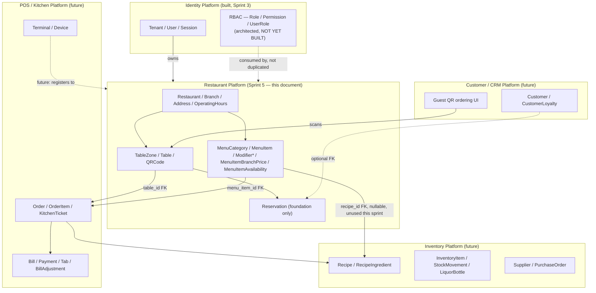
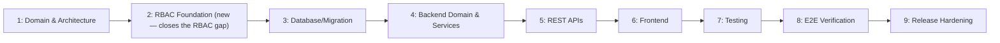

# RestaurantOS — Restaurant Platform Architecture (Sprint 5 Planning)

**Document type:** Pre-implementation architecture & sprint plan
**Status:** Planning only — no production code, no migrations, no database tables, no API endpoints exist yet as a result of this document
**Branch:** `feature/restaurant-platform` (cut from `develop` at `f1acdf5`, Sprint 4.1 Tenant Platform merged and CI-verified)
**Supersedes/extends:** [Product Blueprint](product-blueprint.md) · [Technical Architecture v2.0](technical-architecture-v2.md) · [Data Architecture v1.0 (superseded, base entity catalogue)](superseded-data-architecture-v1.md) · [Data Architecture v2.0 (remediation, current)](data-architecture-v2.md) · [`docs/AI_HANDOFF.md`](../AI_HANDOFF.md)
**Scope discipline:** This document does not redesign anything already fixed by the documents above. Where the Restaurant Platform needs something those documents already specified (RLS, the Outbox, ULID conventions, the API envelope, the module-boundary rule), this document points at it and reuses it. New decisions are called out explicitly, in the same style as Sprint 4.1's numbered Decisions.

---

## 0. How This Document Was Produced

Before designing anything, the following were read in full or targeted-read against specific sections, per the session's explicit "do not assume anything that already exists" instruction:

1. [Product Blueprint](product-blueprint.md) — full read (personas, module breakdown, screen inventory, business rules, roadmap phases).
2. [Technical Architecture v2.0](technical-architecture-v2.md) — full read (Groups A–H: offline-first, outbox/idempotency, permission versioning, events, bounded-context module structure, PCI/GDPR, Redis/Postgres scaling, tenant isolation).
3. [Data Architecture v2.0](data-architecture-v2.md) — full read (Groups A–M: the remediation delta — Tab, BillAdjustment, OrderTaxLine, `MenuItemBranchPrice`, ULID-as-TEXT, ON DELETE policy, ledger, offline-sync fixes).
4. [Data Architecture v1.0 (superseded)](superseded-data-architecture-v1.md) — targeted read of the base Entity Catalogue (§3, especially §3.2 Restaurant Structure and §3.4 Menu & Recipe), the common column set (§5.1), representative table specs (§5.6 `menu_items`), SQLAlchemy mixin conventions (§6.1), and the Restaurant-Structure/Menu ER diagrams (§14.2, §14.4). **This document's content is the actual base entity catalogue** — Data Architecture v2.0 is a remediation *delta* on top of it, not a replacement, and explicitly says so in its own scope note. Treating it as "superseded" at the document-status level but authoritative at the content level (for sections v2.0 didn't touch) follows the same precedent already used elsewhere in this repo (`docs/AI_HANDOFF.md`'s Docker/CI topology guidance from the superseded Technical Architecture v1.0).
5. `docs/AI_HANDOFF.md` — full read of current state, known scope boundaries, and Decision C (interim `is_platform_admin` boolean, full RBAC deferred).
6. **Existing Tenant Platform implementation** — read directly, not assumed: `platform/database/mixins.py`, `platform/database/unit_of_work.py`, `platform/events/domain_event.py`, `platform/outbox/*`, `platform/tenancy/context.py`, `core/ids.py`, `modules/identity/domain/events/tenant_events.py`, `modules/identity/presentation/api/v1/admin_tenant_router.py`, and the actual SQLAlchemy models (`modules/identity/infrastructure/database/models.py`).
7. **ADRs** — `docs/architecture/adr/` confirmed empty (only `.gitkeep`); no prior ADRs to reconcile against.
8. **Migrations** — `alembic/versions/` confirmed at `0001_create_identity_schema.py`, `0002_tenant_platform.py`; the next migration is `0003`.
9. **Test architecture** — `tests/integration/conftest.py`'s unprivileged-RLS-test-role pattern, `test_repositories.py`'s cross-tenant isolation test, `test_admin_tenant_router.py`'s "non-admin gets 403 everywhere" pattern.
10. **Git branch structure** — `main`/`develop`/`feature/tenant-platform-frontend` (merged, still present) confirmed via `git branch -vv`; this document's branch, `feature/restaurant-platform`, cut fresh from a verified-clean, verified-synced `develop`.

**One finding changes this plan materially and is disclosed up front rather than buried:** `grep`-verified against the actual codebase, **no `Role`, `Permission`, `RolePermission`, or `UserRole` table exists yet.** Only `users.is_platform_admin` (a single boolean, Sprint 4.1 Decision C) exists. The Blueprint's Restaurant Platform roles (Waiter, Branch Manager, Kitchen Staff, …) cannot be expressed by one boolean the way Tenant Administration's admin/non-admin split could be. This is treated as a first-class dependency throughout this document, not an assumption papered over — see §11 and §15.

---

## 1. Executive Summary

Sprint 5 is documentation-and-planning only, per explicit instruction — no code, no migrations, no endpoints. It designs the **Restaurant Platform**, RestaurantOS's second bounded context, sitting directly on top of the now-merged Tenant Platform. The Restaurant Platform owns *restaurant/branch structure* and *menu/table foundations* — the data every future POS, KDS, QR-ordering, reservation, and inventory feature will read and reference, but none of those features' own transactional logic.

**What this sprint's eventual implementation will build:** `Restaurant`, `Branch`, `Address`, `OperatingHours`, `TableZone`, `Table`, `QRCode`, `MenuCategory`, `MenuItem`, `ModifierGroup`, `Modifier`, `MenuItemModifierGroup`, `MenuItemBranchPrice`, `MenuItemAvailability`, and a foundation-only `Reservation`. All of it reuses existing platform infrastructure exactly as built: the same `TenantScopedMixin`/RLS/`SET LOCAL` isolation, the same `OutboxWriter`/`DomainEvent` contract, the same `ApiResponse[T]` envelope and offset/limit pagination, the same Alembic hand-written-migration discipline, the same pytest/Playwright test patterns.

**What this sprint's eventual implementation will explicitly not build:** POS billing, payments, KDS, inventory, liquor inventory, loyalty, analytics, recipes, or a real RBAC module — but it is designed so that when RBAC and those future platforms arrive, none of Restaurant Platform's own schema needs to change shape.

**The one real blocking dependency found during this planning pass:** Restaurant Platform's own role model (Waiter, Branch Manager, Kitchen Staff, …) needs actual RBAC tables that do not exist yet. This is not invented scope creep — it's a genuine prerequisite, scoped and estimated in §14/§15, not silently assumed away.

---

## 2. Bounded-Context Boundary (Step 1)

### 2.1 Ownership table

| Entity / capability | Owning bounded context | Rationale |
|---|---|---|
| Tenant, Subscription, User, Session, ApiKey | **Tenant Platform** (existing, merged) | Already built in Sprint 3/4.1. Restaurant Platform never re-models these. |
| Role, Permission, RolePermission, UserRole | **Identity Platform** (RBAC — architected, **not yet implemented**) | Cross-cutting authorization belongs with authentication, per this session's explicit "do not duplicate authentication" instruction. Restaurant Platform *consumes* this once it exists; it does not build a parallel mechanism (see §11). |
| Restaurant, Branch, Address, OperatingHours | **Restaurant Platform (this sprint)** | The Blueprint's "Restaurant Setup & Onboarding" and "Branch Management" modules. |
| TableZone, Table, QRCode | **Restaurant Platform (this sprint)** | The Blueprint's "Table Management" module, foundation slice only (no reservations engine, no order association yet). |
| MenuCategory, MenuItem, ModifierGroup, Modifier, MenuItemModifierGroup, MenuItemBranchPrice, MenuItemAvailability | **Restaurant Platform (this sprint)** | The Blueprint's "Menu Management" module. |
| Reservation | **Restaurant Platform (this sprint), foundation only** | Table-adjacent enough to belong here at foundation depth; a full waitlist/optimization engine is future, separately-chartered work (Blueprint Phase 2+). |
| Order, OrderItem, KitchenTicket, KitchenItem | **Future POS/Kitchen Platform** | Already fully catalogued in Data Architecture v1.0 §3.5/§3.6 with FKs into `menu_items`/`tables` — Restaurant Platform supplies the referenced side of those FKs, never the Order side itself. |
| Bill, Payment, Refund, Tab, BillAdjustment, Discount, PromoCode, OrderTaxLine, LedgerEntry, ChartOfAccount | **Future POS/Billing Platform** | Fully catalogued (Data Architecture v1.0 §3.7, v2.0 Groups B/C/E/I). Explicitly "Do NOT implement POS billing" per this sprint's instructions. |
| Recipe, RecipeIngredient, InventoryItem, StockMovement, LiquorBottle, InventoryCategory, StockAdjustment | **Future Inventory Platform** | Explicitly excluded ("Do NOT implement inventory yet," "Do NOT implement liquor inventory yet"). `MenuItem.recipe_id` stays nullable and unpopulated this sprint — the column exists in the future-facing catalogue (Data Architecture v1.0 §3.4) but Recipe itself is not built. |
| Supplier, PurchaseOrder, PurchaseOrderItem, GoodsReceipt | **Future Inventory/Purchasing Platform** | Same exclusion as Inventory. |
| Customer, CustomerAddress, CustomerLoyalty | **Future Customer/CRM Platform** | Referenced (nullable) by `Reservation`, never owned here. |
| Terminal, Device | **Future POS Platform (device pairing)** | Already catalogued under "Restaurant Structure" in Data Architecture v1.0, but the *use* of a Terminal (a POS lane, a KDS screen) is POS/KDS territory, not restaurant setup. Deliberately deferred — see §15. |
| Kitchen Display System, Bar Display | **Future Kitchen Platform** | Excluded ("Do NOT implement Kitchen Display System yet"). |
| Customer QR ordering flow (cart, checkout, guest session) | **Future Customer/Guest Platform** | This sprint builds only `QRCode` (an opaque table-scoped token/URL) — not the guest-facing ordering UI or cart, which is Blueprint Phase 2 and its own bounded context. |

### 2.2 Bounded-context diagram



### 2.3 What Restaurant Platform explicitly does *not* touch

Per this sprint's instructions: no POS billing, no payments, no KDS, no inventory (food or liquor), no loyalty, no analytics. Per this document's own boundary analysis: no RBAC (consumes it, doesn't build it), no Terminal/Device pairing (POS Platform's concern), no guest-facing ordering UI (Customer Platform's concern; `QRCode` here is only the table-scoped token the guest UI will later resolve).

---

## 3. Domain Model (Step 2)

The user-provided candidate list (`Restaurant, Branch, BranchAddress, OperatingHours, DiningArea, Table, TableStatus, Menu, MenuCategory, MenuItem, MenuItemPrice, ModifierGroup, Modifier, MenuItemModifier, MenuAvailability, QRCode, Reservation, ReservationStatus, BranchStaffAssignment`) was **not accepted as-is** — cross-checked against the actual, already-designed catalogue instead, per instruction. Four concrete deviations, each justified:

1. **`DiningArea` → `TableZone`.** The base catalogue (Data Architecture v1.0 §3.2) already names this entity `TableZone` ("a named grouping of tables (patio, main floor, bar seating)"), already has an ER diagram shape for it, and already has `Table.table_zone_id` as its FK column name. Introducing a second name for the same concept would fragment the schema for no benefit.
2. **`Menu` (as a wrapper entity) — not introduced.** The candidate list implies a `Menu` object above `MenuCategory` (for "breakfast/lunch/dinner menus"). The base catalogue instead has `MenuCategory` belong directly to `Restaurant`, and Data Architecture v2.0 Group J already solved *branch-specific and time-scheduled pricing* via `MenuItemBranchPrice` (an override row keyed by branch + effective-time window) rather than a `Menu` wrapper object. This document extends that exact pattern (§6) instead of introducing a competing "named menu" concept — see §6 for the full reasoning.
3. **`MenuItemPrice` / `MenuItemModifier` — not introduced as separate entities.** `MenuItemBranchPrice` (already specified) *is* the price-override entity; a bare `MenuItemPrice` would duplicate it. `MenuItemModifier` is already named `MenuItemModifierGroup` in Data Architecture v2.0 Group F (the join table resolving `MenuItem`↔`ModifierGroup`'s many-to-many).
4. **`TableStatus` / `ReservationStatus` — not introduced as separate entities.** Both are enumerated `status` columns (`CHECK` constraints) on `Table` and `Reservation` respectively, matching the base catalogue's own convention (e.g., `orders.status`, `menu_items.is_available`) — a separate lookup table for a small, fixed, code-defined enum would be inconsistent with how every other status field in this schema is modeled.

`MenuAvailability` is kept, renamed `MenuItemAvailability` for naming consistency with its sibling `MenuItemBranchPrice`. `BranchStaffAssignment` is **not built as a new table** — see §11's explicit reasoning (it would duplicate the future `UserRole.branch_id` mechanism already scoped in the base catalogue's `UserRole` design).

### 3.1 Entity-by-entity specification

Every entity below composes the **same mixins already implemented** in `platform/database/mixins.py` (`ULIDPrimaryKeyMixin`, `TenantScopedMixin`, `TimestampMixin`, `SoftDeleteMixin`) plus **one new mixin this sprint needs to add**, `BranchScopedMixin` (see §8.1) — not a second isolation mechanism, an extension of the existing one (§4).

#### Restaurant

| Field | Purpose / Owner / Relationship |
|---|---|
| Purpose | A tenant's named business concept/brand. A tenant may operate more than one (Data Architecture v1.0 §3.2, unchanged). |
| Owner | Restaurant Platform |
| Tenant relationship | `tenant_id` (via `TenantScopedMixin`) — a Restaurant belongs to exactly one Tenant. |
| Branch relationship | Has many `Branch`. |
| Lifecycle | `created → active → discontinued` (mirrors `Tenant`'s own status-enum pattern, not the full 5-state Tenant lifecycle — a Restaurant doesn't need `provisioning`/`suspended`/`migrating`, since it's not a billing/infrastructure unit, `Tenant` already is). |
| Required fields | `legal_name`, `display_name`, `default_currency_code` (FK → `currencies.code`, mirroring `tenants.default_currency_code`). |
| Relationships | `Tenant ||--o{ Restaurant`, `Restaurant ||--o{ Branch`, `Restaurant ||--o{ MenuCategory`. |
| Constraints | `legal_name` required; `default_currency_code` FK. |
| Uniqueness | None required at this layer (a tenant could legitimately operate two brands with similar names) — no `UNIQUE` constraint on `display_name`. |
| Soft-delete | `Soft` (`deleted_at`), per catalogue. |
| Audit | Standard `AuditEvent` on create/update once the audit module exists (§9) — not blocking this sprint's design. |
| Retention | Indefinite while any `Branch` references it (matches catalogue). |
| RLS | Tenant-level RLS only (no branch scoping — a Restaurant sits *above* Branch). |
| Offline-sync | **Configuration/reference data** category (Technical Architecture v2.0 Group A's registry) — server-authoritative, client caches with short TTL. Not written by any Edge app. |
| Future extension points | Multi-brand tenants (a chain with two distinct restaurant concepts sharing back-office staff) — already representable today via `Tenant ||--o{ Restaurant`, no redesign needed later. |

#### Branch

| Field | Purpose / Owner / Relationship |
|---|---|
| Purpose | A single physical location — the unit the Blueprint's Branch Manager persona operates (Data Architecture v1.0 §3.2, unchanged). |
| Owner | Restaurant Platform |
| Tenant relationship | `tenant_id` (via `TenantScopedMixin`), inherited/denormalized from the parent `Restaurant` for RLS/query-filter efficiency — same denormalization pattern already used for `branch_id` on child tables throughout the catalogue. |
| Branch relationship | Is the branch; has one `Address`; has many `TableZone`, `OperatingHours` rows, `MenuItemBranchPrice`/`MenuItemAvailability` overrides. |
| Lifecycle | `opened → active → temporarily_closed → permanently_closed` (catalogue-specified). |
| Required fields | `restaurant_id` FK, `name`, `status`. |
| Relationships | `Restaurant ||--o{ Branch`, `Branch ||--|| Address`, `Branch ||--o{ TableZone`, `Branch ||--o{ OperatingHours`. |
| Constraints | `status` `CHECK` enum. |
| Uniqueness | `UNIQUE (restaurant_id, name)` — two branches of the same restaurant should not share a display name (new constraint this sprint adds; not present in the base catalogue, which didn't specify it, but consistent with the catalogue's own uniqueness-discipline established by Data Architecture v2.0 Group F). |
| Soft-delete | `Soft`. |
| Audit | Branch status transitions (`temporarily_closed`, `permanently_closed`) are exactly the kind of action Blueprint BR-17-adjacent workflows care about — flagged for `AuditEvent` once the audit module exists. |
| Retention | Indefinite; closed branches retain full historical data (catalogue). |
| RLS | Tenant-level RLS (inherited `tenant_id`); branch-level *authorization* (which staff can act on which branch) is an application-layer concern, not a second RLS policy — see §4. |
| Offline-sync | Configuration/reference data — same category as Restaurant. |
| Future extension points | `allow_negative_stock` (Data Architecture v2.0 Group D) already reserves a future Inventory-Platform column on this exact table — Restaurant Platform's `Branch` model should leave room for it (documented here, not added this sprint, since Inventory is out of scope). |

#### Address

| Field | Purpose / Owner / Relationship |
|---|---|
| Purpose | A normalized postal address, reused by `Branch` today; reused by `CustomerAddress`/`Supplier` in future platforms (catalogue, unchanged). |
| Owner | Restaurant Platform (first consumer); shared shape, not a shared table — Data Architecture v1.0 explicitly rejected a generic polymorphic association here ("separate FK columns per owner, not a generic polymorphic association — see ADR-D3"). Restaurant Platform's migration creates the `addresses` table and `branches.address_id`; future platforms add their own FK column to the same table, never a polymorphic join. |
| Tenant relationship | `tenant_id` (via `TenantScopedMixin`) for RLS consistency, even though it's only ever reached via `Branch` today. |
| Branch relationship | `Branch ||--|| Address`. |
| Required fields | `line1`, `city`, `country_code`, `postal_code` (all nullable individually to tolerate incomplete-onboarding states, per the Blueprint's own "a single-location owner never has to configure branch concepts to get started" principle — a Branch can exist with a placeholder address during setup). |
| Constraints | None beyond types. |
| Uniqueness | None. |
| Soft-delete | `Soft`, follows owner's retention (catalogue). |
| Audit | Not independently audited (address edits are part of Branch Settings audit, once the audit module exists). |
| RLS | Tenant-level. |
| Offline-sync | Configuration/reference data. |
| Future extension points | `Supplier`/`CustomerAddress` FK columns, added by their respective future platforms without touching this table's shape. |

#### OperatingHours

| Field | Purpose / Owner / Relationship |
|---|---|
| Purpose | A branch's weekly service-hours schedule — **new entity, not in the base catalogue**, added because the user's Sprint 5 scope explicitly names "Restaurant operating hours" and no existing entity covers it. |
| Owner | Restaurant Platform |
| Tenant/Branch relationship | `tenant_id` + `branch_id` (via the new `BranchScopedMixin`, §8.1). |
| Lifecycle | `set → updated` — reference/config data, not a versioned/historical entity (unlike `MenuItemBranchPrice`, past operating hours have no reporting requirement identified in the Blueprint). |
| Required fields | `day_of_week` (`0`–`6`), `opens_at`/`closes_at` (`TIME`, nullable pair = closed that day), `is_closed` (boolean, for an explicit "closed all day" row rather than inferring it from null times). |
| Relationships | `Branch ||--o{ OperatingHours` (one row per day of week, at most 7 per branch — a branch operating split shifts, e.g. lunch + dinner with a mid-afternoon closure, needs two rows for the same `day_of_week`, so the natural key is *not* simply `(branch_id, day_of_week)`). |
| Constraints | `CHECK (day_of_week BETWEEN 0 AND 6)`; `CHECK (opens_at < closes_at OR is_closed)`. |
| Uniqueness | None enforced at the DB level (split shifts are legitimate, overlap validation is an application-layer concern, not a schema constraint — consistent with the catalogue's general preference for `CHECK`/`UNIQUE` only where a violation is *always* wrong, never where it depends on business judgment). |
| Soft-delete | `Soft`. |
| Retention | Indefinite (small table, no archival need). |
| RLS | Branch-scoped. |
| Offline-sync | Configuration/reference data — read by the future Guest QR ordering UI to show "open now" state; never written by an Edge app. |
| Future extension points | Holiday/exception-date overrides (a specific date's hours differing from the weekly default) — deliberately not designed this sprint (no Blueprint requirement named it); the table shape (one row per rule) can absorb an `effective_date` variant later without a redesign, following the same override-row pattern used throughout this document. |

#### TableZone

| Field | Purpose / Owner / Relationship |
|---|---|
| Purpose | A named grouping of tables for floor-plan organization and (future) waiter-section assignment (catalogue, unchanged). |
| Owner | Restaurant Platform |
| Tenant/Branch relationship | `tenant_id` + `branch_id` (`BranchScopedMixin`). |
| Lifecycle | `created → edited → retired`. |
| Required fields | `name`, `display_order` (new column this sprint — the base catalogue didn't specify one, but the Blueprint's floor-plan editor needs a stable render order). |
| Relationships | `Branch ||--o{ TableZone`, `TableZone ||--o{ Table`. |
| Constraints | None beyond `NOT NULL`. |
| Uniqueness | `UNIQUE (branch_id, name)`. |
| Soft-delete | `Soft`. |
| Retention | Indefinite. |
| RLS | Branch-scoped. |
| Offline-sync | Configuration/reference data. |
| Future extension points | Waiter-section assignment (Blueprint's `KDS Station Config`-equivalent for floor staff) — depends on RBAC (§11); the FK target (`table_zone_id`) already exists for that future feature to attach to. |

#### Table

| Field | Purpose / Owner / Relationship |
|---|---|
| Purpose | A physical seating unit (catalogue, unchanged), now with an explicit `status` enum this sprint adds. |
| Owner | Restaurant Platform |
| Tenant/Branch relationship | `tenant_id` + `branch_id` (`BranchScopedMixin`) — `branch_id` is denormalized from `table_zone_id`'s own branch for query efficiency, matching the pattern already used for `Branch.tenant_id`. |
| Lifecycle | `added to floor plan → active → retired` (catalogue) — `status` (below) is a separate, higher-frequency-changing field layered on top of this slower lifecycle, matching the same distinction `MenuItem` already draws between its own lifecycle and its `is_available` flag. |
| Required fields | `table_zone_id` FK, `table_number` (`TEXT`, not `INTEGER` — supports "12A"/"Patio-3" style labels the Blueprint's floor-plan editor implies), `capacity` (`INTEGER`, `CHECK > 0`), `status`. |
| Relationships | `TableZone ||--o{ Table`, `Table ||--o{ Reservation`, `Table ||--o{ QRCode}` (one active QR code per table — modeled as one-to-many to allow regeneration history, not one-to-one), and (future, unowned here) `Table ||--o{ Order`. |
| Constraints | `status CHECK (status IN ('available','occupied','reserved','cleaning'))` — the four states the Blueprint's Table Floor Plan screen (§7.2) explicitly color-codes. `capacity > 0`. |
| Uniqueness | `UNIQUE (branch_id, table_number)`. |
| Soft-delete | `Soft`. |
| Audit | Not independently audited (retirement is a Branch Settings action). |
| Retention | Indefinite (referenced by historical Orders, per catalogue). |
| RLS | Branch-scoped. |
| Offline-sync | **`status` is "Exclusive shared state"** — Technical Architecture v2.0 Group A's Conflict Resolution Registry names "Table status/assignment" as its own literal worked example: server-authoritative by first-commit-receipt order, losing device gets an `applied_with_correction` event. Every other field on `Table` (`table_number`, `capacity`, `table_zone_id`) is configuration/reference data (rarely written, never by an Edge app). This means `Table` needs the `sync_version` column (§8.1) even though nothing writes it via sync yet this sprint — see §9. |
| Future extension points | Table combination/merge for floor-plan seating (distinct from the already-solved *billing*-side table merge via `Tab`, Data Architecture v2.0 Group E) — explicitly **not designed this sprint** (no concrete Blueprint requirement beyond "future requirements" in the user's own instructions); flagged in §15 as a deliberately deferred design question, not a silent gap. Waiter assignment — depends on RBAC (§11). |

#### QRCode

| Field | Purpose / Owner / Relationship |
|---|---|
| Purpose | A table-scoped, guest-resolvable identifier — **new entity**, the "QR ordering foundation" the user's scope names. Deliberately minimal: it encodes *which table*, nothing about the ordering flow itself (Customer Platform's future concern). |
| Owner | Restaurant Platform |
| Tenant/Branch relationship | `tenant_id` + `branch_id` (`BranchScopedMixin`), denormalized from `table_id`. |
| Lifecycle | `generated → active → regenerated (superseded) → revoked`. |
| Required fields | `table_id` FK, `token` (`TEXT`, `UNIQUE`, opaque — a cryptographically random identifier, not the table's own ULID, so a leaked/scanned QR code can be individually revoked and regenerated without touching the `Table` row it points at), `status` (`active` \| `revoked`). |
| Relationships | `Table ||--o{ QRCode` (one-to-many to preserve regeneration history — an old, revoked code should not silently vanish, since "someone printed and laminated the wrong code" is a real, traceable operational event). |
| Constraints | `status CHECK`. |
| Uniqueness | `UNIQUE (token)` — global, not tenant-scoped, since the token is resolved from an unauthenticated guest request *before* tenant context is known (the token itself is what establishes tenant/branch/table context, the reverse of every other entity in this document). |
| Soft-delete | `Soft` — a revoked code is deactivated, not deleted (it may need to be shown in an audit trail: "this code was scanned N times before being revoked"). |
| Audit | `QRCode` revocation/regeneration flagged for `AuditEvent` once the audit module exists — this is a security-relevant action (a compromised or stolen code). |
| Retention | Indefinite (superseded codes are cheap to retain and useful for the future guest-ordering analytics). |
| RLS | Branch-scoped for the *management* read path (admin-web); the *resolution* read path (an unauthenticated guest scanning a code) is necessarily a distinct, unauthenticated endpoint that looks up by `token` alone and only then establishes tenant context — this is an explicit, narrow exception to "every query goes through `TenantContext`" and must be its own reviewed code path, not a precedent for skipping tenant scoping elsewhere. |
| Offline-sync | Configuration/reference data; not written by any Edge app this sprint (guest ordering itself is out of scope). |
| Future extension points | The Customer/Guest Platform resolves `token → (tenant, branch, table)` as its first step before anything else — this is the entire, deliberate purpose of keeping `QRCode` this thin. |

#### MenuCategory

| Field | Purpose / Owner / Relationship |
|---|---|
| Purpose | A named grouping of sellable items (catalogue, unchanged). |
| Owner | Restaurant Platform |
| Tenant relationship | `tenant_id` (via `TenantScopedMixin`) — belongs to `Restaurant`, **not** `Branch** (catalogue's own placement, deliberately preserved — see §6 for why branch-specific menu behavior is handled by override rows, not by scoping the category itself to a branch). |
| Relationships | `Restaurant ||--o{ MenuCategory`, `MenuCategory ||--o{ MenuItem`. |
| Lifecycle | `created → reordered/edited → retired`. |
| Required fields | `restaurant_id` FK, `name`, `display_order` (catalogue implies ordering via the Blueprint's "Categories & Items" screen; made explicit here as a column, matching `TableZone.display_order`'s new addition above). |
| Constraints | None beyond `NOT NULL`. |
| Uniqueness | `UNIQUE (restaurant_id, name)`. |
| Soft-delete | `Soft`. |
| Retention | Indefinite. |
| RLS | Tenant-level (Restaurant-scoped, no branch dimension). |
| Offline-sync | Configuration/reference data. |
| Future extension points | None needed — the branch/time dimensions live on `MenuItem`'s override tables, not here. |

#### MenuItem

| Field | Purpose / Owner / Relationship |
|---|---|
| Purpose | A sellable product (catalogue, unchanged) — the unit priced, ordered, and (future) recipe-costed. |
| Owner | Restaurant Platform |
| Tenant relationship | `tenant_id` (via `TenantScopedMixin`) — Restaurant-scoped like `MenuCategory`, not branch-scoped. |
| Relationships | `MenuCategory ||--o{ MenuItem`, `MenuItem }o--o{ ModifierGroup` (via `MenuItemModifierGroup`), `MenuItem ||--o{ MenuItemBranchPrice`, `MenuItem ||--o{ MenuItemAvailability`, `MenuItem ||--o| Recipe` (FK column reserved, nullable, **unpopulated this sprint** — Recipe doesn't exist), and (future, unowned here) `MenuItem ||--o{ OrderItem`. |
| Lifecycle | `created → priced → available/86'd → discontinued` (catalogue). |
| Required fields | `menu_category_id` FK, `name`, `price_amount` (`NUMERIC(19,4)`, the tenant-wide default), `currency_code`, `is_available` (global default; branch-level overrides live in `MenuItemAvailability`), `display_order`. |
| Constraints | `price_amount >= 0` (catalogue's existing `menu_items` spec). |
| Uniqueness | None beyond the implicit uniqueness a UI enforces — two items can legitimately share a name within a category is judged unlikely to matter enough to hard-constrain (unlike `MenuCategory.name`, which gates navigation). |
| Soft-delete | `Soft`. |
| Retention | Indefinite (referenced by historical `OrderItem` — catalogue). |
| RLS | Tenant-level. |
| Offline-sync | **`price_amount`/`is_available` (and their branch/time overrides) are the literal "Configuration/reference data" example already named in Technical Architecture v2.0 Group A** ("Menu prices, item availability... Server is always authoritative; clients treat their local copy as a cache with a short TTL"). No redesign needed — this document's `MenuItemBranchPrice`/`MenuItemAvailability` tables are exactly the resolution source that cache-refresh reads from. |
| Future extension points | `recipe_id` (Inventory Platform), `tax_id` (deliberately **not added this sprint** — tax calculation is an order-time POS concern per the catalogue's own `Tax` entity design, and Menu Management doesn't need it at foundation depth; adding it later is a single nullable-FK migration, not a redesign). `search_vector` (full-text, catalogue-specified generated column) — included in the DB design (§8) since it costs nothing extra to add now and the catalogue already specifies its exact shape for `menu_items`. |

#### ModifierGroup / Modifier / MenuItemModifierGroup

| Field | Purpose / Owner / Relationship |
|---|---|
| Purpose | A named set of choices for a menu item (`ModifierGroup`) and each individual selectable option within it (`Modifier`), joined many-to-many to `MenuItem` via `MenuItemModifierGroup` (all catalogue-specified, Data Architecture v2.0 Group F resolved the ambiguous v1.0 relationship in favor of "shareable across multiple items," which this document follows unchanged). |
| Owner | Restaurant Platform |
| Tenant relationship | `tenant_id` on all three (`ModifierGroup`, `Modifier` via its parent, `MenuItemModifierGroup` via either side). |
| Relationships | `MenuItem }o--o{ ModifierGroup` via `MenuItemModifierGroup`; `ModifierGroup ||--o{ Modifier`. |
| Lifecycle | `created → edited → retired` for all three. |
| Required fields | `ModifierGroup`: `name`, `selection_type` (`single` \| `multiple` — new field this sprint, since the Blueprint's own example, "Choose your side" vs. "Spice level," implies both single- and multi-select groups exist and the schema should say which, rather than leaving it to application-layer convention). `Modifier`: `modifier_group_id` FK, `name`, `price_delta` (`NUMERIC(19,4)`, `DEFAULT 0`, may be negative for a "remove ingredient" discount-adjacent modifier). |
| Constraints | `MenuItemModifierGroup`: `UNIQUE (menu_item_id, modifier_group_id)` (Data Architecture v2.0 Group F, unchanged). |
| Uniqueness | `UNIQUE (restaurant_id via MenuItem's own scope, name)` on `ModifierGroup` is deliberately **not** enforced — a `ModifierGroup` named "Size" legitimately repeats across unrelated item families (drinks vs. entrees) with different `Modifier` sets; global name-uniqueness would be actively wrong here. |
| Soft-delete | `Soft` on all three. |
| Retention | Indefinite (referenced by historical `OrderItem` modifier snapshots — catalogue). |
| RLS | Tenant-level. |
| Offline-sync | Configuration/reference data, same category as `MenuItem`. |
| Future extension points | None identified beyond what's already here. |

#### MenuItemBranchPrice

**Already fully specified by Data Architecture v2.0 Group J — not redesigned, only referenced and relied upon.** `id`, `menu_item_id` FK, `branch_id` FK, `price_amount`, `effective_from`, `effective_to` (nullable). When a row exists for `(menu_item, branch, now())`, it overrides `menu_items.price_amount`; absent, the global default applies. This is the *only* mechanism Restaurant Platform needs for branch-specific pricing, breakfast/lunch/dinner pricing windows, and (later, unimplemented this sprint) happy-hour pricing — see §6.

#### MenuItemAvailability *(new, this sprint — sibling to `MenuItemBranchPrice`)*

| Field | Purpose / Owner / Relationship |
|---|---|
| Purpose | The availability-dimension twin of `MenuItemBranchPrice` — a branch- and time-scoped override of `menu_items.is_available`. Needed because "temporary unavailable items" and "branch-specific menu availability" (both explicitly named in the user's Sprint 5 scope) are an *availability* concern, not a *pricing* concern, and conflating the two into one table would force every availability toggle to also carry a nonsensical price value. |
| Owner | Restaurant Platform |
| Tenant/Branch relationship | `tenant_id` + `branch_id` (`BranchScopedMixin`). |
| Lifecycle | `created → active → expired/removed`. |
| Required fields | `menu_item_id` FK, `branch_id` FK, `is_available` (boolean), `effective_from`, `effective_to` (nullable — an open-ended 86 until manually cleared, exactly matching the Blueprint's "86 List Management" screen's "toggle item availability, set auto-restore time" actions). |
| Relationships | `MenuItem ||--o{ MenuItemAvailability`, `Branch ||--o{ MenuItemAvailability`. |
| Constraints | `CHECK (effective_from < effective_to OR effective_to IS NULL)`. |
| Uniqueness | None enforced (multiple historical override windows for the same item/branch are legitimate and useful for "how often does this item get 86'd" reporting, out of scope but not precluded). |
| Soft-delete | `Soft` — matches `MenuItemBranchPrice`'s own classification. |
| Retention | Indefinite, same reasoning as `MenuItemBranchPrice` (historical availability accuracy). |
| RLS | Branch-scoped. |
| Offline-sync | Configuration/reference data — same category and same caching/TTL treatment as `MenuItemBranchPrice`; this is the literal data a future KDS's "86 an item" action and a future QR-ordering menu's greyed-out items both read. |
| Future extension points | This is already the happy-hour foundation the user's Step 4 explicitly asked for without naming happy-hour pricing itself — a scheduled availability *and* a scheduled price window are the same shape, applied twice. No redesign needed when happy-hour pricing is actually implemented. |

#### Reservation *(foundation only)*

| Field | Purpose / Owner / Relationship |
|---|---|
| Purpose | A booked table request or walk-in waitlist entry (catalogue, unchanged) — built to *foundation* depth only: no waitlist-time-estimation logic, no automated table-assignment optimization, no SMS/email notification integration. Those are Blueprint Phase 2+ concerns. |
| Owner | Restaurant Platform |
| Tenant/Branch relationship | `tenant_id` + `branch_id` (`BranchScopedMixin`). |
| Lifecycle | `requested → confirmed → seated → completed / no_show / canceled` (catalogue, unchanged). |
| Required fields | `branch_id` FK, `table_id` FK (nullable — a request can exist before a specific table is assigned), `customer_id` FK (nullable — guest reservations allowed, per catalogue), `party_size` (`INTEGER`, `CHECK > 0`), `requested_at`, `status`. |
| Relationships | `Branch ||--o{ Reservation`, `Table ||--o{ Reservation` (optional), `Customer ||--o{ Reservation` (optional — `Customer` doesn't exist yet either; this FK is declared but, like `MenuItem.recipe_id`, unpopulated/nullable until the CRM Platform exists). |
| Constraints | `status CHECK (status IN ('requested','confirmed','seated','completed','no_show','canceled'))`. |
| Uniqueness | None (multiple reservations can legitimately target the same table at different times). |
| Soft-delete | `Soft`. |
| Retention | Operational retention (catalogue: "feeds CRM visit-frequency analytics" — a future concern, not built here). |
| RLS | Branch-scoped. |
| Offline-sync | **Exclusive shared state** for `table_id` assignment (same category as `Table.status` — two staff members shouldn't both confirm the same table for overlapping parties) once an Edge app can write reservations; this sprint's admin-web CRUD is Connected-app-only (§9), so this classification is documented for the future, not exercised yet. |
| Future extension points | Waitlist quoted-wait-time estimation, automated table suggestion, SMS/email confirmation — all explicitly out of scope, all addable later without touching this table's core shape (they're application-layer intelligence on top of the same `requested`/`confirmed`/`seated` state machine). |

---

## 4. Multi-Tenancy (Step 3)

**No second tenant-isolation mechanism is introduced.** Every entity above reuses the exact RLS + `SET LOCAL app.tenant_id` mechanism already implemented in `platform/database/unit_of_work.py` and `platform/tenancy/context.py` — the same mechanism this session's own RC1 work fixed and integration-tested (`test_unit_of_work.py`) for the Tenant Platform.

### 4.1 The scoping chain

```
Tenant  (RLS: tenant_id = current_setting('app.tenant_id'))
  └─ Restaurant       (tenant_id, no branch dimension)
       └─ Branch      (tenant_id, denormalized from restaurant_id)
            └─ TableZone   (tenant_id, branch_id)
                 └─ Table       (tenant_id, branch_id, denormalized from table_zone_id)
                      └─ QRCode      (tenant_id, branch_id)

Tenant
  └─ Restaurant
       └─ MenuCategory     (tenant_id — no branch dimension, deliberately)
            └─ MenuItem         (tenant_id)
                 ├─ MenuItemBranchPrice     (tenant_id, branch_id — the override)
                 └─ MenuItemAvailability    (tenant_id, branch_id — the override)
       └─ ModifierGroup ─┬─ Modifier
                          └─ (joined to MenuItem via MenuItemModifierGroup)
```

### 4.2 RLS

Every table above enables RLS with the identical policy shape already used by `tenants`/`users`/the Tenant Platform tables: `USING (tenant_id = current_setting('app.tenant_id')::text)`, applied via `SELECT set_config('app.tenant_id', :tenant_id, true)` at the start of every transaction (the exact fix this session made in `07dea29` — `SET LOCAL` cannot take a bind parameter; `set_config()` with the `is_local := true` argument achieves the identical transaction-scoped, PgBouncer-safe semantics). **No branch-level RLS policy is added.** Branch is a *narrower* application-layer filter within an already-tenant-scoped query, not a second isolation boundary — see 4.4.

### 4.3 Tenant context

Unchanged: `TenantContext`, resolved once per request from the authenticated principal (never client-supplied input), threaded through every repository call exactly as it is today for Tenant Platform entities. Restaurant Platform's repositories follow the identical base-repository pattern (`modules/identity/infrastructure/database/repositories.py`'s established shape) — no new pattern invented.

### 4.4 Branch scoping — an application-layer filter, not a second RLS layer

A `Branch`-scoped table's repository additionally filters `WHERE branch_id = ANY(:accessible_branch_ids)`, where `accessible_branch_ids` is resolved from the acting principal's role/assignment (§11) — **not** enforced by a second RLS policy, for a concrete reason: a Tenant Owner or Restaurant Manager legitimately needs cross-branch visibility *within their own tenant* (the Blueprint's Owner persona explicitly wants "a consolidated dashboard across all branches"), so branch access is a **role-shaped, not tenant-shaped**, permission — exactly the distinction RLS (a fixed, structural boundary) is the wrong tool for and application-layer authorization (a flexible, role-evaluated one) is the right tool for. RLS remains the hard backstop at the tenant boundary; branch-level access is enforced the same way `require_platform_admin` already enforces a different, existing role boundary today — a dependency-injected authorization check per route, not a database policy.

### 4.5 Platform-admin access

**Unchanged, and explicitly not reused for Restaurant Platform's own endpoints.** `require_platform_admin` gates RestaurantOS's *own operators* managing customer tenants (the existing Tenant Administration surface) — it has nothing to do with a tenant's own staff managing their own restaurant. Restaurant Platform's endpoints are gated by ordinary tenant-scoped authentication plus the (not-yet-built) RBAC role check — see §11.

### 4.6 Staff access and cross-branch permissions (intended model, dependent on §11)

| Role | Scope |
|---|---|
| Tenant Owner | All branches of all restaurants under their tenant. |
| Restaurant Manager | All branches of the specific `Restaurant` they're assigned to. |
| Branch Manager | One `Branch`. |
| Waiter, Cashier, Kitchen Staff | One `Branch`, operational actions only (no menu/branch settings edit). |

This table is the *intended* shape — it cannot be implemented until `UserRole.branch_id` (already reserved in the base catalogue's `UserRole` design, Data Architecture v1.0 §3.1/§14.1) actually exists as a table. See §11.

---

## 5. Menu Design (Step 4)

Every capability the user's Step 4 lists is achieved by extending patterns that already exist, not by introducing new ones:

| Requirement | Mechanism | New or existing? |
|---|---|---|
| Multiple menus / breakfast-lunch-dinner | `MenuItemAvailability` + `MenuItemBranchPrice`'s `effective_from`/`effective_to` windows, applied per-item rather than via a wrapping "Menu" object | **Existing pattern** (Data Architecture v2.0 Group J), one new sibling table this sprint (`MenuItemAvailability`) |
| Branch-specific menus | `MenuItemBranchPrice`/`MenuItemAvailability` rows scoped by `branch_id`; absence of a row = falls back to the tenant-wide `MenuItem` default | **Existing** |
| Item availability | `menu_items.is_available` (global default) + `MenuItemAvailability` (branch/time override) | **Existing + new sibling** |
| Pricing | `menu_items.price_amount` (global) + `MenuItemBranchPrice` (override) | **Existing** |
| Modifiers | `ModifierGroup`/`Modifier`/`MenuItemModifierGroup` | **Existing**, fully specified already |
| Taxes | Deliberately **not wired to `MenuItem` this sprint** — `Tax` is order-time POS territory (catalogue: "referenced by Bill line calculations") and doesn't exist in the codebase yet either; adding `menu_items.tax_id` later is a single nullable-FK migration | Deferred, not designed |
| Item ordering | `MenuCategory.display_order`, `MenuItem.display_order` | **New columns**, following the catalogue's own precedent for ordered lists |
| Temporary unavailable items | `MenuItemAvailability` with `effective_to = NULL` (open-ended 86) | **New sibling table** |
| Future scheduled pricing (happy hour) | Already supported by `MenuItemBranchPrice`'s time window — **not implemented this sprint**, no redesign needed later | **Existing mechanism, deliberately unused for this purpose yet** |

**Why no `Menu` wrapper entity:** a named "Breakfast Menu" is, functionally, nothing more than a *time window during which a particular set of items is available and priced a particular way* — exactly what `MenuItemAvailability`/`MenuItemBranchPrice` already express, per-item. A wrapper `Menu` entity would either (a) duplicate that time-window concept at a second level (two sources of truth for "is this item available right now"), or (b) become a purely cosmetic UI grouping with no data-integrity purpose — in which case it belongs in the frontend's presentation layer (a saved filter/view over `MenuCategory`/`MenuItem`, §7), not the domain model. This document takes position (b) is out of scope for foundation depth and not needed for correctness; if product requirements later demand a literal named-menu *artifact* (e.g., a printable PDF menu), that's an additive, non-breaking future entity referencing the existing items, not a redesign of them.

---

## 6. Table Model (Step 5)

Already substantially covered in §3.1's `TableZone`/`Table`/`QRCode` entries. Summary against the user's specific asks:

| Requirement | This sprint's design |
|---|---|
| Dining areas | `TableZone` (existing catalogue name, reused) |
| Tables, table numbers, capacity | `Table.table_number` (text), `Table.capacity` |
| Table status | `Table.status` enum (`available`/`occupied`/`reserved`/`cleaning`) — new field, matches the Blueprint's Floor Plan screen's stated color-coded states |
| Table combinations | **Not designed this sprint** — no concrete requirement beyond "future requirements" in the instructions; the *billing*-side merge (settling two tables' orders together) is already solved by `Tab` (Data Architecture v2.0 Group E) and needs nothing from `Table` itself; the *floor-plan* side (physically combining two tables for a larger party) is a distinct, deliberately deferred question — see §15 |
| QR codes | `QRCode`, table-scoped, opaque token |
| Branch association | `table_zone_id` → `branch_id`, denormalized onto `Table` |
| Waiter assignment (future) | Depends on RBAC (§11); `TableZone`/`Table` already have the FK targets a future `waiter_assignments` table would reference |
| Reservations (future integration) | `Reservation` built to foundation depth this sprint (§3.1) |
| Table transfers (future) | An `Order.table_id` update in the future POS module — `Table` needs no schema change to support it |
| Merged/split tables (future) | See "table combinations" above |
| Order association (future) | Already solved: the base catalogue's `Order` entity already has `table_id` as a nullable FK (Data Architecture v1.0 §3.5) — Restaurant Platform supplies the referenced side; no design work needed here |

---

## 7. API Boundary (Step 6) — documented, not implemented

Follows the exact conventions already established and verified in `modules/identity/presentation/api/v1/admin_tenant_router.py`: `ApiResponse[T]` envelope, `PaginationMeta` (offset/limit), URI versioning (`/api/v1/...`), `Idempotency-Key` header on mutating requests (Technical Architecture v2.0 Group B — **not yet implemented as shared infrastructure**, see §11's sibling finding for idempotency), FastAPI `Depends`-based authorization gating.

| Area | Method | Path | Notes |
|---|---|---|---|
| Restaurants | `POST` | `/api/v1/restaurants` | Tenant Owner only |
| | `GET` | `/api/v1/restaurants` | Paginated, tenant-scoped |
| | `GET` | `/api/v1/restaurants/{id}` | |
| | `PATCH` | `/api/v1/restaurants/{id}` | |
| Branches | `POST` | `/api/v1/restaurants/{restaurant_id}/branches` | |
| | `GET` | `/api/v1/branches` | Paginated; filtered to caller's accessible branches (§4.4) |
| | `GET` | `/api/v1/branches/{id}` | |
| | `PATCH` | `/api/v1/branches/{id}` | |
| | `POST` | `/api/v1/branches/{id}/close` / `/reopen` | Lifecycle actions, mirrors `suspend`/`reactivate`'s existing sub-resource-verb pattern |
| Operating Hours | `PUT` | `/api/v1/branches/{id}/operating-hours` | Full-week replace, not per-day PATCH — matches how the Blueprint's Branch Settings screen edits the whole week at once |
| Dining Areas | `POST`/`GET`/`PATCH` | `/api/v1/branches/{branch_id}/table-zones` | |
| Tables | `POST`/`GET`/`PATCH` | `/api/v1/branches/{branch_id}/tables` | |
| | `POST` | `/api/v1/tables/{id}/status` | Body: `{status}` — the one endpoint a future Edge app's sync engine will eventually call through `/sync/push` instead of this direct path |
| QR Codes | `POST` | `/api/v1/tables/{id}/qr-codes` | Generates a new active code, revokes the prior one |
| | `GET` | `/api/v1/tables/{id}/qr-codes` | History |
| | `GET` | `/api/v1/qr/{token}` | **Unauthenticated** — the guest-resolution path (§3.1's `QRCode` note); returns only `{tenant_id, branch_id, table_id}`, nothing else, until the Customer Platform exists to build on it |
| Menu Categories | `POST`/`GET`/`PATCH` | `/api/v1/restaurants/{restaurant_id}/menu-categories` | |
| Menu Items | `POST`/`GET`/`PATCH` | `/api/v1/menu-categories/{id}/menu-items` | |
| | `PUT` | `/api/v1/menu-items/{id}/branch-price` | Body includes `branch_id`, `effective_from`/`to` |
| | `PUT` | `/api/v1/menu-items/{id}/availability` | Same shape, availability dimension |
| Modifiers | `POST`/`GET`/`PATCH` | `/api/v1/modifier-groups`, `/api/v1/modifier-groups/{id}/modifiers` | |
| | `PUT` | `/api/v1/menu-items/{id}/modifier-groups` | Body: list of `modifier_group_id`s — replaces the full set, matching how `MenuItemModifierGroup` is a pure join |
| Reservations | `POST`/`GET`/`PATCH` | `/api/v1/branches/{branch_id}/reservations` | Foundation CRUD only, no waitlist logic |

**Error responses:** the existing `ApiErrorResponse` shape (`{success: false, error: {code, message}}`), with new codes following the established `SCREAMING_SNAKE` convention (`BRANCH_NOT_FOUND`, `TABLE_NUMBER_ALREADY_EXISTS`, `MENU_ITEM_NOT_FOUND`, …) — no new envelope shape.

---

## 8. Frontend Boundary (Step 7) — documented, not implemented

`apps/admin-web` is the **Connected** app family (Technical Architecture v2.0 Group A) — every screen below is ordinary server-state CRUD via TanStack Query, no local-first/offline requirement, following the exact stack already in place (Next.js 15, shadcn/ui on Base UI, Zustand for the persisted auth store, React Hook Form + Zod).

| Screen | Purpose | Roles (pending §11) | Data | Actions | States |
|---|---|---|---|---|---|
| Restaurant Setup | Create/edit the tenant's restaurant concept(s) | Tenant Owner | Restaurant fields | Create, edit | loading/error/empty (first-run: "No restaurant yet — set one up") |
| Branch List | List branches, status filter | Owner, Restaurant Manager | Paginated `Branch` | Create, navigate to detail | loading/error/empty |
| Branch Details | Single branch — address, hours, status | Owner, Restaurant/Branch Manager | `Branch` + `Address` + `OperatingHours` | Edit, close/reopen | loading/error |
| Dining Areas | Manage `TableZone`s for a branch | Owner, Branch Manager | List of `TableZone` | Create, edit, reorder | loading/error/empty |
| Tables | Manage `Table`s within a zone; floor-plan-lite list view (not a drag-and-drop visual editor this sprint — that's a larger, separately-scoped UI investment) | Owner, Branch Manager | `Table` list, status badges | Create, edit, change status | loading/error/empty |
| QR Code Management | Generate/view/revoke a table's QR code | Owner, Branch Manager | `QRCode` history per table | Generate, revoke, download/print | loading/error |
| Menu Management (Categories) | Manage `MenuCategory` | Owner, Restaurant Manager | Category list, reorder | Create, edit, reorder | loading/error/empty |
| Menu Items | Manage `MenuItem` within a category | Owner, Restaurant Manager | Item list | Create, edit, toggle availability | loading/error/empty |
| Menu Item Branch Pricing | Set/clear a branch-specific price window | Owner, Restaurant Manager | `MenuItemBranchPrice` rows for the item | Add/edit/remove override | loading/error/empty |
| Menu Item Availability | Set/clear a branch-specific 86 window | Owner, Restaurant/Branch Manager | `MenuItemAvailability` rows | Add/edit/remove override | loading/error/empty |
| Modifiers | Manage `ModifierGroup`/`Modifier`, attach to items | Owner, Restaurant Manager | Group/modifier lists | Create, edit, attach to item | loading/error/empty |
| Operating Hours | Weekly schedule editor | Owner, Branch Manager | 7-row form | Save whole week | loading/error |
| Reservations (foundation) | List/create reservations for a branch | Branch Manager, Waiter | Paginated `Reservation` | Create, confirm, seat, cancel | loading/error/empty |

**Validation:** client-side Zod schemas mirroring backend `CHECK` constraints exactly (e.g., `capacity > 0`, `table_number` required) — same pattern already used for Tenant Create/Edit.
**Permission requirements:** every screen above is blocked on §11 — none of it can be gated correctly until Restaurant Platform roles exist as real, checkable grants, not just documented intent.

---

## 9. Database Design (Step 8)

### 9.1 New mixin: `BranchScopedMixin`

```python
class BranchScopedMixin:
    """A required `branch_id` foreign key, indexed — layered on top of
    TenantScopedMixin, never used alone. Extends the existing dual
    isolation model (Part 1 SS4.1); does not introduce a second one."""

    @declared_attr
    def branch_id(cls) -> Mapped[str]:
        return mapped_column(
            Text,
            ForeignKey("branches.id", ondelete="RESTRICT"),
            nullable=False,
            index=True,
        )
```

Every branch-scoped entity in §3 composes `ULIDPrimaryKeyMixin, TenantScopedMixin, BranchScopedMixin, TimestampMixin, SoftDeleteMixin` — Tenant-only entities (`Restaurant`, `MenuCategory`, `MenuItem`, `ModifierGroup`, `Modifier`) omit `BranchScopedMixin`.

### 9.2 `sync_version` — a second new mixin addition

The base catalogue's common column set (Data Architecture v1.0 §5.1) specifies `sync_version BIGINT NOT NULL DEFAULT 0` on every table, feeding the offline conflict-resolution registry's classification — but **it isn't in the currently-implemented `mixins.py`** (Tenant Platform never needed it, since none of its entities are Edge-app-writable). This sprint adds it as its own mixin, applied only to `Table` and `Reservation` (the two entities classified "Exclusive shared state" in §3/§9.4 — everything else in this document is "Configuration/reference data," cached with a TTL, and doesn't need optimistic-concurrency versioning since it's never subject to a genuine two-writer race the way table status is).

```python
class SyncVersionedMixin:
    sync_version: Mapped[int] = mapped_column(BigInteger, nullable=False, default=0)
```

### 9.3 Representative DDL (illustrative — actual DDL is written in the Sprint 6 migration, not here)

```sql
CREATE TABLE restaurants (
    id              TEXT PRIMARY KEY CHECK (id ~ '^[0-9A-HJKMNP-TV-Z]{26}$'),
    tenant_id       TEXT NOT NULL REFERENCES tenants(id) ON DELETE RESTRICT,
    legal_name      TEXT NOT NULL,
    display_name    TEXT NOT NULL,
    default_currency_code CHAR(3) NOT NULL REFERENCES currencies(code) ON DELETE RESTRICT,
    status          TEXT NOT NULL DEFAULT 'active' CHECK (status IN ('active','discontinued')),
    created_at      TIMESTAMPTZ NOT NULL DEFAULT now(),
    updated_at      TIMESTAMPTZ NOT NULL DEFAULT now(),
    deleted_at      TIMESTAMPTZ
);
CREATE INDEX ix_restaurants_tenant_id ON restaurants(tenant_id);
ALTER TABLE restaurants ENABLE ROW LEVEL SECURITY;
CREATE POLICY restaurants_tenant_isolation ON restaurants
    USING (tenant_id = current_setting('app.tenant_id', true));

CREATE TABLE branches (
    id              TEXT PRIMARY KEY CHECK (id ~ '^[0-9A-HJKMNP-TV-Z]{26}$'),
    tenant_id       TEXT NOT NULL REFERENCES tenants(id) ON DELETE RESTRICT,
    restaurant_id   TEXT NOT NULL REFERENCES restaurants(id) ON DELETE RESTRICT,
    address_id      TEXT REFERENCES addresses(id) ON DELETE RESTRICT,
    name            TEXT NOT NULL,
    status          TEXT NOT NULL DEFAULT 'active'
                        CHECK (status IN ('opened','active','temporarily_closed','permanently_closed')),
    created_at      TIMESTAMPTZ NOT NULL DEFAULT now(),
    updated_at      TIMESTAMPTZ NOT NULL DEFAULT now(),
    deleted_at      TIMESTAMPTZ,
    CONSTRAINT uq_branches_restaurant_id_name UNIQUE (restaurant_id, name)
);
CREATE INDEX ix_branches_tenant_id ON branches(tenant_id);
CREATE INDEX ix_branches_restaurant_id ON branches(restaurant_id);
ALTER TABLE branches ENABLE ROW LEVEL SECURITY;
CREATE POLICY branches_tenant_isolation ON branches
    USING (tenant_id = current_setting('app.tenant_id', true));

CREATE TABLE tables (
    id              TEXT PRIMARY KEY CHECK (id ~ '^[0-9A-HJKMNP-TV-Z]{26}$'),
    tenant_id       TEXT NOT NULL REFERENCES tenants(id) ON DELETE RESTRICT,
    branch_id       TEXT NOT NULL REFERENCES branches(id) ON DELETE RESTRICT,
    table_zone_id   TEXT NOT NULL REFERENCES table_zones(id) ON DELETE RESTRICT,
    table_number    TEXT NOT NULL,
    capacity        INTEGER NOT NULL CHECK (capacity > 0),
    status          TEXT NOT NULL DEFAULT 'available'
                        CHECK (status IN ('available','occupied','reserved','cleaning')),
    sync_version    BIGINT NOT NULL DEFAULT 0,
    created_at      TIMESTAMPTZ NOT NULL DEFAULT now(),
    updated_at      TIMESTAMPTZ NOT NULL DEFAULT now(),
    deleted_at      TIMESTAMPTZ,
    CONSTRAINT uq_tables_branch_id_table_number UNIQUE (branch_id, table_number)
);
CREATE INDEX ix_tables_tenant_id ON tables(tenant_id);
CREATE INDEX ix_tables_branch_id_status ON tables(branch_id, status);
ALTER TABLE tables ENABLE ROW LEVEL SECURITY;
CREATE POLICY tables_tenant_isolation ON tables
    USING (tenant_id = current_setting('app.tenant_id', true));
```

Every other entity in §3 follows the identical shape (see the per-entity spec's Constraints/Uniqueness/RLS rows) — the three tables above establish the pattern every remaining migration statement mechanically repeats, exactly as the base catalogue's own §5 intended ("a senior engineer implementing any of the other entities applies these same conventions without needing a new architectural decision").

### 9.4 ON DELETE policy (Data Architecture v2.0 Group G, applied)

| Relationship | Policy | Rationale |
|---|---|---|
| `branches.restaurant_id`, `tables.table_zone_id`, `menu_items.menu_category_id`, etc. → parent reference/config rows | `RESTRICT` | Matches Group G's documented default for FKs into `Soft`-lifecycle reference data — a branch cannot silently disappear because its restaurant was hard-deleted (which shouldn't happen anyway; soft-delete is the actual mechanism). |
| `menu_item_modifier_groups` when a `MenuItem`/`ModifierGroup` is genuinely hard-deleted | `CASCADE` | Pure join row, no independent audit value — same rule Group G already applies to `RolePermission`/`UserRole`. |
| `reservations.customer_id` when a future `Customer` is hard-purged (GDPR) | `SET NULL` | Mirrors `orders.customer_id`'s existing policy exactly — the reservation record survives, only the identifying link is severed. |
| `qr_codes.table_id` | `RESTRICT` | A `Table` should never be hard-deleted while an (even revoked) `QRCode` history references it — soft-delete is the retirement path. |

### 9.5 Partitioning

**None of Restaurant Platform's tables need partitioning.** The base catalogue's partitioning treatment (Data Architecture v2.0 Group G/§10.4) is reserved for high-volume, ever-growing, append-only tables (`orders`, `stock_movements`, `audit_events`, the outbox). Every table in this document is low-cardinality reference/configuration data (a tenant might have dozens of branches, hundreds of menu items, low thousands of tables across all branches — nowhere near partition-scale) or a small operational table (`Reservation`). This is stated explicitly so a future engineer doesn't over-apply the partitioning pattern where it isn't warranted.

---

## 10. Offline-First (Step 9)

### 10.1 The governing distinction

`apps/admin-web` — where every screen in §7 lives — is explicitly a **Connected** app (Technical Architecture v2.0 Group A's own classification table), not an Edge app. **Sprint 5's own implementation therefore needs zero offline/sync-engine work.** What this section actually does is classify each entity in the existing Conflict Resolution Registry so that *future* Edge apps (POS, waiter handheld, KDS, the eventual guest QR-ordering UI) know exactly how to treat this data when they start reading and, eventually, writing it.

### 10.2 READ vs. WRITE, by entity

| Entity | Read by future Edge apps? | Written by future Edge apps? | Registry category |
|---|---|---|---|
| Restaurant, Branch, Address, OperatingHours | Yes (branch config, "open now" check) | No | Configuration/reference data |
| TableZone | Yes | No | Configuration/reference data |
| **Table** (`status` field specifically) | Yes | **Yes** — POS/waiter handheld will mark tables occupied/available | **Exclusive shared state** (Technical Architecture v2.0's own worked example) |
| Table (all other fields) | Yes | No | Configuration/reference data |
| QRCode | Read only by the future guest-ordering UI, via the unauthenticated resolve endpoint | No | Configuration/reference data |
| MenuCategory, MenuItem, ModifierGroup, Modifier | Yes (every ordering surface) | No | Configuration/reference data |
| MenuItemBranchPrice, MenuItemAvailability | Yes (resolved at order time) | No (admin-web only, this sprint and beyond — a manager 86's an item from back-office, not from a POS terminal, per the Blueprint's own screen ownership in §7.4) | Configuration/reference data |
| **Reservation** (`table_id` assignment) | Yes | Potentially, once a future front-of-house app exists | **Exclusive shared state** |
| Reservation (all other fields) | Yes | No (this sprint) | Configuration/reference data |

### 10.3 What this means concretely for this sprint's eventual implementation

- `Table` and `Reservation` get the `sync_version` column (§9.2) even though nothing writes it via sync yet — cheap to add now, expensive to retrofit onto a live table later.
- Every other entity needs **no** sync-specific columns beyond the standard `TenantScopedMixin`/`BranchScopedMixin`/`TimestampMixin`/`SoftDeleteMixin` set.
- Mutating admin-web requests use the **online-client idempotency path** (Technical Architecture v2.0 Group B: a client-supplied `Idempotency-Key` header, not a ULID `operation_id`) — because admin-web is Connected, not Edge. **This exposes a real gap, disclosed in §11/§15:** the shared `platform/idempotency/` module Group B specifies does not exist in the codebase yet (verified: only `platform/outbox/` and `platform/events/` exist). Restaurant Platform's mutating endpoints need it exactly as much as Tenant Platform's did — this is a pre-existing gap Sprint 4.1 also didn't close, not something new to this sprint, but worth surfacing since Restaurant Platform will have meaningfully more mutating endpoints (§7) than Tenant Administration did.
- No conflict resolution code is written this sprint. The registry classification above is the design contract a future `modules/sync/` implementation reads from — consistent with Technical Architecture v2.0 Group A's own stated process ("Every future business module that introduces an offline-capable entity must declare its category in this registry as part of code review").

---

## 11. Events (Step 10)

Published through the **existing, already-implemented** `OutboxWriter` port — no new event infrastructure. Every event follows the exact convention verified in `modules/identity/domain/events/tenant_events.py`: a frozen, slotted dataclass with `ClassVar` `event_type`/`aggregate_type`, an `aggregate_id` property, and a `to_payload()` returning `camelCase` keys.

| Event | `aggregate_type` | Fields | Emitted by |
|---|---|---|---|
| `RestaurantCreated` | `restaurant` | `restaurant_id`, `tenant_id`, `legal_name`, `display_name`, `occurred_at` | Restaurant creation use case |
| `BranchCreated` | `branch` | `branch_id`, `restaurant_id`, `name`, `occurred_at` | Branch creation use case |
| `BranchUpdated` | `branch` | `branch_id`, `occurred_at` | Branch edit use case |
| `BranchClosed` / `BranchReopened` | `branch` | `branch_id`, `occurred_at` | Branch lifecycle use cases (named to match the actual lifecycle verbs in §7's API, not the user's example `BranchSuspended` — `Branch` doesn't have a "suspended" state in the catalogue, `Tenant` does; reusing `Tenant`'s exact vocabulary for a different entity's different lifecycle would be misleading) |
| `TableZoneCreated` | `table_zone` | `table_zone_id`, `branch_id`, `name`, `occurred_at` | |
| `TableCreated` | `table` | `table_id`, `branch_id`, `table_zone_id`, `table_number`, `occurred_at` | |
| `TableUpdated` | `table` | `table_id`, `occurred_at` | Non-status edits (number, capacity, zone) |
| `TableStatusChanged` | `table` | `table_id`, `previous_status`, `new_status`, `occurred_at` | Separate from `TableUpdated` because this is the one field a future consumer (WebSocket fan-out to a live floor-plan view) needs to subscribe to independently of everything else about the table |
| `QRCodeGenerated` / `QRCodeRevoked` | `qr_code` | `qr_code_id`, `table_id`, `occurred_at` | |
| `MenuCategoryCreated` | `menu_category` | `menu_category_id`, `restaurant_id`, `name`, `occurred_at` | |
| `MenuItemCreated` | `menu_item` | `menu_item_id`, `menu_category_id`, `name`, `price_amount`, `occurred_at` | |
| `MenuItemUpdated` | `menu_item` | `menu_item_id`, `occurred_at` | |
| `MenuItemAvailabilityChanged` | `menu_item` | `menu_item_id`, `branch_id` (nullable — global vs. branch-scoped change), `is_available`, `occurred_at` | The literal event a future KDS/QR-ordering cache-invalidation consumer subscribes to |
| `MenuItemBranchPriceChanged` | `menu_item` | `menu_item_id`, `branch_id`, `price_amount`, `effective_from`, `occurred_at` | |
| `ModifierGroupCreated`, `ModifierCreated` | `modifier_group` / `modifier` | Standard shape | |
| `ReservationCreated`, `ReservationStatusChanged` | `reservation` | Standard shape + `previous_status`/`new_status` for the latter | |

**Versioning:** every event starts at `event_version = 1` (the `OutboxEvent` row's existing column, per Data Architecture v1.0 §5.11) — no event schema changes are anticipated this sprint, but the column already exists to support one later without a migration.
**Consumers this sprint:** none — no `modules/sync/`, no WebSocket service, no cache-invalidation worker exist yet (verified against the actual codebase — only `platform/outbox/` writes rows; nothing relays them to Redis Streams yet, exactly as `docs/AI_HANDOFF.md`'s existing "Known scope boundaries" already discloses for the Tenant Platform's own events). Restaurant Platform's events land in the same, already-durable, already-correct outbox table and simply wait for that relay/consumer infrastructure to be built — no new problem, an existing one, restated for completeness.

---

## 12. Security / RBAC (Step 11)

### 12.1 The finding, restated precisely

`grep -rn "class.*Role\|class.*Permission" modules/identity/` returns nothing. `docs/AI_HANDOFF.md`'s own Decision C already documents why: Sprint 4.1 used a single `users.is_platform_admin` boolean instead, explicitly because "Full RBAC (`Role`/`Permission`/`RolePermission`/`UserRole`) remains deferred with no consumer yet." **Restaurant Platform is that consumer.** A single boolean cannot express Waiter vs. Branch Manager vs. Restaurant Manager vs. Kitchen Staff — this sprint is where the deferred RBAC work stops being deferrable.

### 12.2 What this document does *not* do about it

It does **not** propose a second, Restaurant-Platform-specific authorization mechanism (a `restaurant_staff_roles` table, a `BranchStaffAssignment` entity as the user's candidate list suggested, or any parallel scheme) — that would be exactly the "duplicate authentication" this session was explicitly told not to do. `UserRole` (with its already-reserved, catalogue-specified `branch_id` nullable FK, Data Architecture v1.0 §3.1/§14.1) is the correct, singular home for "which role does this user have, optionally scoped to which branch" — Restaurant Platform waits for it and consumes it, exactly like it consumes `TenantContext`.

### 12.3 The roles this document specifies (for RBAC, once built, to grant)

| Role | Tenant-level or branch-level | Restaurant Platform permissions (representative, not exhaustive) |
|---|---|---|
| Platform Admin | Existing, unchanged | No Restaurant Platform involvement — this role manages RestaurantOS's own tenants, not a tenant's restaurants |
| Tenant Owner | Tenant-level | Full CRUD on Restaurant/Branch/Menu across all branches |
| Restaurant Manager | Tenant-level, scoped to one `Restaurant`'s branches | CRUD on Branch (their restaurant's), Menu (their restaurant's) |
| Branch Manager | Branch-level | CRUD on TableZone/Table/QRCode/OperatingHours for their branch; read-only Menu |
| Waiter | Branch-level | Read Table/Menu; create/update Reservation; **no** Branch/Menu edit |
| Cashier | Branch-level | Read Table/Menu only (billing itself is POS Platform's scope) |
| Kitchen Staff | Branch-level | Read Menu availability only (KDS 86-marking is Kitchen Platform's scope, not built here) |

### 12.4 What implementing this actually requires (flagged, not built here)

A minimal RBAC slice: `roles`, `permissions`, `role_permissions`, `user_roles` tables (all already specified in Data Architecture v1.0 §3.1/§5.1's common-column conventions), a permission-check dependency mirroring `require_platform_admin`'s existing shape, and Technical Architecture v2.0 Group C's permission-versioning mechanism (`users.permission_version`, already a column on `users` — confirmed present in the current schema — but its Redis-propagation half was never built either, per the same disclosed scope boundary). This is real, estimable work — captured as its own step in §14, not silently folded into "backend services."

---

## 13. Test Strategy (Step 12)

Follows the exact conventions already proven in this session's own work (Sprint 3/4.1's 84 backend tests, 24 Playwright specs):

| Layer | Pattern (existing, reused) | Restaurant-Platform-specific scenarios |
|---|---|---|
| Domain unit tests | `pytest`, no DB, tests entity invariants/lifecycle transitions directly | `Table.status` transition validity; `MenuItem.price_amount >= 0`; `OperatingHours` day/time `CHECK` logic expressed at the domain layer before it ever reaches Postgres |
| Repository integration tests | Real Postgres, `TEST_DATABASE_URL`, base-repository pattern | Standard CRUD round-trip per entity |
| **RLS tests** | The unprivileged-DB-role pattern this session's own Step 4 work made *actually meaningful* (`tests/integration/conftest.py`'s `_provision_unprivileged_app_role`) — reused verbatim, not reinvented | Cross-tenant isolation for every new table (a query under Tenant A's context never returns Tenant B's `Restaurant`/`Branch`/`Table`/`MenuItem` rows) |
| **Branch isolation tests** | New pattern this sprint, layered on the RLS harness | A Branch Manager scoped to Branch X cannot read/write Branch Y's `Table`/`TableZone`/`Reservation` even within the *same* tenant — this is an application-layer check (§4.4), so it needs its own test category distinct from RLS |
| Duplicate names/numbers | Standard `IntegrityError`-on-violation assertions | `UNIQUE (branch_id, table_number)`; `UNIQUE (restaurant_id, name)` on `Branch`/`MenuCategory`; `UNIQUE (branch_id, name)` on `TableZone` |
| Invalid lifecycle transitions | Domain-layer guard clauses raise a typed exception; use case test asserts it | e.g., reopening an already-`active` branch; seating an already-`seated` reservation |
| Unauthorized access | `test_admin_tenant_router.py`'s "non-admin gets 403 everywhere" pattern, adapted to "non-assigned-branch-staff gets 403" once §12 lands | Every mutating Restaurant Platform endpoint |
| Soft deletion | Assert a soft-deleted row is excluded from default queries but still resolvable by FK from historical data | `MenuItem` soft-delete doesn't break a (future) historical `OrderItem`'s FK |
| Concurrent updates | `sync_version` optimistic-concurrency check | Two simultaneous `Table` status updates — second writer gets a version-conflict error, matching the "Exclusive shared state" registry category's documented behavior (§10) |
| Offline replay implications | Not exercised this sprint (no sync module exists yet) — documented as a **known test gap** to close once `modules/sync/` is built, not silently skipped |
| API integration tests | `TestClient`, real DB, dependency overrides — `test_admin_tenant_router.py`'s exact shape | Full CRUD + lifecycle per §7 endpoint |
| Frontend tests | `tsc --noEmit`, `eslint`, `next build` | Standard, per screen |
| Playwright E2E | This session's own `e2e/` suite conventions (`fixtures.ts`, `global-setup.ts`, real backend, real DB, `workers: 1`) | One spec per §8 screen's golden path, following the exact pattern the Tenant Platform's 24-spec suite already established |

---

## 14. Migration Strategy (Step 13) — not created this sprint

- **Migration number:** `0003` (confirmed — `0001`/`0002` are the only migrations that exist; `0003_restaurant_platform.py` is the next).
- **Upgrade path:** purely additive — 13 new tables (`restaurants`, `addresses`, `branches`, `operating_hours`, `table_zones`, `tables`, `qr_codes`, `menu_categories`, `menu_items`, `modifier_groups`, `modifiers`, `menu_item_modifier_groups`, `menu_item_branch_prices`, `menu_item_availabilities`, `reservations` — 15, precisely), zero modifications to any existing table. No existing row of any kind becomes invalid.
- **Downgrade strategy:** drop the 15 new tables in FK-dependency order (children before parents) — mechanically derivable from the `ON DELETE` graph exactly as Data Architecture v2.0 Group G already established for the tenant-offboarding purge job; no data-loss risk since nothing existing is touched.
- **Indexes:** one composite `(tenant_id, ...)` or `(branch_id, ...)` index per table matching its dominant query shape (§9.3's representative DDL shows the pattern); a `GIN` index on `menu_items.search_vector` (generated column, matching the catalogue's existing `menu_items` spec exactly).
- **RLS:** every new table gets `ENABLE ROW LEVEL SECURITY` + the identical tenant-isolation policy, applied in the same migration that creates the table (matching `0002`'s own precedent).
- **Seed data:** none required — unlike Sprint 3's Role/Permission platform-reference-data seed (which doesn't exist yet either, see §12), Restaurant Platform's entities are all tenant-created, not platform-seeded.
- **Rollback risk:** **low.** Purely additive schema, no data migration, no existing-row backfill, hand-written (not autogenerated) per Data Architecture v2.0 §7.1's established discipline, following `0002`'s own reviewed structure.

---

## 15. Sprint Breakdown (Step 14)

The user's suggested 8-step structure is adapted to **9 steps**, with one addition (Step 2, RBAC foundation) justified directly by §12's finding — silently folding RBAC into "backend services" would understate a genuinely separate, blocking piece of work.

| Step | Objective | Deliverables | Dependencies | Expected commits | Verification | Exit criteria |
|---|---|---|---|---|---|---|
| **1 — Domain & architecture** | This document, reviewed and approved | `RestaurantOS_Restaurant_Platform_Architecture.md` | None | 1 (this sprint) | User review | Explicit user approval to proceed |
| **2 — RBAC foundation** | Close the §12 gap — the one real blocker | `roles`/`permissions`/`role_permissions`/`user_roles` tables + migration; permission-check dependency; Redis permission-version propagation (Technical Architecture v2.0 Group C, previously deferred) | Step 1 approved | 3–5 | Unit + integration tests for role grant/revoke, cross-branch denial | A Branch Manager role can be granted, scoped to a branch, and denied access to another branch's data in a real integration test |
| **3 — Database / data layer** | `0003` migration, all 15 tables, RLS, mixins | Migration file; `BranchScopedMixin`/`SyncVersionedMixin` additions to `platform/database/mixins.py` | Step 2 (branch-scoped tables need `Branch` to exist, but not RBAC itself — could parallelize with Step 2 if resourced) | 2–3 | `alembic upgrade head` / `downgrade base` round-trip against real Postgres; RLS smoke test | Migration applies and reverses cleanly; every table has RLS enabled |
| **4 — Backend domain & application services** | Entities, domain events, use cases, repositories | `modules/restaurant/domain/`, `application/`, `infrastructure/` per Technical Architecture v2.0 Group E's module shape | Step 3 | 6–10 (one logical commit per entity family: Restaurant/Branch, TableZone/Table, QRCode, Menu*, Reservation) | Unit tests per use case | Every §3 entity has a working repository + at least create/read/update use cases |
| **5 — REST APIs** | §7's endpoints, wired to real use cases | `modules/restaurant/presentation/` | Step 4 | 3–5 | `test_admin_tenant_router.py`-style integration tests | Every §7 endpoint returns the correct `ApiResponse[T]` shape and enforces §12's role checks |
| **6 — Frontend** | §8's admin-web screens | New pages/components under `apps/admin-web/src/app/(admin)/` | Step 5 | 5–8 (one per screen group) | `tsc`/`eslint`/`next build` clean; manual browser verification against a real backend (this session's own established pattern) | Every §8 screen functions against the real API |
| **7 — Testing** | §13's full test matrix | Unit, integration, RLS, branch-isolation, Playwright specs | Steps 4–6 | 3–5 | Full suite green | Coverage matches §13's table, not just "some tests exist" |
| **8 — E2E verification** | Full-stack browser verification, mirroring Sprint 4.1 Step 3's real-backend pass | Bug-fix commits for whatever real verification surfaces | Step 7 | Variable (defect-driven) | Manual + Playwright, against a real Postgres-backed backend | Every §8 screen's golden path confirmed working end-to-end |
| **9 — Release hardening** | RC report, CI, docs, handoff — mirroring this session's own RC1 process exactly | `docs/releases/vX.Y.0-rcN.md`; `docs/AI_HANDOFF.md` update; CI green | Step 8 | 2–4 | Real GitHub Actions run (a remote and CI now exist, unlike Sprint 4.1's early sessions) | Merge-ready, same bar as Sprint 4.1's RC1 |

---

## 16. Risks (Step 15)

| Severity | Risk | Notes |
|---|---|---|
| **Critical** | RBAC does not exist. Every §7 endpoint and §8 screen is unimplementable-with-correct-authorization until Step 2 (§14) lands. | Not a surprise risk — disclosed prominently since §0; the sprint breakdown already treats it as gating, not optional. |
| **High** | `platform/idempotency/` (Technical Architecture v2.0 Group B) does not exist. Restaurant Platform will have more mutating endpoints than Tenant Administration did, multiplying the exposure of not having this shared infrastructure. | Pre-existing gap, not new — but Restaurant Platform is where it starts to matter more. Recommend closing it alongside or shortly after Step 2, not indefinitely deferred. |
| **High** | Future POS integration: `Order.table_id`/`Order.menu_item_id` FKs must resolve correctly against this sprint's `Table`/`MenuItem` shape. | Verified low actual mismatch risk — cross-checked against the base catalogue's own already-specified `orders`/`order_items` columns (§5.4/§5.5 of Data Architecture v1.0), which already assume exactly this shape. Not a hypothetical future risk; a already-designed contract this document fulfills. |
| **High** | Future inventory integration: `MenuItem.recipe_id` must exist and stay nullable/unused correctly. | Same as above — already accounted for, low residual risk, flagged for visibility not because it's unresolved. |
| **Medium** | Menu pricing: the "no `Menu` wrapper entity" decision (§3, §5) is a real architectural bet — if a future product requirement needs a literal named, printable menu artifact distinct from the override-row model, that's new (additive) work, not a redesign, but it wasn't free to decide against building it now. | Documented reasoning in §5 makes this a reviewable, not a silent, bet. |
| **Medium** | Branch isolation: enforced at the application layer, not RLS (§4.4) — this is a deliberate, reasoned choice (Owner/Manager cross-branch access is legitimate), but it means branch-boundary bugs fail differently (a missed `WHERE branch_id` filter) than tenant-boundary bugs (caught by RLS even if the app layer forgets). | Mitigated by §13's dedicated branch-isolation test category, which does not exist for any prior sprint's code — this is new test discipline, not an assumed-safe gap. |
| **Medium** | QR ordering foundation: keeping `QRCode` deliberately thin (§3) avoids premature commitment to a guest-ordering data shape, but means the eventual Customer Platform's design isn't yet informed by any built experience with the token-resolution path. | Accepted trade-off — the alternative (guessing at the guest-ordering shape now) risks a real redesign later, which is worse. |
| **Medium** | Reservation foundation intentionally excludes waitlist/table-optimization logic — a future dedicated Reservations module could clash with this "foundation" model's boundaries if not coordinated. | Mitigated by this document's explicit "foundation only" framing and the base catalogue's own existing `Reservation` shape (not reinvented here). |
| **Low** | Migration complexity — 15 new tables in one migration. | Purely additive, no existing-table risk (§14) — low actual complexity despite the table count, since every table follows one of three established patterns (tenant-scoped reference data, branch-scoped reference data, branch-scoped exclusive-shared-state). |
| **Low** | Data ownership ambiguity between Restaurant Platform and future platforms. | Resolved explicitly and exhaustively in §2.1's ownership table — residual risk is low precisely because this was done as a first step, not an afterthought. |
| **Low** | Event contract stability. | The dataclass+`ClassVar` pattern is mechanical, already proven across 4 existing event types, and versioned (`event_version` column already exists) — low risk of this specific mechanism breaking. |

---

## 17. Mermaid Reference Diagrams

### 17.1 Restaurant Structure ERD

```mermaid
erDiagram
    TENANT ||--o{ RESTAURANT : owns
    RESTAURANT ||--o{ BRANCH : has
    BRANCH ||--o| ADDRESS : located_at
    BRANCH ||--o{ OPERATING_HOURS : schedules
    BRANCH ||--o{ TABLE_ZONE : has
    TABLE_ZONE ||--o{ TABLE : contains
    TABLE ||--o{ QR_CODE : identified_by
    TABLE ||--o{ RESERVATION : booked_for
    BRANCH ||--o{ RESERVATION : hosts

    RESTAURANT { text id PK, text tenant_id FK, text legal_name, text display_name }
    BRANCH { text id PK, text restaurant_id FK, text name, text status }
    TABLE_ZONE { text id PK, text branch_id FK, text name, int display_order }
    TABLE { text id PK, text table_zone_id FK, text table_number, int capacity, text status, bigint sync_version }
    QR_CODE { text id PK, text table_id FK, text token UK, text status }
    RESERVATION { text id PK, text branch_id FK, text table_id FK "nullable", text status }
```

### 17.2 Menu ERD

```mermaid
erDiagram
    RESTAURANT ||--o{ MENU_CATEGORY : offers
    MENU_CATEGORY ||--o{ MENU_ITEM : contains
    MENU_ITEM }o--o{ MODIFIER_GROUP : via_join
    MENU_ITEM_MODIFIER_GROUP }o--|| MENU_ITEM : links
    MENU_ITEM_MODIFIER_GROUP }o--|| MODIFIER_GROUP : links
    MODIFIER_GROUP ||--o{ MODIFIER : contains
    MENU_ITEM ||--o{ MENU_ITEM_BRANCH_PRICE : overridden_by
    MENU_ITEM ||--o{ MENU_ITEM_AVAILABILITY : overridden_by
    BRANCH ||--o{ MENU_ITEM_BRANCH_PRICE : scopes
    BRANCH ||--o{ MENU_ITEM_AVAILABILITY : scopes

    MENU_CATEGORY { text id PK, text restaurant_id FK, text name, int display_order }
    MENU_ITEM { text id PK, text menu_category_id FK, text name, numeric price_amount, bool is_available, text recipe_id FK "nullable, unused this sprint" }
    MODIFIER_GROUP { text id PK, text name, text selection_type }
    MODIFIER { text id PK, text modifier_group_id FK, text name, numeric price_delta }
    MENU_ITEM_BRANCH_PRICE { text id PK, text menu_item_id FK, text branch_id FK, numeric price_amount, timestamptz effective_from, timestamptz effective_to }
    MENU_ITEM_AVAILABILITY { text id PK, text menu_item_id FK, text branch_id FK, bool is_available, timestamptz effective_from, timestamptz effective_to }
```

### 17.3 Sprint roadmap



---

## 18. Acceptance Criteria

This document (Step 1 of §15's sprint breakdown) is complete when:

- [x] Bounded-context boundary explicitly enumerated against every neighboring future platform (§2).
- [x] Every proposed entity cross-checked against the existing catalogue before acceptance; deviations justified individually (§3).
- [x] Multi-tenancy design reuses the existing RLS/`SET LOCAL` mechanism with zero new isolation mechanisms (§4).
- [x] Menu design demonstrated to support future happy-hour/scheduled pricing without redesign, via an already-existing pattern (§5, §6).
- [x] Table model addresses every user-named future requirement, explicitly deferring only "table combinations" with stated reasoning (§6).
- [x] API and frontend boundaries documented to existing conventions, not implemented (§7, §8).
- [x] Database design follows Data Architecture v2.0 conventions exactly; no new pattern introduced without justification (§9).
- [x] Offline-first requirements classified per-entity against the existing Conflict Resolution Registry (§10).
- [x] Domain events specified in the existing dataclass/Outbox convention (§11).
- [x] RBAC gap found via direct code inspection (not assumed), and not worked around with a duplicate mechanism (§12).
- [x] Test strategy extends existing patterns (RLS harness, Playwright conventions) with one genuinely new category (branch isolation) (§13).
- [x] Migration strategy specified, not executed — next migration confirmed as `0003` (§14).
- [x] Sprint broken into verifiable steps with explicit exit criteria, including the RBAC step the user's example structure didn't name (§15).
- [x] Risks disclosed by severity, including the two genuinely blocking ones (§16).

**This document does not, by itself, constitute approval to begin implementation.** Per this sprint's explicit instructions, production code, migrations, database tables, and API endpoints all remain unwritten until the user reviews this document and separately approves proceeding.

---

*End of document — RestaurantOS Restaurant Platform Architecture (Sprint 5 Planning)*
