# RestaurantOS — Product Blueprint & Functional Specification

**Document type:** Product Requirements Document (PRD) + Functional Specification
**Product:** RestaurantOS — Cloud-native Restaurant, Bar & Hospitality Operations Platform
**Prepared as:** Founding product/design/architecture blueprint (pre-engineering)
**Status:** Draft v1.0 — ready for engineering scoping

> Competitive frame: Toast POS, Square for Restaurants, Lightspeed Restaurant, Restaurant365, Oracle MICROS Simphony, Revel Systems.
> This document defines **what** to build and **why**. It intentionally contains no code, schemas, or API contracts — those are downstream engineering artifacts derived from this spec.

---

## Table of Contents

1. [Executive Summary](#1-executive-summary)
2. [Product Vision](#2-product-vision)
3. [User Personas](#3-user-personas)
4. [User Stories](#4-user-stories)
5. [Feature Prioritization (MoSCoW)](#5-feature-prioritization-moscow)
6. [Complete Module Breakdown](#6-complete-module-breakdown)
7. [Screen Inventory](#7-screen-inventory)
8. [Navigation Structure](#8-navigation-structure)
9. [User Journey Maps](#9-user-journey-maps)
10. [Business Workflows](#10-business-workflows)
11. [UX Design Guidelines](#11-ux-design-guidelines)
12. [Design System Specification](#12-design-system-specification)
13. [Business Rules](#13-business-rules)
14. [Reporting Requirements](#14-reporting-requirements)
15. [Non-Functional Requirements](#15-non-functional-requirements)
16. [Success Metrics (KPIs)](#16-success-metrics-kpis)
17. [Product Roadmap](#17-product-roadmap)
18. [Risks and Assumptions](#18-risks-and-assumptions)
19. [Future Enhancements](#19-future-enhancements)

---

## 1. Executive Summary

RestaurantOS is a cloud-native, offline-first operating system for food & beverage businesses — independent restaurants, pubs, bars, cafes, breweries, food courts, hotel F&B outlets, and multi-branch chains. It unifies front-of-house (POS, QR ordering, table management), back-of-house (KDS, bar display, inventory, recipes, purchasing), people operations (attendance, payroll-ready exports), guest engagement (CRM, loyalty), and enterprise oversight (multi-branch cloud dashboard, consolidated reporting, AI business assistant) into a single connected platform.

The category leaders (Toast, Square, Lightspeed, Oracle MICROS, Revel, Restaurant365) each dominate a slice — U.S. quick-service, SMB retail-adjacent, enterprise hospitality, or back-office finance — but none delivers a single coherent stack spanning **POS + KDS + Bar + Inventory + Recipe costing + CRM + Workforce + Multi-branch cloud + AI** with true offline-first resilience at the terminal level. That gap is RestaurantOS's wedge.

**Why now:** Labor costs and food/liquor cost volatility are squeezing margins industry-wide; operators need real-time cost visibility (recipe-level food cost %, liquor variance) tied directly to POS sales data, not reconciled a week later in spreadsheets. Cloud + edge architecture now makes offline-resilient, real-time-synced multi-branch software achievable without enterprise-grade IT budgets.

**Target outcome:** A platform an independent single-location cafe can adopt in a day, and a 200-location chain can standardize on for enterprise operations — same core, scaled by module activation and role/branch governance.

---

## 2. Product Vision

> **Vision statement:** Every restaurant, bar, and hotel kitchen in the world runs its entire operation — from the QR code on the table to the P&L on the owner's phone — on one connected, always-available platform.

**Design principles (non-negotiable):**

| Principle | Meaning in practice |
|---|---|
| **Offline-first, cloud-always** | Every terminal (POS, KDS, Bar Display) keeps operating with zero internet. Cloud sync resumes automatically and reconciles conflicts deterministically. A power or network outage never stops a sale. |
| **Speed is a feature** | POS billing target: item search + add + tender in under 10 seconds for a trained cashier. Every screen is designed around touch-first speed, not menu depth. |
| **One source of truth, many surfaces** | A sale recorded at POS instantly reflects in inventory, KDS, reporting, and loyalty — no batch imports, no manual reconciliation. |
| **Role-scoped simplicity** | A waiter never sees payroll; a cashier never sees supplier contracts. Every persona gets the minimum surface area needed to work fast. |
| **Built for the chain, usable by the single store** | Multi-branch governance (menu push, pricing, consolidated P&L) is core architecture from day one, not bolted on later — but a single-location owner never has to configure "branch" concepts to get started. |
| **AI as an operator, not a chatbot bolt-on** | The AI Business Assistant surfaces anomalies (liquor variance, slow-moving stock, no-show trends) proactively, and answers natural-language questions against live operational data. |

**Who wins with RestaurantOS:**
- **Independent operators** get enterprise-grade cost control (recipe costing, liquor variance, labor %) without an enterprise budget.
- **Multi-branch chains** get standardized menu/pricing governance with branch-level autonomy where it matters (local specials, local stock).
- **Bars & breweries** get liquor-specific inventory (pour-cost, keg tracking, variance) that generalist POS platforms treat as an afterthought.

---

## 3. User Personas

Eleven personas span the full operational and administrative surface of the platform.

### 3.1 Restaurant Owner / Proprietor

| Attribute | Detail |
|---|---|
| **Responsibilities** | Overall P&L accountability, strategic decisions (menu, pricing, expansion), final approval authority on high-risk actions |
| **Daily tasks** | Review previous day's sales/cash-up remotely, spot-check labor cost %, approve large refunds/voids, review AI assistant insights |
| **Pain points** | No real-time visibility across branches; end-of-month is the first time true food/liquor cost is known; can't tell if a manager's discretionary discounts are eroding margin |
| **Permissions** | Full system access across all branches; only role that can delete employees, change core business settings, and view consolidated financials |
| **Goals** | Grow revenue, protect margin, reduce time spent "in the business" vs. "on the business" |
| **Success metrics** | Net margin %, revenue growth, time-to-insight (minutes, not days) |

### 3.2 Branch Manager

| Attribute | Detail |
|---|---|
| **Responsibilities** | Day-to-day operations of one location: staffing, shift scheduling oversight, stock ordering, service quality, opening/closing procedures |
| **Daily tasks** | Opening checklist, staff roster check, approve voids/discounts within limit, monitor table turnover live, closing/cash-up, next-day par-stock ordering |
| **Pain points** | Firefighting during service leaves no time for admin; approvals (voids, comps) interrupt floor management; supplier price changes go unnoticed until invoice |
| **Permissions** | Full operational access to their branch(es); approve refunds/voids up to a limit; cannot delete employees or see other branches' financials (unless granted) |
| **Goals** | Smooth service, staff productivity, hit daily revenue/cost targets |
| **Success metrics** | Table turnover time, staff punctuality, void/comp % of sales, stockout incidents |

### 3.3 Cashier

| Attribute | Detail |
|---|---|
| **Responsibilities** | Accurate, fast order entry and payment collection at the counter or POS terminal |
| **Daily tasks** | Ring up orders, apply discounts/coupons within permission, process payments (cash/card/wallet/split), open/close till, print/send receipts |
| **Pain points** | Slow item search during rush; till discrepancies at end of shift; having to call a manager for routine actions |
| **Permissions** | POS billing, till open/close, basic discounts (capped); cannot void completed orders or edit menu prices |
| **Goals** | Zero queue backup, zero till discrepancy, fast accurate transactions |
| **Success metrics** | Average transaction time, till accuracy, transactions/hour |

### 3.4 Waiter / Server

| Attribute | Detail |
|---|---|
| **Responsibilities** | Table service — order taking, upselling, delivering food/drink, managing table lifecycle |
| **Daily tasks** | Seat guests, take orders tableside, fire orders to kitchen/bar, check on tables, process bill requests, handle split bills, table turnover |
| **Pain points** | Running back and forth to a fixed terminal to place orders; forgetting modifiers/allergies; not knowing when food is actually ready |
| **Permissions** | Create/edit orders on assigned tables, fire to kitchen/bar, request bill printing; cannot apply large discounts or void without manager PIN |
| **Goals** | Maximize tips via fast, attentive service; minimize order errors |
| **Success metrics** | Orders per table per hour, order accuracy, average table service time |

### 3.5 Kitchen Staff / Chef

| Attribute | Detail |
|---|---|
| **Responsibilities** | Food preparation per ticket, timing coordination across stations, quality and plating consistency |
| **Daily tasks** | Monitor KDS queue, mark items in-progress/ready, flag 86'd (out-of-stock) items, manage prep by station (grill, fry, cold, dessert) |
| **Pain points** | Paper tickets get lost or smudged; no visibility into how many tickets are backed up; modifiers/allergies missed in busy handwriting |
| **Permissions** | KDS access only; can mark items ready and 86 menu items; cannot access financials or POS |
| **Goals** | Ticket accuracy, consistent prep time, zero missed allergy/modifier |
| **Success metrics** | Average ticket time, order accuracy, food waste % |

### 3.6 Bartender

| Attribute | Detail |
|---|---|
| **Responsibilities** | Drink preparation, bar stock handling, pour accuracy, responsible service of alcohol |
| **Daily tasks** | Monitor Bar Display queue, prepare cocktails/drinks, track keg/bottle levels, manage bar tabs, ring up walk-up bar orders |
| **Pain points** | Manual pour tracking is guesswork; liquor shrinkage is only discovered at month-end stocktake; bar tabs get lost during rush |
| **Permissions** | Bar Display + bar POS access; liquor inventory read access; cannot access kitchen or full back-office |
| **Goals** | Fast, accurate drink prep; minimize pour variance/loss |
| **Success metrics** | Drink prep time, liquor variance %, bar tab accuracy |

### 3.7 Inventory Manager / Store Keeper

| Attribute | Detail |
|---|---|
| **Responsibilities** | Stock accuracy across food and liquor, purchase ordering, supplier relationships, stocktake/reconciliation |
| **Daily tasks** | Review auto-deducted stock vs. physical counts, raise purchase orders, receive deliveries, manage recipe/BOM accuracy, run periodic stocktakes |
| **Pain points** | Manual stock deduction is error-prone and lags reality; suppliers change prices without notice; no early warning before a stockout during service |
| **Permissions** | Full inventory, purchasing, supplier, and recipe module access; no POS or payroll access |
| **Goals** | Minimize stockouts and spoilage/waste, keep recipe costs accurate, negotiate supplier pricing from data |
| **Success metrics** | Inventory accuracy %, stockout incidents, food cost % vs. target, waste % |

### 3.8 Accountant / Finance Manager

| Attribute | Detail |
|---|---|
| **Responsibilities** | Financial accuracy — reconciliation, tax filing readiness, expense tracking, payroll-ready exports, multi-branch consolidation |
| **Daily tasks** | Reconcile daily cash-up against bank deposits, review expense entries, prepare tax (GST/VAT) reports, export payroll data, review P&L by branch |
| **Pain points** | Data scattered across POS exports, spreadsheets, and supplier invoices; tax report prep is manual and error-prone; no branch-to-branch comparability |
| **Permissions** | Full financial reporting, expense, and payroll-export access across authorized branches; no operational (POS/KDS) actions |
| **Goals** | Audit-ready books at all times, accurate tax filings, fast month-end close |
| **Success metrics** | Time to close books, reconciliation discrepancies, tax filing accuracy |

### 3.9 Customer / Guest

| Attribute | Detail |
|---|---|
| **Responsibilities** | Places and pays for their own order (dine-in via QR, or online ahead-order) |
| **Daily tasks** | Scan QR at table, browse digital menu, order, pay, optionally track loyalty points, leave feedback |
| **Pain points** | Waiting to flag a server just to order or pay; no visibility into order status; loyalty programs that are paper stamp cards |
| **Permissions** | Self-service ordering/payment scoped to their own session; loyalty account self-view |
| **Goals** | Fast, low-friction ordering and payment; rewarded for repeat visits |
| **Success metrics** | Order completion time, repeat visit rate, NPS/satisfaction score |

### 3.10 Delivery Driver

| Attribute | Detail |
|---|---|
| **Responsibilities** | Pickup and delivery of off-premise orders (in-house delivery fleet, not third-party aggregators) |
| **Daily tasks** | Receive assigned delivery orders, view route/address, mark picked-up/en-route/delivered, collect payment if COD |
| **Pain points** | No single view of assigned orders; unclear delivery windows; manual COD reconciliation at day end |
| **Permissions** | Delivery module only — assigned orders, status updates, COD collection logging; no menu/financial access |
| **Goals** | Maximize deliveries per shift, minimize late deliveries |
| **Success metrics** | On-time delivery %, deliveries per hour, COD reconciliation accuracy |

### 3.11 System Administrator (Platform/IT)

| Attribute | Detail |
|---|---|
| **Responsibilities** | Technical configuration — user provisioning, device/terminal setup, integrations, security policy, uptime monitoring |
| **Daily tasks** | Provision/deprovision staff accounts and devices, monitor sync health across branches, manage integrations (payment gateways, accounting, SMS), respond to incidents |
| **Pain points** | No unified view of terminal/device health across branches; security/permission sprawl as staff turn over; integration failures discovered only when a downstream report is wrong |
| **Permissions** | Full technical/system configuration access; scoped away from day-to-day financial decision-making (visibility yes, not necessarily transaction-level edit) |
| **Goals** | Zero unplanned downtime, fast incident response, clean audit trail |
| **Success metrics** | System uptime %, mean time to resolve incidents, failed sync incidents |

---

## 4. User Stories

Format: `As a [role], I want [capability] so that [outcome].` Priority uses MoSCoW (expanded in Section 5).

### 4.1 Cashier

| # | User Story | Priority |
|---|---|---|
| C1 | As a cashier, I want to search menu items instantly so that billing takes less than 10 seconds. | Must |
| C2 | As a cashier, I want a numeric keypad and barcode/QR scan input so I can ring up items without touch-hunting through categories. | Must |
| C3 | As a cashier, I want to split a bill by item or by equal shares so groups can pay separately. | Must |
| C4 | As a cashier, I want to accept cash, card, and wallet payments in a single transaction so guests can split payment methods. | Must |
| C5 | As a cashier, I want to reprint or resend a digital receipt so I can help a guest who lost theirs. | Should |
| C6 | As a cashier, I want the till to auto-calculate expected cash at close so I can spot discrepancies immediately. | Must |
| C7 | As a cashier, I want to apply a pre-approved discount code without manager approval so common promotions don't slow service. | Should |
| C8 | As a cashier, I want the system to work with no internet connection so a network outage never stops billing. | Must |

### 4.2 Waiter

| # | User Story | Priority |
|---|---|---|
| W1 | As a waiter, I want to take orders on a handheld/tablet at the table so I don't need to walk to a fixed terminal. | Must |
| W2 | As a waiter, I want to fire an order directly to the kitchen or bar by item so drinks and food aren't held up waiting on each other. | Must |
| W3 | As a waiter, I want to see a live status indicator per table (ordering, food fired, ready, served, bill requested) so I know where to focus. | Must |
| W4 | As a waiter, I want to add a modifier or allergy note per item so kitchen staff never miss it. | Must |
| W5 | As a waiter, I want to merge or transfer a table's order so I can accommodate guests moving seats. | Should |
| W6 | As a waiter, I want to see menu items that are 86'd (out of stock) grayed out in real time so I don't promise unavailable dishes. | Must |
| W7 | As a waiter, I want to request manager approval for a discount from my own device so I don't have to leave the floor. | Should |

### 4.3 Kitchen Staff

| # | User Story | Priority |
|---|---|---|
| K1 | As kitchen staff, I want incoming tickets grouped and color-coded by wait time so I can prioritize aging orders. | Must |
| K2 | As kitchen staff, I want to mark individual items ready independently of the full ticket so a server can serve partial dishes. | Must |
| K3 | As kitchen staff, I want to mark an ingredient or dish 86'd from the KDS so it instantly disappears from POS/QR ordering. | Must |
| K4 | As kitchen staff, I want a bump bar or large-touch interface so I can update ticket status without a keyboard/mouse. | Must |
| K5 | As kitchen staff, I want tickets routed to the correct station (grill, fry, cold, dessert) automatically so I only see my station's items. | Should |

### 4.4 Bartender

| # | User Story | Priority |
|---|---|---|
| B1 | As a bartender, I want a dedicated bar display separate from the kitchen so drink orders aren't mixed with food tickets. | Must |
| B2 | As a bartender, I want automatic stock deduction per poured drink based on the recipe so I don't manually log every pour. | Must |
| B3 | As a bartender, I want to open and manage running bar tabs tied to a table or customer name so I can settle at the end. | Must |
| B4 | As a bartender, I want a variance report comparing expected vs. actual liquor usage so shrinkage is visible weekly, not at year-end. | Should |

### 4.5 Inventory Manager

| # | User Story | Priority |
|---|---|---|
| I1 | As an inventory manager, I want stock to auto-deduct based on recipe/BOM when an item sells so I never have to manually log usage. | Must |
| I2 | As an inventory manager, I want low-stock alerts before a stockout occurs during service so I can reorder proactively. | Must |
| I3 | As an inventory manager, I want to record supplier deliveries against purchase orders so received quantities reconcile automatically. | Must |
| I4 | As an inventory manager, I want to run a stocktake and see variance against system-expected stock so I can investigate discrepancies. | Must |
| I5 | As an inventory manager, I want recipe costing to update automatically when ingredient prices change so menu margin is always current. | Should |
| I6 | As an inventory manager, I want to compare multiple suppliers' pricing for the same ingredient so I can optimize purchasing cost. | Could |

### 4.6 Branch Manager

| # | User Story | Priority |
|---|---|---|
| M1 | As a branch manager, I want a live dashboard of sales, covers, and labor cost % during service so I can make real-time staffing calls. | Must |
| M2 | As a branch manager, I want to approve or deny a void/refund/comp request from my phone so I don't have to leave what I'm doing. | Must |
| M3 | As a branch manager, I want an opening/closing checklist so procedures are consistent regardless of who's on shift. | Should |
| M4 | As a branch manager, I want to see staff attendance and late clock-ins in real time so I can address it same-day. | Must |
| M5 | As a branch manager, I want to schedule staff shifts and see conflicts (overtime, unavailability) before publishing. | Should |

### 4.7 Restaurant Owner

| # | User Story | Priority |
|---|---|---|
| O1 | As an owner, I want a consolidated dashboard across all branches so I can compare performance without visiting each location. | Must |
| O2 | As an owner, I want to push a menu or price change to selected branches centrally so pricing stays consistent across the chain. | Must |
| O3 | As an owner, I want an AI assistant to proactively flag anomalies (e.g., unusual discount rates, liquor variance spikes) so I catch issues before they compound. | Should |
| O4 | As an owner, I want to ask the AI assistant plain-language questions ("which branch had the highest food cost % last week?") and get an answer instantly. | Should |
| O5 | As an owner, I want role-based access so a branch manager can't see another branch's financials unless I grant it. | Must |

### 4.8 Accountant

| # | User Story | Priority |
|---|---|---|
| A1 | As an accountant, I want daily cash-up automatically reconciled against POS sales so I can spot discrepancies same-day. | Must |
| A2 | As an accountant, I want tax reports (GST/VAT) generated automatically from sales data so filing doesn't require manual recompilation. | Must |
| A3 | As an accountant, I want to export payroll-ready hours and wage data so I don't re-key attendance into a separate payroll system. | Should |
| A4 | As an accountant, I want expense entries categorized and attached with receipt images so audit trails are complete. | Should |
| A5 | As an accountant, I want a consolidated multi-branch P&L so I can report to ownership/investors without manual aggregation. | Must |

### 4.9 Customer

| # | User Story | Priority |
|---|---|---|
| G1 | As a customer, I want to scan a QR code at my table and view the menu on my phone so I don't have to wait for a physical menu. | Must |
| G2 | As a customer, I want to place and pay for my order directly from my phone so I don't have to flag a server. | Must |
| G3 | As a customer, I want to see real-time order status (received, preparing, ready) so I know what to expect. | Should |
| G4 | As a customer, I want to earn and redeem loyalty points automatically when I pay so I don't need a physical stamp card. | Should |
| G5 | As a customer, I want to leave feedback/rating right after my meal so my experience is captured while fresh. | Could |

### 4.10 Delivery Driver

| # | User Story | Priority |
|---|---|---|
| D1 | As a delivery driver, I want a list of my assigned deliveries with addresses and order details so I can plan my route. | Must |
| D2 | As a delivery driver, I want to update delivery status (picked up, en route, delivered) so dispatch and the customer both stay informed. | Must |
| D3 | As a delivery driver, I want to log cash-on-delivery payments collected so end-of-shift reconciliation is automatic. | Should |

### 4.11 System Administrator

| # | User Story | Priority |
|---|---|---|
| S1 | As a system administrator, I want to provision and deactivate staff accounts and device pairings centrally so offboarding is immediate and secure. | Must |
| S2 | As a system administrator, I want visibility into sync health per terminal/branch so I can proactively resolve connectivity issues. | Must |
| S3 | As a system administrator, I want a full audit log of sensitive actions (voids, refunds, price changes, permission changes) so any incident is traceable. | Must |
| S4 | As a system administrator, I want to configure integrations (payment gateway, accounting export, SMS/email provider) without engineering support. | Should |

---

## 5. Feature Prioritization (MoSCoW)

| Priority | Definition | Representative features |
|---|---|---|
| **Must Have** | Platform is not viable without these; required for Phase 1 launch | POS billing, offline-first sync, table management, KDS, bar display, menu management, basic inventory + auto-deduction, employee attendance, core reporting (sales, tax), role-based permissions, audit log |
| **Should Have** | Materially strengthens competitiveness; targeted for Phase 2 | QR ordering, loyalty/CRM, purchase & supplier management, recipe costing, multi-branch cloud dashboard, payroll-ready export, expense tracking, manager mobile approvals |
| **Could Have** | Valuable differentiation, not launch-blocking | AI business assistant (v1: Q&A + anomaly alerts), delivery driver module, supplier price comparison, advanced liquor variance analytics, customer feedback/NPS capture |
| **Future** | Roadmap beyond initial 12–18 months | Predictive inventory ordering (AI-driven), dynamic menu pricing, franchise self-service onboarding, third-party delivery aggregator marketplace, embedded financial services (lending, payroll-as-a-service) |

---

## 6. Complete Module Breakdown

| Module | Purpose | Key Features | Dependencies | Future Expansion |
|---|---|---|---|---|
| **Authentication & Identity** | Secure, role-aware access for every persona and device | PIN/biometric quick login for floor staff, email/password + MFA for back-office, device pairing, session timeout policies | None (foundational) | SSO for enterprise chains, biometric terminal login |
| **Restaurant Setup & Onboarding** | Guided initial configuration of a new business | Business profile, tax settings, currency/locale, initial menu import wizard, terminal pairing | Authentication | Self-service franchise onboarding flow |
| **Branch Management** | Manage one-to-many physical locations under one business | Branch profiles, per-branch settings overrides, branch grouping (regions), branch-level feature toggles | Restaurant Setup | Franchise vs. corporate-owned branch distinction |
| **Menu Management** | Central control of sellable items, categories, modifiers, pricing | Categories/items/combos, modifiers & modifier groups, per-branch price overrides, scheduled menus (breakfast/lunch/happy hour), item availability toggles | Restaurant Setup, Recipe Management | AI-suggested pricing, menu engineering (BCG-style item performance) |
| **POS Billing** | Fast, reliable point-of-sale transaction processing | Item search/add, order hold/recall, split/merge bill, multi-tender payment, discounts/comps, receipt print/SMS/email, offline queueing | Menu Management, Table Management, Inventory | Self-checkout kiosks, voice-assisted ordering |
| **QR Code Ordering** | Guest-facing self-service ordering via table QR | Digital menu browsing, cart & checkout, table-linked ordering, order status tracking, direct payment | Menu Management, Table Management, POS Billing, Payments | Ahead-of-time ordering, loyalty tie-in at checkout |
| **Order Management** | Central order lifecycle across all order sources (dine-in, QR, delivery, takeaway) | Unified order queue, status tracking, source tagging (POS/QR/delivery), order history | POS Billing, QR Ordering, Table Management | Third-party delivery aggregator ingestion |
| **Table Management** | Floor plan, table status, and reservation handling | Visual floor plan editor, table status (empty/seated/ordered/billed), reservations & waitlist, merge/transfer tables | Restaurant Setup | Predictive table-turn forecasting |
| **Kitchen Display System (KDS)** | Digital replacement for paper kitchen tickets | Station-routed tickets, color-coded aging, item-level ready marking, 86 (out-of-stock) flagging, bump bar support | Order Management, Menu Management, Inventory | Predictive prep-time estimation per dish |
| **Bar Display System** | Dedicated drink-order queue and bar operations | Drink ticket queue, bar tab management, recipe-based pour deduction | Order Management, Liquor Inventory | Smart pour device integration |
| **Food Inventory** | Track and control raw food ingredient stock | Ingredient catalog, stock levels per branch, auto-deduction via recipes, low-stock alerts, waste logging | Recipe Management, Purchase Management | Expiry/FEFO tracking with alerts |
| **Liquor Inventory** | Specialized stock control for alcohol (bottle & keg level) | Bottle/keg tracking, pour-cost management, variance reporting, bar-specific units (ml/oz/keg %) | Recipe Management, Purchase Management | Smart pour spout / IoT keg sensor integration |
| **Recipe Management** | Define bill-of-materials and cost basis for every menu item | Ingredient-to-dish mapping, yield/portion sizing, automatic cost & margin calculation, sub-recipe nesting | Food Inventory, Liquor Inventory | AI-suggested recipe cost optimization |
| **Automatic Stock Deduction** | Real-time inventory decrement tied to sales | Deduction on order completion, recipe-driven multi-ingredient deduction, modifier-aware deduction (e.g., "extra cheese") | Recipe Management, POS Billing, Order Management | Real-time stock-driven menu 86'ing automation |
| **Purchase Management** | Manage procurement lifecycle | Purchase requisitions, purchase orders, goods-received notes, invoice matching | Supplier Management, Food/Liquor Inventory | Automated reorder-point PO generation |
| **Supplier Management** | Maintain vendor relationships and pricing | Supplier profiles, price lists, order history, performance tracking (on-time %, quality) | Purchase Management | Supplier price comparison marketplace |
| **Expense Tracking** | Capture and categorize non-inventory operating expenses | Expense entry with receipt capture, categorization, recurring expenses, approval workflow | Accounting/Reporting | Bank feed auto-import & matching |
| **Employee Management** | Staff records, roles, and permissions administration | Employee profiles, role assignment, document storage, onboarding/offboarding | Authentication | Skills/certification tracking (food safety, alcohol service) |
| **Employee Attendance** | Time and attendance tracking | Clock-in/out (PIN, biometric, geofenced), shift scheduling, late/absence tracking, break tracking | Employee Management | Facial-recognition clock-in |
| **Payroll Ready** | Prepare wage-relevant data for payroll processing | Hours worked export, overtime calculation, tip pooling/distribution, payroll-system export formats | Employee Attendance | Native payroll processing & disbursement |
| **Customer Loyalty** | Reward repeat customers | Points accrual/redemption, tiered membership, punch-card digital equivalent, birthday/anniversary offers | CRM, POS Billing, QR Ordering | Gamified challenges, partner-brand rewards |
| **CRM** | Manage guest relationships and marketing | Customer profiles, visit/order history, segmentation, campaign messaging (SMS/email/push) | Customer Loyalty | Predictive churn/win-back campaigns |
| **Reporting** | Operational and financial reporting across the business | Pre-built report library (Section 14), scheduled report delivery, export (PDF/CSV/Excel) | All transactional modules | Custom report builder, embedded BI |
| **Multi-Branch Management** | Governance and comparison across locations | Cross-branch menu/price push, consolidated dashboards, branch benchmarking | Branch Management, Reporting | Region/franchise hierarchy management |
| **Cloud Dashboard** | Remote, real-time visibility for owners/management | Live sales/labor/covers view, mobile-first, multi-branch switcher | Reporting, Multi-Branch Management | Customizable widget dashboards |
| **AI Business Assistant** | Natural-language insight and proactive anomaly detection | Conversational Q&A over operational data, anomaly alerts (variance, discount abuse, no-shows), daily digest summaries | Reporting, all transactional modules | Predictive forecasting, automated action recommendations |
| **Settings** | Business-wide and branch-level configuration | Tax rules, receipt templates, printer/device config, service charge rules | Restaurant Setup | Marketplace for third-party integrations |
| **Audit Logs** | Immutable record of sensitive actions | Void/refund/discount logs, permission change logs, login history | Authentication, all modules | Anomaly-triggered automatic audit flags |
| **Offline Sync Engine** | Underlying resilience layer (not a user-facing module, but foundational) | Local-first data store per terminal, conflict-free sync on reconnect, sync health monitoring | None (foundational) | Peer-to-peer LAN sync for zero-internet sites |

---

## 7. Screen Inventory

Screens are grouped by primary persona surface. Permissions reference role names from Section 3.

### 7.1 Shared / Entry Screens

| Screen | Purpose | Primary Actions | Displayed Data | Navigation | Permissions |
|---|---|---|---|---|---|
| **Login** | Authenticate user/device | PIN entry, email/password login, biometric login | Business/branch logo, login method selector | → Branch Selector or Dashboard | All roles |
| **Branch Selector** | Choose active branch context | Select branch, search branches (chains) | List of accessible branches, branch status indicator | → Dashboard | Multi-branch roles (Owner, Manager, Accountant, Admin) |
| **Dashboard (role-adaptive)** | Landing hub summarizing relevant data for the logged-in role | Navigate to modules, view alerts | Sales snapshot, tasks, alerts, quick actions | → All modules per role | All roles (content varies) |
| **Profile / Account** | Manage own account details | Edit contact info, change PIN/password, view assigned permissions | Personal info, role, assigned branch(es) | ← Dashboard | All roles |
| **Notifications Center** | Central feed of alerts and approvals | Mark read, act on approval requests | Alerts (low stock, approval requests, sync issues) | ← Dashboard | All roles (content varies) |
| **Help & Support** | Access documentation and support contact | Search help articles, contact support, view system status | FAQ/help content, support ticket status | ← Dashboard | All roles |

### 7.2 POS & Order-Taking Screens

| Screen | Purpose | Primary Actions | Displayed Data | Navigation | Permissions |
|---|---|---|---|---|---|
| **POS Home / Order Entry** | Primary billing screen | Search/add items, apply modifiers, hold/recall order | Menu categories/items, current order cart, running total | → Payment, → Table Selector | Cashier, Waiter, Manager, Owner |
| **Table Floor Plan** | Visual overview of all tables | Select table, seat guests, merge/transfer tables | Table status (color-coded), covers count, elapsed time | → POS Order Entry | Waiter, Cashier, Manager |
| **Order Cart / Review** | Review current order before firing/payment | Edit quantities, remove items, add notes | Line items, modifiers, subtotal/tax/total | → Payment, → KDS fire | Cashier, Waiter |
| **Payment Screen** | Collect and process payment | Select tender type(s), split payment, enter tip | Amount due, tender options, change due | → Receipt | Cashier, Waiter, Manager |
| **Receipt / Confirmation** | Confirm transaction completion | Print, email, or SMS receipt; start new order | Itemized receipt, payment confirmation, loyalty points earned | → POS Home | Cashier, Waiter |
| **Split Bill Screen** | Divide one order into multiple payments | Split by item, by seat, or evenly | Original order, split groups, per-split total | ← Order Cart | Cashier, Waiter, Manager |
| **Discount / Comp Screen** | Apply discounts or comps | Select discount type, enter reason, request manager approval | Applicable discounts, approval status | ← Order Cart | Cashier (limited), Manager (full) |
| **Order History / Search** | Look up past orders | Search by table/date/customer/receipt #, reprint/refund | Order list with filters | ← Dashboard | Cashier, Manager, Accountant |

### 7.3 QR / Guest-Facing Screens

| Screen | Purpose | Primary Actions | Displayed Data | Navigation | Permissions |
|---|---|---|---|---|---|
| **QR Landing / Table Confirm** | Confirm which table the guest is ordering for | Confirm table number, start browsing | Restaurant branding, table number | → Digital Menu | Customer |
| **Digital Menu (Guest)** | Browse and select items | Add to cart, view item details/allergens, apply modifiers | Categories, items, images, prices, availability | → Cart | Customer |
| **Guest Cart & Checkout** | Review and pay for order | Edit cart, apply loyalty points, choose payment method | Order summary, total, loyalty balance | → Order Status | Customer |
| **Guest Order Status** | Track live order progress | View status, call waiter, request bill | Status timeline (received/preparing/ready/served) | ← Digital Menu (reorder) | Customer |
| **Guest Feedback** | Capture post-meal feedback | Rate experience, leave comments | Rating scale, comment box | End of session | Customer |
| **Loyalty Account (Guest)** | View rewards status | View points balance, redeem rewards, view history | Points balance, tier, reward catalog | ← Guest Cart | Customer |

### 7.4 Kitchen & Bar Screens

| Screen | Purpose | Primary Actions | Displayed Data | Navigation | Permissions |
|---|---|---|---|---|---|
| **Kitchen Display (KDS)** | Live ticket queue for kitchen | Mark item/ticket in-progress or ready, recall completed ticket | Tickets grouped by station/age, modifiers, allergy flags | Standalone (terminal-locked) | Kitchen Staff, Manager |
| **KDS Station Config** | Configure station routing rules | Assign menu categories to stations | Station list, routing rules | ← KDS (manager mode) | Manager, Admin |
| **86 List Management** | Mark items unavailable | Toggle item availability, set auto-restore time | Menu items, current 86 status | ← KDS or Menu Management | Kitchen Staff, Manager |
| **Bar Display** | Live drink ticket queue | Mark drink ready, open/view bar tab | Drink tickets, tab list | Standalone (terminal-locked) | Bartender, Manager |
| **Bar Tab Management** | Manage running tabs | Open/close tab, add items to tab, transfer tab to table | Active tabs, tab balances | ← Bar Display | Bartender, Manager |

### 7.5 Inventory, Purchasing & Recipes

| Screen | Purpose | Primary Actions | Displayed Data | Navigation | Permissions |
|---|---|---|---|---|---|
| **Inventory Dashboard** | Overview of stock health | View low-stock alerts, filter by category/branch | Stock levels, valuation, alerts | ← Dashboard | Inventory Manager, Owner, Manager |
| **Ingredient Catalog** | Manage raw ingredient master data | Add/edit ingredient, set units, set reorder points | Ingredient list, unit costs | ← Inventory Dashboard | Inventory Manager, Admin |
| **Recipe Builder** | Define BOM per menu item | Add ingredients + quantities, set yield, view computed cost/margin | Recipe list, ingredient mapping, cost breakdown | ← Menu Management | Inventory Manager, Owner |
| **Stock Adjustment** | Manually correct stock levels | Enter adjustment quantity + reason | Current stock, adjustment history | ← Inventory Dashboard | Inventory Manager, Manager |
| **Stocktake / Physical Count** | Reconcile system vs. physical stock | Enter counted quantities, review variance | Expected vs. counted, variance % | ← Inventory Dashboard | Inventory Manager |
| **Supplier List** | Manage vendor records | Add/edit supplier, view price lists | Supplier directory, contact info, terms | ← Dashboard | Inventory Manager, Owner |
| **Purchase Orders** | Create and track POs | Create PO, send to supplier, mark received | PO list with status, line items | ← Supplier List | Inventory Manager |
| **Goods Received Note** | Log delivery receipt against PO | Confirm quantities received, flag discrepancies | PO reference, expected vs. received | ← Purchase Orders | Inventory Manager |
| **Liquor Variance Report View** | Review pour-cost variance | Filter by date/bar/item, drill into item detail | Expected vs. actual usage, variance % | ← Inventory Dashboard | Inventory Manager, Owner, Manager |

### 7.6 CRM & Loyalty (Admin side)

| Screen | Purpose | Primary Actions | Displayed Data | Navigation | Permissions |
|---|---|---|---|---|---|
| **Customer Directory** | Manage guest records | Search/add/edit customer, view order history | Customer list, contact info, visit frequency | ← Dashboard | Manager, Owner, Accountant (read) |
| **Customer Profile Detail** | Deep view of a single guest | View order/visit history, loyalty status, send message | Order history, loyalty points, notes | ← Customer Directory | Manager, Owner |
| **Loyalty Program Config** | Define rewards rules | Set earn/redeem rates, tiers, expiry rules | Current program config | ← Dashboard | Owner, Manager |
| **Campaign Manager** | Create marketing campaigns | Compose message, select segment, schedule send | Campaign list, performance stats | ← Dashboard | Owner, Manager |

### 7.7 Employee & Payroll

| Screen | Purpose | Primary Actions | Displayed Data | Navigation | Permissions |
|---|---|---|---|---|---|
| **Employee Directory** | Manage staff records | Add/edit/deactivate employee, assign role/branch | Employee list, role, status | ← Dashboard | Owner, Manager, Admin |
| **Employee Detail / Profile** | View/edit one employee | Edit details, view documents, view attendance history | Personal info, role, pay rate, documents | ← Employee Directory | Owner, Manager, Admin |
| **Attendance / Clock-In Terminal** | Staff clock in/out | Clock in, clock out, start/end break | Current clock status, shift schedule | Standalone or ← Dashboard | All staff roles |
| **Shift Scheduling** | Build and publish rosters | Create shifts, assign staff, detect conflicts | Weekly/monthly schedule grid | ← Dashboard | Manager, Owner |
| **Payroll Export** | Prepare payroll-ready data | Select pay period, review hours/OT/tips, export | Hours worked, overtime, tips, deductions summary | ← Dashboard | Accountant, Owner |

### 7.8 Reporting & Financial

| Screen | Purpose | Primary Actions | Displayed Data | Navigation | Permissions |
|---|---|---|---|---|---|
| **Reports Home** | Entry point to report library | Select report, set filters, export/schedule | Report categories list | ← Dashboard | Owner, Manager, Accountant |
| **Sales Report** | Analyze sales performance | Filter by date/branch/category/item | Revenue, transaction count, average check | ← Reports Home | Owner, Manager, Accountant |
| **Tax / GST Report** | Prepare tax filings | Filter by period, export filing-ready format | Taxable sales, tax collected by rate | ← Reports Home | Accountant, Owner |
| **Inventory Report** | Analyze stock movement and valuation | Filter by category/branch | Usage, waste, valuation, variance | ← Reports Home | Inventory Manager, Owner |
| **Employee/Attendance Report** | Analyze labor metrics | Filter by employee/branch/period | Hours, punctuality, labor cost % | ← Reports Home | Manager, Owner, Accountant |
| **Expense Report** | Review operating expenses | Filter by category/period | Expense line items, totals by category | ← Reports Home | Accountant, Owner |
| **Multi-Branch Comparison** | Benchmark branches against each other | Select branches/metrics to compare | Side-by-side KPI table/chart | ← Reports Home | Owner, Accountant |

### 7.9 Multi-Branch, Cloud & AI

| Screen | Purpose | Primary Actions | Displayed Data | Navigation | Permissions |
|---|---|---|---|---|---|
| **Cloud Dashboard (Owner)** | Real-time multi-branch overview | Switch branch, drill into alerts | Live sales, labor %, covers, alerts across branches | Standalone landing for Owner | Owner |
| **Menu Push / Governance** | Push centralized menu/pricing changes | Select branches, review diff, publish | Pending changes, affected branches | ← Dashboard | Owner, Admin |
| **AI Assistant Chat** | Natural-language Q&A over operational data | Ask question, view generated answer/chart | Conversation history, suggested questions | ← Dashboard (persistent access) | Owner, Manager, Accountant |
| **AI Insights Feed** | Proactive anomaly/insight stream | Review insight, dismiss, drill into detail | Ranked list of flagged anomalies | ← Dashboard | Owner, Manager |

### 7.10 Settings & Administration

| Screen | Purpose | Primary Actions | Displayed Data | Navigation | Permissions |
|---|---|---|---|---|---|
| **Business Settings** | Core business configuration | Edit business info, tax rules, currency | Business profile fields | ← Dashboard | Owner, Admin |
| **Branch Settings** | Per-branch configuration overrides | Edit branch-specific settings | Branch profile, overrides | ← Branch Management | Owner, Manager, Admin |
| **Device / Terminal Management** | Manage paired hardware | Pair/unpair device, view device status | Device list, last-sync status | ← Settings | Admin |
| **Integrations** | Configure third-party connections | Connect/disconnect payment gateway, accounting, SMS provider | Integration status list | ← Settings | Admin, Owner |
| **Roles & Permissions** | Define/edit access control | Create custom role, assign permissions | Role list, permission matrix | ← Settings | Owner, Admin |
| **Audit Log Viewer** | Review sensitive action history | Filter by user/action type/date | Chronological action log | ← Settings | Owner, Admin |
| **Sync Health Monitor** | Monitor offline/online sync status per terminal | View sync status, force resync | Terminal list, last-sync timestamp, conflict alerts | ← Settings | Admin |

### 7.11 Delivery

| Screen | Purpose | Primary Actions | Displayed Data | Navigation | Permissions |
|---|---|---|---|---|---|
| **Driver Assignment Board** | Assign orders to drivers | Assign/reassign order to driver | Unassigned + assigned deliveries, driver availability | ← Dashboard | Manager |
| **Driver Task List (Driver app)** | Driver's own delivery queue | Update status, view address/order detail, log COD | Assigned deliveries, navigation link | Standalone (driver device) | Delivery Driver |

---

## 8. Navigation Structure

### 8.1 Primary Menu Hierarchy

```
Dashboard
├── Operations
│   ├── POS
│   ├── Table Management
│   ├── Kitchen Display (KDS)
│   ├── Bar Display
│   ├── QR Ordering (config)
│   └── Order History
├── Menu
│   ├── Categories & Items
│   ├── Modifiers
│   ├── Recipes
│   └── Pricing & Availability
├── Inventory
│   ├── Food Inventory
│   ├── Liquor Inventory
│   ├── Stock Adjustments
│   ├── Stocktake
│   ├── Purchase Orders
│   └── Suppliers
├── Customers
│   ├── Customer Directory
│   ├── Loyalty Program
│   └── Campaigns
├── Employees
│   ├── Employee Directory
│   ├── Attendance
│   ├── Scheduling
│   └── Payroll Export
├── Reports
│   ├── Sales
│   ├── Tax / GST
│   ├── Inventory
│   ├── Employee / Labor
│   ├── Expenses
│   └── Multi-Branch Comparison
├── Finance
│   ├── Expense Tracking
│   └── Cash-Up / Reconciliation
├── Multi-Branch (Owner/Admin only)
│   ├── Cloud Dashboard
│   ├── Branch Management
│   └── Menu Push / Governance
├── AI Assistant
│   ├── Chat
│   └── Insights Feed
├── Delivery
│   ├── Driver Assignment
│   └── Driver App (separate surface)
└── Settings
    ├── Business Settings
    ├── Branch Settings
    ├── Devices / Terminals
    ├── Integrations
    ├── Roles & Permissions
    ├── Audit Logs
    └── Sync Health
```

Each top-level item is **role-filtered**: a Cashier's menu renders only Operations → POS and their own Profile; a Kitchen Staff account boots straight into KDS full-screen with no menu chrome at all (terminal-locked mode).

### 8.2 Navigation Flow Diagram

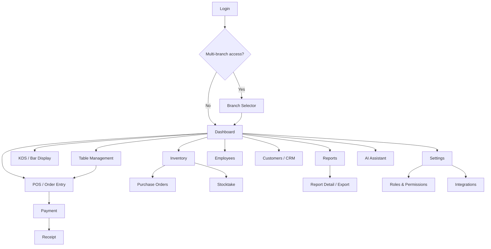

---

## 9. User Journey Maps

### 9.1 Customer Dine-In Journey (QR Ordering)

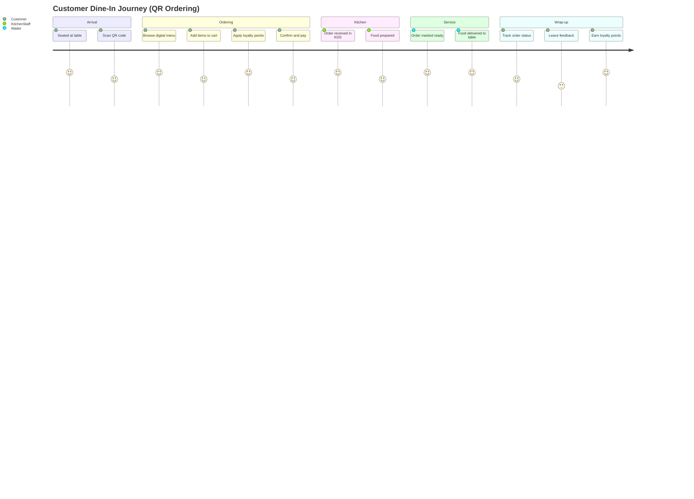

### 9.2 Waiter Table-Service Journey

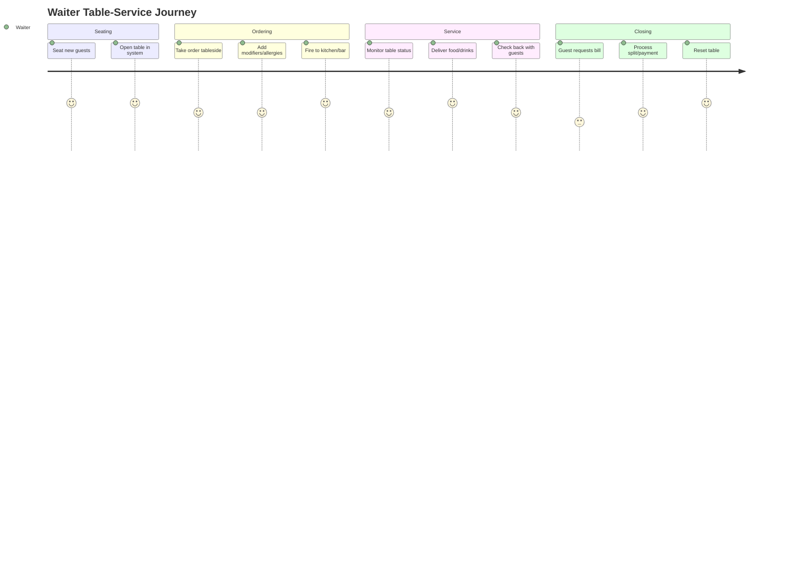

### 9.3 Owner Multi-Branch Oversight Journey

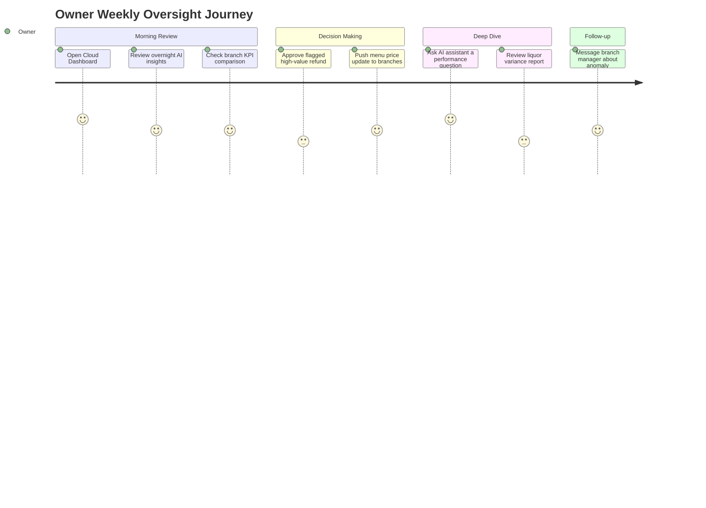

---

## 10. Business Workflows

### 10.1 Order Lifecycle — Dine-In (Take Order → Kitchen/Bar → Payment)

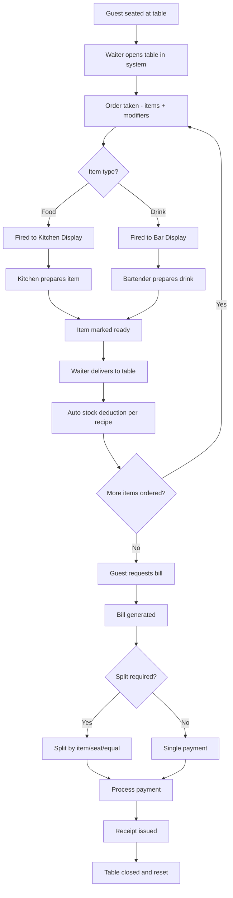

### 10.2 Split Bill Workflow

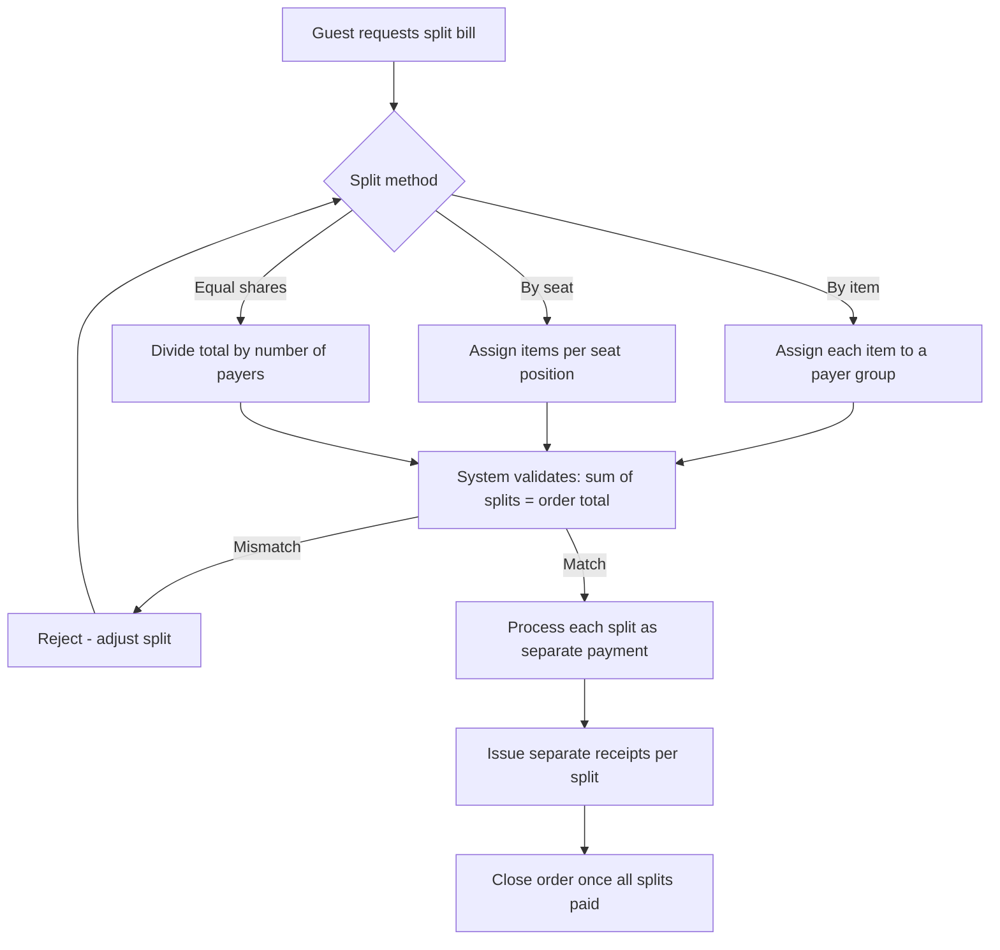

### 10.3 Refund / Void Approval Workflow

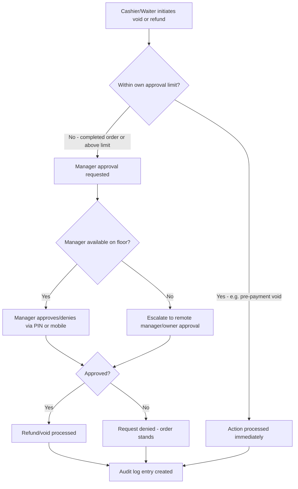

### 10.4 Branch Opening Workflow

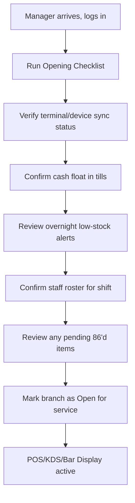

### 10.5 Branch Closing / Day Close Workflow

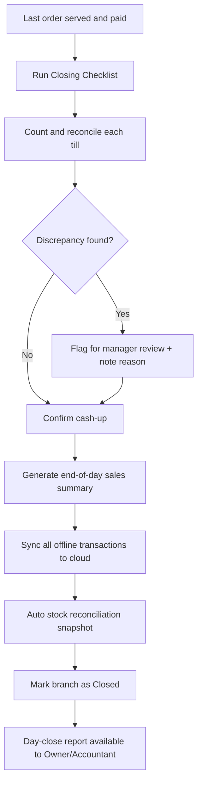

### 10.6 Inventory Purchase-to-Stock Workflow

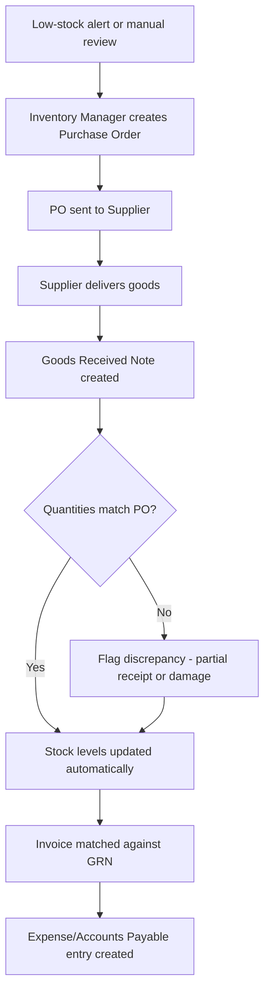

### 10.7 Stock Adjustment & Stocktake Workflow

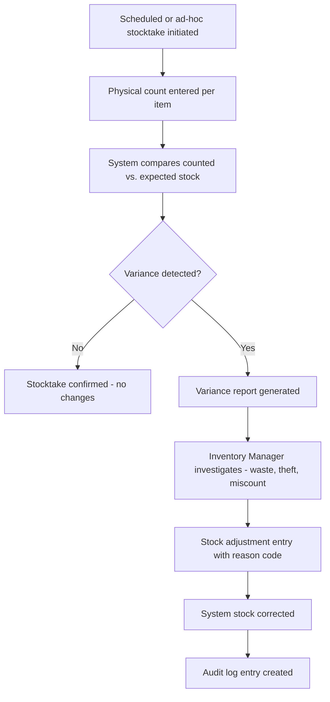

### 10.8 Employee Check-In Workflow

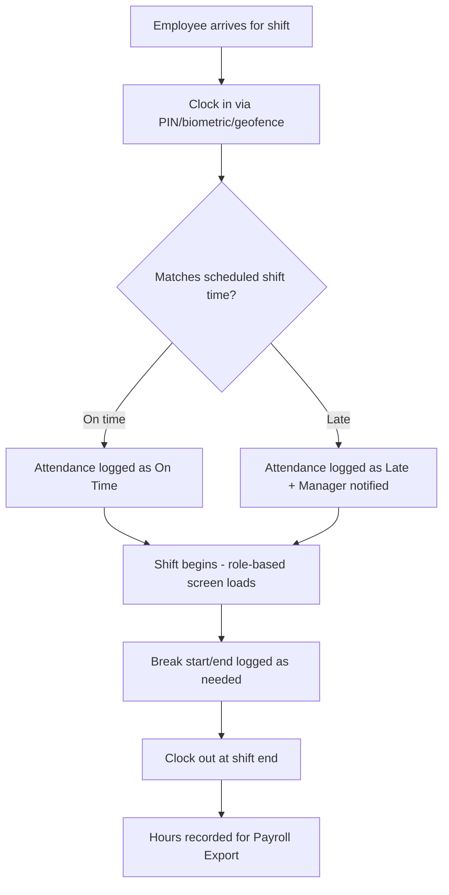

### 10.9 Reservation & Customer Walk-In Workflow

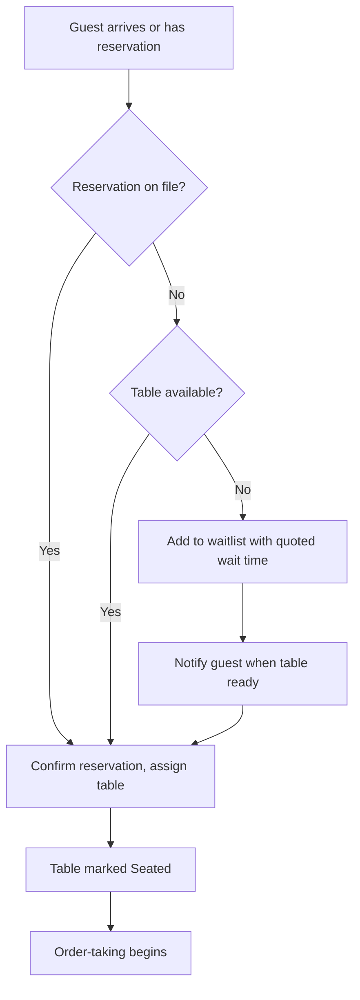

### 10.10 High-Level Product Architecture

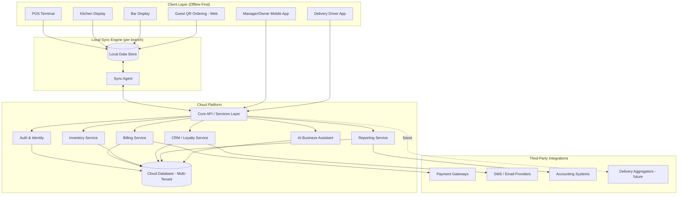

### 10.11 Module Relationship Map

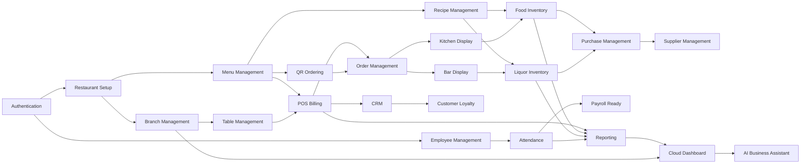

---

## 11. UX Design Guidelines

### 11.1 Design Philosophy

RestaurantOS interfaces split into two behavioral modes:

- **Speed-mode surfaces** (POS, KDS, Bar Display, Waiter handheld) — optimized for glanceable, large-touch, low-cognitive-load interaction under time pressure. Minimal navigation depth (max 2 taps to any action). Large hit targets. High-contrast status colors.
- **Analysis-mode surfaces** (Reports, Cloud Dashboard, Settings, AI Assistant) — optimized for information density and comparison, still fast, but tolerant of more visual complexity and longer dwell time.

Both modes share one visual language so switching between them (e.g., a manager moving from POS to reports mid-shift) never feels like a different product.

### 11.2 Core Guidelines

| Dimension | Guideline |
|---|---|
| **Touch targets** | Minimum 44×44px (mobile/tablet), 56×56px on speed-mode POS/KDS screens to tolerate imprecise taps during rush and gloved hands (bar/kitchen). |
| **Keyboard support** | All back-office and POS screens fully operable via keyboard shortcuts for power users (e.g., cashiers on a fixed terminal with barcode scanner + numeric pad). |
| **Tablet-first** | Table management, waiter order-taking, and manager approvals are designed tablet-first (landscape), then adapted down to phone and up to desktop. |
| **Dark mode** | Kitchen Display and Bar Display default to dark mode (kitchen/bar environments are often dim; reduces glare and eye strain during long shifts). POS defaults to light mode (front-of-house lighting is typically bright); both are user-toggleable. |
| **Accessibility** | WCAG 2.1 AA minimum: color is never the sole status indicator (icon + label + color), minimum 4.5:1 text contrast, full screen-reader labeling on back-office/reporting surfaces, scalable text up to 200% without layout breakage. |
| **Responsiveness** | Every screen defined with three breakpoints: phone (guest QR, driver app, manager mobile), tablet (POS, waiter, KDS/Bar), desktop (back-office, reporting, settings). |
| **Latency perception** | Every action gives feedback within 100ms (optimistic UI for offline-first actions); network-dependent actions show explicit loading state past 300ms. |

### 11.3 Visual Language

| Element | Specification |
|---|---|
| **Color palette (semantic)** | Primary brand color for navigation/branding (tenant-configurable for white-labeling); fixed semantic colors regardless of theme: Green = ready/available/success, Amber = warning/pending/aging, Red = urgent/error/86'd/overdue, Blue = informational/in-progress, Gray = inactive/disabled. |
| **Typography** | A single geometric sans-serif family across the product for legibility at distance (KDS screens viewed from arm's length+). Minimum 16px body text on back-office, minimum 20px on KDS/Bar ticket text. Numerals use tabular figures for price/quantity alignment. |
| **Spacing** | 8px base spacing grid. Speed-mode screens use generous spacing (16–24px between tappable elements) to prevent mis-taps; analysis-mode screens use tighter spacing (8–12px) to maximize information density. |
| **Icons** | Consistent outlined icon set; filled variant indicates active/selected state. Every icon paired with a text label on first-level navigation (never icon-only for primary actions). |
| **Animations** | Purposeful only: state-change confirmations (item added, payment success), status transitions (ticket moving from "new" to "in-progress"). No decorative animation on speed-mode screens — it costs attention during rush. Duration ≤200ms. |
| **Loading states** | Skeleton screens (not spinners) for content-heavy views (reports, dashboards); inline spinners only for short discrete actions (payment processing). |
| **Empty states** | Every empty state explains *why* it's empty and offers the next action (e.g., "No purchase orders yet — Create your first PO"), never a bare "No data." |
| **Error states** | Errors are specific and actionable ("Card declined — try another payment method" not "Transaction failed"); offline-caused errors are distinguished from real errors ("You're offline — this will sync automatically" is not an error state at all, it's an offline-mode indicator). |

---

## 12. Design System Specification

A shared component library ("RestaurantOS UI Kit") underpins every surface, with speed-mode and analysis-mode variants where interaction patterns diverge.

| Component | Variants | Notes |
|---|---|---|
| **Buttons** | Primary, Secondary, Destructive, Ghost, Icon-only | Speed-mode buttons use larger padding + bolder labels; destructive actions (void, delete) always require a secondary confirmation step. |
| **Cards** | Item card (menu/POS), Summary card (dashboard KPI), Status card (table/order) | Status cards always carry a color-coded left border or badge reflecting state. |
| **Tables / Data Grid** | Standard data table, Dense report table, Editable inline-edit table | Sticky headers, column sort, filter row; dense variant used in reporting for large datasets with virtualized scrolling. |
| **Forms & Inputs** | Text input, Numeric keypad input, Search-as-you-type, Toggle, Dropdown/select, Date/time picker | Numeric keypad input is the default entry method on POS/inventory quantity fields (not a raw text field) to prevent input errors on touch devices. |
| **Dialogs / Modals** | Confirmation modal, Full-screen modal (mobile), Approval request modal | Approval modals (void/refund) always show requester, amount, and reason before an approve/deny action. |
| **Drawers** | Side drawer (item detail, filters), Bottom sheet (mobile actions) | Bottom sheets used for guest-facing QR ordering interactions on phone. |
| **Tabs** | Top tabs (section switching), Segmented control (view toggle) | Segmented control used for e.g. "Day / Week / Month" report range toggling. |
| **Charts** | Line (trend), Bar (comparison), Donut (composition), Sparkline (compact KPI trend) | Charts always paired with the underlying data table view (toggle), never chart-only. |
| **Badges** | Status badge, Count badge, New/Alert badge | Used for order status, notification counts, low-stock flags. |
| **Notifications / Toasts** | Success toast, Error toast, Info toast, Persistent banner | Toasts auto-dismiss in 4s except errors, which require manual dismissal. |
| **Dropdowns** | Single-select, Multi-select, Searchable combobox | Branch/category filters use searchable combobox once list exceeds ~10 items. |
| **Modals for approvals** | Manager PIN modal, Remote approval push notification | PIN modal used on-premise; push notification + in-app approval used for remote manager/owner. |
| **Data Grid (advanced)** | Sortable, filterable, exportable, with row-level actions | Used in Order History, Employee Directory, Reports, Audit Logs. |

---

## 13. Business Rules

| # | Rule |
|---|---|
| BR-1 | A bill cannot be closed without full payment recorded (cash, card, wallet, split, or approved comp/write-off). |
| BR-2 | A completed (paid and closed) order cannot be deleted — only refunded or voided through the approval workflow, preserving the audit trail. |
| BR-3 | Any refund requires Manager (or higher) approval, regardless of amount, unless explicitly configured otherwise for a specific low-risk threshold by the Owner. |
| BR-4 | Only Kitchen Staff (or Bartender, for drinks) can mark a ticket/item as "ready" — no other role can advance kitchen/bar ticket status. |
| BR-5 | Only the Owner (or a role explicitly granted "employee management" permission) can permanently delete an employee record; deactivation is available to Managers, deletion is not. |
| BR-6 | Only a Manager or higher can void a bill after it has been fired to kitchen/bar; pre-fire edits do not require approval. |
| BR-7 | A split bill's individual split amounts must sum exactly to the original order total before any split payment can be processed. |
| BR-8 | Stock cannot go negative through normal sales deduction; if a recipe's ingredient is insufficient, the system flags the item for 86 rather than allowing an oversell (configurable per branch for backorder tolerance). |
| BR-9 | A purchase order cannot be marked "received" for a quantity greater than what was ordered without an explicit override + reason code. |
| BR-10 | Menu price changes pushed from the multi-branch governance screen require Owner or Admin role; a Branch Manager may only adjust prices within a pre-defined tolerance band (if permitted) for their own branch. |
| BR-11 | An employee cannot clock in for a shift they are not scheduled for without Manager override (prevents unauthorized/unplanned labor cost). |
| BR-12 | Loyalty points cannot be redeemed for more value than the current order subtotal (points cannot generate a negative payable balance). |
| BR-13 | A table cannot be marked "closed/available" while it has an unpaid open order attached. |
| BR-14 | Discounts beyond a cashier's/waiter's permitted threshold require Manager approval before the order can proceed to payment. |
| BR-15 | Every void, refund, comp, discount override, price change, and permission change is written to the immutable audit log with actor, timestamp, and reason — no exceptions, no soft-delete of audit entries. |
| BR-16 | Liquor inventory deduction is recipe/pour-based, not just "1 unit sold = 1 unit deducted" — a cocktail deducts fractional bottle quantities per ingredient. |
| BR-17 | A branch cannot be marked "closed for the day" while any till remains unreconciled. |
| BR-18 | System Administrators can configure integrations and devices but cannot approve financial actions (refunds, discounts) unless also explicitly assigned an operational role. |

---

## 14. Reporting Requirements

| Report | Purpose | Primary Consumers |
|---|---|---|
| **Sales Report** | Revenue by period, branch, category, item, payment method | Owner, Manager, Accountant |
| **Tax / GST Report** | Taxable sales and tax collected by rate/jurisdiction, filing-ready | Accountant, Owner |
| **Customer Report** | New vs. repeat customers, visit frequency, average spend per customer | Owner, Manager |
| **Inventory Report** | Stock on hand, usage, waste %, valuation, reorder recommendations | Inventory Manager, Owner |
| **Employee / Labor Report** | Hours worked, labor cost % of sales, overtime, punctuality | Manager, Owner, Accountant |
| **Attendance Report** | Clock-in/out records, absences, lateness trends | Manager, Owner |
| **Profit Report (P&L)** | Revenue minus food/liquor cost, labor, and operating expenses by branch | Owner, Accountant |
| **Expense Report** | Categorized operating expenses, recurring vs. one-off | Accountant, Owner |
| **Payments Report** | Breakdown of tender types, settlement status, processing fees | Accountant, Owner |
| **Branches Comparison Report** | Side-by-side KPIs across branches (revenue, food cost %, labor %, covers) | Owner, Accountant |
| **Kitchen Performance Report** | Average ticket time, item-level prep time, void/remake rate | Manager, Owner |
| **Bar / Liquor Variance Report** | Expected vs. actual liquor usage, pour-cost variance, shrinkage by item | Inventory Manager, Owner, Manager |
| **Discount & Void Report** | Discount/void/comp frequency and value by employee, flags outliers | Owner, Manager |
| **Loyalty Program Report** | Points issued/redeemed, active members, program ROI | Owner, Manager |
| **Purchase & Supplier Report** | Spend by supplier, price trend, on-time delivery rate | Inventory Manager, Owner |

---

## 15. Non-Functional Requirements

| Category | Requirement |
|---|---|
| **Performance** | POS item search returns results in <150ms; full transaction (search → add → tender) achievable in <10s by a trained cashier; KDS ticket appears within 1s of order fire, online or offline-then-synced. |
| **Scalability** | Architecture supports single-location tenants and 500+ branch chains on the same platform without re-architecture; horizontal scaling of cloud services independent of client terminal count. |
| **Availability** | Cloud platform target 99.9% uptime; individual terminal availability effectively 100% for core billing/KDS functions due to offline-first design (cloud outage does not stop service). |
| **Security** | Role-based access control at module and action level; encryption in transit (TLS) and at rest; PCI-DSS aligned handling for card payment data (tokenization, no raw PAN storage); MFA available for back-office/admin roles. |
| **Offline Support** | POS, KDS, Bar Display, and table management fully functional with zero connectivity for an extended period (target: indefinite for core billing, with local storage capacity as the only practical limit); guest QR ordering degrades gracefully (falls back to notifying "ask your server") when the branch itself is offline from the internet but local network is intact. |
| **Cloud Sync** | Automatic, conflict-aware synchronization on reconnect; deterministic conflict resolution rules (e.g., last-write-wins for non-financial settings, append-only merge for transactional records — never silently discard a recorded sale). |
| **Backups** | Automated, encrypted, geographically redundant backups of cloud data; point-in-time recovery capability. |
| **Disaster Recovery** | Defined RTO (recovery time objective) and RPO (recovery point objective) for cloud services; local terminal data survives cloud-side incidents entirely due to offline-first local store. |
| **Logging & Monitoring** | Centralized application and infrastructure monitoring; real-time alerting on sync failures, payment gateway errors, and abnormal error rates. |
| **Audit Trails** | Immutable, append-only audit log for all sensitive actions (Section 13, BR-15), retained per applicable regulatory retention periods. |
| **Localization** | Multi-currency, multi-language (UI text, receipts), multi-tax-regime (VAT/GST/sales tax variants) support from the core data model, not bolted on per-market. |
| **Accessibility** | WCAG 2.1 AA compliance across back-office and guest-facing surfaces (Section 11.2). |

---

## 16. Success Metrics (KPIs)

| KPI | Definition | Relevant Persona(s) |
|---|---|---|
| **Average Billing Time** | Time from first item added to payment completion | Cashier, Owner |
| **Average Kitchen Ticket Time** | Time from order fired to all items marked ready | Kitchen Staff, Manager |
| **Table Turnover Rate** | Covers seated per table per time period | Manager, Owner |
| **Revenue (by branch/period)** | Gross sales | Owner, Accountant |
| **Repeat Customer Rate** | % of transactions from previously-seen customers | Owner, Manager |
| **Food Cost %** | Cost of ingredients sold ÷ food revenue | Inventory Manager, Owner |
| **Liquor Variance %** | (Expected usage − actual usage) ÷ expected usage | Inventory Manager, Owner |
| **Inventory Accuracy %** | Stocktake counted quantity vs. system-expected quantity | Inventory Manager |
| **Customer Satisfaction (NPS/rating)** | Post-visit feedback score | Owner, Manager |
| **Employee Productivity** | Sales or covers served per labor hour | Manager, Owner |
| **Labor Cost %** | Total wage cost ÷ revenue | Owner, Accountant, Manager |
| **Void/Comp % of Sales** | Value of voids and comps ÷ gross sales | Manager, Owner |
| **On-Time Delivery %** | Deliveries completed within promised window | Delivery Driver, Manager |
| **System Uptime %** | Cloud + terminal availability | System Administrator |
| **Sync Failure Rate** | Failed/delayed sync events per terminal per period | System Administrator |

---

## 17. Product Roadmap

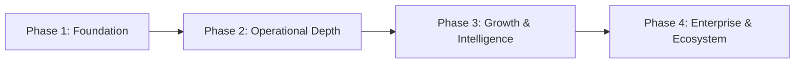

### Phase 1 — Foundation (Core Viability)
**Why this phase exists:** A restaurant cannot go live without reliable billing, kitchen coordination, and basic stock control. This phase proves the offline-first architecture and delivers a product that can fully replace an existing POS on day one.

- Authentication & role-based access
- Restaurant setup, single/multi-branch basics
- Menu management
- POS billing (incl. split/merge, multi-tender, offline-first)
- Table management
- Kitchen Display System
- Bar Display System
- Basic food & liquor inventory with manual + auto-deduction
- Employee management & attendance
- Core reporting (sales, tax, inventory)
- Audit logs, settings, device management

### Phase 2 — Operational Depth (Competitive Parity+)
**Why this phase exists:** This is where RestaurantOS starts beating single-purpose competitors by connecting the dots they leave disconnected — cost control, guest engagement, and procurement discipline.

- QR code ordering (guest self-service)
- Recipe management with automatic cost/margin calculation
- Purchase management & supplier management
- Expense tracking
- Customer CRM & loyalty program
- Payroll-ready export & shift scheduling
- Manager mobile approvals
- Multi-branch cloud dashboard (basic)

### Phase 3 — Growth & Intelligence (Differentiation)
**Why this phase exists:** Data accumulated in Phases 1–2 becomes the fuel for AI-driven decision support — the layer generalist competitors can't easily replicate without the same underlying operational data depth.

- AI Business Assistant (Q&A + proactive anomaly insights)
- Advanced liquor variance & pour-cost analytics
- Delivery driver module (in-house fleet)
- Customer feedback/NPS capture
- Supplier price comparison
- Menu push/governance across branches (full)
- Advanced multi-branch benchmarking

### Phase 4 — Enterprise & Ecosystem (Scale)
**Why this phase exists:** To win large chains and become a durable platform (not just an app), RestaurantOS needs enterprise governance, predictive intelligence, and an ecosystem others build on.

- Predictive/AI-driven inventory ordering
- Dynamic menu pricing recommendations
- Franchise self-service onboarding
- Third-party delivery aggregator marketplace integration
- Embedded financial services (e.g., working-capital lending, payroll-as-a-service)
- Open integration marketplace / partner API ecosystem

---

## 18. Risks and Assumptions

| Type | Item | Mitigation |
|---|---|---|
| **Risk** | Offline-first conflict resolution is complex; incorrect merge logic could corrupt financial records. | Append-only transactional log design (never overwrite a recorded sale); extensive conflict-scenario testing before Phase 1 GA. |
| **Risk** | Multi-branch governance (centralized menu/pricing push) could clash with legitimate local branch autonomy needs. | Configurable override bands (BR-10) rather than hard central lock. |
| **Risk** | AI Business Assistant giving confidently wrong answers could erode trust faster than it builds it. | Ground all AI responses in queryable operational data with visible source/citation of the underlying report; no unconstrained generative claims about financials. |
| **Risk** | Payment processing and PCI compliance scope creep could slow Phase 1 delivery. | Use certified payment gateway partners/tokenization rather than building card processing in-house. |
| **Risk** | Liquor/food inventory auto-deduction accuracy depends entirely on recipe data quality entered by operators. | Recipe Builder UX must make accurate entry the path of least resistance (Section 12); provide default recipe templates for common items. |
| **Assumption** | Target customers have (or will accept) tablet/touch hardware at the table and counter. | Validate hardware assumptions per target segment (e.g., breweries/pubs may prefer fixed terminals over tablets) during Phase 1 pilot. |
| **Assumption** | Target markets have reasonably reliable (if intermittent) internet at each branch for periodic sync. | Offline-first design already hedges this; validate sync interval tolerance with pilot customers in low-connectivity regions. |
| **Assumption** | Multi-branch chains will want centralized governance, not fully independent branch instances. | Confirmed as an explicit design principle (Section 2); revisit if enterprise pilot feedback contradicts. |

---

## 19. Future Enhancements

- Predictive demand forecasting driving auto-generated purchase orders
- Dynamic, demand-based menu pricing (e.g., happy-hour auto-pricing by real-time occupancy)
- Facial-recognition or biometric guest recognition for VIP/loyalty personalization (opt-in, privacy-first)
- IoT integration: smart pour spouts, connected kegs, smart scales for portion control
- Franchise self-service onboarding portal (reduce time-to-launch for new chain locations)
- Marketplace of third-party integrations (delivery aggregators, accounting platforms, marketing tools) with a partner API program
- Embedded financial services: working-capital lending based on real-time sales data, integrated payroll disbursement
- Voice-assisted ordering (guest-facing and kitchen-facing "hands-free" ticket updates)
- Sustainability tracking (food waste reduction metrics, carbon footprint reporting) as an ESG-driven differentiator
- Advanced workforce tools: skills/certification tracking (food safety, responsible alcohol service), AI-assisted shift scheduling optimization

---

*End of document — RestaurantOS Product Blueprint v1.0*
