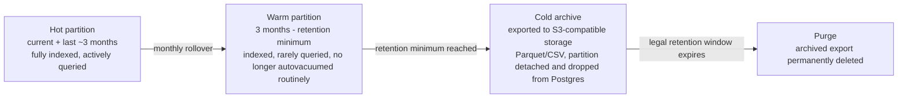
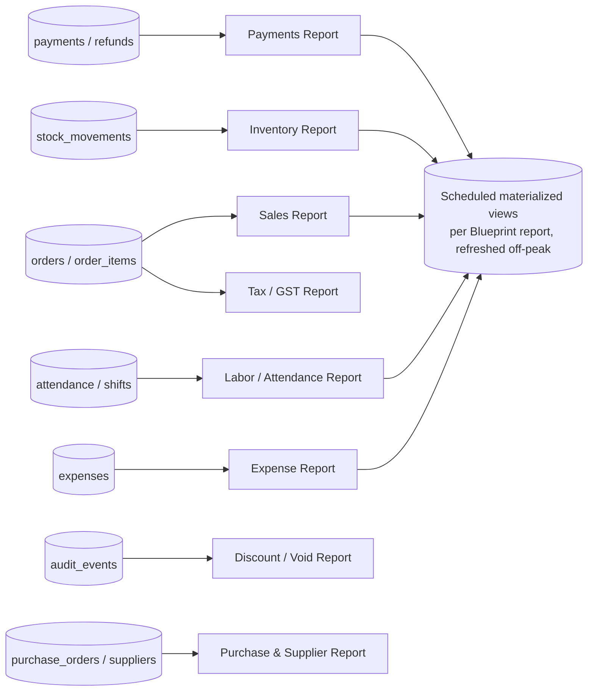
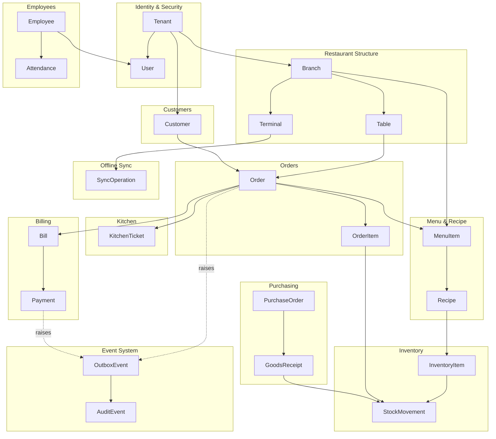
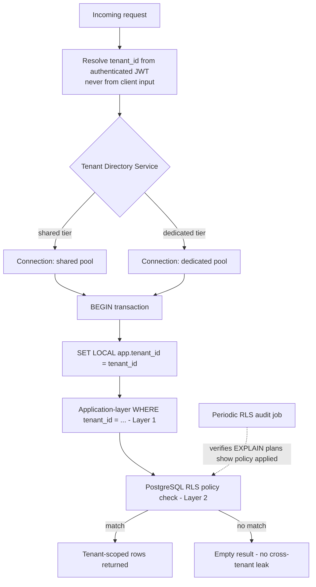
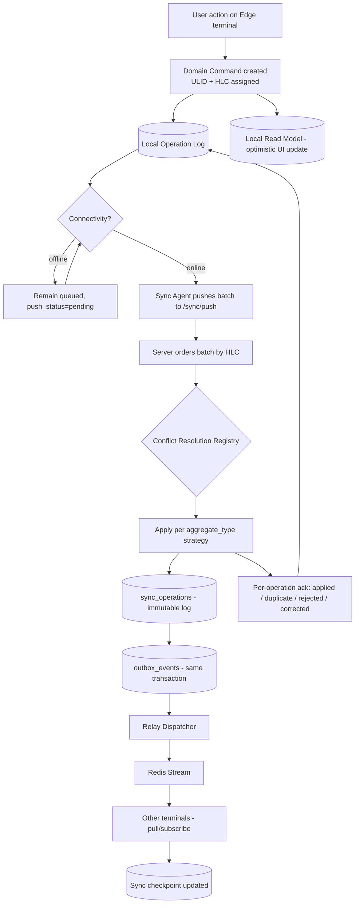
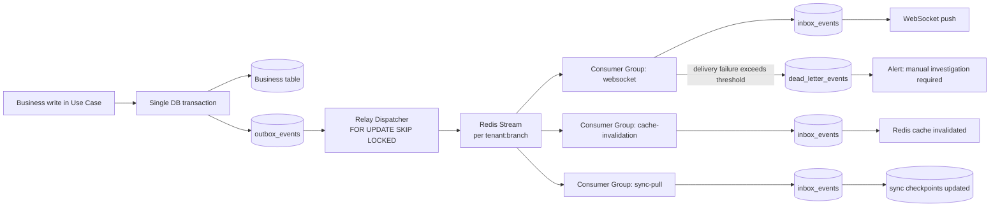
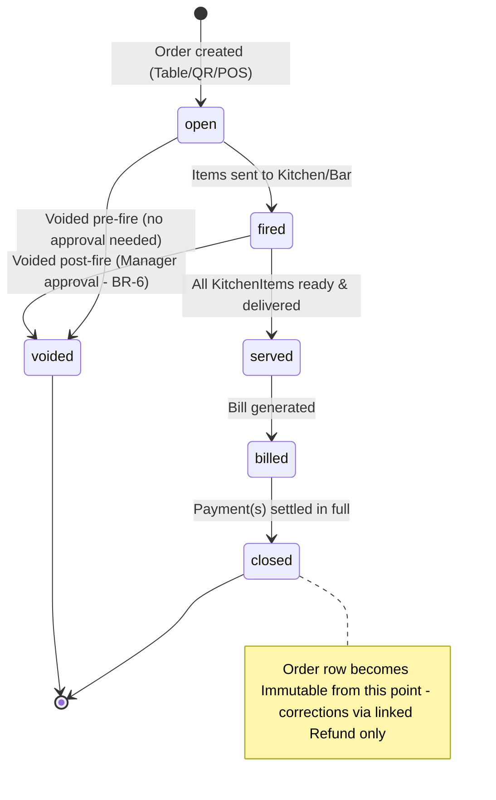
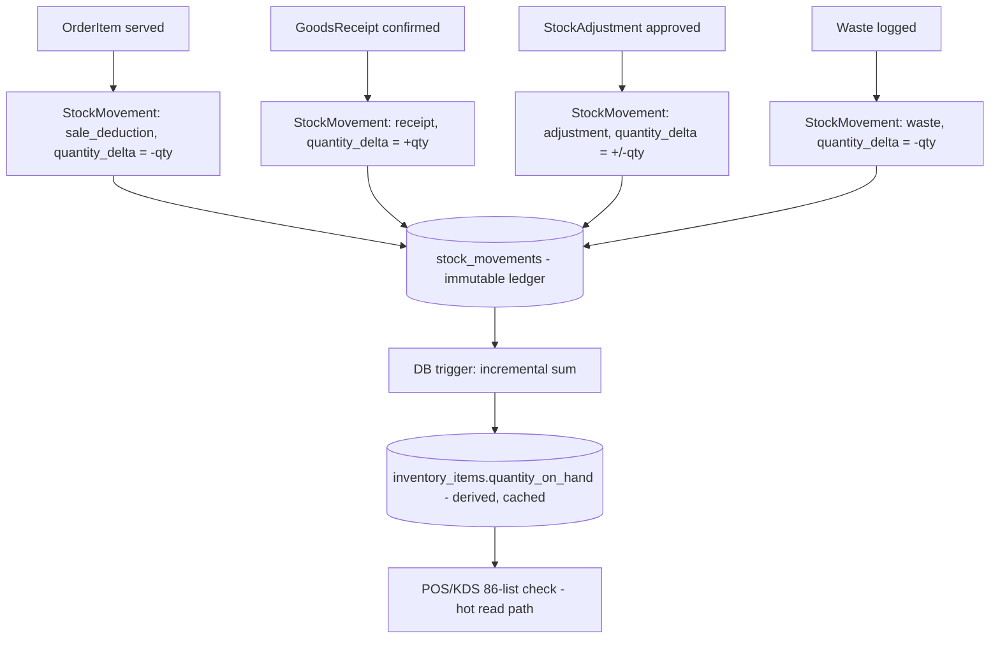
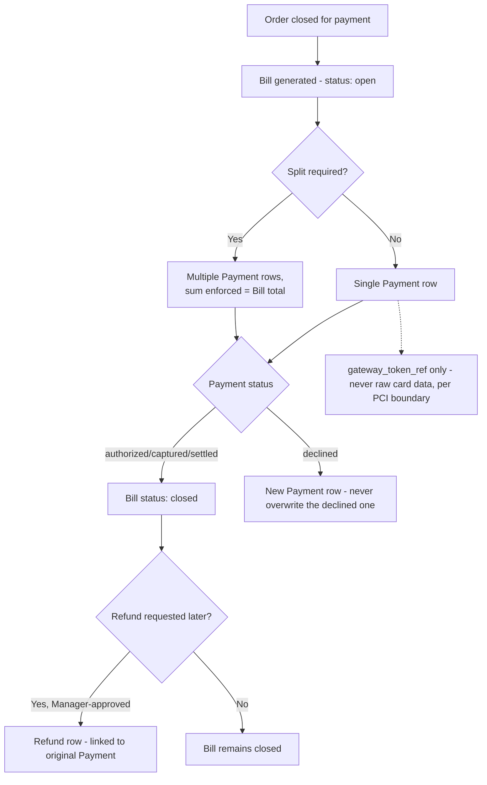

# RestaurantOS — Enterprise Data Architecture (Sprint 2)

**Document type:** Enterprise Data Architecture Document
**Supersedes/extends:** [Product Blueprint v1.0](RestaurantOS_Product_Blueprint.md) · [Technical Architecture v1.0](RestaurantOS_Technical_Architecture.md) · [Technical Architecture v2.0](RestaurantOS_Technical_Architecture_v2.md) · [Architecture Review](RestaurantOS_Architecture_Review.md)
**Scope:** Persistence layer only — data model, database design, multi-tenancy implementation, offline/event data structures, performance, security, ORM/migration strategy, governance, and testing. No business logic, no UI, no feature APIs beyond illustrative examples.
**Status:** Part 1 of 5 — this part covers the Data Architecture Overview, the complete Entity Catalogue (Deliverable 1), and Multi-Tenancy (Deliverable 4). Parts 2–5 cover Table Specifications/SQLAlchemy/Alembic, Offline & Event data, Performance/Security/Governance/Testing, and Diagrams/ADRs/Risks/Self-Review respectively. All parts are concatenated into the final combined document.

---

## 1. Executive Summary

This document defines how RestaurantOS's data is structured, isolated, synchronized, and governed — the persistence-layer counterpart to the Technical Architecture v2.0's application-layer decisions. It does not revisit those decisions; it implements them. Where a data-layer question exposes a genuine gap or forces a change to prior architecture, that change is recorded as an ADR (Part 5) rather than applied silently, per this sprint's operating constraint.

Three v2.0 decisions drive every design choice below and are treated as fixed inputs, not open questions:

1. **Shared-schema, RLS-isolated multi-tenancy with a Tenant Directory Service** for sharding/tiering readiness (v2.0 Groups G, H).
2. **A durable, HLC-ordered, ULID-keyed local-first sync protocol** (v2.0 Group A) — every offline-capable write must be representable as a replayable, idempotent operation.
3. **A transactional outbox + Redis Streams event backbone** (v2.0 Groups B, D) — every state change that matters to another consumer must be captured as a durable, ordered event in the same transaction as the write that caused it.

---

## 2. Data Architecture Overview

### 2.1 Core Technology Decisions (data layer)

| Decision | Choice | Rationale |
|---|---|---|
| **Primary datastore** | PostgreSQL 17 | Already fixed by TAD v1.0/v2.0. PostgreSQL 17 specifically adds improved incremental backup, better `MERGE` support (useful for upsert-heavy sync reconciliation), and continued JSONB/partitioning maturity — all directly relevant to this sprint's offline-sync and partitioning designs. |
| **Primary key strategy** | ULID, stored as a 26-character Crockford Base32 string in a `char(26)` column (not native `uuid`) | See **ADR-D1** (Part 5). Summary: ULIDs are lexicographically sortable by creation time, which is exactly what the local-first sync engine (v2.0 Group A) needs for HLC-ordered replay — a random UUIDv4 would fragment B-tree indexes and destroy the natural time-ordering the sync protocol depends on. Client-generated ULIDs also let Edge terminals mint valid, globally-unique primary keys **while fully offline**, which a database-generated identity/sequence column cannot do. |
| **Tenant/branch scoping column** | Every tenant-owned table carries a non-nullable `tenant_id CHAR(26)` (and, where branch-scoped, `branch_id CHAR(26)`) | Implements v2.0 Group H's shared-schema RLS model at the column level — this is the literal enforcement surface for both the RLS policies and the application-layer scoping. |
| **Soft delete** | A nullable `deleted_at TIMESTAMPTZ` column plus (where the row is also tenant-owned) inclusion in the same RLS policy — no separate "deleted" boolean | A single nullable timestamp gives "is it deleted" (`IS NOT NULL`) and "when was it deleted" (retention/archival scheduling) in one column, avoiding the drift risk of a boolean and a timestamp disagreeing. |
| **Audit/timestamp columns** | `created_at`, `updated_at` (both `TIMESTAMPTZ NOT NULL DEFAULT now()`, `updated_at` maintained by a trigger, not application code) | A DB-level trigger guarantees `updated_at` correctness even for direct migrations/bulk operations that bypass the ORM — the application layer should never be the only thing responsible for this invariant. |
| **JSON usage** | `JSONB`, used deliberately and narrowly (modifier configuration snapshots, webhook payloads, event payloads) — never as a substitute for a properly normalized column set | JSONB is appropriate for genuinely semi-structured, schema-flexible data (e.g., a modifier selection snapshot frozen at order time) but is explicitly *not* used for anything that needs to be filtered/indexed/reported on relationally — that data gets real columns. |
| **Full-text search** | PostgreSQL native `tsvector` generated columns + GIN indexes (menu items, customers, suppliers) | Matches TAD v2.0's stated Phase 1–2 search strategy; the search *port* remains swappable to Elasticsearch later without touching calling code. |
| **Money representation** | `NUMERIC(19,4)` for all monetary amounts, paired with a `currency_code CHAR(3)` (ISO 4217) column — never `FLOAT`/`DOUBLE` | See **ADR-D2** (Part 5). Fixed-point decimal avoids floating-point rounding error in financial calculations; 4 decimal places accommodates currencies and tax-rate arithmetic that need more precision than 2 decimals mid-calculation, rounded to the currency's actual minor-unit precision only at display/settlement time. |

### 2.2 Naming Conventions (data layer)

| Object | Convention | Example |
|---|---|---|
| Table names | plural, `snake_case` | `menu_items`, `kitchen_tickets` |
| Column names | `snake_case` | `unit_price_amount`, `deleted_at` |
| Primary key column | always `id` | `id CHAR(26) PRIMARY KEY` |
| Foreign key column | `{singular_referenced_table}_id` | `order_id`, `branch_id` |
| Index names | `ix_{table}_{columns}` | `ix_orders_tenant_id_branch_id_created_at` |
| Unique constraint names | `uq_{table}_{columns}` | `uq_users_tenant_id_email` |
| Check constraint names | `ck_{table}_{rule}` | `ck_orders_total_amount_non_negative` |
| Foreign key constraint names | `fk_{table}_{column}_{referenced_table}` | `fk_order_items_order_id_orders` |

### 2.3 Guiding Principles Carried Forward from v2.0

1. **Append-only where the domain is append-only.** Financial facts (orders, payments, audit events, stock movements) are never updated in place once committed — corrections are new, linked rows (a refund references its payment; a stock adjustment references its movement), not mutations. This is what makes the Group A conflict-resolution registry's "append-only facts never conflict" guarantee actually true at the schema level.
2. **Every tenant-owned row is scoped, indexed, and RLS-protected the same way.** No table gets a bespoke isolation mechanism — consistency here is what makes the CI-level and DBA-level auditing of tenant isolation tractable at 10,000+ tenants.
3. **Every offline-capable write carries its own idempotency key and causal ordering data.** This is not bolted onto specific tables — it's a base mixin (Part 2) applied uniformly to every entity the sync engine can originate.

---

## 3. Entity Catalogue (Deliverable 1)

All 60 required entities, organized into the domains used consistently across this document and the ER diagrams (Part 5). Every entity specifies **Purpose**, **Key Relationships**, **Lifecycle**, **Soft Delete Policy**, and **Retention Policy**.

**Legend for Soft Delete Policy:** `Soft` = `deleted_at` nullable column, row retained; `Hard` = physically deletable (rare, only for data with no financial/audit weight); `Immutable` = never deleted or updated, ever (append-only fact); `N/A` = reference/config table, deactivated rather than deleted.

### 3.1 Identity & Security

| Entity | Purpose | Key Relationships | Lifecycle | Soft Delete | Retention |
|---|---|---|---|---|---|
| **Tenant** | The top-level business account (a restaurant company, chain, or independent operator) — the root of all tenant-scoped data and the unit of billing/subscription | Has many Branches (via Restaurant), Users, Subscriptions | Created at signup/onboarding → active → optionally suspended (billing failure) → optionally offboarded | Soft (never hard-deleted; suspension precedes any deactivation) | Indefinite while active; offboarded tenant data retained per contractual/legal minimum (Part 4) before archival |
| **Subscription** | The tenant's current commercial plan, billing cycle, and feature entitlements | Belongs to Tenant; referenced by feature-gating checks | Created on signup → renewed/upgraded/downgraded → canceled | Soft | Retained for the life of the tenant relationship plus financial retention minimum (7 years, Part 4) for billing history |
| **User** | An authenticated principal — any human who can log into any RestaurantOS surface (owner, manager, cashier, waiter, kitchen staff, accountant, admin) | Belongs to Tenant; has many UserRole; has one Employee (optional, for staff); has many Session | Invited/created → active → deactivated (Group C's immediate-revocation path applies here) | Soft (deactivation is the dominant path; hard delete only on verified GDPR erasure, Part 4) | Retained for audit-trail integrity (referenced by `actor_ref` in AuditEvent) even after deactivation; PII erasable independently (Part 4) |
| **Role** | A named, tenant-configurable bundle of permissions (e.g., "Branch Manager," a custom role) | Has many RolePermission; has many UserRole | Created (system default or tenant-custom) → edited → retired | Soft | Indefinite while referenced by any UserRole; retired roles retained for audit history |
| **Permission** | A single, granular, enumerated capability (e.g., `orders.void`, `employees.deactivate`) — platform-defined, not tenant-editable | Has many RolePermission | Defined at platform level, versioned with releases | N/A (platform reference data) | Indefinite |
| **RolePermission** | Join table granting a Permission to a Role | Belongs to Role, belongs to Permission | Created/removed as role definitions change | Hard (pure join row, no independent audit weight — the Role edit itself is audited) | N/A |
| **UserRole** | Join table assigning a Role to a User, optionally scoped to a specific Branch | Belongs to User, belongs to Role, optionally belongs to Branch | Assigned → revoked (revocation triggers Group C's `permission_version` bump) | Soft (revocation recorded, not deleted, for audit of "who had what access when") | Retained for the audit/compliance retention window (Part 4) |
| **Session** | A live or historical authenticated session (Group C's session registry, persisted for audit in addition to its live Redis copy) | Belongs to User; belongs to Device (optional) | Created at login → active → expired/revoked/logged-out | Soft | Short operational retention (e.g., 90 days) then archived/purged — sessions are operational, not financial, records |
| **ApiKey** | A credential for machine-to-machine access (integrations, future partner API) | Belongs to Tenant; optionally scoped to specific permissions | Issued → active → rotated/revoked | Soft | Retained for audit for the compliance window after revocation, then purged |

### 3.2 Restaurant Structure

| Entity | Purpose | Key Relationships | Lifecycle | Soft Delete | Retention |
|---|---|---|---|---|---|
| **Restaurant** | A tenant's named business concept (a tenant may operate more than one distinct brand/concept, each with its own branches) | Belongs to Tenant; has many Branch | Created during onboarding or brand expansion → active → discontinued | Soft | Indefinite while any Branch references it |
| **Branch** | A single physical location — the unit the Blueprint's Branch Manager persona operates | Belongs to Restaurant; has one Address; has many Table, Terminal, Employee, InventoryItem (branch-scoped stock) | Opened → active → temporarily closed → permanently closed | Soft | Indefinite; closed branches retain full historical data for reporting continuity |
| **Address** | A normalized postal address, reused by Branch, CustomerAddress, Supplier | Referenced by Branch, CustomerAddress, Supplier (polymorphic-safe via separate FK columns per owner, not a generic polymorphic association — see ADR-D3, Part 5) | Created with its owner → edited | Soft | Follows owner's retention |
| **Table** | A physical seating unit on a branch's floor plan | Belongs to Branch; belongs to TableZone; has many Reservation, Order (dine-in) | Added to floor plan → active → retired (renovation, layout change) | Soft | Indefinite (referenced by historical Orders) |
| **TableZone** | A named grouping of tables (patio, main floor, bar seating) for floor-plan organization and waiter-section assignment | Belongs to Branch; has many Table | Created → edited → retired | Soft | Indefinite |
| **Reservation** | A booked table request, walk-in waitlist entry, for a future or current time | Belongs to Branch; belongs to Table (once assigned); belongs to Customer (optional, guest reservations allowed) | Requested → confirmed → seated → completed / no-show / canceled | Soft | Retained per general operational retention (Part 4); feeds CRM visit-frequency analytics |
| **Terminal** | A registered logical point-of-service endpoint (a POS lane, a KDS screen, a bar display) — the thing Blueprint §7.10's Device Management screen manages | Belongs to Branch; has many Device (a terminal's paired hardware over its lifetime) | Provisioned → active → decommissioned | Soft | Indefinite (referenced by historical Orders/Sessions for audit) |
| **Device** | A specific physical hardware pairing (a tablet, a receipt printer, a card reader) bound to a Terminal | Belongs to Terminal; referenced by Session (`device_id`) | Paired → active → unpaired/replaced | Soft | Retained for the audit window after unpairing |

### 3.3 Customers

| Entity | Purpose | Key Relationships | Lifecycle | Soft Delete | Retention |
|---|---|---|---|---|---|
| **Customer** | A guest record — the CRM/loyalty subject, may exist with minimal data (guest checkout) or full profile | Belongs to Tenant (customers can be tenant-wide across branches for chain-level CRM); has many CustomerAddress; has one CustomerLoyalty; has many Order, Reservation | Created (first visit/signup) → active → merged (duplicate resolution) → erased (GDPR) | Soft; supports the Part 4 pseudonymization/tombstone pattern for GDPR erasure without breaking Order history | PII erasable on request (Part 4); linked Order/financial facts retained regardless via the actor-ref/tombstone pattern |
| **CustomerAddress** | A customer's saved delivery/billing address(es) | Belongs to Customer; uses Address | Added → edited → removed | Soft | Follows Customer's retention/erasure policy |
| **CustomerLoyalty** | A customer's points balance, tier, and loyalty program membership state | Belongs to Customer; belongs to Tenant's loyalty program configuration (future module, not designed here) | Enrolled → accruing/redeeming → expired/closed | Soft | Retained per Customer's retention; point-transaction history retained for the audit window even if the loyalty account itself is closed |

### 3.4 Menu & Recipe

| Entity | Purpose | Key Relationships | Lifecycle | Soft Delete | Retention |
|---|---|---|---|---|---|
| **MenuCategory** | A named grouping of sellable items (Appetizers, Cocktails) | Belongs to Restaurant; has many MenuItem | Created → reordered/edited → retired | Soft | Indefinite |
| **MenuItem** | A sellable product — the unit priced, ordered, and recipe-costed | Belongs to MenuCategory; has many ModifierGroup (via join); has one Recipe (optional — not every sellable item has a costed recipe, e.g. a resold bottled drink); referenced by OrderItem | Created → priced → available/86'd → discontinued | Soft | Indefinite (referenced by historical OrderItem for reporting) |
| **ModifierGroup** | A named set of choices for a menu item (e.g., "Choose your side," "Spice level") | Belongs to MenuItem (or shared across items — modeled as its own entity referenced by a join, not owned exclusively) | Created → edited → retired | Soft | Indefinite |
| **Modifier** | A single selectable option within a ModifierGroup, with its own optional price delta | Belongs to ModifierGroup | Created → priced → retired | Soft | Indefinite (referenced by historical OrderItem modifier snapshots) |
| **Recipe** | The bill-of-materials definition for a MenuItem — what it costs to make | Belongs to MenuItem (one-to-one); has many RecipeIngredient | Created → revised (versioned — see Part 2) → retired | Soft | Indefinite; historical versions retained for accurate historical cost/margin reporting |
| **RecipeIngredient** | One ingredient line within a Recipe, with quantity and unit | Belongs to Recipe; belongs to InventoryItem | Added → quantity adjusted → removed | Soft | Follows Recipe's retention |

### 3.5 Orders

| Entity | Purpose | Key Relationships | Lifecycle | Soft Delete | Retention |
|---|---|---|---|---|---|
| **Order** | The core transactional aggregate — one dine-in/QR/takeaway/delivery order | Belongs to Branch; belongs to Table (optional, dine-in); belongs to Customer (optional); has many OrderItem; has one Bill; originates KitchenTicket(s) | Opened → items added → fired → served → billed → closed / voided | **Immutable** once closed (Group A's append-only-fact category) — corrections happen via linked Refund/void records, never in-place edits | Financial retention minimum (7 years, Part 4), then archived to cold storage (partition detach, Part 4) |
| **OrderItem** | A single line item within an Order, with its selected modifiers frozen at order time (JSONB snapshot, §2.1) | Belongs to Order; belongs to MenuItem | Added → fired to kitchen/bar → prepared → served / voided (pre-fire only, per Blueprint BR-6) | Immutable once fired (matches Order's immutability) | Follows Order's retention |

### 3.6 Kitchen

| Entity | Purpose | Key Relationships | Lifecycle | Soft Delete | Retention |
|---|---|---|---|---|---|
| **KitchenTicket** | A station-routed ticket representing one or more OrderItems fired together | Belongs to Order; belongs to Branch; routed to a station (grill/fry/cold/bar — modeled as an attribute, not a separate entity per the "no business logic" scope constraint) | Fired → in-progress → ready → bumped/served | Immutable once bumped (append-only fact, feeds Blueprint's Kitchen Performance Report) | Follows Order's retention |
| **KitchenItem** | One OrderItem's status within a KitchenTicket — allows partial-ticket readiness (Blueprint K2) | Belongs to KitchenTicket; belongs to OrderItem | Queued → in-progress → ready | Immutable once ready | Follows Order's retention |

### 3.7 Billing & Payments

| Entity | Purpose | Key Relationships | Lifecycle | Soft Delete | Retention |
|---|---|---|---|---|---|
| **Bill** | The payable total for an Order (or a split portion of it — one Order can have multiple Bills under Blueprint's split-bill workflow) | Belongs to Order; has many Payment | Generated → partially paid → fully paid → closed | Immutable once closed | Financial retention minimum (7 years) |
| **Payment** | A single tender/payment attempt against a Bill (cash, card-token reference, wallet) — **never contains raw card data**, per TAD v2.0 Group F's PCI boundary | Belongs to Bill; belongs to Terminal/Device (which device processed it); belongs to CashDrawer (if cash) | Authorized → captured → settled / declined | Immutable once settled; a failed/declined attempt is retained as its own immutable record, not overwritten by a retry | Financial retention minimum (7 years) |
| **Refund** | A reversal of all or part of a Payment, always linked back to it — never a mutation of the original Payment (Blueprint BR-2, BR-3) | Belongs to Payment; belongs to Order; references the approving User (manager approval, Blueprint BR-3) | Requested → approved → processed | Immutable once processed | Financial retention minimum (7 years) |
| **CashDrawer** | A physical till's running cash state for a shift (opening float, expected vs. counted at close) | Belongs to Terminal; belongs to Shift | Opened → transactions accrue → closed/reconciled | Immutable once closed/reconciled | Financial retention minimum (7 years) |
| **Tax** | A tenant/branch-configurable tax rate definition (GST/VAT/sales-tax variants, per Blueprint NFR localization) | Belongs to Tenant (with optional Branch override); referenced by Bill line calculations | Configured → effective-dated → superseded | Soft (superseded rates retained for historical bill recalculation/audit, never deleted) | Indefinite |
| **Currency** | Reference data — ISO 4217 currency definitions (code, symbol, minor-unit precision) | Referenced by Tenant, Order, Bill, Payment, Expense | Platform-seeded reference data | N/A | Indefinite |

### 3.8 Inventory

| Entity | Purpose | Key Relationships | Lifecycle | Soft Delete | Retention |
|---|---|---|---|---|---|
| **InventoryCategory** | A grouping for InventoryItem (Produce, Dry Goods, Spirits, Beer) | Belongs to Tenant; has many InventoryItem | Created → edited → retired | Soft | Indefinite |
| **InventoryItem** | A raw ingredient or stock-tracked unit (food or liquor), branch-scoped stock level | Belongs to InventoryCategory; belongs to Branch; referenced by RecipeIngredient, StockMovement, PurchaseOrderItem | Created → stocked → depleted/restocked → discontinued | Soft | Indefinite (historical stock-movement reporting depends on it) |
| **StockMovement** | An immutable ledger entry for every stock change (sale deduction, adjustment, receipt, waste) — the append-only source of truth stock *levels* are derived from, never the other way around | Belongs to InventoryItem; belongs to Branch; optionally references OrderItem (sale deduction), GoodsReceipt (purchase receipt), or StockAdjustment (manual correction) | Created once, never edited | **Immutable** | Financial/operational retention minimum, then partition-archived (Part 4) |
| **StockAdjustment** | A manual correction to stock (stocktake variance, spoilage, theft) — the *reason* record; the actual quantity change is still expressed as a linked StockMovement | Belongs to InventoryItem; belongs to Branch; references approving User | Recorded → approved | Immutable once approved | Financial/operational retention minimum |
| **LiquorBottle** | A specialized tracking unit for bottle/keg-level liquor inventory (pour-cost tracking, Blueprint's Liquor Inventory module) — distinct from generic InventoryItem due to fractional-pour deduction needs | Belongs to InventoryItem (a LiquorBottle is a specific trackable instance of a liquor InventoryItem); belongs to Branch | Received → tapped/opened → depleted | Soft (depleted bottles retained for variance reporting, not deleted) | Follows InventoryItem's retention |

### 3.9 Purchasing

| Entity | Purpose | Key Relationships | Lifecycle | Soft Delete | Retention |
|---|---|---|---|---|---|
| **Supplier** | A vendor record | Belongs to Tenant; has one Address; has many PurchaseOrder | Onboarded → active → inactive | Soft | Indefinite (historical PO/spend reporting) |
| **PurchaseOrder** | A procurement request/commitment to a Supplier | Belongs to Supplier; belongs to Branch; has many PurchaseOrderItem; has many GoodsReceipt | Draft → sent → partially received → fully received / canceled | Immutable once fully received (financial commitment record) | Financial retention minimum |
| **PurchaseOrderItem** | A single line item within a PurchaseOrder | Belongs to PurchaseOrder; belongs to InventoryItem | Added → received (fully/partially) | Immutable once the PO is received | Follows PurchaseOrder's retention |
| **GoodsReceipt** | A record of goods actually received against a PurchaseOrder (may be partial, may flag discrepancies) | Belongs to PurchaseOrder; generates StockMovement entries on confirmation | Created at delivery → confirmed | Immutable once confirmed | Financial retention minimum |

### 3.10 Employees

| Entity | Purpose | Key Relationships | Lifecycle | Soft Delete | Retention |
|---|---|---|---|---|---|
| **Employee** | The staff-specific profile extending a User (pay-rate reference, hire date, employment documents metadata) | Belongs to User (one-to-one); belongs to Branch (primary assignment); has many Shift, Attendance | Hired → active → terminated | Soft | Payroll/employment records retained per labor-law minimum (jurisdiction-configurable, typically several years) |
| **Shift** | A scheduled work period for an Employee | Belongs to Employee; belongs to Branch | Scheduled → published → completed/no-show | Soft | Follows Employee's retention |
| **Attendance** | An actual clock-in/out record against a Shift (or an unscheduled clock-in, flagged) | Belongs to Employee; belongs to Shift (optional); belongs to Terminal/Device (where clocked in) | Clock-in → break events → clock-out | Immutable once clock-out is recorded (payroll-source-of-truth fact) | Payroll/employment records retention minimum |

### 3.11 Expenses

| Entity | Purpose | Key Relationships | Lifecycle | Soft Delete | Retention |
|---|---|---|---|---|---|
| **ExpenseCategory** | A grouping for Expense (Utilities, Rent, Maintenance) | Belongs to Tenant; has many Expense | Created → edited → retired | Soft | Indefinite |
| **Expense** | A recorded operating expense, optionally with an attached receipt (Attachment) | Belongs to ExpenseCategory; belongs to Branch; has many Attachment | Recorded → approved (if workflow requires) | Immutable once approved (financial fact) | Financial retention minimum |

### 3.12 Offline Sync

| Entity | Purpose | Key Relationships | Lifecycle | Soft Delete | Retention |
|---|---|---|---|---|---|
| **SyncOperation** | The server-side durable record of one client-originated operation (Group A) — the append-only Operation/Command Log described in Deliverable 5 (Part 3) | Belongs to Tenant, Branch, Device; references the aggregate it mutated (`aggregate_type`, `aggregate_id`) | Received → applied / rejected / applied-with-correction | Immutable | Operational retention window (Part 3/4), then archived — this is the audit trail of "what actually happened, from where, in what order" |
| **SyncConflict** | A recorded instance where the Conflict Resolution Registry (v2.0 Group A) had to resolve competing operations, kept for observability and dispute resolution | Belongs to SyncOperation (the losing operation); references the winning SyncOperation | Detected → resolved → (rarely) manually reviewed | Immutable | Operational retention window, then archived |

### 3.13 Event System

| Entity | Purpose | Key Relationships | Lifecycle | Soft Delete | Retention |
|---|---|---|---|---|---|
| **AuditEvent** | The immutable Financial/Action Fact half of TAD v2.0 Group F's split audit design — action code, resource, amount, timestamp, `actor_ref` (never a name/email directly) | References the acting User via opaque `actor_ref`; polymorphically references the affected resource (`resource_type`, `resource_id`) | Written once, in the same transaction as the audited action | **Immutable, no exceptions** (financial fact half only — PII lives in the separate, erasable Actor/Context Directory, Part 4) | Compliance/audit retention minimum, typically longer than general financial retention |
| **OutboxEvent** | The transactional outbox row (TAD v2.0 Group B) — written in the same transaction as its triggering business change, relayed to Redis Streams, then marked dispatched | References the originating aggregate; not FK-linked to business tables (deliberately decoupled — an outbox row must never fail to insert due to an unrelated FK constraint) | Created (transactional) → dispatched → (short-lived) purged | Hard delete after a bounded retention window once dispatched (this is a relay mechanism, not a permanent record — the durable history lives in Redis Streams' own retention and, longer-term, in AuditEvent/domain tables) | Short (days), purged after confirmed dispatch + a safety buffer |
| **InboxEvent** | The consumer-side deduplication record for the Inbox pattern (Part 3) — guards against double-processing an at-least-once-delivered event from Redis Streams or an external webhook | References the source event's id/offset | Received → processed (idempotency check) | Hard delete after a bounded retention window | Short (days) |
| **Notification** | A dispatched (or pending) user-facing notification (push/SMS/email), decoupled from the domain event that triggered it | Belongs to User or Customer (recipient); references the triggering OutboxEvent/domain event for traceability | Queued → sent → delivered/failed | Soft | Operational retention (e.g., 90 days), then purged — not a financial record |
| **Webhook** | An outbound integration endpoint configuration (future marketplace/accounting integrations, TAD v2.0 §9) — the delivery *attempts* are logged separately (not enumerated as its own top-level entity here, tracked via Notification-equivalent delivery-log rows scoped under Webhook) | Belongs to Tenant | Configured → active → failing (circuit-broken) → disabled | Soft | Indefinite while active; delivery logs retained for a shorter operational window |

### 3.14 Platform & System

| Entity | Purpose | Key Relationships | Lifecycle | Soft Delete | Retention |
|---|---|---|---|---|---|
| **FeatureFlag** | A named, tenant-scopable toggle for progressive feature rollout | Optionally belongs to Tenant (global flags have no tenant) | Created → enabled/disabled per scope → retired | Soft | Indefinite while referenced in code; retired flags archived after code cleanup |
| **SystemSetting** | Tenant/branch-level configuration values not significant enough to warrant their own entity (receipt template choice, service-charge percentage, printer defaults) | Belongs to Tenant or Branch (key-scoped) | Set → updated | Soft (previous values retained via AuditEvent, not on the row itself) | Indefinite |
| **Attachment** | A reference to a file stored in S3-compatible object storage (receipt images, expense documents, employee documents) — this table stores only metadata and the storage key, never the binary | Polymorphically referenced by Expense, Employee, PurchaseOrder, etc. via (`owner_type`, `owner_id`) | Uploaded → referenced → (rarely) removed | Soft (the storage object is retained per its own lifecycle policy even if the reference is soft-deleted, to avoid orphaning an audit-relevant file prematurely) | Follows owner's retention |

---

## 4. Multi-Tenancy (Deliverable 4)

This section makes TAD v2.0 Groups G and H concrete at the schema and query level. No new tenancy *decision* is made here beyond what v2.0 already fixed; this is the implementation of that decision.

### 4.1 Tenant Isolation Model

**Two enforced layers, exactly as v2.0 specified, now expressed as concrete mechanisms:**

1. **Application-layer scoping (primary, always active):** every repository method operates through a `TenantContext` (resolved once per request/transaction from the authenticated principal, never from client-supplied input) that is threaded into every query's `WHERE tenant_id = :tenant_id` clause automatically via the base repository (Part 2) — no query is hand-written per call site without it.
2. **PostgreSQL Row-Level Security (defense-in-depth, always active):** every tenant-owned table has RLS enabled with a policy of the shape `USING (tenant_id = current_setting('app.tenant_id')::char(26))`, and — implementing the Group G fix precisely — that setting is applied via **`SET LOCAL app.tenant_id = '<value>'`** at the start of every database transaction, never a session-level `SET`. Because `SET LOCAL` is scoped to the transaction and automatically resets at `COMMIT`/`ROLLBACK` regardless of whether the underlying physical connection is reused, this is safe under PgBouncer transaction-mode pooling — the exact incompatibility the Architecture Review flagged as a Critical risk is closed at this layer.

Both layers must independently agree for a query to return tenant-scoped data; a bug in either one alone is caught by the other, and the combination is periodically **audited** (Part 4.7) rather than merely trusted.

### 4.2 Shared Database Strategy (default tier: `shared`)

The default and majority case. All `shared`-tier tenants live in one PostgreSQL cluster, one schema, with every tenant-owned table isolated purely by the `tenant_id` column plus RLS described above. This is the model that makes onboarding a new single-café tenant a zero-infrastructure-change operation — a row in the `tenants` table and nothing else.

### 4.3 Dedicated Database Strategy (tier: `dedicated`)

For large enterprise chains or any tenant with a contractual/regulatory data-residency requirement (TAD v2.0 §H.3), the **same schema and the same application code** are deployed against a tenant-specific database (or, for a lighter-weight middle ground, a tenant-specific schema within a shared cluster — chosen per contract, not per code path). The application never branches on tier: the **Tenant Directory Service** (4.4) is the only place tier-aware routing logic exists. A `dedicated`-tier tenant's RLS policies remain in place as defense-in-depth even though physical isolation already provides the primary guarantee — belt and suspenders, consistently, regardless of tier.

### 4.4 Tenant Routing — the Tenant Directory Service

A small, deliberately simple, aggressively-cached lookup table/service, **not** part of the main tenant-data schema (it must be reachable before a tenant's connection is even resolved):

| Column | Type | Purpose |
|---|---|---|
| `tenant_id` | `CHAR(26)` PK | The tenant being routed |
| `tenant_tier` | `TEXT` (`shared` \| `dedicated`) | Drives connection resolution |
| `shard_key` | `TEXT` | Logical shard identifier (all `shared`-tier tenants point at `shard-01` today; future shards are added here, never by code change — see TAD v2.0 §G.3) |
| `connection_ref` | `TEXT` | A **reference to a secrets-manager entry**, never a raw connection string (Part 4 Security) |
| `status` | `TEXT` (`provisioning` \| `active` \| `suspended` \| `migrating` \| `offboarded`) | Drives onboarding/offboarding state machine (4.5, 4.6) |

Every API request resolves `tenant_id → connection_ref` through this directory (cached in `redis-cache`, Group G, with short TTL + active invalidation on tier/shard changes) before opening the tenant-scoped database transaction described in 4.1.

### 4.5 Tenant Lifecycle & Onboarding

```
provisioning → active → (suspended ↔ active) → (migrating) → offboarded
```

- **Provisioning:** a new `tenants` row and Tenant Directory entry are created together (single transaction, directory service and shared-tier database co-located for this step); default Role/Permission seed data (Part 2, Alembic seed strategy) is applied; the tenant starts in `shared` tier by default.
- **Active:** normal operation.
- **Suspended:** billing failure or manual hold — the tenant's data is untouched, but the Auth layer rejects new sessions (checked at the same layer as Group C's permission-version check, so suspension is enforceable with the same sub-second propagation).
- **Migrating:** a deliberate, rare, operator-initiated state (e.g., promoting a growing tenant from `shared` to `dedicated`) — data is copied to the new location, the directory entry is atomically flipped once verified, and the tenant briefly operates read-only during cutover (an explicit, monitored maintenance operation, not a background best-effort process).
- **Offboarded:** tenant relationship ended — see 4.6.

### 4.6 Tenant Deletion / Offboarding

Given the append-only, financial-retention-heavy nature of most tenant data (Section 3), "deletion" is **never** an immediate `DROP`/`DELETE`. The offboarding sequence:

1. Directory status → `offboarded`; all sessions/API keys revoked immediately (same mechanism as Group C).
2. Data enters the **contractual/legal retention hold** (Part 4 Governance) — read-only, inaccessible to any user, but preserved for the required financial/audit retention window (typically the greater of contractual SLA and the 7-year financial retention minimum, Section 3.7).
3. Only after that window expires does a scheduled, audited, two-person-approved purge job physically remove the tenant's data (a `shared`-tier tenant's rows are deleted by `tenant_id`; a `dedicated`-tier tenant's database/schema is dropped) and the Tenant Directory entry is finally removed.
4. **GDPR erasure requests during the retention hold are still honored** at the PII layer (Section 4.7-adjacent, Part 4) even though the underlying financial facts remain — the same Actor/Context Directory tombstone pattern (TAD v2.0 Group F) applies to an offboarded tenant's customer/employee PII exactly as it would to an active tenant's.

### 4.7 Cross-Tenant Protection — Verification, Not Just Design

Design alone is not proof. Cross-tenant protection is treated as a continuously verified property:

- **Automated test suite requirement** (expanded in Part 4/testing strategy): every repository method has a corresponding test asserting that a query executed under Tenant A's context can never return Tenant B's rows, run against a real Postgres instance with RLS enabled (not mocked).
- **Periodic RLS audit job:** a scheduled job (per-tenant-scoped, respecting Section 4.2's worker discipline) that samples queries and confirms `EXPLAIN` plans show the RLS policy predicate is actually applied (catches the case where a policy is silently disabled or a role bypasses RLS unexpectedly, e.g. a superuser-equivalent connection).
- **Worker-role separation:** the ordinary application database role has RLS enforced against it with no `BYPASSRLS` attribute; only the narrowly-scoped, separately-audited "aggregator" role (TAD v2.0 §H.3) may bypass RLS, and every use of that role is itself logged as an AuditEvent.

### 4.8 PgBouncer Compatibility — Concrete Configuration Posture

- **Pooling mode:** transaction pooling for the general application workload (maximizes connection reuse efficiency), made safe for RLS by the `SET LOCAL`-per-transaction pattern (4.1) — this is the specific, previously-missing piece that makes transaction pooling viable at all with RLS-based tenant scoping.
- **Session pooling reserved** for the small number of operations that genuinely require session-level state across multiple statements outside a single transaction (rare; flagged for case-by-case review rather than used as a default).
- **Per-tenant-tier pool sizing:** `dedicated`-tier tenants get their own pool allocation (via the Tenant Directory's `connection_ref`); `shared`-tier tenants share a common pool with per-tenant `statement_timeout` and a soft per-tenant connection quota enforced at the application layer (TAD v2.0 §H.3's noisy-neighbor protection), so no single shared-tier tenant can exhaust the pool that every other shared-tier tenant depends on.

---

*Continued in Part 2: Table Specifications, SQLAlchemy Architecture, and Alembic Strategy.*
---

# Part 2 — Table Specifications, SQLAlchemy Architecture, Alembic Strategy

## 5. Database Design (Deliverable 2)

Full DDL for all 60 entities is intentionally not reproduced here (per this sprint's scope constraint). Instead, this section gives **column-level specifications for the representative tables that establish every pattern the remaining tables follow** — a senior engineer implementing any of the other 45+ entities in the Catalogue (Part 1) applies these same conventions without needing a new architectural decision. Each spec states the design choice and *why*.

### 5.1 Common Column Set (applies to every tenant-owned table)

| Column | Type | Constraints | Default | Rationale |
|---|---|---|---|---|
| `id` | `CHAR(26)` | `PRIMARY KEY` | client- or server-generated ULID | See ADR-D1 (Part 5) — time-sortable, offline-mintable |
| `tenant_id` | `CHAR(26)` | `NOT NULL`, `FK → tenants.id` | — | Enforces §4.1's dual isolation layer |
| `created_at` | `TIMESTAMPTZ` | `NOT NULL` | `now()` | Immutable once written |
| `updated_at` | `TIMESTAMPTZ` | `NOT NULL` | `now()`, maintained by trigger | Never trusted from application code alone |
| `deleted_at` | `TIMESTAMPTZ` | nullable | `NULL` | Soft-delete marker (Part 1 §2.1); omitted entirely on `Immutable`-lifecycle tables (Part 1 legend) where soft-delete would be semantically meaningless |
| `sync_version` | `BIGINT` | `NOT NULL` | `0`, incremented on every update | Optimistic-concurrency token, also feeds the conflict-resolution registry (Part 3) for "commutative delta vs. exclusive state" classification |

Branch-scoped tables additionally carry `branch_id CHAR(26) NOT NULL REFERENCES branches(id)`.

### 5.2 `tenants`

| Column | Type | Constraints | Notes |
|---|---|---|---|
| `id` | `CHAR(26)` | PK | Server-generated (tenants are never created offline) |
| `legal_name` | `TEXT` | `NOT NULL` | |
| `display_name` | `TEXT` | `NOT NULL` | |
| `tenant_tier` | `TEXT` | `NOT NULL`, `CHECK (tenant_tier IN ('shared','dedicated'))`, default `'shared'` | Mirrors the Tenant Directory Service's own record (Part 1 §4.4) — kept in sync via the same Outbox event that changes tier |
| `status` | `TEXT` | `NOT NULL`, `CHECK (status IN ('provisioning','active','suspended','migrating','offboarded'))` | Drives Part 1 §4.5's lifecycle |
| `default_currency_code` | `CHAR(3)` | `NOT NULL`, `FK → currencies.code` | |
| `created_at`, `updated_at` | as §5.1 | | |

**Indexes:** `ix_tenants_status` (partial: `WHERE status <> 'active'` — the common query is "find tenants needing attention," a small subset). **No `tenant_id`/`deleted_at`** on this table — it *is* the tenant root; deletion is governed entirely by the state machine in Part 1 §4.6, not a generic soft-delete flag.

### 5.3 `users`

| Column | Type | Constraints | Notes |
|---|---|---|---|
| `id` | `CHAR(26)` | PK | |
| `tenant_id` | `CHAR(26)` | `NOT NULL`, FK | |
| `email` | `CITEXT` | nullable (PIN-only staff accounts may have no email) | `CITEXT` for case-insensitive uniqueness without application-side lowercasing discipline |
| `phone` | `TEXT` | nullable | |
| `password_hash` | `TEXT` | nullable (Argon2id-encoded string, includes salt+params — never a separate salt column, per Argon2id's self-contained encoding) | Never populated for PIN-only accounts |
| `pin_hash` | `TEXT` | nullable | Separate hash namespace from `password_hash` so a PIN's smaller keyspace can never be tested against the password path or vice versa |
| `permission_version` | `BIGINT` | `NOT NULL`, default `1` | The Postgres source of truth for TAD v2.0 Group C's revocation mechanism; Redis holds the live-propagated cache of this value |
| `status` | `TEXT` | `NOT NULL`, `CHECK (status IN ('invited','active','deactivated'))` | |
| `deleted_at` | as §5.1 | | Reserved for verified GDPR hard-erasure preparation, not routine deactivation (which uses `status`) |
| ... | + §5.1 common columns | | |

**Constraints:** `uq_users_tenant_id_email` (`UNIQUE (tenant_id, email) WHERE email IS NOT NULL AND deleted_at IS NULL`) — a **partial unique index**, chosen specifically so PIN-only accounts (`email IS NULL`) never collide with the uniqueness rule, and a soft-deleted user's email can be reused by a new invite.
**Indexes:** `ix_users_tenant_id_status`.

### 5.4 `orders`

| Column | Type | Constraints | Notes |
|---|---|---|---|
| `id` | `CHAR(26)` | PK | **Client-generated** when originated from an Edge terminal (Part 1 §2.1's ULID rationale) |
| `tenant_id`, `branch_id` | as §5.1 | `NOT NULL` | |
| `table_id` | `CHAR(26)` | nullable, FK | Null for takeaway/delivery/QR-without-table orders |
| `customer_id` | `CHAR(26)` | nullable, FK | Null for anonymous walk-ins |
| `order_source` | `TEXT` | `NOT NULL`, `CHECK (order_source IN ('pos','qr','delivery','takeaway'))` | |
| `status` | `TEXT` | `NOT NULL`, `CHECK (status IN ('open','fired','served','billed','closed','voided'))` | |
| `subtotal_amount` | `NUMERIC(19,4)` | `NOT NULL`, `CHECK (subtotal_amount >= 0)` | |
| `tax_amount` | `NUMERIC(19,4)` | `NOT NULL`, `CHECK (tax_amount >= 0)` | |
| `total_amount` | `NUMERIC(19,4)` | `NOT NULL`, `CHECK (total_amount >= 0)`, **generated column**: `GENERATED ALWAYS AS (subtotal_amount + tax_amount) STORED` | A generated column removes an entire class of "total didn't match subtotal+tax" bug at the database level rather than trusting every write path to compute it consistently |
| `currency_code` | `CHAR(3)` | `NOT NULL`, FK | |
| `opened_at` | `TIMESTAMPTZ` | `NOT NULL` | The client's HLC-derived wall-clock component (Part 3) — **not** `created_at`, which reflects server insertion time; the distinction matters for offline orders synced hours later |
| `closed_at` | `TIMESTAMPTZ` | nullable | |
| `origin_device_id` | `CHAR(26)` | `NOT NULL`, FK → `devices.id` | Traceability for every order back to its originating terminal — required for the sync/conflict audit trail (Part 3) |
| `idempotency_key` | `CHAR(26)` | `NOT NULL` | Equal to `id` for client-originated orders (Part 3's unified idempotency strategy) |
| ... | + `created_at`, `updated_at`, `sync_version` | | (`deleted_at` intentionally **omitted** — Orders are Immutable-lifecycle per Part 1 §3.5; a mistaken order is voided, never deleted) |

**Indexes:**
- `ix_orders_tenant_id_branch_id_status` (composite — the dominant query shape: "open orders for this branch")
- `ix_orders_tenant_id_branch_id_opened_at` (composite, supports date-range reporting; **BRIN**, not B-tree — see §7.1)
- `uq_orders_tenant_id_idempotency_key` (unique — enforces Part 3's idempotency guarantee at the database level, not just the application layer)

**Partitioning:** range-partitioned by `opened_at` (monthly) — see §7.4.

### 5.5 `order_items`

| Column | Type | Constraints | Notes |
|---|---|---|---|
| `id` | `CHAR(26)` | PK | |
| `order_id` | `CHAR(26)` | `NOT NULL`, FK, part of composite partition key (§7.4 — child tables of a partitioned parent must include the partition key or its FK-compatible equivalent) | |
| `menu_item_id` | `CHAR(26)` | `NOT NULL`, FK | |
| `quantity` | `INTEGER` | `NOT NULL`, `CHECK (quantity > 0)` | |
| `unit_price_amount` | `NUMERIC(19,4)` | `NOT NULL` | Snapshot of the menu price **at order time** — never a live join to `menu_items.price`, since historical orders must reflect the price actually charged even after a later price change |
| `modifiers_snapshot` | `JSONB` | `NOT NULL`, default `'[]'` | The one deliberate, narrow JSONB use in this table (Part 1 §2.1) — a frozen array of `{modifier_id, name, price_delta}` at order time; never queried relationally, only ever read back whole for receipt/KDS display |
| `line_status` | `TEXT` | `NOT NULL`, `CHECK (line_status IN ('added','fired','ready','served','voided'))` | |
| ... | + `tenant_id`, `branch_id`, `created_at`, `updated_at`, `sync_version` | | |

**Indexes:** `ix_order_items_order_id`.

### 5.6 `menu_items`

| Column | Type | Constraints | Notes |
|---|---|---|---|
| `id` | `CHAR(26)` | PK | |
| `menu_category_id` | `CHAR(26)` | `NOT NULL`, FK | |
| `name` | `TEXT` | `NOT NULL` | |
| `description` | `TEXT` | nullable | |
| `price_amount` | `NUMERIC(19,4)` | `NOT NULL`, `CHECK (price_amount >= 0)` | The **current** price; historical charged prices live only in `order_items.unit_price_amount` |
| `is_available` | `BOOLEAN` | `NOT NULL`, default `true` | The 86-list flag (Blueprint K3) — indexed for the KDS/POS hot-read path (§7.2) |
| `search_vector` | `TSVECTOR` | **generated column**: `GENERATED ALWAYS AS (to_tsvector('simple', coalesce(name,'') \|\| ' ' \|\| coalesce(description,''))) STORED` | Backs the GIN full-text index (§7.1) — generated so it's always consistent with `name`/`description` without an application-side sync step |
| ... | + §5.1 common columns | | |

**Indexes:** `ix_menu_items_tenant_id_is_available` (**partial**: `WHERE deleted_at IS NULL AND is_available = true` — the query that runs on every POS keystroke only ever wants available items); `ix_menu_items_search_vector` (**GIN**).

### 5.7 `recipes` / `recipe_ingredients`

`recipes.version` (`INTEGER NOT NULL DEFAULT 1`) plus `recipes.superseded_by_id` (nullable, self-referencing FK) implement **versioning at the row level**, not in-place mutation — editing a recipe's cost basis creates a new `recipes` row and updates `menu_items.recipe_id` to point at it, so historical `order_items` costed against the old recipe remain accurately attributable (Part 1 §3.4's "historical versions retained for accurate cost/margin reporting"). `recipe_ingredients.quantity` is `NUMERIC(12,4)` with a `unit` `TEXT` column constrained to a small enumerated set — not a separate `units` table, since unit conversion logic is business logic explicitly out of this sprint's scope.

### 5.8 `inventory_items` / `stock_movements`

`stock_movements` is the append-only ledger; `inventory_items.quantity_on_hand` is a **derived, cached** column, never the source of truth:

| Column (`stock_movements`) | Type | Constraints | Notes |
|---|---|---|---|
| `id` | `CHAR(26)` | PK | |
| `inventory_item_id` | `CHAR(26)` | `NOT NULL`, FK | |
| `branch_id` | `CHAR(26)` | `NOT NULL`, FK | |
| `movement_type` | `TEXT` | `NOT NULL`, `CHECK (movement_type IN ('sale_deduction','adjustment','receipt','waste','transfer'))` | |
| `quantity_delta` | `NUMERIC(14,4)` | `NOT NULL` | **Signed delta, never an absolute value** — this is what makes Part 3's commutative-delta conflict resolution correct: two offline deductions of `-1` replay and sum to `-2` regardless of order |
| `reference_type`, `reference_id` | `TEXT`, `CHAR(26)` | nullable | Points at the `order_item_id` / `goods_receipt_id` / `stock_adjustment_id` that caused this movement — polymorphic-by-column-pair (ADR-D3, Part 5), not a generic polymorphic table |
| `occurred_at` | `TIMESTAMPTZ` | `NOT NULL` | Client HLC timestamp, same rationale as `orders.opened_at` |
| ... | + `tenant_id`, `created_at`, `sync_version`, `idempotency_key` | | No `updated_at`/`deleted_at` — **Immutable** |

`inventory_items.quantity_on_hand` is maintained by a **database trigger** summing `stock_movements.quantity_delta` incrementally on insert (not recomputed by full aggregation per read) — chosen over recomputing on every read because stock-level reads (every POS 86-check) are far more frequent than writes, and over application-level maintenance because the ledger's integrity must hold even for direct/bulk data operations.

**Indexes:** `ix_stock_movements_inventory_item_id_occurred_at` (composite, **BRIN** on `occurred_at`, §7.1); `uq_stock_movements_tenant_id_idempotency_key`.
**Partitioning:** range-partitioned by `occurred_at` (monthly, §7.4) — this is one of the highest-volume tables in the system (every sold item, every branch, every day).

### 5.9 `payments`

| Column | Type | Constraints | Notes |
|---|---|---|---|
| `id` | `CHAR(26)` | PK | |
| `bill_id` | `CHAR(26)` | `NOT NULL`, FK | |
| `tender_type` | `TEXT` | `NOT NULL`, `CHECK (tender_type IN ('cash','card','wallet'))` | |
| `amount` | `NUMERIC(19,4)` | `NOT NULL`, `CHECK (amount > 0)` | |
| `currency_code` | `CHAR(3)` | `NOT NULL`, FK | |
| `gateway_token_ref` | `TEXT` | nullable | **Never a card number** — TAD v2.0 Group F's PCI boundary enforced at the column level: this column, by design, only ever holds an opaque gateway token reference |
| `gateway_last4` | `CHAR(4)` | nullable | Display-only, PCI-safe |
| `status` | `TEXT` | `NOT NULL`, `CHECK (status IN ('authorized','captured','settled','declined'))` | |
| `idempotency_key` | `CHAR(26)` | `NOT NULL` | Prevents a retried payment submission from double-charging (Part 3) |
| ... | + `tenant_id`, `branch_id`, `created_at`, `sync_version` | | No `updated_at` beyond status transition (append pattern preferred — a declined attempt is its own row, not a mutation) |

**Constraint enforcement of the PCI boundary:** a `CHECK` constraint plus a CI-level source-scan (TAD v2.0 §F.3) both guard against a raw-PAN column ever being added to this table — the schema encodes the compliance decision, not just a code-review reminder.
**Indexes:** `uq_payments_tenant_id_idempotency_key`; `ix_payments_bill_id`.

### 5.10 `audit_events`

| Column | Type | Constraints | Notes |
|---|---|---|---|
| `id` | `CHAR(26)` | PK | |
| `tenant_id` | `CHAR(26)` | `NOT NULL` | |
| `actor_ref` | `CHAR(26)` | `NOT NULL` | Opaque — resolves via the separate, erasable **Actor/Context Directory** (Part 4 Security), never a name/email directly (TAD v2.0 Group F) |
| `action_code` | `TEXT` | `NOT NULL` | Enumerated, e.g. `order.voided`, `refund.approved`, `employee.deactivated` |
| `resource_type`, `resource_id` | `TEXT`, `CHAR(26)` | `NOT NULL` | |
| `amount` | `NUMERIC(19,4)` | nullable | Populated for financially-relevant actions |
| `metadata` | `JSONB` | nullable | Bounded, schema-per-`action_code` documented separately — not a dumping ground |
| `occurred_at` | `TIMESTAMPTZ` | `NOT NULL` | |
| ... | `tenant_id` only from §5.1 — **no** `updated_at`, `deleted_at`, or `sync_version`: this table permits **no mutation of any kind, ever** | |

**Indexes:** `ix_audit_events_tenant_id_resource_type_resource_id`; `ix_audit_events_tenant_id_occurred_at` (**BRIN**).
**Partitioning:** range-partitioned by `occurred_at` (monthly), with the **longest** retention of any partitioned table (Part 4).

### 5.11 `outbox_events`

| Column | Type | Constraints | Notes |
|---|---|---|---|
| `id` | `CHAR(26)` | PK | |
| `tenant_id` | `CHAR(26)` | `NOT NULL` | |
| `aggregate_type`, `aggregate_id` | `TEXT`, `CHAR(26)` | `NOT NULL` | |
| `event_type` | `TEXT` | `NOT NULL` | e.g. `OrderPlaced`, `StockDeducted` |
| `event_version` | `SMALLINT` | `NOT NULL`, default `1` | Event schema versioning (Part 3) |
| `payload` | `JSONB` | `NOT NULL` | |
| `created_at` | `TIMESTAMPTZ` | `NOT NULL` | |
| `dispatched_at` | `TIMESTAMPTZ` | nullable | Null = pending relay |

**Deliberately no foreign keys** from this table to any business table (Part 1 §3.13) — an outbox insert must never fail because of an unrelated FK constraint on a table it doesn't even need to join to.
**Indexes:** `ix_outbox_events_dispatched_at` (**partial**: `WHERE dispatched_at IS NULL` — this is the exact index the Relay Dispatcher's `SELECT ... FOR UPDATE SKIP LOCKED` poll uses, and keeping it partial means the index stays tiny regardless of total historical outbox volume).

### 5.12 `sync_operations`

| Column | Type | Constraints | Notes |
|---|---|---|---|
| `id` | `CHAR(26)` | PK | Equal to the client's `operation_id` (ULID) — this **is** the idempotency key (Part 3) |
| `tenant_id`, `branch_id`, `device_id` | as above | `NOT NULL` | |
| `aggregate_type`, `aggregate_id` | `TEXT`, `CHAR(26)` | `NOT NULL` | |
| `hlc_timestamp` | `TEXT` | `NOT NULL` | Encoded hybrid logical clock value (wall-clock + counter + device tiebreaker) — stored as sortable text, not decomposed into columns, since it's only ever compared/ordered, never filtered by its parts |
| `payload` | `JSONB` | `NOT NULL` | The command itself |
| `result` | `TEXT` | `NOT NULL`, `CHECK (result IN ('applied','duplicate','rejected','applied_with_correction'))` | |
| `rejection_reason` | `TEXT` | nullable | |
| `received_at` | `TIMESTAMPTZ` | `NOT NULL` | Server receipt time |
| ... | append-only, no `updated_at`/`deleted_at`/`sync_version` | | |

**Indexes:** `uq_sync_operations_tenant_id_id` (the idempotency check's exact lookup path); `ix_sync_operations_tenant_id_branch_id_hlc_timestamp` (drives ordered replay).

---

## 6. SQLAlchemy Architecture (Deliverable 9)

### 6.1 Base Classes & Mixins

A small, composable set of mixins — applied consistently, never reinvented per module — implement every cross-cutting column set from §5.1. Illustrative shape only (not a complete implementation):

```python
class Base(DeclarativeBase):
    metadata = MetaData(naming_convention={
        "ix": "ix_%(table_name)s_%(column_0_N_name)s",
        "uq": "uq_%(table_name)s_%(column_0_N_name)s",
        "ck": "ck_%(table_name)s_%(constraint_name)s",
        "fk": "fk_%(table_name)s_%(column_0_name)s_%(referred_table_name)s",
        "pk": "pk_%(table_name)s",
    })

class ULIDPrimaryKeyMixin:
    id: Mapped[str] = mapped_column(CHAR(26), primary_key=True, default=generate_ulid)

class TenantScopedMixin:
    tenant_id: Mapped[str] = mapped_column(CHAR(26), ForeignKey("tenants.id"), nullable=False, index=True)

class TimestampMixin:
    created_at: Mapped[datetime] = mapped_column(TIMESTAMP(timezone=True), server_default=func.now())
    updated_at: Mapped[datetime] = mapped_column(TIMESTAMP(timezone=True), server_default=func.now())
    # updated_at refresh is a DB trigger (§2.1), not an ORM event — holds true for raw SQL/migrations too

class SoftDeleteMixin:
    deleted_at: Mapped[datetime | None] = mapped_column(TIMESTAMP(timezone=True), default=None)

class SyncableMixin:
    sync_version: Mapped[int] = mapped_column(BigInteger, nullable=False, default=0)
    idempotency_key: Mapped[str] = mapped_column(CHAR(26), nullable=False)

class AuditableMixin:
    """Marker mixin: entities carrying this are required to emit an AuditEvent
    (via the platform/audit port) inside the same use-case transaction as any mutation."""
```

A module's `domain`/`infrastructure` ORM model composes exactly the mixins its entity's Catalogue lifecycle (Part 1) calls for — an `Immutable`-lifecycle entity (e.g., `Order`, `Payment`, `AuditEvent`) never includes `SoftDeleteMixin`, enforced by a lint convention, not just discipline.

### 6.2 Relationships

- Relationships are declared with explicit `back_populates` (never `backref`, for clarity of ownership direction) and **lazy="raise"** as the default loader strategy — an accidental N+1 lazy-load in a hot path fails loudly in development/tests rather than silently degrading production performance; each use case explicitly opts into `selectinload`/`joinedload` for the relationships it actually needs.
- Cross-module relationships (e.g., `OrderItem.menu_item` reaching from the `orders` module into the `menu` module) are **modeled at the database level** (a real FK, since referential integrity is a database concern) but are **not traversed as an ORM relationship across the module boundary** — the Orders module's Application layer calls the Menu module's `public/` contract (TAD v2.0 Group E) to fetch menu data it needs, rather than lazy-loading across the boundary. This keeps the module-isolation CI rule (Group E) meaningful at the persistence layer, not just the Python-import layer.

### 6.3 Repository Pattern

One repository per aggregate root, implementing the `domain/ports/` interface (TAD v2.0 §2.2), with the tenant-scoping and soft-delete filtering applied **inside the base repository**, never left to individual query call sites:

```python
class SQLAlchemyRepository(Generic[T]):
    def __init__(self, session: AsyncSession, tenant_context: TenantContext):
        self._session = session
        self._tenant_id = tenant_context.tenant_id

    async def _base_query(self, model: type[T]):
        stmt = select(model).where(model.tenant_id == self._tenant_id)
        if hasattr(model, "deleted_at"):
            stmt = stmt.where(model.deleted_at.is_(None))
        return stmt
```

Every concrete repository (`OrderRepository`, `InventoryItemRepository`, …) extends this base rather than writing `tenant_id ==` filters ad hoc — this is the literal implementation of Part 1 §4.1's application-layer isolation guarantee.

### 6.4 Unit of Work

A `UnitOfWork` context manager wraps exactly one database transaction per use case, and is the **only** place that issues the `SET LOCAL app.tenant_id` statement (Part 1 §4.1) and the outbox-relevant transactional guarantee (Part 3):

```python
class UnitOfWork:
    async def __aenter__(self):
        self._session = self._session_factory()
        await self._session.execute(text("SET LOCAL app.tenant_id = :tid"), {"tid": self._tenant_id})
        return self

    async def __aexit__(self, exc_type, *_):
        if exc_type is None:
            await self._session.commit()
        else:
            await self._session.rollback()
```

A use case never opens its own transaction — it receives a `UnitOfWork` via DI (TAD v2.0 §5.2) and everything it does (business write + outbox insert + audit insert) happens inside that single transaction boundary, which is what makes Part 3's outbox atomicity guarantee real rather than aspirational.

---

## 7. Alembic Strategy (Deliverable 10)

### 7.1 Migration Strategy

- Alembic **autogenerate** proposes migrations from ORM model diffs; every autogenerated migration is **manually reviewed and edited** before merge — autogenerate reliably misses partial indexes, `CHECK` constraints with complex expressions, generated columns, and partitioning, all of which this schema uses heavily (§5), so blind trust in the generated file is explicitly disallowed by code-review policy.
- Each migration file is scoped to **one module** (mirroring TAD v2.0 Group E's bounded contexts) wherever possible, so a migration's blast radius and review scope are obvious from its filename and location.

### 7.2 Branching Strategy

- A **single linear migration history** per environment is the goal; Alembic's multi-head capability is used only transiently during parallel feature-branch development, and every PR that introduces a new migration head must include a **merge migration** before merging to `main` — CI fails the build if `alembic heads` reports more than one head on `main`, preventing the classic "two features both branched off revision X" conflict from ever reaching production undetected.

### 7.3 Rollback Strategy

- Every migration implements both `upgrade()` and a genuinely working `downgrade()` — not a `pass` stub — and CI runs `upgrade → downgrade → upgrade` against a fresh database as a required check, catching irreversible migrations before merge, not after a failed production rollback.
- Schema changes affecting a table read by more than one concurrently-deployed application version (i.e., during any rolling deploy, TAD v2.0 §11.3) follow the **expand/contract pattern**: a migration that adds a column ships and is fully rolled out *before* a subsequent migration/release starts relying on it being present; a column removal ships only after no deployed code path reads it anymore.
- Partition management operations (attaching/detaching monthly partitions, §5.4/§5.8/§5.10/§7.4) are handled by **scheduled maintenance migrations/jobs**, not ad hoc manual SQL — kept in version control exactly like schema migrations, so the partition topology at any point in time is reconstructible from history.

### 7.4 Seed Data & Reference Data

Two distinct categories, handled differently:

| Category | Examples | Mechanism |
|---|---|---|
| **Platform reference data** | `permissions` (enumerated, platform-defined), `currencies` (ISO 4217) | Idempotent **data migrations** (Alembic revisions that `INSERT ... ON CONFLICT DO NOTHING`), versioned alongside schema changes since new permissions/currencies ship with releases |
| **Tenant onboarding seed data** | Default `roles` + `role_permissions` for a newly provisioned tenant (Part 1 §4.5) | **Application-layer seeding**, executed by the onboarding use case at tenant-provisioning time, not an Alembic migration — this data is created *per tenant*, not once globally, and belongs to the same transaction as the tenant's creation (so a failed seed rolls back the whole provisioning attempt) |

### 7.5 Versioning

Alembic revision IDs are the source of truth for schema version; the currently-applied revision is exposed via the `/health/ready` endpoint (TAD v2.0 §7.5) so a deploy's readiness check can confirm the running application version and the database's migration state are compatible before serving traffic — closing a gap where a code deploy could otherwise outrun its required migration.

---

*Continued in Part 3: Offline-First Data Model and Event-Driven Data.*
---

# Part 3 — Offline-First Data Model & Event-Driven Data

## 8. Offline-First Data Model (Deliverable 5)

This section defines the concrete data structures behind TAD v2.0 Group A's local-first sync engine. Everything here is data architecture — table shapes and client-side structures — not the sync engine's runtime logic (which remains an Application-layer concern per the Clean Architecture boundary).

### 8.1 Command vs. Operation — the Two Representations of One Write

| Representation | Where it lives | Shape |
|---|---|---|
| **Command** | Client-side only, transient | The in-memory/local-store domain intent produced the instant a user acts (`AddOrderItem`, `RecordPayment`) — never sent over the wire as-is |
| **Operation** | Persisted, both client-side (local op log) and server-side (`sync_operations`, Part 2 §5.12) | The durable, serialized, idempotency-keyed representation of a Command, carrying `operation_id` (ULID), `hlc_timestamp`, `aggregate_type`/`aggregate_id`, and `payload` |

A Command becomes an Operation the moment it's appended to the local operation log (TAD v2.0 §A.3) — from that point forward, every layer of the system (client queue, wire transfer, server persistence, event fan-out) deals only with Operations, never Commands. This distinction matters because it's what makes replay safe: an Operation is a fully-formed, self-contained fact ("device X intended Y at logical time Z"), not a re-executable procedure that could behave differently on retry.

### 8.2 Client-Side Local Operation Log (Sync Queue)

The embedded local store (IndexedDB via `packages/sync-engine`, or SQLite/Drift on Flutter) maintains a local table with this shape:

| Column | Type | Purpose |
|---|---|---|
| `operation_id` | ULID (text) | Primary key; identical to what will become `sync_operations.id` server-side |
| `aggregate_type`, `aggregate_id` | text | What this operation mutates |
| `hlc_timestamp` | text (sortable) | §8.5 |
| `payload` | JSON (text-serialized) | The command payload |
| `local_sequence` | integer, auto-increment | **Local FIFO ordering only** — guarantees this device pushes its own operations in the order it created them; never compared across devices (that's the HLC's job) |
| `push_status` | enum: `pending`, `in_flight`, `acknowledged`, `rejected` | Drives the Sync Agent's queue-draining logic |
| `server_result` | text, nullable | Populated once acknowledged — `applied` / `duplicate` / `rejected` / `applied_with_correction`, plus any correction payload |

This **is** the client-side "Sync Queue" named in the deliverable — a single table serves both roles (durable command log and outbound queue) rather than maintaining two structures that could drift out of sync with each other.

### 8.3 Server-Side Operation Log

`sync_operations` (Part 2 §5.12) is the authoritative, append-only, server-side record of every operation ever received, from every device, regardless of outcome — including rejected ones, which are retained (not discarded) because a rejection is itself an auditable fact ("device X tried to sell an 86'd item at time Y and was correctly refused").

### 8.4 Conflict Queue & Conflict Resolution Registry

**Conflict Resolution Registry** — a small, platform-reference table (not tenant-scoped; it's a system-wide policy definition), implementing TAD v2.0 §A.3's registry concretely:

| Column | Type | Notes |
|---|---|---|
| `aggregate_type` | text, PK | e.g. `order`, `inventory_stock`, `table_status`, `menu_item_availability` |
| `strategy` | enum: `append_only`, `commutative_delta`, `exclusive_first_commit`, `server_authoritative` | Matches TAD v2.0's four categories exactly |
| `notes` | text | Human-readable rationale, required at registry-entry creation time (code review artifact) |

Every new aggregate type introduced by a future module **must** have a registry row before it can be marked sync-capable — enforced by a CI check that fails if a `SyncableMixin`-carrying model's `aggregate_type` has no corresponding registry entry.

**`sync_conflicts`** (Part 1 §3.12) records every instance where `strategy = exclusive_first_commit` or `server_authoritative` actually rejected/corrected an operation:

| Column | Type | Notes |
|---|---|---|
| `id` | ULID | |
| `losing_operation_id` | FK → `sync_operations.id` | |
| `winning_operation_id` | FK → `sync_operations.id`, nullable | Null when the "win" is simply "server state," not another operation |
| `aggregate_type`, `aggregate_id` | text | |
| `resolution` | text | What actually happened (e.g., `rejected_table_already_seated`) |
| `detected_at` | timestamptz | |

This table is what feeds an operational dashboard of conflict *frequency* per aggregate type — a rising rate for a given `aggregate_type` is a signal that its chosen strategy (or the UX around it) may need revisiting, without ever needing to touch the append-only `sync_operations` log directly.

### 8.5 Logical Clocks (Hybrid Logical Clock)

Every Operation carries an HLC value, encoded as a sortable string: `{wall_clock_ms:013d}-{logical_counter:05d}-{device_id_suffix:04s}`.

- **`wall_clock_ms`**: the device's local clock at command creation, giving HLC values a real-world time meaning for humans (reporting, debugging) even though it is *not* trusted alone for ordering.
- **`logical_counter`**: incremented whenever two operations on the same device would otherwise tie on `wall_clock_ms`, and bumped past the max of any HLC value the device has *observed* from another device during sync — this is the standard HLC algorithm's causality-preserving step, ensuring "if operation B was created after device X learned about operation A, B's HLC sorts after A's" even under real-world clock drift between devices.
- **`device_id_suffix`**: a final deterministic tiebreaker so no two operations, even from misconfigured devices with identical clocks, ever produce an identical HLC value.

**Why HLC and not pure ULID ordering (§8.6) alone:** a ULID's timestamp component has millisecond precision and no causality tracking — two devices, both slightly clock-skewed, could generate ULIDs that sort in an order that contradicts the actual causal relationship between their operations (e.g., a stock deduction appearing to happen before the order that caused it, because that device's clock ran fast). The HLC's logical counter is what corrects for this by explicitly propagating "the latest time I've seen from anyone" alongside wall-clock time.

### 8.6 ULID Ordering — Role Alongside HLC

ULIDs remain the **primary key strategy** (Part 1 §2.1) purely for their global uniqueness, offline-mintability, and *approximate* time-sortability (which keeps B-tree indexes on `id` well-behaved even though `id` is client-generated). The HLC value is the field actually used for **causal replay ordering** (`ORDER BY hlc_timestamp` when applying a sync batch). These are deliberately two different fields serving two different purposes — conflating them (e.g., trying to derive causal order from a ULID's timestamp bits alone) is exactly the mistake §8.5 explains why to avoid.

### 8.7 Idempotency Keys — Unified with Part 2 §5.9's Mechanism

Restated precisely for the offline path: an Operation's `operation_id` (ULID) *is* its idempotency key, full stop — there is no separate idempotency-key concept for sync writes. This is why `sync_operations.id` and the idempotency record are the same row rather than two related tables: a duplicate push of the same `operation_id` is detected by a primary-key conflict on insert (`ON CONFLICT (id) DO NOTHING`, returning the original row's stored `result`), which is both simpler and strictly more efficient than maintaining a parallel lookup table.

### 8.8 Replay Strategy

Two distinct replay directions, both bounded and both falling back to a full resync beyond their bound:

| Direction | Mechanism | Bound | Fallback beyond bound |
|---|---|---|---|
| **Client → Server** (pushing queued local operations) | Client drains its local op log in `local_sequence` order via `/sync/push`; server re-orders the *batch* by `hlc_timestamp` before applying (a device's own local order is a hint, not the authority, once merged with other devices' concurrent operations) | Local op log has no hard size cap, but the Sync Agent alerts the UI (Sync Health, Blueprint §7.10) if pending count exceeds a threshold suggesting a stuck device | N/A — the client's own queue is always fully replayable; there is no "too old" for a device's own unsent work |
| **Server → Client** (pulling missed events) | `GET /sync/pull` / the durable event stream (§9.5) replays from the client's last acknowledged **sync checkpoint** (§8.9) | Bounded by the Redis Stream's retention window (§9.5, e.g. 24–72 hours) | Beyond the retention window, the client discards its local read model and requests a **full snapshot** of its branch's current state instead of an incremental replay — a deliberate, monitored fallback, not a silent failure |

### 8.9 Sync Checkpoints

A durable, per-device checkpoint record (server-side, small table):

| Column | Type | Notes |
|---|---|---|
| `device_id` | FK, PK (with `channel`) | |
| `channel` | text, PK (with `device_id`) | e.g. `branch:{id}:kds` — matches the event-stream channel naming (§9.5) |
| `last_acknowledged_offset` | text | The Redis Stream entry ID this device has fully processed |
| `updated_at` | timestamptz | |

This is the server-side twin of the client's own last-known-offset (also cached locally so a device can request the right starting point even before the server round-trip confirms it) — together they implement "resume exactly where I left off" for both the KDS/WebSocket real-time path (§9.5) and a POS terminal that was fully powered off for a week.

### 8.10 Versioning

Three distinct versioning concerns, deliberately kept separate rather than conflated into one "version" column meaning three different things:

1. **Optimistic concurrency** (`sync_version` on mutable entities, Part 2 §5.1) — incremented per update, checked on write to detect a lost-update race between two operations that both read the same version.
2. **Entity content versioning** (e.g., `recipes.version`/`superseded_by_id`, Part 2 §5.7) — row-level history for entities whose *past values* matter for historical reporting accuracy, not just concurrency control.
3. **Event schema versioning** (`outbox_events.event_version`, §9.6 below) — a completely independent concern about wire-format compatibility between producers and consumers over time.

---

## 9. Event-Driven Data (Deliverable 6)

### 9.1 Transactional Outbox — Data-Level Mechanics

`outbox_events` (Part 2 §5.11) is written in the same transaction as its triggering business change (TAD v2.0 Group B); the Relay Dispatcher's claim query is the concrete mechanism that makes multiple dispatcher instances safe to run concurrently:

```sql
SELECT id, aggregate_type, aggregate_id, event_type, event_version, payload
FROM outbox_events
WHERE dispatched_at IS NULL
ORDER BY created_at
FOR UPDATE SKIP LOCKED
LIMIT 100;
```

`FOR UPDATE SKIP LOCKED` lets N dispatcher instances each claim a disjoint batch without blocking each other — horizontal scalability of the relay (TAD v2.0 §B.7) falls directly out of this one query pattern, not out of any external coordination service.

### 9.2 Inbox Pattern

`inbox_events` (Part 1 §3.13) is the consumer-side mirror of the outbox: any consumer processing an at-least-once-delivered message (from Redis Streams, or a future inbound webhook, §9.5/§9.6) first checks/records the message's unique id here inside the *same* transaction as the side effect it performs:

| Column | Type | Notes |
|---|---|---|
| `id` | text, PK | The source message's unique id (Redis Stream entry ID, or webhook delivery id) |
| `consumer_name` | text, PK (composite with `id`) | The same message may be legitimately processed once per distinct consumer (e.g., both `cache-invalidation` and `sync-pull` process the same event independently) |
| `processed_at` | timestamptz | |

An insert into `inbox_events` that violates the `(id, consumer_name)` primary key is exactly the signal "already processed — skip" — the same `ON CONFLICT DO NOTHING` pattern used for sync idempotency (§8.7), applied on the consuming side instead of the producing side.

### 9.3 Domain Events vs. Integration Events

| | Domain Event | Integration Event |
|---|---|---|
| **Defined in** | The owning module's Domain layer (TAD v2.0 Group E) | `platform/events`' published contract |
| **Audience** | Internal to the module; may reference internal identifiers freely | Cross-module and external consumers; stable, versioned schema |
| **Example** | `Order.aggregate` internally raises `OrderLineVoided` with full internal context | Translated to the integration event `OrderUpdated{order_id, status, total_amount}` — coarser-grained, stable |
| **Persisted as** | Not persisted directly — exists only as an in-process object during the use case | The translated form is what actually gets written to `outbox_events.payload` |

This translation step (domain → integration event, performed by the module's Application layer before handing off to the outbox port) is what protects external/cross-module consumers from churn every time a module's internal domain model changes shape — the integration event contract evolves deliberately and independently (§9.6), while domain events can be refactored freely inside their owning module.

### 9.4 Event Catalogue (Representative, Not Exhaustive)

| Event type | Producing module | Typical consumers |
|---|---|---|
| `OrderPlaced` | orders | sync (fan-out to other terminals), cache-invalidation, future analytics |
| `OrderClosed` | orders | reporting cache, audit |
| `StockDeducted` | inventory | menu (86-list evaluation), reporting |
| `TicketReady` | kitchen | websocket (KDS/waiter push) |
| `PaymentSettled` | billing | audit, reporting, loyalty (future) |
| `PermissionsChanged` | identity | Redis permission-version cache invalidation, session revocation (TAD v2.0 Group C) |
| `MenuPriceChanged` | menu | cache-invalidation, sync (client local-cache refresh, TAD v2.0 §A.3's "reference/config data" strategy) |

### 9.5 Redis Streams — Data Structures

| Concern | Design |
|---|---|
| **Stream key naming** | `stream:{tenant_id}:{branch_id}:events` — one stream per branch, keeping any single stream's volume bounded and independent of total platform scale (TAD v2.0 §D.7) |
| **Entry fields** | `event_id`, `event_type`, `event_version`, `aggregate_type`, `aggregate_id`, `payload` (JSON-serialized integration event) |
| **Retention** | Trimmed by both age (`MINID`, ~24–72h depending on tenant tier) and a size cap (`MAXLEN ~`) as a safety valve against a pathological event-volume spike exhausting Redis memory |
| **Consumer groups** | One per consumer type: `cg:websocket`, `cg:cache-invalidation`, `cg:sync-pull`, with future groups (`cg:search-index`, `cg:analytics-cdc`) addable without touching producer code |

### 9.6 Retry Strategy & Dead Letter Queue

| Failure point | Retry approach | Escalation |
|---|---|---|
| **Outbox → Stream publish** (Relay Dispatcher) | Row stays `dispatched_at IS NULL`, naturally retried on the next poll cycle — no separate retry-count needed since the operation is idempotent (re-publishing an already-published event to the stream is harmless; consumers dedupe via the Inbox pattern, §9.2) | `dispatch_attempts` counter column added if a row survives more than N poll cycles undispatched — surfaced as an alert (a persistently stuck outbox row is a signal of a downstream Redis problem, not a transient blip) |
| **Consumer group processing** (e.g., WebSocket service applying an event) | Redis Streams' native **Pending Entries List (PEL)** + `XCLAIM`/`XAUTOCLAIM` handles automatic reassignment of a message a crashed consumer never acknowledged | After a bounded number of delivery attempts (tracked via the PEL's delivery-count), the message is moved to a **`dead_letter_events`** table (`event_id`, `event_type`, `payload`, `consumer_name`, `failure_reason`, `failed_at`, `attempt_count`) rather than retried forever |

`dead_letter_events` is monitored (Part 4 observability) as a hard operational signal — a non-empty DLQ means a specific consumer is failing in a way retries cannot fix, and needs a human, not a hope that the next retry succeeds.

### 9.7 Event Versioning

- `event_version` (Part 2 §5.11) is a small integer per `event_type`, incremented **only on a breaking change** to that integration event's schema (field removal, type change, semantic change) — purely additive fields (a new optional field) do not bump the version, matching TAD v2.0 §5.5's API-versioning philosophy applied to events instead of HTTP routes.
- Consumers declare which version(s) of each `event_type` they understand; the Application-layer event-publishing code (`platform/events`) is capable of emitting **both** the old and new version simultaneously during a documented migration window when a breaking change ships, exactly mirroring the API's deprecation-header pattern — no consumer is ever broken by an in-place, unversioned schema change.

---

*Continued in Part 4: PostgreSQL Performance, Security, Data Governance, and Testing Strategy.*
---

# Part 4 — PostgreSQL Performance, Security, Data Governance, Testing Strategy

## 10. PostgreSQL Performance (Deliverable 7)

### 10.1 Index Strategy by Type

| Index type | Used for | Example (from Part 2) | Why this type |
|---|---|---|---|
| **B-tree (default)** | Equality/range lookups on scalar columns | `ix_users_tenant_id_status` | The default, correct choice for the overwhelming majority of lookups |
| **Composite** | Multi-column filters that always appear together | `ix_orders_tenant_id_branch_id_status` | Column order matches query shape: `tenant_id` first (RLS/scoping predicate present on every query), then the next-most-selective, most-frequently-filtered column — never alphabetical or creation order |
| **Partial** | Indexing only the operationally "hot" subset of a large table | `ix_menu_items_tenant_id_is_available WHERE deleted_at IS NULL AND is_available = true`; `ix_outbox_events_dispatched_at WHERE dispatched_at IS NULL` | Keeps the index small and fast regardless of total historical row count — the query that matters (available items, undispatched events) only ever touches a small, stable-sized slice |
| **Covering (`INCLUDE`)** | Index-only scans for frequently-run narrow queries | `ix_orders_tenant_id_branch_id_status INCLUDE (total_amount, opened_at)` for the "branch order list" screen | Avoids a heap fetch entirely for the common case of listing orders with just a few display columns |
| **GIN** | Full-text search, JSONB containment (where genuinely needed) | `ix_menu_items_search_vector` (tsvector) | The only index type that supports efficient full-text and containment queries |
| **BRIN** | Very large, naturally time-ordered (append-mostly) columns | `ix_orders_..._opened_at`, `ix_stock_movements_..._occurred_at`, `ix_audit_events_..._occurred_at` | Orders of magnitude smaller than a B-tree on the same column for tables with hundreds of millions of rows, because rows are physically inserted in roughly time order (matches partition-local insert patterns, §10.4) — the trade-off (slower for highly selective point lookups) is acceptable because these columns are queried as ranges (reporting date ranges), never single-point equality |

### 10.2 Composite Index Column-Order Rule

Documented once, applied everywhere: **`tenant_id` (or `tenant_id, branch_id`) always leads a composite index**, because it is present in the `WHERE` clause of every single query in the system (§4.1's dual isolation layer guarantees this) — leading with it means the index is useful regardless of which additional filter a given query adds, and it keeps each tenant's data physically clustered within the index for the common case of one request touching one tenant's data.

### 10.3 Vacuum Strategy & Autovacuum Tuning

Tables are tuned differently based on their write pattern, not left on one global default:

| Table pattern | Example | Tuning |
|---|---|---|
| **High-frequency small-row updates** | `inventory_items.quantity_on_hand` (updated by trigger on every `stock_movements` insert) | Lower `autovacuum_vacuum_scale_factor` (more frequent vacuum passes) — this table's dead-tuple ratio grows fast relative to its size, and infrequent vacuuming here directly causes the exact query-planner degradation that harms the POS 86-check hot path |
| **Append-only, partitioned** | `orders`, `stock_movements`, `audit_events`, `outbox_events` | Autovacuum tuned *per partition*: the active (current month) partition uses standard settings; older, closed partitions are effectively static and are excluded from routine autovacuum scheduling entirely once confirmed closed (no further writes possible), with a one-time `VACUUM FREEZE` run as part of the partition-close maintenance job (§10.4) instead |
| **Reference/config data** | `permissions`, `currencies`, `tax` | Default settings — low write volume, no special tuning needed |

### 10.4 Partitioning Strategy

**Time-based (monthly range) partitioning** applies to every high-volume, naturally time-ordered, append-only table: `orders`, `order_items` (partitioned by its parent `orders.opened_at` via a composite FK, matching Part 2 §5.5's note), `stock_movements`, `audit_events`, `outbox_events`, `sync_operations`.

- **Partition creation** is automated (a scheduled job creates next month's partition ahead of time — never created reactively on first insert, which would otherwise cause a write-path failure at a month boundary).
- **Partition pruning**: because every query against these tables includes a `tenant_id` filter and, for reporting, typically a date range, the query planner prunes to a small number of relevant partitions automatically — this is the mechanism that keeps query performance flat as total historical data grows into the billions of rows.
- **Partition close + freeze**: once a month's partition is fully in the past (no further writes expected — enforced by a constraint trigger rejecting late writes outside a small grace window, which also protects against a badly-clock-skewed offline device trying to insert far outside its actual sync window), it is vacuum-frozen once, then becomes eligible for the archival tiering described in Part 4 §12.2.

### 10.5 Connection Pooling

Restating Part 1 §4.8's decision with the performance-sizing detail: PgBouncer transaction-mode pooling, sized per the standard formula (`pool_size ≈ (core_count × 2) + effective_spindle_count`, adjusted empirically) **per shard**, with the Tenant Directory Service routing `dedicated`-tier tenants to their own pool entirely. `shared`-tier per-tenant statement timeouts (Part 1 §4.8) are enforced at the role level (`ALTER ROLE ... SET statement_timeout`) so a single runaway query cannot hold a pooled connection indefinitely and starve the shared pool.

### 10.6 Query Optimization Guidelines

- No `SELECT *` in any repository query — every column is named, both for index-only-scan eligibility (§10.1) and to make a future column addition never silently bloat existing query payloads.
- SQLAlchemy's statement cache (compiled-query caching) is relied on for prepared-statement reuse; queries are written as parameterized, structurally identical statements across calls (avoiding dynamic `IN` list explosion patterns that defeat plan caching) wherever the call pattern allows it.
- Any new query added to a documented "hot path" (POS billing, KDS ticket fetch, sync push/pull) requires an `EXPLAIN (ANALYZE, BUFFERS)` review attached to its PR — a process requirement enforced by the code-review checklist (TAD v1.0 §10.9, extended here), not just a suggestion.

### 10.7 Expected Bottlenecks (Ranked)

Consistent with the Architecture Review's ranking, now addressed concretely:

1. **Postgres primary write throughput** — mitigated (not eliminated) by the Tenant Directory Service's shard-readiness (Part 1 §4.4) and by partitioning keeping per-partition write/index maintenance cost bounded; the genuine long-term fix is adding a second shard once a single primary's write volume approaches saturation, which this design makes an operational task, not a re-architecture.
2. **Large partitioned table maintenance windows** — mitigated by per-partition autovacuum exclusion once closed (§10.3) and by archival (Part 4 §12.2) keeping the *actively-queried* partition set small regardless of total historical volume.
3. **Reporting queries against OLTP-adjacent replicas** — mitigated by the dedicated reporting-replica pool (TAD v2.0 §G.3), kept separate from the pool serving POS-adjacent reads.
4. **RLS policy evaluation overhead** — a real, non-zero per-query cost; mitigated by keeping RLS predicates simple (a direct column equality against a `SET LOCAL` value, never a subquery-based policy) specifically so the planner can push the predicate down efficiently rather than materializing an intermediate result.

---

## 11. Security (Deliverable 8)

### 11.1 PII Handling

Every column classified as PII is explicitly tagged in a lightweight, queryable **PII column registry** (a small reference table or a SQLAlchemy model-level metadata annotation surfaced into a generated report) — `users.email`, `users.phone`, `customers.*` name/contact fields, `employees.*` personal fields, `customer_addresses.*`, `attachments` referencing identity documents. This registry is what makes GDPR tooling (erasure, data export, §11.6) mechanically verifiable rather than dependent on institutional memory of "which columns are sensitive."

### 11.2 Encryption at Rest

- **Disk-level:** full-disk/volume encryption at the managed PostgreSQL provider level (baseline, non-negotiable, applies to every table uniformly).
- **Application-level field encryption:** reserved for the narrow set of fields whose sensitivity exceeds what disk encryption alone addresses (protects against a compromised database credential, not just physical media theft) — e.g., any future government-ID or banking-detail field. Pattern: encrypt the value in the Application layer before it reaches the repository, using a key referenced (never embedded) from the secrets manager (TAD v2.0 §7.4), store as `bytea`; decryption is likewise an explicit Application-layer step, never automatic at the ORM-mapping level, so a raw database dump alone never yields plaintext for these specific fields.

### 11.3 Encryption in Transit

TLS (`sslmode=verify-full`) for every application-to-Postgres connection, including from PgBouncer to Postgres, not just client-to-PgBouncer; TLS for every Redis connection across all three roles (TAD v2.0 Group G) — no plaintext internal traffic to a stateful store, regardless of network segmentation, consistent with TAD v2.0 §8.2's move toward mandatory internal TLS.

### 11.4 Password & Token Storage

- **Passwords/PINs:** Argon2id, self-contained encoded hash (salt + parameters embedded in the stored string), two separate columns/namespaces (`password_hash`, `pin_hash`) as specified in Part 2 §5.3 — never comparable or interchangeable.
- **Refresh tokens:** the `sessions` table (Part 1 §3.1) never stores a usable refresh token in plaintext — it stores a **hash** of the token (same principle as password storage), so a database read alone cannot yield a token an attacker could replay; the actual bearer token is only ever compared by hashing the presented value and matching against the stored hash.
- **API keys:** identical pattern — `api_keys.key_hash`, never the raw key, with the raw value shown to the tenant exactly once at creation time.

### 11.5 Audit Storage & the PII/Immutability Split

Implementing TAD v2.0 Group F concretely: `audit_events` (Part 2 §5.10) never stores a name or email — only `actor_ref`. A separate, much smaller **`actor_directory`** table resolves it:

| Column | Type | Notes |
|---|---|---|
| `actor_ref` | `CHAR(26)` PK | Typically equal to the `users.id` or `customers.id` it represents |
| `display_name` | text | |
| `email` | text | |
| `tombstoned` | boolean, default `false` | |
| `tombstoned_at` | timestamptz, nullable | |

On a verified GDPR erasure request, `display_name`/`email` are overwritten with a fixed placeholder and `tombstoned` is set — every historical `audit_events` row referencing that `actor_ref` continues to exist, unmodified, and renders as "Erased User #{actor_ref}" wherever the directory is joined for display. This is the literal implementation of TAD v2.0 §F.3's structural resolution to the GDPR-vs-immutable-audit-log conflict.

### 11.6 Secrets References

No table in this schema ever stores a usable secret directly: `tenant_directory.connection_ref`, `payments.gateway_token_ref`, and any future integration credential are all **references** resolved against the secrets manager (TAD v2.0 §7.4) at the moment of use — a full database dump, even an unencrypted one, never by itself yields a working database connection string, payment credential, or third-party API key.

### 11.7 GDPR Compliance

| Requirement | Mechanism |
|---|---|
| **Right to erasure** | `actor_directory` tombstoning (§11.5) for identity/audit references; `customers`/`customer_addresses` PII columns overwritten with placeholders on verified request while the `customer_id` FK and all linked `orders`/`payments` remain fully intact (financial facts are never erasure targets — only the PII layer is) |
| **Right to data portability** | A defined export query set (per PII-registry-tagged table, §11.1) producing a structured export of one customer's/user's own data — an operational capability built on the same registry that drives erasure, not a bespoke one-off script per request |
| **Data residency** | Handled at the tenant-tiering layer (Part 1 §4.3) — an EU tenant can be assigned `dedicated` tier with a connection routed to an EU-region database |

### 11.8 Right to Erasure — Concrete Workflow

1. Verified erasure request received (identity verification is a process/business concern outside this document's scope) for a given `customer_id` or `user_id`.
2. The PII registry (§11.1) is queried to enumerate every column, across every table, tagged as PII for that entity type.
3. A single transaction overwrites each identified field with a tombstone placeholder and sets the corresponding `tombstoned`/`tombstoned_at` markers (on `actor_directory` and/or `customers`/`employees` directly, per §11.5's pattern).
4. The erasure action itself is recorded as its own `audit_events` row (`action_code = 'gdpr.erasure_completed'`) — the fact that an erasure happened, and when, is retained even though the erased data is not.

### 11.9 Financial Record Retention

| Category | Minimum retention | Rationale |
|---|---|---|
| Orders, OrderItems, Bills, Payments, Refunds | 7 years | Standard financial/tax audit minimum across most jurisdictions RestaurantOS targets (jurisdiction-specific overrides configurable per tenant, not hardcoded) |
| PurchaseOrders, GoodsReceipts, Expenses | 7 years | Same basis |
| AuditEvents | 7 years minimum, often longer per compliance program (SOC 2 evidence windows, Part 4 §12.5) | Compliance/audit trail, not just financial |
| Attendance, Employee records | Per applicable labor-law minimum (jurisdiction-configurable, typically 3–7 years) | Employment-law driven, not uniform globally |
| SyncOperations, Sessions, Notifications | Short (days–90 days) operational window, then purged | Operational, not financial — no compliance basis for long retention |

---

## 12. Data Governance (Deliverable 11)

### 12.1 Retention & Archival Tiering

A three-tier lifecycle for every partitioned, high-volume table (§10.4):



Cold-archived data remains retrievable (for a rare audit/legal request) via a documented, deliberately-slower restore-from-archive process — it does not need to be Postgres-query-fast, since by definition nothing in normal operation reads it.

### 12.2 Backup Strategy

- **Continuous WAL archiving** to S3-compatible storage, providing point-in-time recovery capability between full backups.
- **Daily full base backups**, retained on a rolling window (e.g., 35 days) plus monthly backups retained for a longer compliance-aligned window.
- **Cross-region backup replication** for the `dedicated` tier and, where the managed provider supports it economically, the `shared` tier as well — a regional outage must not be a data-loss event.

### 12.3 Point-in-Time Recovery — Concrete Targets

Addressing the Architecture Review's explicit finding that "RTO/RPO are defined" was previously asserted without numbers:

| Tier | RPO (max data loss) | RTO (max time to restore service) |
|---|---|---|
| `shared` | ≤ 5 minutes (bounded by WAL-shipping interval) | ≤ 60 minutes for a full point-in-time restore of the shared cluster |
| `dedicated` | ≤ 5 minutes, tighter where contractually committed | ≤ 30 minutes, or per the specific enterprise contract's SLA |

### 12.4 Restore Testing

A **quarterly, automated restore drill**: the most recent full backup plus WAL is restored into an isolated sandbox environment, and an automated verification step confirms row counts and checksums for a sample of critical tables match the source at the restore point — closing the Architecture Review's "backups exist but are never proven restorable" gap with a scheduled, non-optional, evidenced procedure.

### 12.5 Data Ownership

| Domain | Owning module (TAD v2.0 Group E) |
|---|---|
| Identity & Security | `modules/identity` |
| Restaurant Structure, Customers | `modules/restaurant`, future `modules/crm` |
| Menu & Recipe, Orders, Kitchen | `modules/menu`, `modules/orders`, `modules/kitchen` |
| Billing & Payments | `modules/billing` |
| Inventory & Purchasing | `modules/inventory` |
| Employees | `modules/workforce` |
| Sync data | `modules/sync` |
| Outbox/Inbox/Audit | `platform/` (shared kernel — owned by the core platform team, not any single business module) |

Every table's owning module is discoverable directly from which module's `infrastructure/database/models/` directory defines it (TAD v2.0 §3.3/§E.3) — ownership is structural, not a separately-maintained spreadsheet that can drift out of date.

### 12.6 Data Lineage

The transactional outbox (§9.1) doubles as the platform's lineage backbone: any derived record (a cache entry, a future analytics/warehouse row, a webhook delivery) can be traced back to the exact `outbox_events.id` that produced it, which in turn is traceable to the originating business transaction and, for offline-originated data, the exact `sync_operations.id` and originating device. Schema lineage (how the structure itself evolved) is simply the Alembic revision history (Part 2 §7.5) — both are version-controlled, queryable, and require no separate lineage-tracking system to be introduced at this stage.

### 12.7 Compliance Requirements Summary

| Requirement | How this architecture satisfies it |
|---|---|
| GDPR | §11.7–11.8 |
| PCI DSS (SAQ A/A-EP) | Part 2 §5.9's structural card-data exclusion |
| Financial/tax audit retention | §11.9, §12.1 |
| SOC 2 readiness | `audit_events`' immutability and completeness (every sensitive action, TAD v1.0 BR-15) directly serves as control evidence; the PII registry (§11.1) and RLS-audit job (Part 1 §4.7) serve as evidence for access-control and data-isolation controls specifically |

---

## 13. Testing Strategy (Deliverable 12)

| Test category | Approach |
|---|---|
| **Database migrations** | CI-enforced `upgrade → downgrade → upgrade` cycle (Part 2 §7.3) against a fresh database on every PR; additionally, any migration touching a table flagged as high-volume (the partitioned tables, §10.4) is required to run once against a production-scale synthetic copy in a staging job before merge, to catch lock-duration/blocking issues no small dev database would reveal |
| **Constraints** | Tests that deliberately attempt to insert invalid data **via raw SQL**, bypassing the ORM/application validation layer entirely — proving the database itself rejects the row (via its `CHECK`/`FK`/`UNIQUE` constraints), not just that the application happens to validate correctly today |
| **Indexes** | A curated suite of "hot path" queries (menu search, open-orders-by-branch, sync-operation lookup) run with `EXPLAIN` against a realistically-sized seeded dataset in CI, asserting the expected index appears in the plan — fails the build if a future query or schema change silently causes a planner regression to a sequential scan |
| **Transactions** | Fault-injection tests that force a failure between the business write and the outbox insert (§9.1) and assert the entire transaction rolled back — no partial-commit state is ever observable, proving the Unit of Work's atomicity guarantee (Part 2 §6.4) holds under failure, not just under the happy path |
| **Concurrent writes** | Two-session tests verifying `sync_version` optimistic-concurrency checks correctly reject a stale concurrent update; parallel multi-worker test runs, each acting as a distinct tenant under RLS, asserting zero cross-tenant row visibility under concurrent load (extends Part 1 §4.7's isolation verification into an automated, repeatable suite) |
| **Offline synchronization** | A dedicated simulation harness: N virtual devices generate operations independently (including deliberately overlapping/conflicting ones) in randomized order, operations are delivered to the server in randomized (non-causal) network order, and the harness asserts the final converged state matches a reference model that applies the same operations in strict HLC order — this is the concrete test of §8's entire causal-ordering design, not just a unit test of the HLC comparison function in isolation |
| **Conflict resolution** | One table-driven test per Conflict Resolution Registry entry (§8.4), asserting each `aggregate_type`'s declared strategy produces the exact specified outcome (append-only entities never conflict; commutative deltas converge regardless of replay order; exclusive-state conflicts produce the correct winner plus a `sync_conflicts` row and a correction event to the loser) |
| **Performance** | A scheduled (not per-PR, given cost) benchmark suite executing representative hot-path queries against a synthetic dataset shaped like the target scale (10,000 tenants, partitioned multi-year history), tracking p95/p99 latency over time with regression alerting |
| **Load testing** | Pre-release load tests (k6/Locust-style) driving concurrent POS billing and `/sync/push` traffic against a staging environment sized to a fraction of target scale, validating connection-pool sizing (§10.5), partition pruning effectiveness (§10.4), and RLS overhead (§10.7) under realistic concurrency — required before any release that changes a hot-path schema or index |

---

*Continued in Part 5: ER Diagrams, remaining required diagrams, ADRs, Risks, Recommendations, and the Self-Review.*
---

# Part 5 — ER Diagrams, Required Diagrams, ADRs, Risks, Recommendations, Self-Review

## 14. ER Diagrams (Deliverable 3)

Each diagram shows entities with their defining attributes only (full column specifications are in Part 2 §5); this is a conceptual ERD, not literal DDL.

### 14.1 Identity & Security

```mermaid
erDiagram
    TENANT ||--o{ SUBSCRIPTION : has
    TENANT ||--o{ USER : has
    USER ||--o{ USER_ROLE : assigned
    ROLE ||--o{ USER_ROLE : granted_via
    ROLE ||--o{ ROLE_PERMISSION : has
    PERMISSION ||--o{ ROLE_PERMISSION : granted_via
    USER ||--o{ SESSION : opens
    USER ||--o{ API_KEY : owns

    TENANT {
        char26 id PK
        text tenant_tier
        text status
    }
    USER {
        char26 id PK
        char26 tenant_id FK
        citext email
        bigint permission_version
    }
    ROLE { char26 id PK }
    PERMISSION { text code PK }
    SESSION { char26 id PK, char26 user_id FK, text refresh_token_hash }
    API_KEY { char26 id PK, text key_hash }
```

### 14.2 Restaurant Structure

```mermaid
erDiagram
    TENANT ||--o{ RESTAURANT : owns
    RESTAURANT ||--o{ BRANCH : has
    BRANCH ||--|| ADDRESS : located_at
    BRANCH ||--o{ TABLE_ZONE : has
    TABLE_ZONE ||--o{ TABLE : contains
    TABLE ||--o{ RESERVATION : booked_for
    BRANCH ||--o{ TERMINAL : hosts
    TERMINAL ||--o{ DEVICE : paired_with

    RESTAURANT { char26 id PK }
    BRANCH { char26 id PK, char26 restaurant_id FK, text status }
    TABLE { char26 id PK, char26 table_zone_id FK }
    TERMINAL { char26 id PK, char26 branch_id FK }
    DEVICE { char26 id PK, char26 terminal_id FK }
```

### 14.3 Customers

```mermaid
erDiagram
    CUSTOMER ||--o{ CUSTOMER_ADDRESS : has
    CUSTOMER ||--|| CUSTOMER_LOYALTY : enrolled_in
    CUSTOMER ||--o{ ORDER : places
    CUSTOMER ||--o{ RESERVATION : books

    CUSTOMER { char26 id PK, char26 tenant_id FK, text tombstoned }
    CUSTOMER_ADDRESS { char26 id PK, char26 customer_id FK }
    CUSTOMER_LOYALTY { char26 customer_id PK_FK, int points_balance }
```

### 14.4 Menu, Recipe & Orders

```mermaid
erDiagram
    MENU_CATEGORY ||--o{ MENU_ITEM : contains
    MENU_ITEM ||--o{ MODIFIER_GROUP : offers
    MODIFIER_GROUP ||--o{ MODIFIER : contains
    MENU_ITEM ||--o| RECIPE : costed_by
    ORDER ||--o{ ORDER_ITEM : contains
    ORDER_ITEM }o--|| MENU_ITEM : references
    ORDER }o--o| TABLE : seated_at
    ORDER }o--o| CUSTOMER : placed_by

    MENU_ITEM { char26 id PK, numeric price_amount, bool is_available, tsvector search_vector }
    ORDER { char26 id PK, char26 branch_id FK, text status, numeric total_amount }
    ORDER_ITEM { char26 id PK, char26 order_id FK, char26 menu_item_id FK, jsonb modifiers_snapshot }
```

### 14.5 Kitchen

```mermaid
erDiagram
    ORDER ||--o{ KITCHEN_TICKET : fires
    KITCHEN_TICKET ||--o{ KITCHEN_ITEM : contains
    KITCHEN_ITEM }o--|| ORDER_ITEM : tracks

    KITCHEN_TICKET { char26 id PK, char26 order_id FK, text station }
    KITCHEN_ITEM { char26 id PK, char26 kitchen_ticket_id FK, text status }
```

### 14.6 Billing & Payments

```mermaid
erDiagram
    ORDER ||--o{ BILL : generates
    BILL ||--o{ PAYMENT : settled_by
    PAYMENT ||--o{ REFUND : reversed_by
    PAYMENT }o--o| CASH_DRAWER : recorded_in

    BILL { char26 id PK, char26 order_id FK, text status }
    PAYMENT { char26 id PK, char26 bill_id FK, text tender_type, text gateway_token_ref }
    REFUND { char26 id PK, char26 payment_id FK, char26 approved_by_user_id FK }
```

### 14.7 Inventory

```mermaid
erDiagram
    INVENTORY_CATEGORY ||--o{ INVENTORY_ITEM : groups
    INVENTORY_ITEM ||--o{ STOCK_MOVEMENT : ledger
    INVENTORY_ITEM ||--o{ STOCK_ADJUSTMENT : corrected_by
    INVENTORY_ITEM ||--o{ LIQUOR_BOTTLE : tracked_as
    RECIPE ||--o{ RECIPE_INGREDIENT : requires
    RECIPE_INGREDIENT }o--|| INVENTORY_ITEM : consumes

    INVENTORY_ITEM { char26 id PK, numeric quantity_on_hand }
    STOCK_MOVEMENT { char26 id PK, char26 inventory_item_id FK, numeric quantity_delta, text movement_type }
    RECIPE_INGREDIENT { char26 id PK, char26 recipe_id FK, numeric quantity }
```

### 14.8 Purchasing

```mermaid
erDiagram
    SUPPLIER ||--|| ADDRESS : located_at
    SUPPLIER ||--o{ PURCHASE_ORDER : receives
    PURCHASE_ORDER ||--o{ PURCHASE_ORDER_ITEM : lists
    PURCHASE_ORDER_ITEM }o--|| INVENTORY_ITEM : orders
    PURCHASE_ORDER ||--o{ GOODS_RECEIPT : fulfilled_by

    SUPPLIER { char26 id PK }
    PURCHASE_ORDER { char26 id PK, char26 supplier_id FK, text status }
    GOODS_RECEIPT { char26 id PK, char26 purchase_order_id FK }
```

### 14.9 Employees

```mermaid
erDiagram
    USER ||--|| EMPLOYEE : extends
    EMPLOYEE ||--o{ SHIFT : scheduled
    EMPLOYEE ||--o{ ATTENDANCE : clocks
    SHIFT ||--o{ ATTENDANCE : covers

    EMPLOYEE { char26 id PK, char26 user_id FK, char26 branch_id FK }
    SHIFT { char26 id PK, char26 employee_id FK }
    ATTENDANCE { char26 id PK, char26 employee_id FK, char26 shift_id FK }
```

### 14.10 Reporting (Data Sources, Not New Entities)

No new persisted entities exist solely for reporting — reports are computed reads over the transactional tables below (optionally accelerated by materialized views refreshed on a schedule, TAD v2.0 §5.9's cache-aside philosophy extended to reporting aggregates). This diagram shows source-to-report traceability rather than a foreign-key ERD:



### 14.11 Offline Sync

```mermaid
erDiagram
    DEVICE ||--o{ SYNC_OPERATION : originates
    SYNC_OPERATION ||--o{ SYNC_CONFLICT : may_lose
    SYNC_OPERATION ||--o{ SYNC_CONFLICT : may_win

    SYNC_OPERATION { char26 id PK, char26 device_id FK, text hlc_timestamp, text result }
    SYNC_CONFLICT { char26 id PK, char26 losing_operation_id FK, char26 winning_operation_id FK }
```

*(The Conflict Resolution Registry, Part 3 §8.4, is platform reference data — not tenant-scoped — and is omitted from this tenant-data ERD; it is documented in full in Part 3.)*

### 14.12 Event System

```mermaid
erDiagram
    OUTBOX_EVENT ||--o{ NOTIFICATION : may_trigger
    AUDIT_EVENT }o--|| ACTOR_DIRECTORY : resolves_via
    WEBHOOK ||--o{ WEBHOOK_DELIVERY : attempts

    OUTBOX_EVENT { char26 id PK, text event_type, smallint event_version, timestamptz dispatched_at }
    INBOX_EVENT { text id PK, text consumer_name PK }
    AUDIT_EVENT { char26 id PK, char26 actor_ref FK }
    ACTOR_DIRECTORY { char26 actor_ref PK, bool tombstoned }
    NOTIFICATION { char26 id PK, char26 outbox_event_id FK }
    WEBHOOK { char26 id PK }
```

*(`inbox_events` and `dead_letter_events` are consumer-local bookkeeping tables with no FK relationship to `outbox_events` — they reference it only by the logical event id carried in the stream message, deliberately decoupled per Part 3 §9.1's "no FK from the outbox" rule.)*

---

## 15. Required Supplementary Diagrams

### 15.1 Complete ERD (Domain Map Overview)



### 15.2 Tenant Isolation



### 15.3 Offline Sync Lifecycle



### 15.4 Event Flow



### 15.5 Order Lifecycle



### 15.6 Inventory Movement



### 15.7 Payment Flow (Data-Level)



### 15.8 Data Ownership

```mermaid
flowchart LR
    subgraph Platform["platform/ (Core Platform Team)"]
        OUTBOXOWN[Outbox / Inbox / Audit / Events]
        TENANCYOWN[Tenancy / Directory]
    end
    subgraph IdentityOwn["modules/identity"]
        IDDATA[Tenant, User, Role, Permission, Session, ApiKey]
    end
    subgraph RestaurantOwn["modules/restaurant"]
        RESTDATA[Restaurant, Branch, Address, Table, Terminal, Device]
    end
    subgraph OrdersOwn["modules/orders + modules/menu"]
        ORDDATA[MenuItem, Order, OrderItem]
    end
    subgraph KitchenOwn["modules/kitchen"]
        KITDATA[KitchenTicket, KitchenItem]
    end
    subgraph BillingOwn["modules/billing"]
        BILLDATA[Bill, Payment, Refund, CashDrawer]
    end
    subgraph InventoryOwn["modules/inventory"]
        INVDATA[InventoryItem, StockMovement, Recipe, Supplier, PurchaseOrder]
    end
    subgraph WorkforceOwn["modules/workforce"]
        WFDATA[Employee, Shift, Attendance]
    end
    subgraph SyncOwn["modules/sync"]
        SYNCDATA[SyncOperation, SyncConflict]
    end
```

### 15.9 Backup & Recovery

```mermaid
flowchart TB
    PRIMARY[(Postgres Primary)] --> WAL[Continuous WAL archiving to S3]
    PRIMARY --> BASEBACKUP[Daily full base backup]
    WAL --> CROSSREGION[Cross-region backup replication]
    BASEBACKUP --> CROSSREGION

    subgraph Recovery["Recovery Path"]
        INCIDENT[Incident declared] --> SELECTPOINT[Select recovery point - PITR target]
        SELECTPOINT --> RESTOREBASE[Restore latest base backup before target]
        RESTOREBASE --> REPLAYWAL[Replay WAL to exact target time]
        REPLAYWAL --> VERIFY[Verify checksums / row counts]
        VERIFY --> CUTOVER[Cutover - RTO target per tier]
    end

    CROSSREGION -.feeds.-> RESTOREBASE

    subgraph Drill["Quarterly Restore Drill (non-production)"]
        SCHEDULED[Scheduled job] --> SANDBOXRESTORE[Restore into sandbox]
        SANDBOXRESTORE --> AUTOVERIFY[Automated checksum/count verification]
        AUTOVERIFY --> REPORT[Drill report - pass/fail evidence for SOC 2]
    end
```

### 15.10 Partitioning Strategy

```mermaid
flowchart TB
    PARENT[("orders (partitioned parent table)")]
    PARENT --> P1[("orders_2026_01")]
    PARENT --> P2[("orders_2026_02")]
    PARENT --> P3[("orders_2026_03 - current, hot")]
    PARENT -.future.-> P4[("orders_2026_04 - pre-created ahead of month boundary")]

    QUERY["Query: WHERE tenant_id=X AND opened_at BETWEEN '2026-03-01' AND '2026-03-31'"] --> PLANNER[Query Planner]
    PLANNER -->|partition pruning| P3
    PLANNER -.skipped.-> P1
    PLANNER -.skipped.-> P2

    P1 --> CLOSEJOB[Partition-close job: VACUUM FREEZE once]
    CLOSEJOB --> WARMTIER[Warm tier - Part 4 §12.1]
    WARMTIER --> COLDARCHIVE[Cold archive to S3, partition dropped]
```

---

## 16. Architecture Decision Records

Per this sprint's operating constraint, every data-layer decision that could be read as a change to (rather than an implementation of) prior architecture is recorded here.

**ADR-D1 — Primary Key Format: ULID as `CHAR(26)`, not native `UUID`**
*Status:* Accepted. *Context:* TAD v2.0 mandated ULIDs for sync ordering but didn't specify storage representation. *Decision:* Store as `CHAR(26)` (Crockford Base32 text), not PostgreSQL's native `uuid` type. *Alternatives considered:* native `uuid` with a ULID-compatible bit-layout (e.g., UUIDv7) — rejected because it requires a custom cast/encode step at every client and loses the direct human-readability of the canonical ULID string form during debugging/support. *Trade-off:* `CHAR(26)` is marginally larger on disk than a 16-byte native `uuid` (26 bytes vs. 16); accepted given the operational/debugging benefit and because index size impact is dominated by the leading `tenant_id` column in every composite index anyway. *Consequences:* all FK columns are `CHAR(26)`, consistently.

**ADR-D2 — Monetary Representation: `NUMERIC(19,4)` + ISO 4217 currency code, never floating-point**
*Status:* Accepted. *Context:* No prior document specified a concrete monetary column type. *Decision:* `NUMERIC(19,4)`. *Alternatives considered:* integer minor-units (store cents as `BIGINT`) — rejected because tax/discount calculations on some tax regimes require sub-cent intermediate precision before final rounding, which integer-cents storage cannot represent without an awkward secondary scaling convention. *Trade-off:* `NUMERIC` arithmetic is marginally slower than integer arithmetic — negligible at this system's transaction volume relative to the correctness guarantee.

**ADR-D3 — Polymorphic References via Explicit Column Pairs, Not a Generic Polymorphic Table**
*Status:* Accepted. *Context:* Several entities (Address, Attachment, StockMovement's reference) logically relate to more than one possible owner type. *Decision:* Use an explicit `(owner_type, owner_id)` or `(reference_type, reference_id)` column pair per table, checked at the application layer, rather than a single shared generic association table or true polymorphic FK. *Alternatives considered:* a generic `polymorphic_associations` table — rejected because it cannot carry a real foreign-key constraint (Postgres has no native polymorphic FK), silently sacrificing referential integrity for a marginal reduction in column count. *Trade-off:* slightly more repetitive schema (one column pair per relationship) in exchange for keeping every reference verifiable by the database itself wherever the owner type is fixed per table (e.g., `stock_movements.reference_type` is checked against an enumerated `CHECK` constraint even though the FK target varies).

**ADR-D4 — `quantity_on_hand` as a Trigger-Maintained Derived Column, Not a Live Aggregate**
*Status:* Accepted. *Context:* Stock level could be computed by summing `stock_movements` on every read, or maintained incrementally. *Decision:* Incremental maintenance via a `AFTER INSERT` trigger on `stock_movements`. *Alternatives considered:* compute-on-read aggregation — rejected because the POS/KDS 86-list check (§10.7) is one of the highest-frequency read paths in the entire system and cannot afford a full ledger scan per check. *Trade-off:* a small amount of write-path overhead on every `stock_movements` insert, and a documented, monitored risk (§17) of lock contention on extremely hot single items — accepted as a reasonable trade at the branch-scoped concurrency levels this system targets, with the aggregation strategy flagged for re-evaluation if that risk materializes.

**ADR-D5 — PostgreSQL Native Full-Text Search Retained for This Sprint**
*Status:* Accepted (reaffirms TAD v1.0 §5.8's decision at the data layer). *Decision:* `tsvector` generated columns + GIN indexes, with the search port abstraction (already established) as the swap-in seam for Elasticsearch if/when search volume outgrows this. No change to prior architecture — included here only for completeness of this document's decision record.

---

## 17. Risks (Data-Layer Specific)

| Risk | Severity | Description | Mitigation |
|---|---|---|---|
| Partition pre-creation job failure | High | If the scheduled job that creates next month's partition fails silently, writes at the month boundary fail outright | Job is monitored with alerting on failure and a fallback manual runbook; partitions are created a full month ahead, giving a wide error-detection window |
| Hot-row contention on `quantity_on_hand` trigger | Medium | A single extremely popular `InventoryItem` at a very high-volume branch could see row-lock contention across many concurrent order-completion transactions | Monitored via lock-wait metrics; if it materializes, mitigation is to move that item's maintenance to an eventually-consistent, queue-based aggregation (asynchronously drained) instead of a synchronous trigger — deferred until evidence, not preemptively built |
| Client clock/HLC misbehavior | Medium | A device with a badly incorrect clock could mint operations with wall-clock components far from reality, though the logical counter still preserves causal correctness | HLC's logical-counter mechanism (Part 3 §8.5) preserves causal ordering regardless of clock skew; a monitored alert flags devices whose `wall_clock_ms` deviates significantly from server-observed receipt time, prompting device-level investigation |
| PII registry drift | Medium | The PII column registry (Part 4 §11.1) is only as good as its maintenance discipline | A CI check compares the registry against actual schema columns matching known PII-suggestive naming patterns (`email`, `phone`, `name`, `address`) and fails the build on an unregistered match, forcing an explicit registry decision (tag it, or justify why not) |
| Cross-shard reporting (future) | Low today, rising with scale | Once a second shard exists (Part 1 §4.4), a tenant-spanning platform report requires querying multiple shards — not designed in this sprint | Explicitly deferred: the Tenant Directory Service's shard list makes "which shards to fan out to" a solved lookup problem when this becomes necessary; the fan-out/merge query logic itself is future work, flagged here rather than silently assumed away |
| Materialized view staleness for reporting | Low | Scheduled-refresh materialized views (§14.10) are not real-time | Acceptable per Blueprint's reporting requirements (not claimed as live/real-time data); any screen requiring genuine real-time figures (Cloud Dashboard) reads the transactional tables directly, not the materialized views |

---

## 18. Recommendations

1. Build the PII-registry CI check (§17) and the partition pre-creation monitoring job as part of the very first data-layer implementation PR — both are cheap now and are exactly the kind of "silent until it's a production incident" gaps this document is designed to prevent.
2. Instrument `quantity_on_hand` trigger lock-wait time from day one, even before any evidence of contention, so ADR-D4's deferred mitigation has real data to trigger on rather than waiting for a customer-visible incident.
3. Treat the AI Assistant's data-warehouse/CDC pipeline (flagged as out of scope here and in the Architecture Review) as its own dedicated future sprint — do not let it get implicitly scoped into a business module's Sprint 2 work without its own design pass, given the outbox-based lineage backbone (Part 4 §12.6) this sprint already provides as its foundation.
4. Run the offline-sync convergence simulation harness (Part 4 §13) against this schema before any Edge-app UI work begins in Sprint 2 — it is the cheapest possible point to discover a Conflict Resolution Registry gap, before real POS code depends on the registry's current entries.

---

## 19. Self-Review

| Criterion | Score /10 | Justification |
|---|---|---|
| **Scalability** | 9.0 | Shard-ready via the Tenant Directory Service, partitioning bounds per-table growth, BRIN/partial/covering indexes match real access patterns. Gap: sharding itself is a designed seam, not yet exercised — score reflects readiness, not proven execution at 10,000-tenant volume. |
| **Security** | 9.0 | PCI boundary enforced at the column/constraint level, GDPR erasure structurally resolved via the actor-directory split, secrets never stored directly, tokens/passwords hashed consistently. Gap: field-level encryption key-rotation mechanics are named but not fully specified (reasonably deferred to a security-focused implementation task). |
| **Maintainability** | 9.0 | Consistent mixins, naming conventions, and module-based ownership (§12.5) make the 60-entity surface navigable. Gap: discipline must hold as entity count grows further with future modules — the CI-enforced conventions (naming, PII registry, conflict registry) are what make this durable rather than aspirational. |
| **Performance** | 8.5 | Indexing/partitioning/vacuum strategy is deliberate and pattern-matched to actual query shapes. Gap: these are projected, reasoned performance characteristics, not yet measured against a real production-scale load test (Part 4 §13's load-testing requirement is a prerequisite before this can be claimed as proven, not just designed). |
| **Offline-first readiness** | 9.5 | HLC + ULID + append-only ledgers + the Conflict Resolution Registry + client/server operation logs form a complete, internally consistent data model for the sync engine. Gap: on-device local-store encryption is a client-engineering implementation detail explicitly deferred to the frontend team, not fully specified here. |
| **Multi-tenancy** | 9.5 | Dual-layer isolation (application + RLS via transaction-scoped `SET LOCAL`), tenant tiering, and worker-role discipline directly close every Critical/High risk the Architecture Review raised. Gap: cross-shard query patterns for a future multi-shard tenant-spanning report are explicitly deferred (§17), a reasonable scope boundary rather than an oversight. |
| **Event-driven readiness** | 9.0 | Outbox/inbox, Redis Streams with consumer groups, DLQ, and explicit event versioning form a complete, durable event backbone at the data layer. Gap: consumer backpressure behavior under an extreme, sustained burst (well beyond normal peak) has not been stress-tested. |
| **AI-readiness** | 7.0 | The outbox-based lineage backbone (§12.6) is a genuinely useful foundation for a future analytics pipeline, and full-text search is production-ready today. Gap: no data warehouse/CDC/OLAP design exists yet — this was explicitly out of this sprint's scope and remains the correct scope boundary (Recommendation 3), not an omission to apologize for, but it is real remaining work before the AI Business Assistant (Blueprint roadmap Phase 3) is data-layer-ready. |
| **Operational readiness** | 8.5 | Concrete RTO/RPO numbers, a scheduled restore-drill process, and retention/archival tiering directly answer the Architecture Review's "DR is aspirational" finding. Gap: alerting thresholds are named throughout this document but a consolidated, numbered alerting runbook (which metric, what threshold, who's paged) is an operations-sprint deliverable, not a data-architecture one. |

**Overall data-layer score: ≈8.9/10.** This is not a claim that the platform overall is at 8.9/10 — it reflects that, within its own explicit scope (persistence, not application logic, not UI, not the AI pipeline itself), this design closes every Critical and High risk the Architecture Review raised against the data layer specifically. The two lowest-scoring areas (AI-readiness, and performance's "designed vs. proven" gap) are both scope boundaries stated openly in this document, not defects — they are the correct inputs for the next sprint's planning, not a hidden shortfall in this one.

---

*End of document — RestaurantOS Enterprise Data Architecture (Sprint 2), Parts 1–5.*
