# RestaurantOS — Engineering Foundation & Technical Architecture

**Document type:** Technical Architecture Document (TAD) — Sprint 1 (Foundation)
**Status:** Draft v1.0 — ready for senior engineering team implementation
**Source of truth:** [RestaurantOS Product Blueprint v1.0](RestaurantOS_Product_Blueprint.md) — every decision below exists to serve that document's personas, modules, and NFRs (Section 15) without exception.

> **Scope discipline:** This document defines the *foundation* — the scaffolding every future business module (POS, Menu, Inventory, CRM, etc.) will be built on. It contains **no business logic, no database table/schema design, and no feature APIs**. Anything resembling a business entity below (e.g., "orders," "inventory") appears only as an illustrative example of how the foundation would be *used*, never as a specification of that feature.

---

## Table of Contents

1. [Executive Summary](#1-executive-summary)
2. [Architecture Overview](#2-architecture-overview)
3. [Folder Structure](#3-folder-structure)
4. [Technology Decisions](#4-technology-decisions)
5. [Backend Architecture](#5-backend-architecture)
6. [Frontend Architecture](#6-frontend-architecture)
7. [Infrastructure Architecture](#7-infrastructure-architecture)
8. [Security Architecture](#8-security-architecture)
9. [DevOps Strategy](#9-devops-strategy)
10. [Development Standards](#10-development-standards)
11. [Deployment Strategy](#11-deployment-strategy)
12. [Future Scaling Strategy](#12-future-scaling-strategy)
13. [Risks](#13-risks)
14. [Recommendations](#14-recommendations)

---

## 1. Executive Summary

This document defines the engineering foundation for RestaurantOS: a Clean Architecture backend (FastAPI + SQLAlchemy 2.x on PostgreSQL), a feature-based Next.js 15 / React 19 frontend, a Flutter mobile client, and the shared infrastructure (Redis, Celery, WebSockets, S3-compatible storage) that binds them — all delivered from a single professionally organized monorepo.

The foundation is designed against three hard constraints derived from the Product Blueprint:

1. **Offline-first, cloud-always** (Blueprint §2, §15) — every synchronous API contract must be idempotent and safe to replay, because terminals queue writes locally and flush them on reconnect.
2. **Multi-tenant at enterprise scale** (Blueprint §2, §17) — a single deployment must serve an independent single-café tenant and a 500-branch chain tenant with identical code paths, differing only in configuration and data partitioning.
3. **Role-scoped simplicity** (Blueprint §3) — eleven personas with sharply different permission surfaces means RBAC cannot be an afterthought bolted onto routes; it must be a first-class architectural layer.

Nothing in this document builds a restaurant feature. It builds the walls, wiring, and plumbing so that when Sprint 2 starts building POS, Menu, or Inventory, engineers inherit: a working auth system, a working request/response contract, a working error model, a working caching and background-job layer, a working CI/CD pipeline, and a working local dev environment — on day one, with zero architectural decisions left to relitigate.

---

## 2. Architecture Overview

### 2.1 Architectural Style

RestaurantOS backend is built as a **modular monolith using Clean Architecture**, not a microservices system, for Phase 1–2 of the Blueprint roadmap. Three independently deployable *processes* (API, Worker, WebSocket) share the same domain and application code but run as separate containers — giving deployment/scaling flexibility today with a clean extraction seam into true microservices later (Section 12), without a rewrite.

**Why modular monolith over microservices at this stage:**

| Consideration | Reasoning |
|---|---|
| Team size vs. operational overhead | A pre-Series-B engineering org cannot absorb the operational tax of 15+ independently deployed services (service mesh, distributed tracing, per-service CI/CD) before product-market fit is proven. |
| Bounded contexts still enforced | Clean Architecture's layer + module boundaries give 90% of microservices' maintainability benefit (isolated business logic, swappable infrastructure) without the distributed-systems tax. |
| Extraction path preserved | Because Domain and Application layers never import Infrastructure or Presentation code, any module (e.g., Inventory) can be lifted into its own service later by moving its folder and standing up its own Presentation shell — the business logic doesn't change. |

### 2.2 Clean Architecture Layers

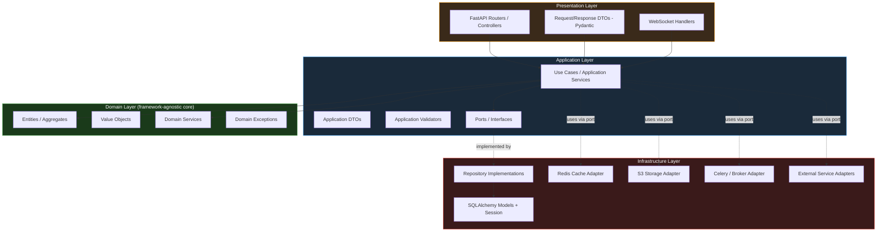

**The dependency rule (non-negotiable):** arrows only point inward. Domain knows nothing about Application, Infrastructure, or Presentation. Application knows Domain but not Infrastructure or Presentation — it depends only on **ports** (interfaces) that Infrastructure implements. This is what makes the domain testable without a database and swappable (e.g., Postgres → another store, Celery → another broker) without touching business logic.

| Layer | Contains | Must never contain |
|---|---|---|
| **Domain** | Entities, value objects, domain services, domain exceptions, repository *interfaces* (ports) | Any import of FastAPI, SQLAlchemy, Redis, Celery, or HTTP concepts |
| **Application** | Use cases (application services), application-level DTOs, application validators, orchestration logic | Direct SQL/ORM calls, direct HTTP request/response objects, direct cache client calls |
| **Infrastructure** | Repository implementations, ORM models, cache/storage/queue adapters, third-party API clients | Business rules or validation that belongs in Domain/Application |
| **Presentation** | FastAPI routers, Pydantic request/response schemas, WebSocket connection handlers, dependency wiring | Business logic of any kind — a route handler's job is: parse → call use case → shape response |

### 2.3 High-Level System Architecture

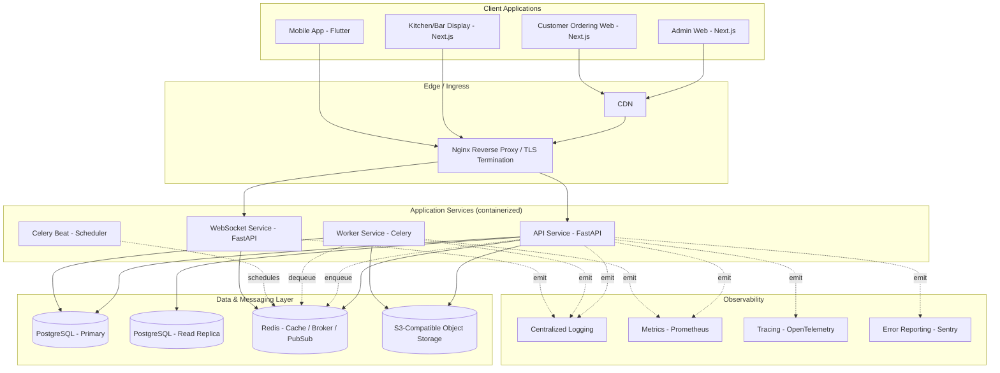

### 2.4 Process Decomposition Rationale

| Process | Why it's separate | Scaling lever |
|---|---|---|
| **API** | Synchronous request/response — the latency-sensitive path (Blueprint NFR: POS search <150ms) | Scale horizontally behind load balancer by request volume |
| **WebSocket** | Long-lived connections behave differently under load than short-lived HTTP (connection count vs. request throughput); isolating it prevents a KDS reconnect storm from starving POS billing requests | Scale horizontally; sticky-session or Redis pub/sub fan-out so any instance can serve any client |
| **Worker (Celery)** | Background/async work (report generation, notification dispatch, sync reconciliation) must never block or compete with request-path latency | Scale horizontally by queue depth, independently per queue priority |
| **Beat** | Scheduled jobs (nightly aggregation, cleanup) need exactly-one-scheduler semantics — kept separate from Worker to avoid duplicate scheduling under Worker autoscaling | Singleton by design; not horizontally scaled |

---

## 3. Folder Structure

### 3.1 Monorepo Layout

A single monorepo (managed with **Turborepo** for JS/TS workspace orchestration + task caching, and a **uv/Poetry workspace** for the Python services) keeps shared types, UI components, and configuration DRY across every client and service, and lets one PR atomically change a backend contract and its frontend consumer.

```
restaurant-os/
├── apps/
│   ├── admin-web/              # Next.js — Owner/Manager/Accountant/Admin back-office
│   ├── customer-ordering/      # Next.js — Guest-facing QR ordering (Blueprint §7.3)
│   ├── kitchen-display/        # Next.js — KDS + Bar Display (terminal-locked kiosk mode)
│   └── mobile/                 # Flutter — Manager approvals, Waiter handheld, Driver app
│
├── services/
│   ├── api/                    # FastAPI — primary synchronous REST + Clean Architecture core
│   ├── worker/                 # Celery workers — background jobs (shares domain/application code with api)
│   └── websocket/              # FastAPI + WebSocket — realtime channel (Section 5.9)
│
├── packages/
│   ├── ui/                     # Shared shadcn/ui-based component library (design system, Blueprint §12)
│   ├── shared-types/           # Generated + hand-authored TypeScript types shared by all apps
│   ├── shared-utils/           # Framework-agnostic TS utilities (formatting, date/time, validation helpers)
│   ├── api-client/             # Typed fetch/TanStack Query client generated from OpenAPI schema
│   └── config/                 # Shared ESLint/TSConfig/Tailwind/Prettier base configs
│
├── infrastructure/
│   ├── docker/                 # Dockerfiles per service, docker-compose files per environment
│   ├── nginx/                  # Reverse proxy configs, TLS, security headers
│   ├── monitoring/             # Prometheus, Grafana dashboards, Alertmanager rules
│   └── scripts/                # One-off ops scripts (seed data, migration runners, backup scripts)
│
├── docs/
│   ├── architecture/           # This document + ADRs (Architecture Decision Records)
│   ├── api/                    # OpenAPI spec exports, Postman collections
│   └── runbooks/               # Incident response, on-call playbooks
│
├── .github/
│   ├── workflows/               # CI/CD pipelines (Section 9.6)
│   ├── ISSUE_TEMPLATE/
│   └── PULL_REQUEST_TEMPLATE.md
│
├── turbo.json                   # Turborepo pipeline definition
├── pnpm-workspace.yaml           # JS/TS workspace membership
├── pyproject.toml                # Python workspace root (uv workspace)
├── docker-compose.yml             # Local development orchestration
├── docker-compose.prod.yml         # Production-shaped compose (staging / small deployments)
└── README.md
```

### 3.2 Why Each Top-Level Folder Exists

| Folder | Reason it exists |
|---|---|
| `apps/` | Every deployable **client surface** the Blueprint defines a distinct persona experience for. Splitting KDS from admin-web is deliberate: KDS boots into a locked kiosk shell with zero navigation chrome (Blueprint §7.4), which is a fundamentally different app shell than the back-office — bundling them would force one app to carry the other's dead code and permission complexity. |
| `services/` | Every deployable **backend process** (Section 2.4). Kept separate from `apps/` because these are Python, not JS/TS, and have entirely different build/deploy pipelines. |
| `packages/` | Code shared across two or more `apps/` or `services/`. The rule: if only one app uses it, it lives inside that app, not in `packages/` — prevents premature abstraction and a bloated shared layer nobody trusts to change. |
| `infrastructure/` | Everything needed to *run* the system that isn't application code — Dockerfiles, reverse proxy config, monitoring config, ops scripts. Kept out of `services/` so infra changes (e.g., an Nginx header tweak) don't require touching application source trees and don't trigger application CI test suites unnecessarily. |
| `docs/` | Living architecture record, including Architecture Decision Records (ADRs) so *why* a decision was made outlives the person who made it — critical once the team outgrows tribal knowledge. |
| `.github/` | CI/CD, issue/PR templates — process-as-code, versioned alongside the system it governs. |

### 3.3 Backend Service Internal Structure (`services/api/`)

```
services/api/
├── src/
│   └── restaurant_os_api/
│       ├── domain/
│       │   ├── entities/            # Framework-agnostic business objects (per bounded context subfolder later)
│       │   ├── value_objects/       # Immutable value types (e.g., Money, EmailAddress)
│       │   ├── services/            # Pure domain services (business rules spanning entities)
│       │   ├── exceptions/          # Domain-specific exception hierarchy
│       │   └── ports/               # Repository & external-service interfaces (ABCs/Protocols)
│       │
│       ├── application/
│       │   ├── use_cases/           # One class/function per application operation, per bounded context
│       │   ├── dto/                 # Application-layer data transfer objects
│       │   ├── validators/          # Cross-field / cross-entity validation not owned by Domain
│       │   └── interfaces/          # Application-level ports (e.g., NotificationSender)
│       │
│       ├── infrastructure/
│       │   ├── database/
│       │   │   ├── models/          # SQLAlchemy 2.x ORM models
│       │   │   ├── repositories/    # Concrete repository implementations (implement domain ports)
│       │   │   ├── session.py       # Session/engine factory, connection pooling config
│       │   │   └── migrations/      # Alembic migration scripts
│       │   ├── cache/               # Redis client + cache adapter implementation
│       │   ├── storage/             # S3-compatible storage adapter implementation
│       │   ├── messaging/           # Celery app config + task producer adapter
│       │   └── external/            # Third-party API client adapters (payment gateway, SMS, etc.)
│       │
│       ├── presentation/
│       │   ├── api/
│       │   │   └── v1/              # Versioned routers (Section 5.5)
│       │   ├── schemas/             # Pydantic request/response models
│       │   ├── dependencies/        # FastAPI `Depends` providers (DI wiring, Section 5.2)
│       │   └── middleware/          # Custom ASGI middleware (Section 5.10)
│       │
│       ├── core/
│       │   ├── config.py            # Settings (Pydantic Settings, env-driven, Section 5.1)
│       │   ├── logging.py           # Structured logging setup (Section 5.3)
│       │   ├── security.py          # JWT encode/decode, password hashing primitives
│       │   ├── exceptions.py        # Base exception → HTTP mapping (Section 5.4)
│       │   └── container.py         # DI container / provider registry (Section 5.2)
│       │
│       └── main.py                  # FastAPI app factory, router + middleware registration
│
├── tests/
│   ├── unit/                        # Domain + Application layer tests (no DB, no network)
│   ├── integration/                 # Infrastructure layer tests (real Postgres/Redis via testcontainers)
│   └── e2e/                         # Full request-cycle tests against a running app instance
│
├── alembic.ini
├── pyproject.toml
└── Dockerfile
```

**Why this shape:** the top-level split (`domain / application / infrastructure / presentation / core`) is the Clean Architecture boundary made literal in the filesystem — an engineer can `grep` for an import of `infrastructure` inside `domain/` in CI and fail the build if it's ever violated (Section 9.6 enforces this as a lint rule, not just a convention).

### 3.4 Frontend App Internal Structure (`apps/admin-web/`)

```
apps/admin-web/
├── app/                          # Next.js App Router — routing only, no business logic
│   ├── (auth)/                   # Route group: login, forgot-password (public)
│   ├── (dashboard)/              # Route group: authenticated shell + all feature routes
│   │   └── [feature]/page.tsx    # Thin route files that render a feature module's top component
│   ├── api/                      # Next.js route handlers used ONLY as a thin BFF proxy (Section 6.5)
│   ├── layout.tsx
│   ├── error.tsx                 # Root error boundary (Section 6.9)
│   └── loading.tsx                # Root loading UI (Section 6.10)
│
├── features/                     # Feature-based modules (Section 6.2) — mirrors Blueprint module list
│   └── [feature-name]/
│       ├── components/
│       ├── hooks/
│       ├── api/                  # TanStack Query hooks calling packages/api-client
│       ├── store/                # Zustand slice scoped to this feature
│       ├── schemas/              # Zod schemas for this feature's forms
│       └── types.ts
│
├── shared/
│   ├── components/                # App-local shared components (promoted to packages/ui once reused ≥2 apps)
│   ├── hooks/                     # App-local shared hooks
│   ├── contexts/                  # Theme, Auth session context providers
│   └── lib/                       # App-local utilities
│
├── middleware.ts                  # Route protection (Section 6.7)
├── next.config.ts
├── tailwind.config.ts
└── Dockerfile
```

### 3.5 Monorepo Structure Diagram

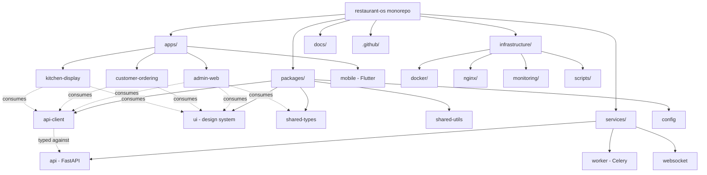

---

## 4. Technology Decisions

Every choice below is evaluated against the Blueprint's hard constraints: offline-first resilience, multi-branch/multi-tenant scale, touch-first speed (POS <10s billing), and a team that must ship fast without accruing architectural debt.

| Technology | Decision | Why |
|---|---|---|
| **Next.js 15 / React 19** | Chosen over plain React SPA or Remix | Server Components reduce client bundle size for data-heavy back-office screens (Reports, Cloud Dashboard); App Router's nested layouts map cleanly to role-scoped navigation (Blueprint §8); React 19's `use()` and Actions simplify form + mutation flows paired with React Hook Form. |
| **TypeScript (strict mode)** | Non-negotiable across all JS/TS code | A multi-tenant financial system cannot tolerate `any`-typed money, order, or permission values reaching production; strict mode catches null/undefined class bugs before runtime. |
| **Tailwind CSS + shadcn/ui** | Chosen over MUI/Ant/Chakra | shadcn/ui ships source (not a black-box npm dependency), so the design system (Blueprint §12) can be owned, themed, and white-labeled per tenant without fighting a third-party component API; Tailwind's utility classes keep speed-mode UI (Blueprint §11) fast to build and consistent via `packages/config`. |
| **Zustand** | Chosen over Redux Toolkit / Context-only | Minimal boilerplate for genuinely client-only state (UI state, cart-in-progress, active table selection); avoids Redux's ceremony for state that doesn't need time-travel debugging or middleware complexity. |
| **TanStack Query** | Chosen for all server state | Server state (orders, menu, inventory levels) is fundamentally different from client state — it's cached, revalidated, and can go stale. TanStack Query owns this so Zustand never has to; also gives free request deduplication, retry, and background refetch needed for the "always feels live" dashboard experience. |
| **React Hook Form + Zod** | Chosen over Formik or uncontrolled forms | Zod schemas double as the single source of truth for both client-side validation and (via shared-types) the contract shape expected by the FastAPI/Pydantic backend — one schema definition philosophy on both sides of the wire, reducing drift. |
| **Flutter** | Chosen for mobile over React Native | Single codebase for iOS/Android with near-native performance for the Waiter handheld and Delivery Driver apps (Blueprint §3.4, §3.10), which need reliable offline local storage (sqlite/drift) and background location — Flutter's platform channel maturity here is ahead of RN's for this use case. |
| **Python 3.13 / FastAPI** | Chosen over Django/Node for backend | FastAPI's native async support and Pydantic-based validation match the I/O-bound, high-concurrency profile of a POS backend (many small, fast requests); Python 3.13's performance improvements (free-threading groundwork, faster startup) reduce the historical Python-vs-Node latency gap. |
| **SQLAlchemy 2.x (async) + Alembic** | Chosen over Django ORM / raw SQL | SQLAlchemy 2.x's async engine + explicit unit-of-work pattern maps directly onto the Repository pattern (Section 5.2) required by Clean Architecture; Alembic gives reviewable, versioned schema migrations — essential once hundreds of tenants share a schema. |
| **Pydantic v2** | Chosen for all validation boundaries | Rust-core performance makes it viable at request-path scale; used consistently for Settings, request/response DTOs, and internal application DTOs so validation logic never has to be reinvented per layer. |
| **PostgreSQL** | Chosen over MySQL/NoSQL as primary store | Strong transactional guarantees for financial data (Blueprint BR-1–BR-18 depend on ACID correctness); native JSONB for semi-structured data (e.g., flexible modifier configs) without abandoning relational integrity; Row-Level Security enables tenant isolation (Section 5.12) at the database layer as defense-in-depth. |
| **Redis** | Cache + Celery broker + Pub/Sub | One operational component serving three cross-cutting needs (cache-aside, task queue, WebSocket fan-out) minimizes infrastructure surface area for a lean ops team. |
| **Celery** | Chosen over Dramatiq/RQ/Arq | Mature ecosystem, battle-tested retry/backoff, priority queues, and scheduling (Celery Beat) — the deepest tooling for the volume of background work implied by multi-branch reporting and sync reconciliation jobs. |
| **WebSockets (native, via FastAPI)** | Chosen over polling or SSE-only | Bidirectional, low-latency updates are required for KDS ticket status and live table status (Blueprint §7.4, §9.2) where polling latency would be user-visible; SSE is unidirectional and doesn't fit acknowledgment patterns (e.g., "ticket bumped") as cleanly. |
| **S3-compatible object storage** | Chosen for all binary/media assets | Decouples file storage from application servers entirely (stateless services, Section 12); "S3-compatible" (not AWS-locked) preserves cloud-provider optionality and supports on-prem/self-hosted deployments for enterprise customers with data-residency requirements. |
| **JWT + Refresh Tokens** | Chosen over server-side session store as the primary mechanism | Stateless access tokens scale horizontally without a shared session store on the hot request path; refresh tokens (stored server-side/Redis for revocability) give back the ability to force-logout a compromised device — the best of both models (Section 8.3). |
| **Docker + Docker Compose** | Chosen for all environments today | Identical container images from a developer's laptop to production eliminates "works on my machine"; Compose is sufficient for Phase 1–2 scale (Section 12 defines the Kubernetes migration trigger). |

---

## 5. Backend Architecture

### 5.1 Configuration System

All configuration is centralized in a single `Settings` class (`core/config.py`) built on **Pydantic Settings**, sourced from environment variables with a strict schema — no scattered `os.environ.get()` calls anywhere else in the codebase.

| Principle | Detail |
|---|---|
| **Single source** | One `Settings` object, instantiated once, injected via DI (Section 5.2) — never re-read from the environment mid-request. |
| **Fail-fast validation** | Missing or malformed required config raises at process startup, not at first use in production traffic. |
| **Environment-scoped files** | `.env.development`, `.env.test`, `.env.production.example` (real production values are never committed — Section 8 secrets management). |
| **Typed groups** | Settings are grouped into nested models: `DatabaseSettings`, `RedisSettings`, `JWTSettings`, `StorageSettings`, `CelerySettings`, `ObservabilitySettings` — so a use case that needs JWT config type-hints exactly that subset. |
| **Feature flags** | A `FeatureFlags` settings group allows per-environment (and later per-tenant) toggling of in-progress modules without branching deploys. |

### 5.2 Dependency Injection

FastAPI's native `Depends()` system is the DI mechanism — no third-party DI framework is introduced, to keep the learning curve low and the mechanism idiomatic to the framework.

**Pattern:**
- Every port (interface) defined in `domain/ports/` has exactly one production implementation in `infrastructure/`, registered as a provider function in `presentation/dependencies/`.
- Use cases (`application/use_cases/`) declare constructor dependencies on **ports**, never on concrete infrastructure classes.
- `presentation/dependencies/` wires concrete implementations to ports for the running process, and **test fixtures re-wire the same ports to in-memory fakes** — this is what makes use cases unit-testable without a database.

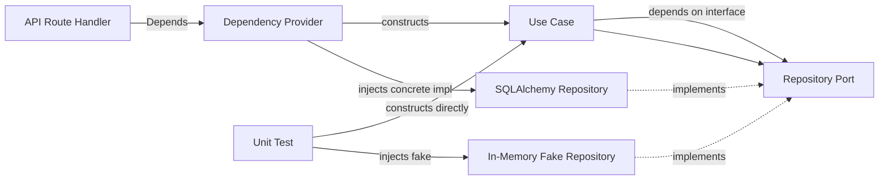

A lightweight `core/container.py` centralizes provider wiring for cross-cutting singletons (DB engine, Redis client, S3 client) so they're constructed once per process and shared, rather than reconstructed per request.

### 5.3 Logging

Structured (JSON) logging via `structlog`, wrapping the standard library logger so third-party libraries' logs are captured in the same pipeline.

| Requirement | Implementation |
|---|---|
| Every log line is JSON | Enables direct ingestion by the centralized logging stack (Section 9) without regex parsing. |
| Correlation ID on every request | A `request_id` (and `tenant_id` once auth resolves) is bound to the logging context at the top of the middleware stack and automatically included in every downstream log line for that request — critical for tracing one request's story across API → Worker (via task metadata) → WebSocket push. |
| No PII/secrets in logs | A logging filter strips known-sensitive field names (`password`, `token`, `card_number`, etc.) before serialization, as a safety net in addition to code review discipline. |
| Log levels used deliberately | `DEBUG` (local dev only), `INFO` (business-relevant events: order state transitions, auth events), `WARNING` (recoverable anomalies: retried request, degraded cache), `ERROR` (unhandled exceptions, failed external calls), `CRITICAL` (process-threatening: DB unreachable). |

### 5.4 Exception Handling

A layered exception hierarchy keeps error semantics attached to the layer that detects them, translated to HTTP only at the edge.

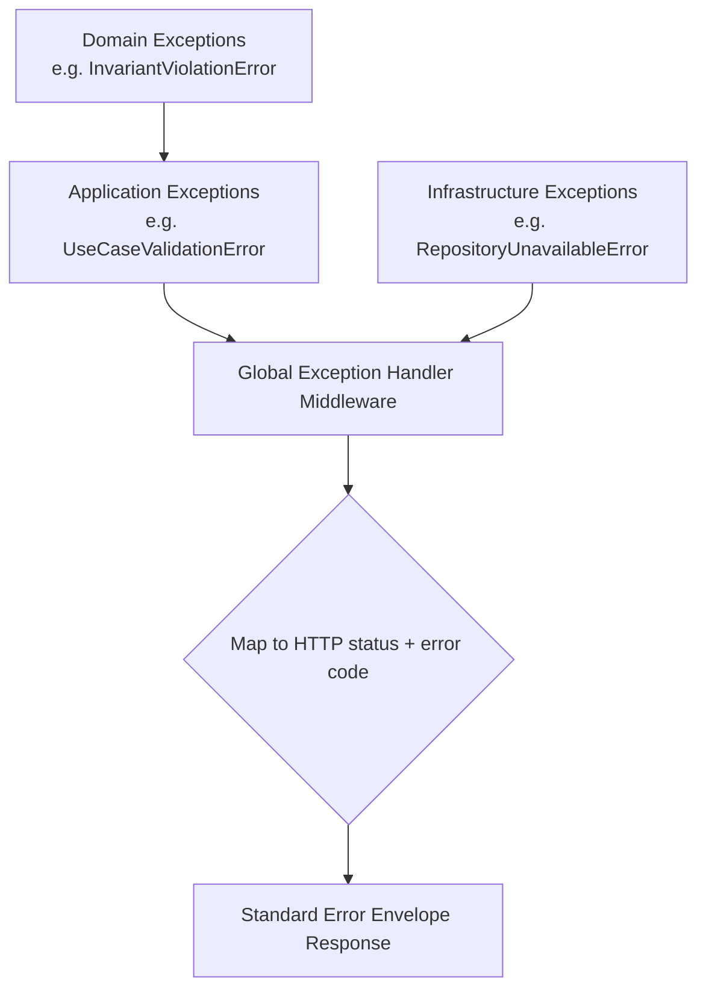

- **Domain exceptions** (e.g., business invariant violations) never carry HTTP concepts — they're plain Python exceptions with a machine-readable `error_code`.
- A single global exception handler (registered once in `main.py`) catches the exception hierarchy at the ASGI boundary and maps each known exception type to an HTTP status + standardized error envelope (Section 5.6). Unhandled/unexpected exceptions map to `500` with a generic message (never leaking stack traces to clients) and are always logged at `ERROR` with full context and reported to the error tracker (Section 10).
- Every exception type is documented in `core/exceptions.py` with its intended HTTP status, so new use cases pick existing exceptions before inventing new ones.

### 5.5 API Versioning

- URI-based versioning: `/api/v1/...`. Chosen over header-based versioning for **discoverability** (a version is visible in logs, browser network tabs, and API docs without extra inspection) and simpler client caching semantics.
- A version is only bumped (`v2`) on a **breaking** change to a resource's contract; additive changes (new optional field) ship within the existing version.
- Each version's routers live in their own `presentation/api/v{n}/` folder; a deprecated version stays live behind a `Deprecation` + `Sunset` response header for a published support window before removal.

### 5.6 Standard Response Format

Every API response — success or error — uses one envelope shape so every client (`packages/api-client`, Flutter) writes one parsing path.

**Success shape (conceptual, not a schema spec):** a top-level success flag, a `data` payload, and a `meta` object (present when pagination or additional context applies).

**Error shape (conceptual):** a top-level success flag (false), an `error` object containing a stable machine-readable `code`, a human-readable `message`, and an optional `details` structure for field-level validation errors — never a raw stack trace or ORM error string.

| Rule | Reason |
|---|---|
| Error `code` is a stable string enum, not the HTTP status number | HTTP status can be coarse (400 covers many distinct problems); the `code` lets frontend code branch on exact meaning (`VALIDATION_ERROR` vs. `RESOURCE_LOCKED` vs. `INSUFFICIENT_STOCK`) without string-matching messages. |
| `message` is always safe to display to an end user | Keeps the "don't leak internals" rule enforceable by a single formatting layer instead of trusting every call site. |
| Field naming is `camelCase` on the wire | Pydantic's alias generator converts internal `snake_case` Python fields to `camelCase` JSON automatically, so frontend TypeScript never has to special-case naming conventions from the backend. |

### 5.7 Pagination Strategy

Two supported strategies, chosen per endpoint based on access pattern:

| Strategy | When used | Why |
|---|---|---|
| **Cursor-based** (opaque cursor token) | High-volume, frequently-appended lists accessed from live/speed-mode surfaces (e.g., an order feed) | Stable under concurrent inserts (no page-drift/duplication that offset pagination suffers from when new rows are added between page fetches); scales to large datasets without the `OFFSET` performance cliff. |
| **Offset/limit (page-based)** | Back-office admin screens needing "jump to page N" or total-count display (e.g., Employee Directory) | Simpler UX for bounded, human-browsed datasets where total count and page-jump matter more than perfect real-time stability. |

Every paginated endpoint returns pagination metadata in the response envelope's `meta` (e.g., `nextCursor`/`hasMore`, or `page`/`totalPages`/`totalCount` depending on strategy) — never leaving the client to infer pagination state from payload size.

### 5.8 Filtering & Search Strategy

| Concern | Approach |
|---|---|
| **Filtering** | Query-parameter based filter DSL: `field`, `operator` (`eq`, `gt`, `lt`, `in`, `between`, etc.), `value`. Each endpoint declares an **explicit allow-list** of filterable fields — arbitrary field filtering is never permitted, both for security (prevents probing internal/sensitive columns) and for guaranteeing every filterable field has a supporting database index. |
| **Search** | Phase 1–2: PostgreSQL native full-text search (`tsvector` + GIN indexes) for in-app search (menu item lookup, customer lookup) — sufficient at target scale and avoids operating a separate search cluster prematurely. The search port is defined as an interface (`domain/ports/search_port.py`) so a future migration to OpenSearch/Elasticsearch (Section 12) requires only a new adapter, not a rewrite of calling code. |
| **Sorting** | Same allow-list philosophy as filtering — sortable fields are explicitly declared per endpoint and indexed accordingly. |

### 5.9 Caching Strategy

Redis-backed, **cache-aside** pattern as the default (application reads cache first, falls back to DB on miss and populates cache; writes invalidate the relevant cache keys).

| Layer | Example use | TTL philosophy |
|---|---|---|
| **Reference/config data** | Settings, feature flags, tenant configuration | Longer TTL (minutes–hours) with explicit invalidation on write, since changes are infrequent and staleness tolerance is higher. |
| **Hot read paths** | Menu availability state (used heavily by both POS and KDS 86-list checks) | Short TTL (seconds) plus explicit invalidation the moment an item's availability changes — correctness here directly affects Blueprint BR-8 (never oversell out-of-stock items). |
| **Session/auth data** | Refresh token registry, rate-limit counters | Redis is authoritative (not just a cache) for these — see Section 8. |
| **Computed/expensive aggregates** | Dashboard summary numbers | Cache-aside with background refresh (via Celery Beat) rather than computing on every request. |

**Cache keys are namespaced** by tenant and entity type (`tenant:{tenant_id}:menu:{item_id}`) so a bulk invalidation (e.g., a tenant-wide menu re-import) can safely pattern-scan and clear only that tenant's keys without a global flush.

### 5.10 Background Job Strategy (Celery)

| Concern | Design |
|---|---|
| **Queue segmentation** | Separate named queues by priority/latency-sensitivity, not just one default queue: e.g., a `realtime` queue (notification dispatch, sync acknowledgments) consumed by workers scaled for low latency, and a `batch` queue (report generation, nightly aggregation) consumed by workers scaled for throughput. |
| **Idempotency** | Every task accepts an idempotency key and checks a Redis-backed dedupe record before executing side effects — required because at-least-once delivery means a task can be retried/redelivered. |
| **Retry policy** | Exponential backoff with a capped max-retry count per task class; permanently-failing tasks land in a dead-letter queue with alerting (Section 10), never silently dropped. |
| **Scheduling** | Celery Beat owns all cron-like scheduled tasks (single source of truth for "what runs when"), reading its schedule from configuration, not hardcoded in multiple places. |
| **Task-to-domain boundary** | A Celery task function is a thin adapter that resolves DI-wired dependencies and calls an **Application-layer use case** — the same use case a synchronous API route could call. Business logic never lives inside a `@task`-decorated function body. |

### 5.11 WebSocket Architecture

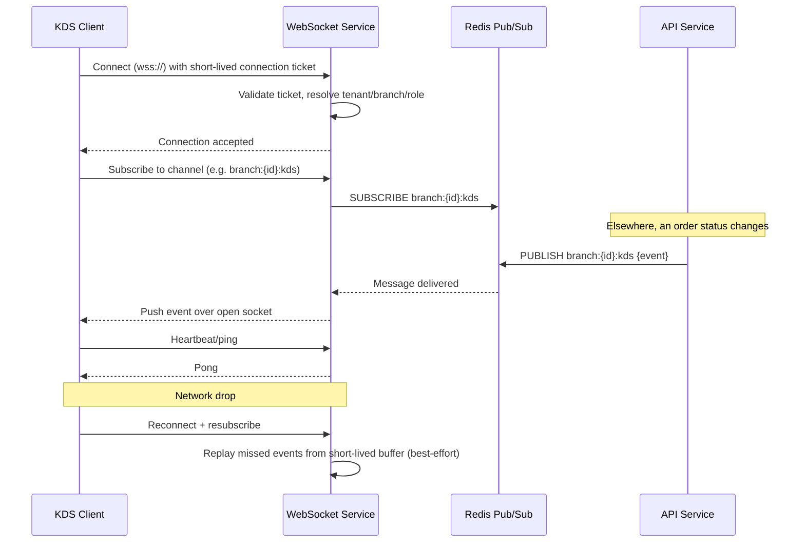

| Design decision | Reason |
|---|---|
| **Redis Pub/Sub as the fan-out backbone** | Any WebSocket service instance can publish or receive for any channel — required for horizontal scaling (Section 12) since a client's connection may be held by any instance behind the load balancer. |
| **Short-lived connection ticket, not the long-lived JWT, for the handshake** | The access JWT is never placed in a URL query string (would leak into logs/proxies); the client exchanges its JWT for a single-use, short-TTL ticket via an authenticated HTTPS call, then opens the socket with that ticket. |
| **Channel naming convention** | `{tenant_id}:{branch_id}:{surface}` (e.g., `kds`, `bar`, `table-status`) — scoped narrowly so a client only ever receives events relevant to its role and branch, enforced server-side at subscribe-time, not trusted from the client. |
| **At-least-once, not exactly-once, delivery** | Consuming clients (KDS, table board) are designed to be idempotent on event application (Blueprint's offline-first philosophy extends here) — a duplicate "ticket ready" event is a no-op, not a bug. |

### 5.12 Multi-Tenancy Strategy

The Blueprint (§2, §17) requires one platform serving both a single café and a 500-branch chain. The chosen model: **shared database, shared schema, row-level tenant partitioning**, enforced at two layers:

1. **Application layer:** every repository method requires a `tenant_id` in its execution context (resolved from the authenticated JWT, never from a client-supplied parameter) and every query is automatically scoped by it — there is no code path that queries across tenants by accident.
2. **Database layer (defense-in-depth):** PostgreSQL Row-Level Security (RLS) policies enforce the same tenant boundary at the database session level, so even a bug in application-layer scoping cannot leak cross-tenant data.

This is a placement/isolation **strategy**, not a schema design — no tables are defined here; every future module inherits this tenant-scoping mechanism automatically through the shared repository base class.

### 5.13 Middleware Architecture & Request Lifecycle

Ordered ASGI middleware stack (outermost to innermost):

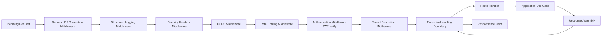

**Request lifecycle, step by step:**

1. Request hits Nginx (TLS termination, Section 7.2) and is forwarded to the API service.
2. **Request ID middleware** generates/propagates a correlation ID.
3. **Logging middleware** starts a request-scoped log context and records entry/exit with duration.
4. **Security headers middleware** ensures every response (including error responses) carries the required headers (Section 8.1) regardless of which handler produced it.
5. **CORS middleware** validates origin against the environment's allow-list.
6. **Rate limiting middleware** checks the caller's bucket (Section 8.6) before any further processing.
7. **Authentication middleware** verifies the JWT signature/expiry and attaches the resolved identity (user, tenant, roles) to the request context.
8. **Tenant resolution middleware** confirms the identity's tenant matches the target resource's tenant scope (Section 5.12).
9. Route handler (Presentation layer) parses/validates the request body against its Pydantic schema and calls exactly one Application-layer use case.
10. The use case orchestrates Domain logic and Infrastructure ports, returns an Application DTO.
11. The route handler maps the DTO to a Presentation response schema and returns it inside the standard envelope (Section 5.6).
12. Any exception raised at any layer surfaces to the global exception handler (Section 5.4) before reaching the client.

---

## 6. Frontend Architecture

### 6.1 Guiding Principle

The frontend mirrors the backend's separation of concerns: **routing is not architecture**. `app/` directories contain only Next.js routing plumbing; all real structure — components, hooks, state, API calls — lives in `features/`, organized to mirror the Blueprint's module list (Section 6 of the Blueprint) so any engineer can find "where loyalty program UI lives" without guessing.

### 6.2 Feature-Based Architecture

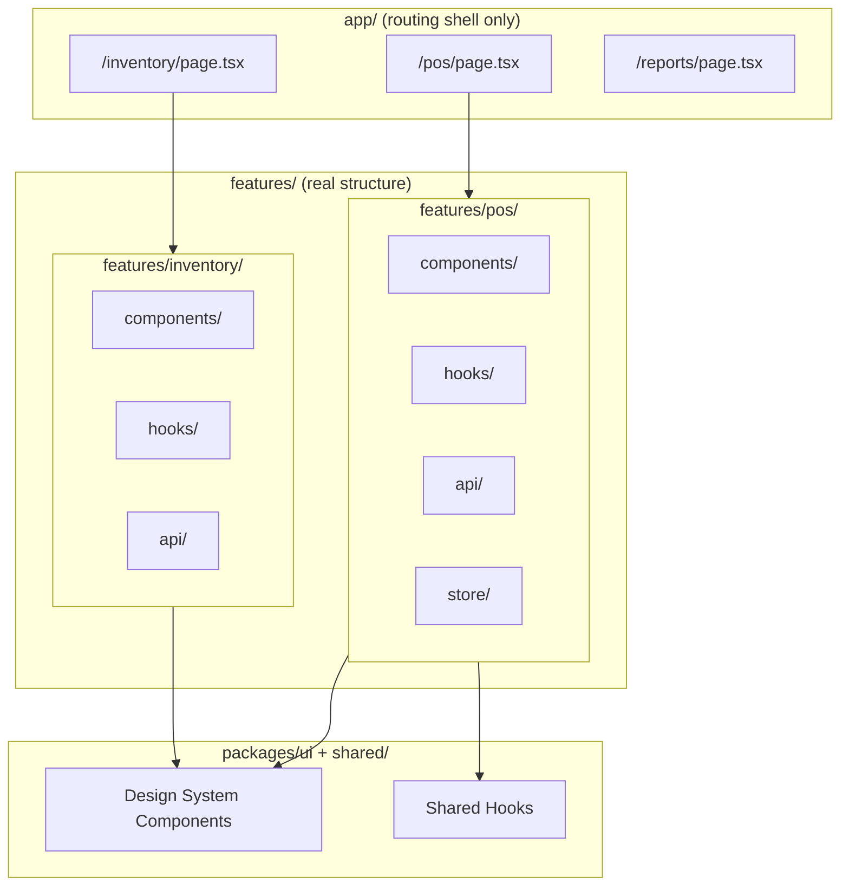

Each feature module is self-contained and only exports what other features/routes need through an `index.ts` barrel — internal components/hooks are not imported cross-feature, preventing the tangled-dependency mess that kills large frontend codebases.

### 6.3 Shared Components & Design System

- `packages/ui` houses the shadcn/ui-based design system defined in Blueprint §12 — every Button, Card, DataGrid, etc., lives here exactly once.
- Promotion rule: a component starts inside a feature's `components/`; it only moves to `packages/ui` once a **second** app or feature needs it — prevents a premature, over-abstracted shared library.

### 6.4 State Management Split

| State category | Owner | Example |
|---|---|---|
| **Server state** (anything that originates from the API and can go stale) | TanStack Query | Menu items, order status, inventory levels |
| **Client/UI state** (ephemeral, never persisted server-side) | Zustand | Active POS cart-in-progress, selected table, sidebar collapsed state, theme preference |
| **Form state** | React Hook Form (+ Zod resolver) | Any create/edit form |
| **URL state** | Next.js `searchParams` | Filters, pagination, sort — shareable/bookmarkable state belongs in the URL, not in a store |

This split is enforced by code review checklist (Section 10.7): a PR that fetches server data into a Zustand store instead of a TanStack Query hook is a rejection, not a style nitpick — it reintroduces manual cache invalidation bugs the architecture is designed to eliminate.

### 6.5 API Client

`packages/api-client` is a typed client generated from the backend's OpenAPI schema (FastAPI auto-generates this), wrapped with TanStack Query hooks per resource. This gives:

- Compile-time breakage the moment a backend contract changes incompatibly with frontend usage — caught in CI, not in production.
- One retry/error-handling/auth-header-injection policy for every network call across every app in the monorepo.
- A thin Next.js `app/api/` layer exists only where a same-origin proxy is needed (e.g., to keep the refresh-token cookie same-site) — it is never a place for business logic.

### 6.6 Authentication Flow (Frontend)

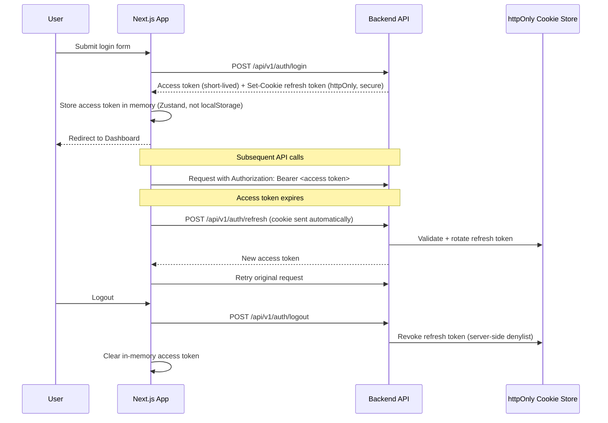

Access tokens are deliberately kept **in memory only** (never `localStorage`) to limit XSS exfiltration blast radius; the refresh token lives in an `httpOnly`, `Secure`, `SameSite=Strict` cookie, inaccessible to JavaScript entirely.

### 6.7 Protected Routes

- `middleware.ts` runs on every request to a protected route group, checking for a valid session signal (presence/validity of the refresh cookie) before the page even renders — unauthenticated users never see a flash of protected UI.
- Role/permission-level gating (e.g., a Cashier hitting a Manager-only screen) is enforced **both** at the route/layout level (redirect) and at the component level (a `<RequirePermission>` wrapper) — defense in depth, since route-level checks alone can miss deeply nested conditional UI.
- The Blueprint's role-scoped navigation (§8.1) is generated from the same permission model the backend enforces — the frontend never invents its own parallel notion of "what a Waiter can see."

### 6.8 Loading Strategy

- Route-level `loading.tsx` + React Suspense boundaries for initial navigation.
- Skeleton components (matching the eventual content's shape) for data-heavy views — never bare spinners for content areas (Blueprint §11.3).
- TanStack Query's `isFetching` (background refetch) is visually distinct from `isLoading` (no data yet) so a live-refreshing dashboard doesn't flash a full loading state on every poll.

### 6.9 Error Boundaries

- A root `error.tsx` per app catches unhandled render errors and shows a recoverable "something went wrong, retry" UI — never a blank white screen.
- Feature-level error boundaries isolate a single widget's failure (e.g., one broken dashboard tile) from taking down the entire page.
- All caught errors are reported to the frontend error tracker (Section 10) with the same correlation ID pattern as the backend, enabling one trace across the full stack for a single failed user action.

### 6.10 Theme Architecture, Dark Mode & Localization

| Concern | Approach |
|---|---|
| **Theme tokens** | CSS custom properties (variables) mapped through Tailwind config, not hardcoded hex values in components — enables white-label tenant branding (Blueprint mentions tenant-configurable brand color, §11.3) by swapping variable values, not component code. |
| **Dark mode** | `next-themes`, respecting Blueprint §11.2's per-surface defaults (KDS/Bar dark by default, POS light by default) as an initial preference that remains user-toggleable, persisted per device. |
| **Localization** | `next-intl` (or equivalent) with all user-facing strings routed through a translation layer from day one — even for a single-locale Phase 1 launch — because retrofitting i18n after hardcoding strings across dozens of screens is materially more expensive than starting with the abstraction in place, and the Blueprint's NFRs (§15) require multi-language support. |

---

## 7. Infrastructure Architecture

### 7.1 Docker Strategy

| Principle | Detail |
|---|---|
| **Multi-stage builds** | Every service Dockerfile separates a `build` stage (installs dependencies, compiles) from a `runtime` stage (copies only build artifacts + runtime deps) — keeps production images small and free of build toolchains/attack surface. |
| **Non-root runtime user** | Every container runs as a dedicated non-root user — a compromised process cannot escalate via container root. |
| **One image per service** | `api`, `worker`, and `websocket` share the same application source (Section 3.3) but are built as distinct images with distinct entrypoints — avoids shipping Celery's dependencies into the latency-sensitive API image and vice versa. |
| **Pinned base images** | Base images pinned to specific digests (not floating `latest` tags) for reproducible builds and predictable security patching cadence. |

### 7.2 Docker Compose — Environments

| File | Purpose |
|---|---|
| `docker-compose.yml` | Local development: hot-reload volumes mounted, debug ports exposed, seed-data service included, all secrets sourced from `.env.development` (never committed, `.env.example` documents required keys). |
| `docker-compose.prod.yml` | Production-shaped topology for staging or small/self-hosted deployments: no source volume mounts (images are immutable artifacts), resource limits set per service, health checks enabled (Section 7.5), logging driver configured for the centralized log pipeline. |

Illustrative service topology (names and relationships only — not a finalized manifest):

```
services:
  nginx        → reverse proxy / TLS termination, depends_on: api, websocket
  api          → FastAPI app, depends_on: postgres, redis
  worker       → Celery worker, depends_on: postgres, redis
  beat         → Celery beat scheduler, depends_on: redis
  websocket    → FastAPI WS app, depends_on: redis
  postgres     → primary datastore (local dev only; managed service in production)
  redis        → cache / broker / pubsub (local dev only; managed service in production)
  minio        → local S3-compatible storage stand-in for development
```

In production, `postgres`, `redis`, and object storage are **managed cloud services**, not containers this Compose file runs — Compose there orchestrates only the stateless application containers (`nginx`, `api`, `worker`, `beat`, `websocket`).

### 7.3 Environment Variables & Configuration Management

| Category | Examples of variable groups (names only) |
|---|---|
| App | `APP_ENV`, `APP_DEBUG`, `APP_LOG_LEVEL` |
| Database | `DATABASE_URL`, `DATABASE_POOL_SIZE`, `DATABASE_READ_REPLICA_URL` |
| Redis | `REDIS_URL`, `REDIS_CACHE_DB`, `REDIS_BROKER_DB` |
| JWT | `JWT_PRIVATE_KEY`, `JWT_PUBLIC_KEY`, `JWT_ACCESS_TTL_SECONDS`, `JWT_REFRESH_TTL_SECONDS` |
| Storage | `S3_ENDPOINT`, `S3_BUCKET`, `S3_ACCESS_KEY`, `S3_SECRET_KEY` |
| Celery | `CELERY_BROKER_URL`, `CELERY_RESULT_BACKEND` |
| Observability | `SENTRY_DSN`, `OTEL_EXPORTER_ENDPOINT` |
| Feature flags | `FEATURE_AI_ASSISTANT_ENABLED`, etc. |

Every variable is declared (name + description + required/optional, no real values) in a committed `.env.example` per service — a new engineer can `cp .env.example .env.development` and know exactly what to fill in.

### 7.4 Secrets Management

| Environment | Mechanism |
|---|---|
| Local development | `.env.development`, gitignored, populated with local/dummy values |
| CI | Secrets injected via the CI provider's encrypted secrets store (GitHub Actions Secrets), never printed in logs |
| Staging/Production | A dedicated secrets manager (e.g., cloud provider's secrets manager or HashiCorp Vault) — containers receive secrets via injected environment variables at deploy time, never baked into images |
| Rotation | JWT signing keys and database credentials are rotatable without a deploy: the config system supports a grace-period dual-key verification window (old key still accepted for token *verification* briefly after a new signing key is activated) so in-flight tokens aren't instantly invalidated |

### 7.5 Health Checks & Readiness Checks

| Endpoint | Purpose | Checks performed |
|---|---|---|
| `/health/live` (liveness) | "Is the process running at all?" — used by orchestrator to decide whether to restart the container | Process responds at all; no external dependency checks (a slow DB shouldn't trigger a restart loop) |
| `/health/ready` (readiness) | "Can this instance actually serve traffic?" — used by the load balancer/orchestrator to decide whether to route traffic to this instance | Database connection pool reachable, Redis reachable, migrations at expected version |

Both endpoints are unauthenticated (infrastructure-internal) but **not** publicly exposed through the public-facing Nginx config — accessible only within the internal network/orchestrator.

---

## 8. Security Architecture

### 8.1 Security Headers

Applied globally via middleware (Section 5.13) and reinforced at the Nginx layer:

| Header | Purpose |
|---|---|
| `Strict-Transport-Security` | Forces HTTPS on all future requests, including subdomains |
| `Content-Security-Policy` | Restricts script/style/connect sources to trusted origins — primary XSS mitigation layer |
| `X-Content-Type-Options: nosniff` | Prevents MIME-sniffing based attacks |
| `X-Frame-Options: DENY` | Prevents clickjacking via iframe embedding |
| `Referrer-Policy: strict-origin-when-cross-origin` | Limits referrer leakage to third parties |
| `Permissions-Policy` | Explicitly disables unused browser features (camera, geolocation) per app unless required (e.g., driver app needs geolocation) |

### 8.2 HTTPS

TLS terminates at the Nginx edge (Section 7); all internal service-to-service traffic within the private network is still encrypted where the deployment environment supports it (Section 12 notes this becomes mandatory, not optional, once moving to Kubernetes with a service mesh). HTTP requests are redirected to HTTPS unconditionally in every non-local environment.

### 8.3 JWT Architecture & Refresh Token Strategy

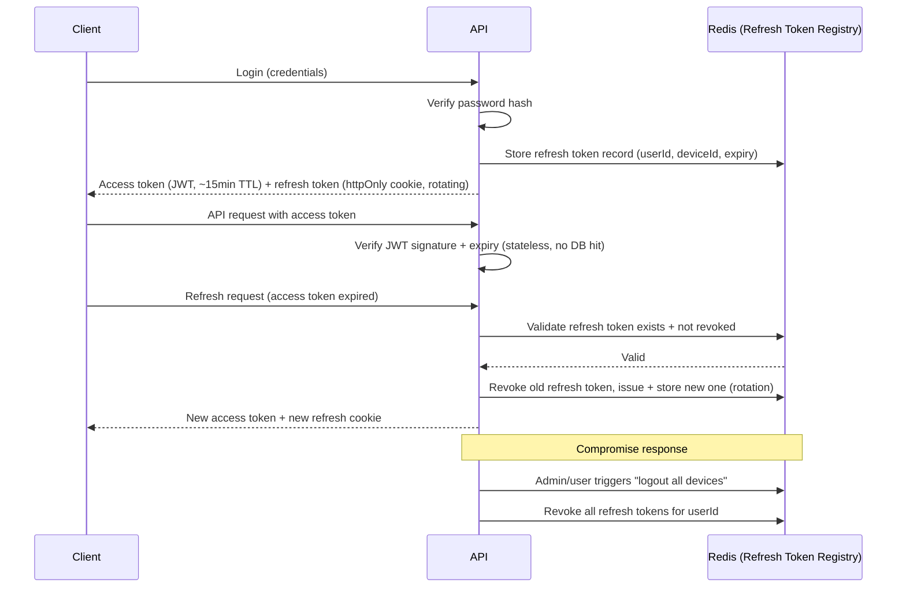

| Design choice | Reason |
|---|---|
| **Short access-token TTL (~15 min)** | Limits the exposure window if an access token is ever exfiltrated; short enough that revocation-by-expiry is meaningful, long enough to avoid excessive refresh traffic. |
| **Refresh token rotation** | Every refresh issues a brand-new refresh token and invalidates the old one; reuse of an already-rotated (stale) refresh token is treated as a signal of possible theft and triggers revocation of the entire token family for that user/device. |
| **Refresh tokens are stateful (Redis-backed), access tokens are stateless** | Gives the system the ability to force-revoke a session (critical for the "deactivate employee immediately" requirement, Blueprint S1) without needing to track every access token. |
| **Asymmetric signing (RS256) over symmetric (HS256)** | The public key can be distributed to the WebSocket service and (future) other microservices to verify tokens independently, without sharing the private signing secret across every service — reduces blast radius if one service is compromised. |
| **JWT claims kept minimal** | `sub` (user id), `tenant_id`, `roles`, and a token version/family identifier — never embedding volatile business data in the token itself, since it can't be updated without reissuing. |

### 8.4 Password Hashing

Argon2id (memory-hard, resistant to GPU/ASIC cracking), with per-password random salts and a configurable work factor reviewed periodically as hardware improves — bcrypt is an acceptable fallback if platform/library constraints require it, but Argon2id is the default choice for new development.

### 8.5 CORS

A strict per-environment allow-list of origins (the known `apps/*` deployed URLs) — never a wildcard `*` in any environment that also allows credentials, since combining those two would defeat the same-origin protections the cookie-based refresh flow (Section 6.6) relies on.

### 8.6 Rate Limiting

Redis-backed token-bucket rate limiting, applied at two granularities:

| Scope | Applied to | Reason |
|---|---|---|
| Per-IP | All unauthenticated endpoints (login, password reset, guest QR ordering) | Blunt protection against credential stuffing and scripted abuse before identity is even known |
| Per-account/per-tenant | All authenticated endpoints | Prevents a single compromised or misbehaving client from degrading service for other tenants sharing infrastructure |

Auth endpoints (`login`, `refresh`, `password-reset`) carry materially stricter limits than general API traffic, given their higher abuse value.

### 8.7 CSRF

Because the refresh token lives in a `SameSite=Strict` `httpOnly` cookie and the access token is sent via an explicit `Authorization` header (never a cookie the browser attaches automatically to cross-site requests), the primary CSRF attack vector is already substantially mitigated. As defense-in-depth for any cookie-authenticated endpoint (e.g., the refresh endpoint itself), a double-submit CSRF token pattern is additionally applied.

### 8.8 XSS Prevention

- React's default JSX escaping handles the vast majority of injection surface automatically; `dangerouslySetInnerHTML` is banned by lint rule except in explicitly reviewed, sanitized cases (e.g., rendering rich-text content through a sanitization library).
- Content-Security-Policy (Section 8.1) as a second layer — even if a script injection slipped through, CSP restricts what it can load/exfiltrate to.

### 8.9 SQL Injection Prevention

- 100% of database access goes through SQLAlchemy's parameterized query construction (ORM or Core expression language) — raw string-interpolated SQL is banned by lint/code-review policy with no exceptions, including for "trusted" internal admin tooling.
- The filtering/search allow-list strategy (Section 5.8) is itself a second injection-surface reduction: user input never determines *which column* is queried, only the *value* compared against a pre-approved column.

### 8.10 Secrets Rotation

Covered in Section 7.4 — the architectural requirement here is that **no secret rotation should require a code change**, only a configuration/secrets-store update plus (for signing keys) the dual-key grace-period mechanism described in Section 8.3.

### 8.11 RBAC Architecture

Role-Based Access Control is modeled as **Role → Permission → Action-on-Resource**, directly reflecting the eleven personas and their permission columns defined in Blueprint §3.

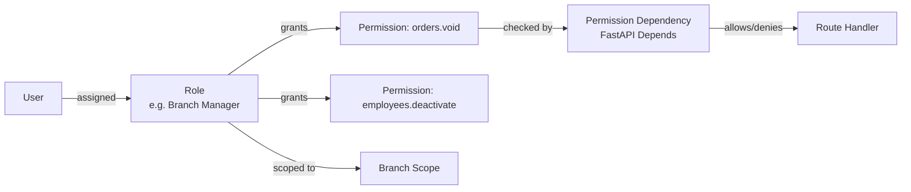

- Permissions are enumerated, granular, and additive (a role is a named bundle of permissions, not a hardcoded `if role == "manager"` check scattered through the codebase).
- A single reusable FastAPI dependency (`require_permission("orders.void")`) gates any route needing that check — the permission model is defined once and consumed declaratively everywhere, so adding a new permission never means hunting for scattered conditional logic.
- Custom roles (Blueprint's Roles & Permissions screen, §7.10) are supported by the same model from day one — "Branch Manager" is a *default* role, not a hardcoded concept baked into application code.

### 8.12 Audit Logging

An append-only audit log service (its own infrastructure adapter behind a domain port, `AuditLogger`) records actor, action, target resource, timestamp, and before/after state for every sensitive action enumerated in Blueprint BR-15 (voids, refunds, discount overrides, price changes, permission changes). Audit log writes are **never optional or best-effort** — a use case that performs a sensitive action and fails to write its audit entry must fail the entire operation (implemented via the same transactional boundary as the business change itself), because an unaudited sensitive action is treated as a correctness bug, not a logging gap.

---

## 9. DevOps Strategy

### 9.1 Development Environment

`docker-compose.yml` (Section 7.2) brings up the full stack — API, Worker, Beat, WebSocket, Postgres, Redis, local S3-compatible storage — with a single `docker compose up`, source-mounted for hot reload on both the Python (uvicorn `--reload`) and Next.js (Fast Refresh) sides. A documented one-command bootstrap script (`infrastructure/scripts/bootstrap.sh`) handles first-run steps: migrations, seed data, dependency install.

### 9.2 Production Environment

Immutable container images (built once in CI, Section 9.6, promoted unchanged across staging → production) deployed via `docker-compose.prod.yml` for Phase 1–2 scale, with the documented migration path to Kubernetes (Section 12) triggered by defined scale thresholds rather than a fixed calendar date.

### 9.3 Configuration Management

Environment-specific values are injected at deploy time (Section 7.3, 7.4); the *application code and images* are byte-for-byte identical across environments — configuration is the only thing that differs, which is what makes "staging passed, therefore production will behave the same" a valid inference.

### 9.4 Logging (Operational)

Every container's stdout/stderr (structured JSON, Section 5.3) is collected by the platform's logging driver and shipped to a centralized log aggregation system (Section 10.1), retained per a documented policy balancing debugging usefulness against storage cost and audit-log regulatory retention requirements (which are held independently and indefinitely per Section 8.12, distinct from general application log retention).

### 9.5 Monitoring

Covered in depth in Section 10 (Observability) — DevOps' responsibility here is ensuring every service exposes a `/metrics` endpoint (Prometheus format) from day one and that new services are onboarded to the existing Grafana dashboards/alert rules as part of their initial deployment, not as a follow-up task.

### 9.6 CI/CD Pipeline (GitHub Actions)

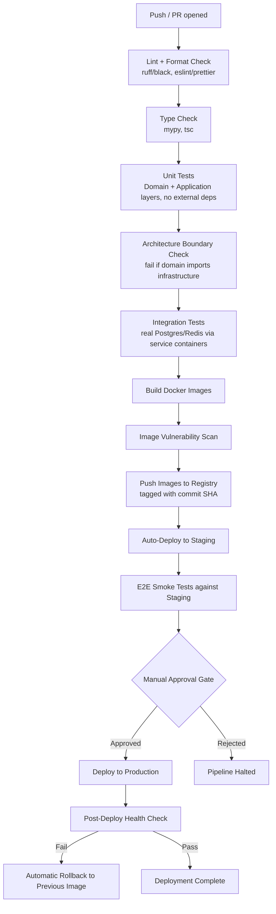

| Stage | Blocking? | Notes |
|---|---|---|
| Lint + format | Yes | Zero tolerance — auto-fixable locally via pre-commit hook, so CI failures here should be rare |
| Type check | Yes | `mypy --strict` on backend, `tsc --noEmit` on frontend |
| Unit tests | Yes | Domain/Application layer tests must run with no network/DB access — enforced by test tooling, not just convention |
| **Architecture boundary check** | Yes | A custom lint rule (import-linter for Python, ESLint boundary rules for TS) that fails the build if `domain/` imports anything from `infrastructure/` or `presentation/` — makes the Clean Architecture rule (Section 2.2) machine-enforced, not just documented |
| Integration tests | Yes | Run against real Postgres/Redis spun up as CI service containers (or testcontainers) — verifies repository implementations actually satisfy their ports |
| Image build + vulnerability scan | Yes | Fails on critical/high CVEs in base images or dependencies |
| Deploy to staging | Automatic on merge to `main` | No manual step — staging always reflects `main` |
| E2E smoke tests | Yes (gates prod promotion) | A small, fast suite covering critical paths (login, health checks) — not a full regression suite |
| Manual approval | Required for production | A human (release owner) explicitly promotes staging → production; never fully automatic for production in Phase 1–2 |
| Post-deploy health check + auto-rollback | Automatic | If `/health/ready` fails post-deploy, the pipeline automatically redeploys the last known-good image tag |

---

## 10. Development Standards

### 10.1 Naming Conventions

| Context | Convention | Example |
|---|---|---|
| Python modules/files | `snake_case` | `order_repository.py` |
| Python classes | `PascalCase` | `OrderRepository` |
| Python functions/variables | `snake_case` | `get_active_orders()` |
| TypeScript files (components) | `PascalCase.tsx` | `MenuItemCard.tsx` |
| TypeScript files (non-component) | `camelCase.ts` or `kebab-case.ts` (consistent per package, documented in that package's README) | `useMenuItems.ts` |
| TypeScript types/interfaces | `PascalCase` | `MenuItem`, `OrderStatus` |
| TypeScript variables/functions | `camelCase` | `fetchMenuItems()` |
| React components | `PascalCase` function name matching filename | `export function MenuItemCard()` |
| React hooks | `use` prefix, `camelCase` | `useActiveTable()` |
| API URL paths | plural nouns, `kebab-case` | `/api/v1/purchase-orders` |
| JSON field names (wire format) | `camelCase` | `tenantId`, `createdAt` |
| Environment variables | `SCREAMING_SNAKE_CASE` | `DATABASE_URL` |
| Redis keys | `colon:namespaced:segments` | `tenant:{id}:menu:{itemId}` |

### 10.2 Folder & File Conventions

- One React component per file; co-locate a component's Storybook story and unit test alongside it (`MenuItemCard.tsx`, `MenuItemCard.test.tsx`).
- One Python class per file for Domain entities and Use Cases — favors discoverability over minimizing file count.
- Barrel (`index.ts`) exports at the feature-module boundary only, never nested arbitrarily deep — prevents ambiguous "where did this import actually come from" debugging.

### 10.3 TypeScript Standards

- `strict: true` non-negotiable in every `tsconfig.json` across the monorepo (enforced via `packages/config` shared base config every app extends).
- `any` is banned by lint rule; `unknown` + narrowing is the escape hatch when a type is genuinely not statically known.
- Prefer `type` for data shapes and unions, `interface` only when declaration merging or class-implementation ergonomics are specifically needed — a documented, not religious, distinction.
- All API response shapes are typed via `packages/shared-types`, generated from the backend OpenAPI schema where possible rather than hand-duplicated.

### 10.4 Python Standards

- PEP 8 enforced via `ruff` (linting) and `black` (formatting) in pre-commit and CI.
- Type hints are mandatory on every function signature; `mypy --strict` runs in CI (Section 9.6).
- Docstrings required on public Domain and Application classes/methods explaining *intent/invariant*, not restating the signature.
- No bare `except:` — every caught exception is either a specific, expected type or re-raised after logging.

### 10.5 API Naming

- Resources are plural nouns (`/branches`, `/purchase-orders`), never verbs — actions are expressed via HTTP method + resource, or a clearly named sub-resource action (`/orders/{id}/void`) only when no clean REST verb mapping exists.
- Nesting reflects genuine ownership (`/branches/{id}/tables`), capped at two levels deep to avoid unwieldy URLs — deeper relationships are queried via filters instead (`/tables?branchId=...`).

### 10.6 Git Commit Convention

**Conventional Commits**, enforced via commit-msg hook (commitlint):

```
<type>(<optional scope>): <short summary>

[optional body]

[optional footer(s)]
```

| Type | Use |
|---|---|
| `feat` | New capability |
| `fix` | Bug fix |
| `refactor` | Code change with no behavior change |
| `chore` | Tooling, dependency bumps, non-source changes |
| `docs` | Documentation only |
| `test` | Adding/adjusting tests only |
| `perf` | Performance improvement |
| `ci` | CI/CD pipeline changes |

### 10.7 Branch Naming

`type/short-description` (e.g., `feat/jwt-refresh-rotation`, `fix/websocket-reconnect-loop`), optionally prefixed with a ticket reference where an issue tracker is in use (`feat/ROS-142-jwt-refresh-rotation`).

### 10.8 Pull Request Rules

- Every PR targets `main` from a short-lived feature branch — no long-lived environment branches (a single deployable `main`, per the trunk-based CI/CD flow in Section 9.6).
- PR description must state: what changed, why, and how it was tested — a PR template (`.github/PULL_REQUEST_TEMPLATE.md`) enforces this structure.
- No PR merges with a failing CI stage (Section 9.6) — no override, including for the architecture boundary check.
- At least one approving review required; PRs touching Domain or Application layers, or anything under Section 8 (Security), require review from a second engineer with context in that layer.

### 10.9 Code Review Checklist

- [ ] Does business logic live only in Domain/Application layers (never in a route handler or React component)?
- [ ] Are all new database queries going through the ORM/repository layer (no raw SQL string interpolation)?
- [ ] Is server state handled via TanStack Query, not stuffed into Zustand?
- [ ] Are new API fields validated by a Pydantic schema and, on the frontend, a matching Zod schema?
- [ ] Does every sensitive action (per Blueprint BR-15) write an audit log entry within the same transaction?
- [ ] Are new endpoints protected by an explicit permission check (Section 8.11), not left open by omission?
- [ ] Are new filterable/sortable fields added to an explicit allow-list (Section 5.8), not left dynamic?
- [ ] Do new background tasks include an idempotency key and a bounded retry policy (Section 5.10)?
- [ ] Are new environment variables documented in `.env.example`?
- [ ] Does the PR include or update tests at the appropriate layer (unit for Domain/Application, integration for Infrastructure)?

---

## 11. Deployment Strategy

### 11.1 Deployment Architecture

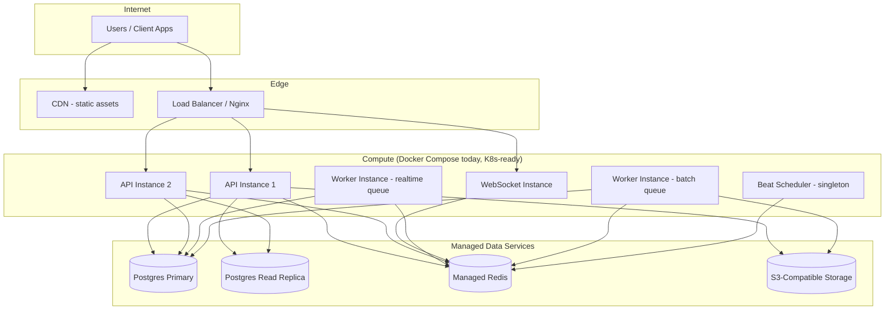

### 11.2 Container Architecture

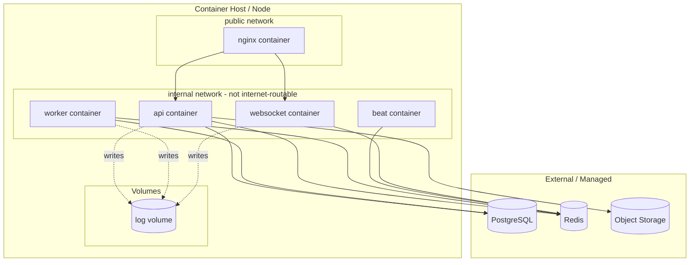

Only `nginx` sits on a network reachable from the internet; every application container is on an internal network reachable only from `nginx` and from each other — the database and Redis are never directly internet-addressable under any circumstance.

### 11.3 Release Strategy

- **Rolling deploys** for the API/WebSocket/Worker containers — new instances are started and pass their readiness check before old instances are drained and stopped, giving zero-downtime deploys even on Compose-based orchestration.
- **Database migrations run as a separate, preceding CI/CD step** before new application code is rolled out, and are written to be backward-compatible with the previous application version for at least one release cycle (expand/contract pattern) — so a mid-rollout moment where old and new code run simultaneously never hits a broken schema assumption.

---

## 12. Future Scaling Strategy

### 12.1 Scale Targets (from the Blueprint)

The foundation is validated against: 1,000+ restaurant tenants, 100+ branches per customer, 100,000+ daily orders, millions of API requests, real-time sync across all of it, and continued offline-first operation at the terminal level.

### 12.2 Scaling Levers, in the Order They'll Actually Be Pulled

| Trigger | Response |
|---|---|
| API p99 latency degrades under request volume | Horizontally scale API container replicas behind the load balancer (already stateless by design, Section 5 — no session affinity required) |
| Read-heavy reporting/dashboard queries contend with transactional writes | Route read-only queries (reports, dashboards) to the Postgres read replica (already wired as a distinct DI-provided connection, Section 5.1) |
| Connection count from many API replicas exceeds Postgres connection limits | Introduce PgBouncer (connection pooling) between API/Worker and Postgres |
| Worker queue backlog grows | Scale worker replicas per queue independently (Section 5.10's queue segmentation makes this a config change, not a redesign) |
| WebSocket connection count exceeds a single instance's practical ceiling | Scale WebSocket instances horizontally — already stateless-per-connection thanks to Redis Pub/Sub fan-out (Section 5.11) |
| Search volume/complexity outgrows Postgres full-text search | Swap the `search_port` (Section 5.8) implementation for an OpenSearch/Elasticsearch adapter — calling code is unchanged, because it only ever depended on the port |
| Operational complexity of Compose-managed scaling becomes the bottleneck itself | Migrate compute layer to **Kubernetes**: the container images, health checks, and stateless design (Sections 7, 11) transfer directly — this migration is an orchestration change, not an application rewrite |
| A specific bounded context (e.g., Inventory) needs independent scaling/deployment cadence from the rest of the monolith | Extract it into its own service: because Domain/Application code for that context never imported Infrastructure/Presentation code from other contexts (Section 2.2's dependency rule), the extraction is a matter of moving a folder and standing up a new Presentation shell + its own database schema/instance — not rewriting business logic |

### 12.3 Offline-First at Scale

The sync engine (a client-side responsibility per the Blueprint, §6) is supported server-side by two foundation guarantees already built in:

1. Every write endpoint is designed to be **safely retriable** (idempotency keys, Section 5.10's pattern extended to synchronous write endpoints as well) — a terminal that queues an order offline and replays it on reconnect cannot double-charge or double-deduct stock.
2. The audit/event trail (Section 8.12) is append-only, which is the same structural property needed for future conflict-resolution logic (reconstructing "what happened and in what order" across a terminal's offline window) — this document does not design that reconciliation logic (it belongs to a future sync-engine-specific RFC), but it ensures the foundation doesn't foreclose it.

### 12.4 Path to Microservices (Illustrative, Not Committed)

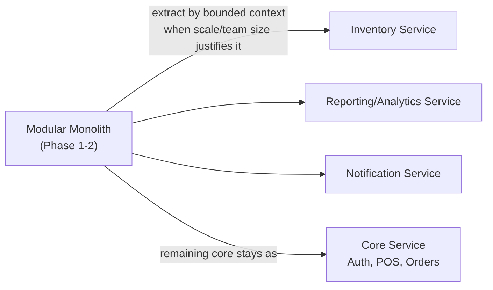

This is a documented *option*, gated by evidence (team size, deploy-cadence conflicts, or scaling asymmetry between contexts), not a scheduled milestone — the Blueprint's Phase 3–4 roadmap does not require it, and pulling this trigger prematurely would trade real velocity today for hypothetical flexibility not yet needed.

---

## 13. Risks

| Risk | Impact | Mitigation |
|---|---|---|
| Clean Architecture discipline erodes under delivery pressure (business logic creeps into route handlers) | Long-term maintainability and testability regress, silently, until a major refactor is needed | CI-enforced architecture boundary check (Section 9.6) makes the violation a build failure, not a code-review judgment call |
| Multi-tenancy row-level isolation has an application-layer bug that leaks cross-tenant data | Severe — data breach, contractual/regulatory exposure | Defense-in-depth via PostgreSQL RLS (Section 5.12) as a second, independent enforcement layer beyond application code |
| Refresh token rotation logic has an edge case allowing replay | Account takeover risk | Token family revocation on detected reuse (Section 8.3); security-focused code review requirement for auth-layer PRs (Section 10.8) |
| Modular monolith becomes a "distributed monolith in waiting" — implicit coupling accumulates between bounded contexts despite the folder structure | Extraction to microservices later (Section 12.4) becomes harder than designed, not easier | Periodic architecture review (quarterly ADR review) explicitly checking for cross-context imports that violate intended bounded-context isolation |
| Offline-first sync conflict resolution (a downstream, not-yet-designed concern) is underestimated in complexity | Data correctness issues (double-charges, lost orders) surface only under real-world network flakiness, hard to reproduce in testing | Idempotency and append-only audit trail are built into the foundation now (Section 12.3) specifically so the sync-engine design has the primitives it needs when that RFC is written |
| Team unfamiliarity with Clean Architecture / DI patterns slows initial velocity | Sprint 2 (first business module) takes longer than a "just wire it to the database" approach would | Mitigated by this document itself plus a small reference implementation (a trivial, non-business "example module" showing the full layer stack end-to-end) to onboard engineers against a concrete pattern, not just prose |

---

## 14. Recommendations

1. **Build one vertical reference module before Sprint 2's real business module.** A tiny, throwaway, non-business example (e.g., a "Feature Flags" or "System Announcements" CRUD slice) exercised through every layer — Domain entity, Application use case, Infrastructure repository, Presentation router, frontend feature module, TanStack Query hook, WebSocket event — gives the team a working, copy-from pattern before real business complexity is layered on.
2. **Write the first five ADRs (Architecture Decision Records) now**, capturing this document's biggest calls (Clean Architecture over alternatives, modular monolith over microservices, shared-schema multi-tenancy, JWT+refresh over server sessions, cache-aside over write-through) — future engineers should find the *why*, not just the *what*, in `docs/architecture/`.
3. **Stand up the CI architecture-boundary check and the audit-logging transactional guarantee before writing the first business feature**, not after — these are the two foundation elements most expensive to retrofit once dozens of features already violate them by omission.
4. **Treat the RBAC permission model as a first-class deliverable of this sprint**, not an auth-module afterthought — every persona in the Blueprint (§3) should have its permission set enumerated and testable before Sprint 2 begins, since every future screen's access control depends on it existing already.
5. **Defer Kubernetes and microservices extraction entirely** until a concrete scale or team-size trigger (Section 12.2) is actually hit — building for hypothetical Phase 4 scale during Sprint 1 would slow the path to the Phase 1 launch the Blueprint's roadmap actually calls for.

---

*End of document — RestaurantOS Engineering Foundation & Technical Architecture v1.0*
