# RestaurantOS — Technical Architecture v2.0 (Sprint 1.5: Enterprise Remediation)

**Document type:** Revised Technical Architecture Document, superseding [v1.0](RestaurantOS_Technical_Architecture.md)
**Trigger:** [Independent Architecture Review Board report](RestaurantOS_Architecture_Review.md) — Overall score 5.8/10, 8 Critical + 7 High risks identified
**Objective of this revision:** close every Critical and High risk before Sprint 2 begins. No business logic, no feature APIs, no database table design — this remains foundation-only work.
**Scope note:** Sections of v1.0 not touched by this remediation (Design System, most of Coding Standards, most of DevOps mechanics, Screen-level frontend concerns) remain in force and are not repeated here. This document is additive/replacing only where the Review flagged a defect.

---

## How to Read This Document

Each of the 17 items named in the remediation mandate is addressed inside one of 8 groups below (several items share a single root cause and a single fix, so they're treated together — each is still called out explicitly). Every group follows the same nine-part structure:

1. Root Cause
2. Why the v1.0 Design Was Insufficient
3. Improved Architecture
4. Updated Architecture Sections (supersedes named v1.0 sections)
5. Updated Mermaid Diagrams
6. Trade-offs
7. Scalability Implications
8. Security Implications
9. Operational Implications

| Group | Items addressed |
|---|---|
| A | Offline-first architecture · Local-first POS workflow · Synchronization engine · Conflict resolution · Multi-terminal synchronization |
| B | Transactional Outbox pattern · Idempotency strategy |
| C | Permission versioning · Session revocation |
| D | Event-driven communication |
| E | Bounded-context backend organization |
| F | Payment processing boundaries (PCI) · GDPR-compliant audit strategy |
| G | Redis responsibilities and scaling · PostgreSQL scaling strategy · WebSocket reliability |
| H | Multi-tenant isolation |

---

## Group A — Offline-First Architecture, Local-First POS Workflow, Synchronization Engine, Conflict Resolution, Multi-Terminal Synchronization

### A.1 Root Cause

v1.0's Frontend Architecture (§6) was designed as a conventional connected web application: Next.js App Router with Server Components, TanStack Query for server state, and no local persistence layer of any kind. Offline behavior was asserted as a product principle (Blueprint §2) but never given a mechanism. Multi-terminal consistency was assumed to flow automatically from "the cloud is the source of truth," which only holds when every terminal is always connected — precisely the condition the product promises to operate without.

### A.2 Why the v1.0 Design Was Insufficient

- Server Components require a server round-trip by construction; applying them to POS/KDS makes those surfaces **non-functional**, not degraded, the instant connectivity drops.
- TanStack Query's cache is in-memory only — it does not survive a reload and cannot serve as a source of truth for writes made while offline.
- There was no mechanism for a POS terminal to *originate* a transaction without a live request/response round trip to the API, and no mechanism to reconcile that transaction once connectivity returned.
- "Multi-terminal synchronization" had no defined protocol at all — it was implicitly delegated to WebSocket push, which itself (Group D) had no durability guarantee.

### A.3 Improved Architecture

**Client tier split.** Apps are explicitly categorized into two architectural families, not one uniform Next.js pattern:

| Family | Apps | Rendering model | Data model |
|---|---|---|---|
| **Connected** | `admin-web` (reporting, settings, back-office) | Server Components where they help (data-heavy, non-time-critical) | Server state via TanStack Query; no offline requirement |
| **Edge (local-first)** | `kitchen-display`, `customer-ordering`, and the POS/table-service surfaces of `admin-web` and `mobile` | Fully client-rendered PWA shell; no RSC on the transactional path | Local-first: an embedded local store is the primary read/write target; the network is a background sync detail, not a request-path dependency |

**The local-first data layer.** Every Edge app embeds a local, durable, structured store — IndexedDB on web (via a purpose-built wrapper, `packages/sync-engine`), SQLite/Drift on Flutter — holding two things:
1. A **local read model**: the current known state of the entities that terminal cares about (its branch's tables, menu, orders, stock levels), kept up to date by applying both its own local writes and inbound sync events.
2. A **local operation log**: an append-only, time-ordered queue of every mutating action the user performed on this device, whether or not it has reached the server yet.

**Local-first POS workflow.** A cashier ringing up an order never waits on the network:

1. UI action (add item, apply modifier, take payment) creates a **domain command** object, tagged with a client-generated **ULID** (`operation_id` — globally unique, time-sortable) and this device's current **hybrid logical clock (HLC)** value (wall-clock timestamp + a logical counter, giving a total, causally-consistent order across devices without needing synchronized clocks).
2. The command is appended to the local operation log **and applied immediately to the local read model**, so the UI updates with zero perceived latency — this is what makes "<10 second billing" achievable regardless of connectivity.
3. A background **Sync Agent** (a service worker using the Background Sync API on web; a background isolate/service on Flutter) watches for connectivity and, whenever available, drains the operation log to the server in FIFO batches.
4. The command's `operation_id` doubles as its idempotency key end-to-end (Group B) — replaying it after a dropped connection or app restart is always safe.

**The synchronization engine.** A single, versioned protocol, not a bespoke endpoint per feature:

- `POST /api/v1/sync/push` — client submits a batch of pending operations. Server applies each in causal (HLC) order, persists it (via the Outbox, Group B), and returns a per-operation result: `applied`, `duplicate` (already seen — no-op), `rejected` (with a machine-readable reason, e.g. `item_unavailable`), or `applied_with_correction` (accepted, but the server's authoritative state differs from what the client assumed — e.g., a price changed centrally after the client went offline).
- `GET /api/v1/sync/pull` (and its real-time equivalent over the event stream, Group D) — server sends the client every state change relevant to its branch since the client's last known **sync cursor** (a durable offset, not a timestamp — timestamps are unsafe across clock drift; the cursor is the Redis Streams offset described in Group G/D).
- Every terminal's local read model is therefore kept eventually consistent through the same two primitives — push local ops, pull remote ops — regardless of how long it was offline or how many other terminals changed shared state in the meantime.

**Conflict resolution — domain-aware, not generic.** Rather than a single blanket strategy (naive last-write-wins silently loses data; full CRDTs are more machinery than this domain needs), each entity type declares an explicit strategy in a small **Conflict Resolution Registry**:

| Entity category | Example | Strategy | Rationale |
|---|---|---|---|
| **Append-only facts** | Orders, payments, KOT tickets | No merge needed — each device's ULID guarantees global uniqueness; concurrent creation is not a conflict, it's just two new records | Financial correctness demands these are never overwritten, only ever added |
| **Commutative numeric deltas** | Stock deduction, till cash count adjustments | Deltas (not absolute values) are transmitted and replayed in HLC order; two terminals each deducting 1 unit from stock=10 while offline converge deterministically to 8 | Avoids the classic last-write-wins bug where one terminal's `-1` overwrites, instead of combines with, another's `-1` |
| **Exclusive shared state** | Table status/assignment, 86'd item flags | Server-authoritative resolution by first-committed-receipt order; the losing device receives an explicit `applied_with_correction` event and surfaces it to the human (e.g., "This table was already seated by Alex") | Some conflicts are genuinely business conflicts a human must see, not something software should silently paper over |
| **Configuration/reference data** | Menu prices, item availability | Server is always authoritative; clients treat their local copy as a cache with a short TTL and reconcile immediately on reconnect | Central governance (Blueprint's multi-branch price push) must always win over stale local state |

Every future business module that introduces an offline-capable entity must declare its category in this registry as part of code review — conflict handling becomes a reviewed architectural decision per entity, not an improvisation.

**Multi-terminal synchronization** is then just the natural consequence of the above: once the server applies a pushed operation, it emits a domain event (Group D) over the durable event stream; every other terminal on that branch — regardless of whether it caused the change — receives it and applies it to its own local read model via the same pull mechanism, in real time when connected, or on next reconnect when not.

### A.4 Updated Architecture Sections

**Supersedes TAD v1.0 §6 (Frontend Architecture) and §11.2 (Latency perception guidance).** New content:

- New shared package: `packages/sync-engine` — the client-side local store, operation log, HLC implementation, and Sync Agent, consumed by every Edge app (web and, via a Dart port, Flutter).
- New backend module surface (see Group E for full module structure): `modules/sync/` owns the `/sync/push` and `/sync/pull` endpoints and the server-side operation-ordering/conflict-resolution logic, calling into each affected module's Application layer to actually apply changes.
- Frontend app classification table (above) is now a permanent part of the architecture — any new Edge app must be built local-first from its first commit, not retrofitted later.

### A.5 Updated Mermaid Diagrams

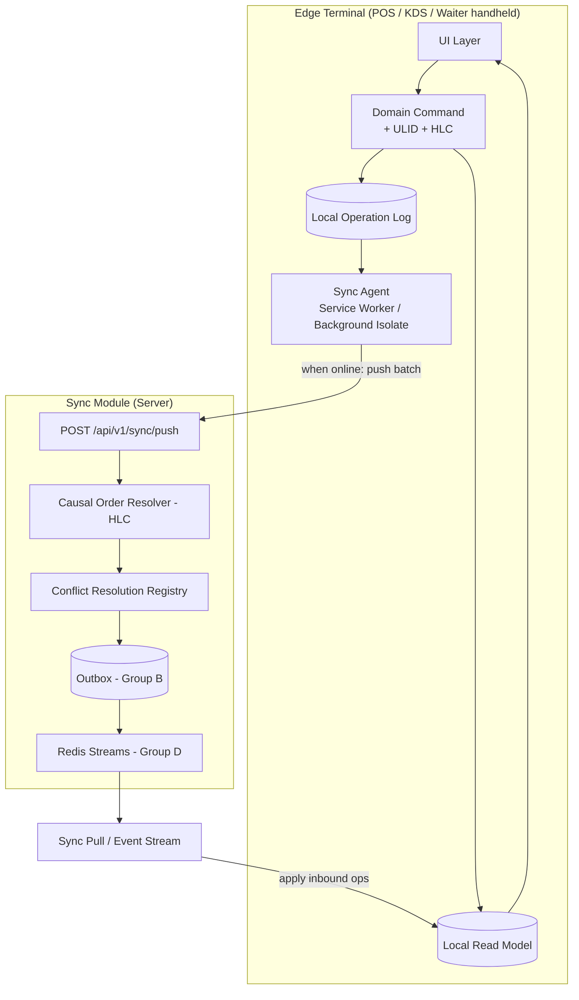

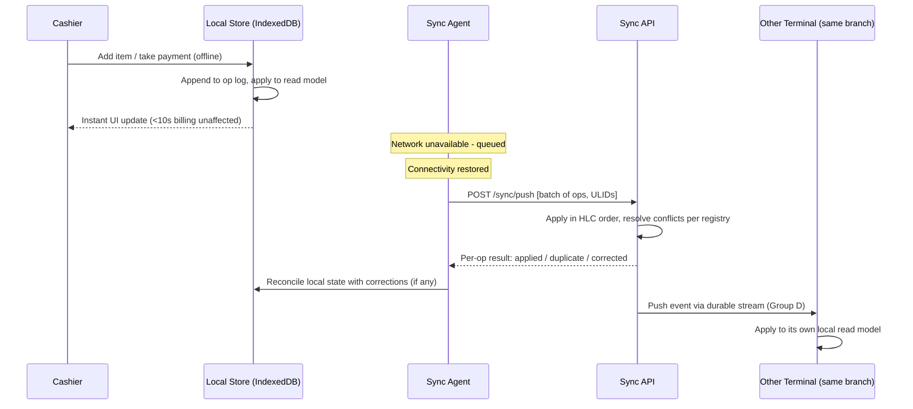

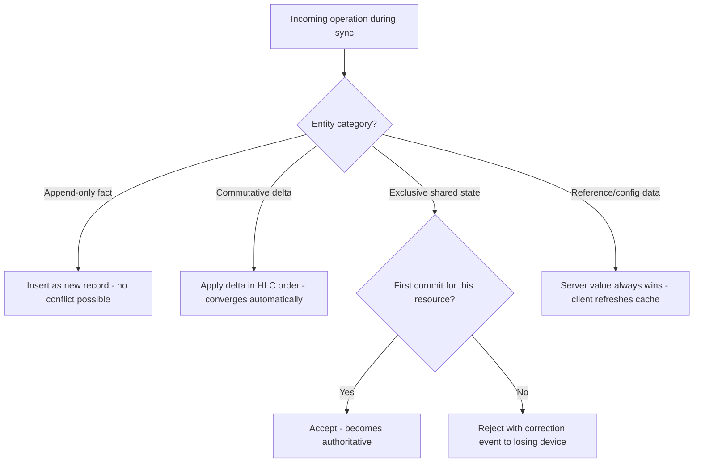

### A.6 Trade-offs

- Building a real local-first layer is materially more engineering effort up front than a connected-only app — this is the single largest addition in this remediation, and it should be budgeted as its own dedicated milestone before POS UI work begins, not squeezed into Sprint 2's estimate.
- Domain-aware conflict resolution requires every future module owner to think explicitly about their entity's offline behavior at design time — more upfront design cost, in exchange for avoiding silent data loss later.
- Client bundle size and complexity increase for Edge apps (local DB engine, sync logic) — acceptable given these are the apps where reliability, not initial load size, is the dominant product requirement.

### A.7 Scalability Implications

- Removes the API from the request-path critical path for the majority of POS interactions — the server only needs to handle *batched* sync pushes, not every keystroke-adjacent action, meaningfully reducing peak request volume compared to a naive connected design.
- HLC-ordered, ULID-keyed operations are inherently shard-friendly (Group G) — no centralized sequence generator is required, which would otherwise become a bottleneck/single point of failure at scale.

### A.8 Security Implications

- Local stores on shared terminals now hold cached business data offline — this data must be encrypted at rest on-device (platform-native storage encryption) and scoped/cleared on operator logout for shared-terminal scenarios (Blueprint's PIN-based shared device model), which is now an explicit requirement of `packages/sync-engine`, not an omission.
- The sync endpoint becomes a high-value target (it's now how *all* state enters the system) — it inherits the full auth/permission-version/rate-limiting stack (Groups C, G) exactly as any other endpoint; batched pushes are validated per-operation against the acting user's permissions, not just once per batch.

### A.9 Operational Implications

- New observability requirement: **sync lag** (time between a local operation's creation and its server-side application) becomes a first-class monitored metric per terminal — this is the operational proxy for "is offline-first actually working" and feeds directly into the Sync Health Monitor screen already specified in the Blueprint (§7.10).
- Conflict Registry entries need to be reviewed as part of any new module's design review — an operational/process change for engineering, not just a one-time build cost.

---

## Group B — Transactional Outbox Pattern & Idempotency Strategy

### B.1 Root Cause

Use cases in v1.0 performed their database write and then separately, non-atomically, triggered cache invalidation, WebSocket notification, and audit logging. Idempotency was designed only for Celery tasks, never for synchronous write endpoints — the one place (order/payment creation, now also every `/sync/push` operation) that most needs it given offline replay.

### B.2 Why the v1.0 Design Was Insufficient

A crash, timeout, or partial failure between "commit the DB write" and "publish the side effect" silently drops that side effect with no record it was ever supposed to happen — directly enabling scenarios like a stock deduction succeeding while the corresponding 86-list/cache update never fires, leading to overselling (violates Blueprint BR-8). Separately, an offline terminal replaying a queued write with no idempotency guard could double-charge a customer or double-deduct stock the moment sync introduced any at-least-once delivery semantics — which Group A's sync engine explicitly has.

### B.3 Improved Architecture

**Transactional Outbox.** Every mutating use case, in the *same* database transaction as its business write, inserts one or more rows into a `platform`-owned outbox store (conceptually: event id, aggregate type/id, event type, payload, tenant id, created-at, dispatched-at). Because this insert shares the transaction with the business write, the two either both commit or both roll back — there is no window where one happens without the other.

A **Relay Dispatcher** (initially a Celery Beat-scheduled poller reading undispatched outbox rows in order; the natural upgrade path is Postgres logical replication/CDC once volume justifies it) publishes each event to the durable event stream (Group D) and marks it dispatched only after a confirmed publish. If the dispatcher crashes mid-relay, undispatched rows simply remain undispatched and are retried — at-least-once delivery, by construction, with no manual bookkeeping per use case.

**Idempotency, unified across every mutation path.** One mechanism, two ways of obtaining the key:

- **Offline-capable clients** (Edge apps, Group A): the operation's `operation_id` (ULID) generated client-side *is* the idempotency key — no separate concept needed.
- **Always-online clients** (back-office admin actions): the client supplies a client-generated `Idempotency-Key` header (the same pattern used by major payment APIs), required on every mutating request.

A single reusable Application-layer wrapper — not a per-endpoint convention — checks a tenant-scoped idempotency record (key, request hash, result, expiry) before executing any use case. A repeated call with the same key and matching request body returns the previously computed result without re-executing business logic; a repeated call with the same key but a *different* body is rejected as a client error (defends against key reuse bugs).

### B.4 Updated Architecture Sections

**Supersedes TAD v1.0 §5.10 (Background Job Strategy — idempotency subsection) and adds new content to §5 (Backend Architecture) and §2.3 (System Architecture diagram).** New `platform/outbox/` and `platform/idempotency/` modules (Group E) are shared-kernel infrastructure every module's Application layer depends on via a port, exactly like any other Infrastructure dependency.

### B.5 Updated Mermaid Diagrams

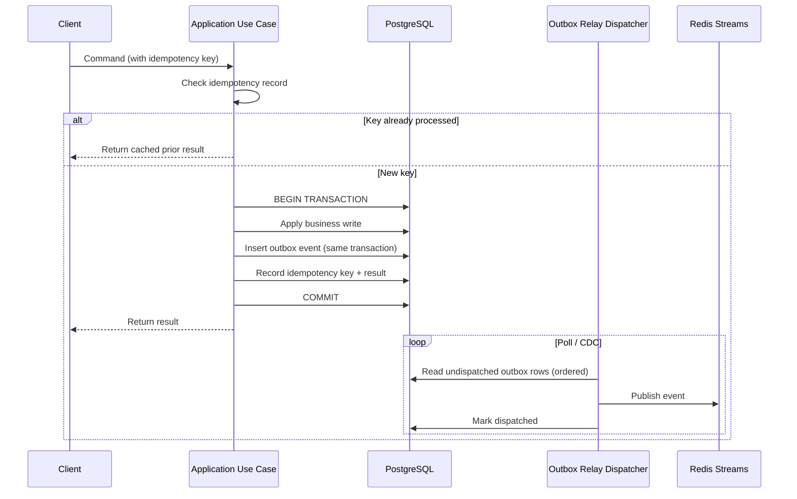

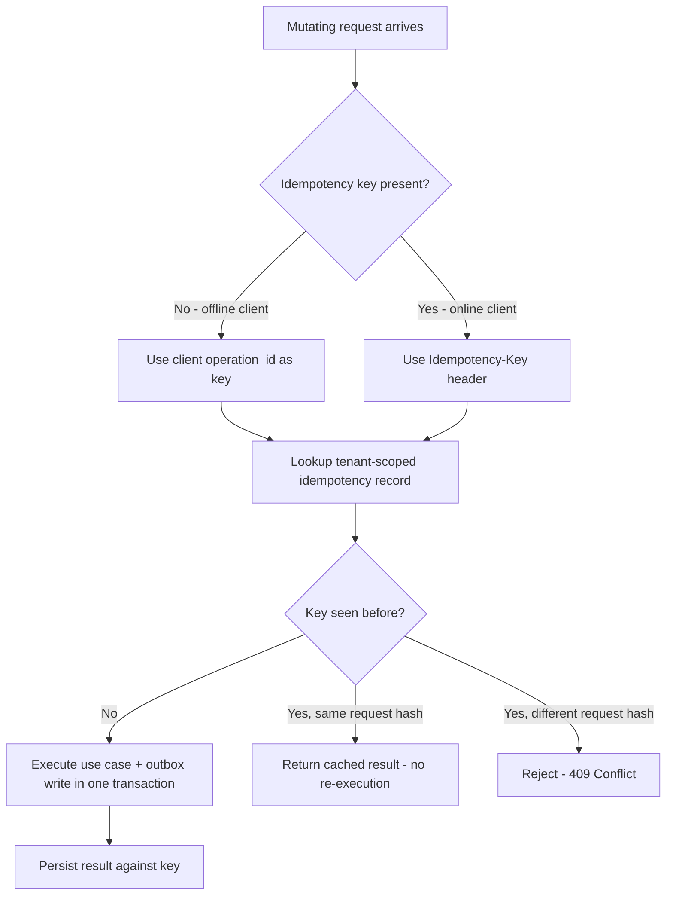

### B.6 Trade-offs

- Every mutating use case now carries a small amount of extra transactional overhead (one additional insert) and requires an idempotency-record lookup — negligible relative to the correctness guarantee purchased.
- The Relay Dispatcher introduces a small amount of end-to-end latency between "committed" and "fanned out" (bounded by poll interval, tunable) — acceptable for the eventual-consistency model the whole system already operates under (Group A).

### B.7 Scalability Implications

- The outbox table is itself a high-write-volume, append-only table and is explicitly included in the Postgres partitioning plan (Group G) from day one, rather than being discovered as a hot table later.
- The Relay Dispatcher is stateless and horizontally scalable (multiple dispatchers can safely claim disjoint batches of undispatched rows via `SELECT ... FOR UPDATE SKIP LOCKED`), so outbox relay throughput scales independently of any other component.

### B.8 Security Implications

- Idempotency records are tenant-scoped exactly like every other resource — a key collision across tenants is architecturally impossible, closing off a subtle cross-tenant replay vector that a naive global idempotency-key store would have permitted.
- Outbox payloads are treated as sensitive data (they may contain business-event details) and inherit the same encryption-at-rest and access-control posture as the primary tables.

### B.9 Operational Implications

- New required monitoring: outbox **dispatch lag** (age of the oldest undispatched row) becomes an alerting metric — a growing lag is now the canonical early signal of downstream event-consumer trouble, well before customers notice.
- Idempotency-record storage needs a retention/expiry policy (e.g., 24–72 hours) to bound table growth, since offline replay windows are bounded by realistic offline durations, not unlimited.

---

## Group C — Permission Versioning & Session Revocation

### C.1 Root Cause

v1.0 embedded `roles` directly inside the JWT payload and relied purely on signature + expiry (~15 minutes) for authorization — no mechanism existed to invalidate a token's authorization claims before natural expiry.

### C.2 Why the v1.0 Design Was Insufficient

This directly contradicted the Blueprint's own requirement (S1) that deactivating a staff account take effect immediately. A terminated cashier, a demoted manager, or a compromised account all retained their old permission set for up to 15 minutes with zero server-side recourse short of taking the entire signing key out of rotation — an unacceptable blast radius for a fix to a single bad actor.

### C.3 Improved Architecture

**Permission versioning.** The JWT is stripped down to identity-only claims: `sub`, `tenant_id`, `device_id`, `session_id`, `token_family` — no roles, no permissions. A per-user `permission_version` integer is maintained in Postgres as the source of truth and mirrored into Redis with active invalidation (not just a short TTL): any action that changes a user's roles, permissions, or active status increments this counter and — via the same Outbox event (Group B) that records the change — immediately pushes the new value into Redis. Every authenticated request's middleware performs one cheap Redis `GET` to compare the live `permission_version` against the value the client last obtained; a mismatch forces a 401 requiring the client to re-authenticate and fetch a fresh permission set. Propagation delay is now bounded by Redis replication (sub-second), not token TTL (15 minutes) — a ~100x improvement in the worst-case exposure window, and one that can be driven further down by shortening the access-token TTL if a business requirement demands it, independently of this fix.

**Session revocation.** A Redis-backed **active session registry** tracks every issued session (`session_id` → device info, issued-at, last-seen), decoupled from the token itself. "Deactivate employee" or "log out all devices" is a single atomic operation (itself an Outbox event) that: (1) bumps `permission_version` (kills all live access-token usage within the Redis-propagation window above), and (2) deletes every session registry entry and revokes every associated refresh token for that user, so no new access token can be minted afterward either. The two mechanisms close both halves of the gap the Review identified: the current token stops working almost immediately, and no replacement token can be issued.

**PIN-based terminal auth** gets its own explicit profile rather than inheriting the standard flow uncritically: a PIN login issues a **shift-length (e.g., 4-hour), device-bound** access token (the `device_id` claim is checked on every request against the physical terminal, not just recorded), PIN attempts are rate-limited **per terminal** in addition to per-account, and a lockout after a small number of failed attempts requires a manager's PIN to clear — directly closing the brute-force gap the Review flagged as previously undesigned.

### C.4 Updated Architecture Sections

**Supersedes TAD v1.0 §5.13 (step 7, Authentication middleware), §6.6 (Authentication Flow), §8.3 (JWT Architecture & Refresh Token Strategy), §8.11 (RBAC Architecture — permission-check subsection).**

### C.5 Updated Mermaid Diagrams

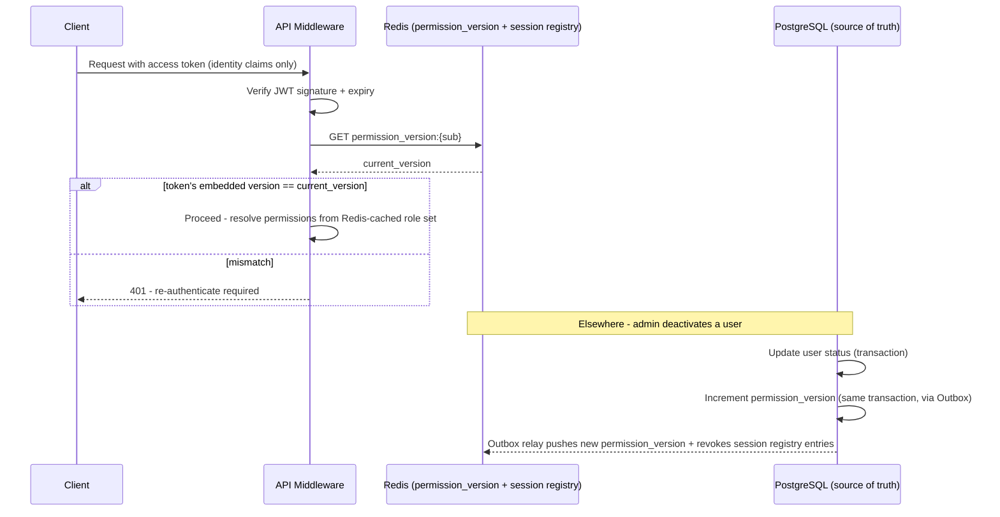

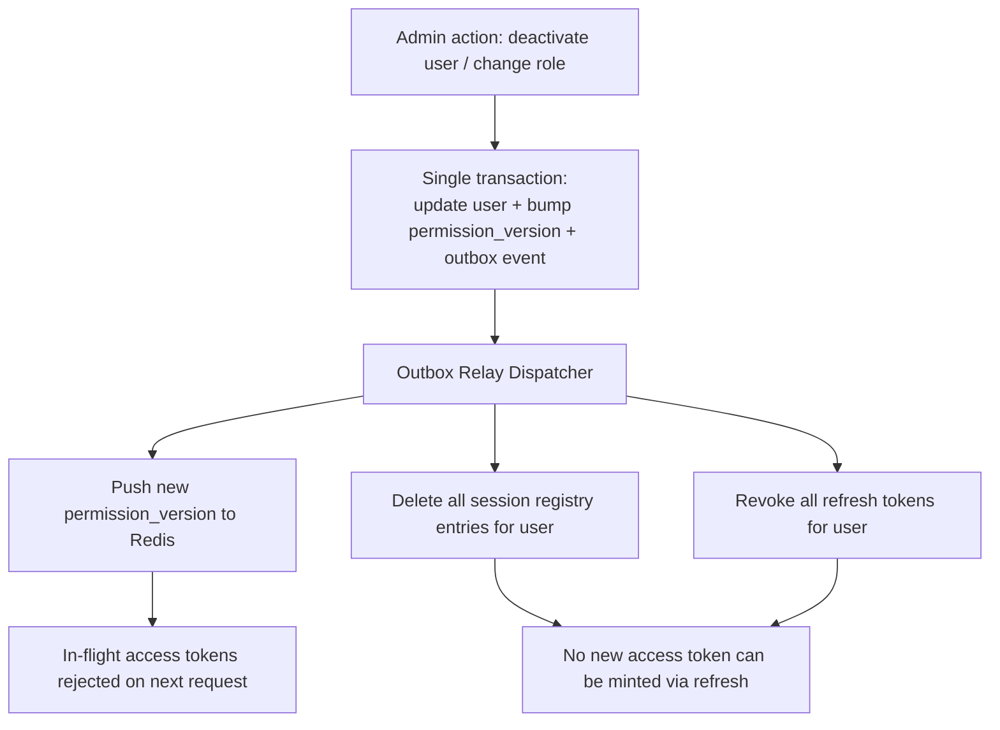

### C.6 Trade-offs

- Adds one Redis round-trip to every authenticated request — negligible latency cost (sub-millisecond) relative to the security guarantee gained, and Redis is already on the request path for caching (Group G).
- Permission resolution now depends on Redis availability for the version check; a Redis outage must fail **closed** for this check specifically (reject the request) rather than open, which is a deliberate, documented trade-off of availability for correctness on the authorization path.

### C.7 Scalability Implications

- The mechanism is O(1) per request and stateless from the API replica's point of view — scales horizontally with no additional coordination required between replicas.

### C.8 Security Implications

- Closes the Review's top-flagged Critical risk directly: the worst-case window between "access should be revoked" and "access is actually revoked" drops from ~15 minutes to sub-second.
- PIN-specific lockout and device-binding close a previously undesigned brute-force surface on shared terminals.

### C.9 Operational Implications

- New metric: **permission-version propagation latency** (time from an Outbox event to Redis reflecting it) is monitored as a security-relevant SLO, not just a performance curiosity.
- Support/ops runbook gains a documented "force logout" action mapped directly to this mechanism, giving on-call staff a fast, verified path to lock out a compromised account.

---

## Group D — Event-Driven Communication

### D.1 Root Cause

v1.0 had no formal domain-event concept and relied on ephemeral Redis Pub/Sub for WebSocket fan-out, which delivers messages only to currently-subscribed consumers with zero persistence — a disconnected client permanently loses whatever was published during its downtime, papered over in the original design as "best-effort" replay with no actual mechanism behind the phrase.

### D.2 Why the v1.0 Design Was Insufficient

For a Kitchen Display System, a lost "ticket ready" event is not a cosmetic gap — it's a dish sitting under a heat lamp until a human notices by other means. More broadly, without a formal event model, every future cross-cutting concern (cache invalidation, search indexing, analytics, notifications) would have had to be wired ad hoc into each use case, guaranteeing inconsistency and omissions as the number of modules grows.

### D.3 Improved Architecture

**Domain events as first-class Domain-layer objects.** Every aggregate that changes meaningfully-observable state produces domain events (e.g., `OrderPlaced`, `StockDeducted`, `TicketReady`, `PermissionsChanged`) as plain data, with zero framework dependency — consistent with the Clean Architecture dependency rule already established in v1.0.

**Durable transport via Redis Streams, not Pub/Sub.** The Outbox Relay Dispatcher (Group B) publishes every domain event onto a Redis Stream, partitioned per tenant+branch channel, using **consumer groups** so each WebSocket service instance reliably claims and acknowledges messages, and a durable **per-consumer offset** is tracked. A reconnecting terminal doesn't hope for "best effort" — it explicitly requests replay from its last acknowledged offset, and the stream (retained for a bounded window, e.g. 24–72 hours per channel) serves exactly what it missed. This is the same primitive that backs Group A's `sync/pull` mechanism — one event backbone serves both real-time push and catch-up replay.

**One publish, many independent consumers.** The WebSocket service is only one subscriber; cache invalidation, future search-index updates, and future analytics/CDC pipelines each get their own consumer group against the same stream, with independent progress tracking — adding a new consumer never requires touching the code that produces events.

### D.4 Updated Architecture Sections

**Supersedes TAD v1.0 §5.11 (WebSocket Architecture) and §2.3 (High-Level System Architecture diagram).**

### D.5 Updated Mermaid Diagrams

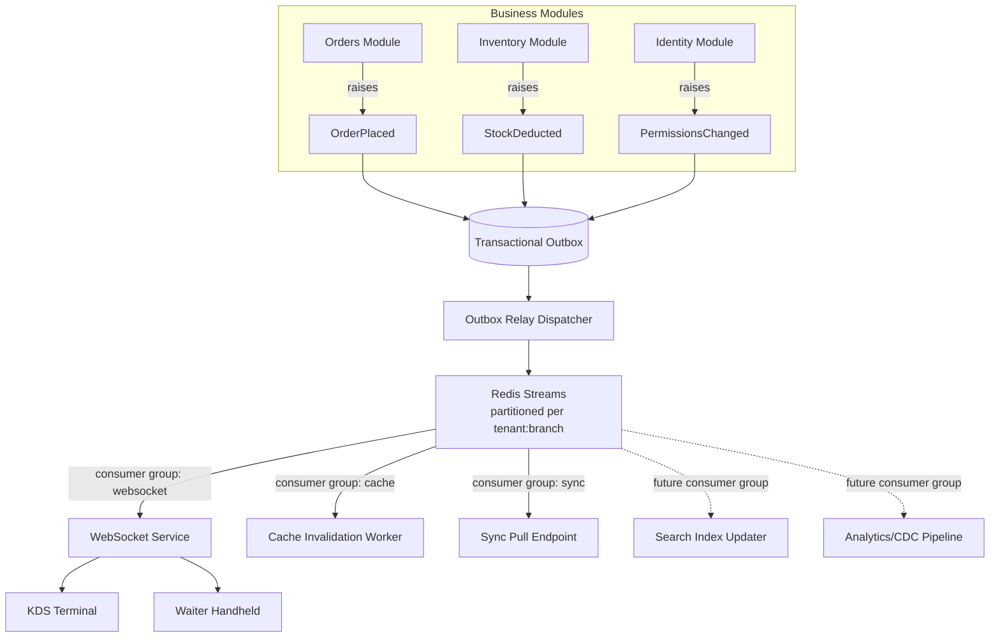

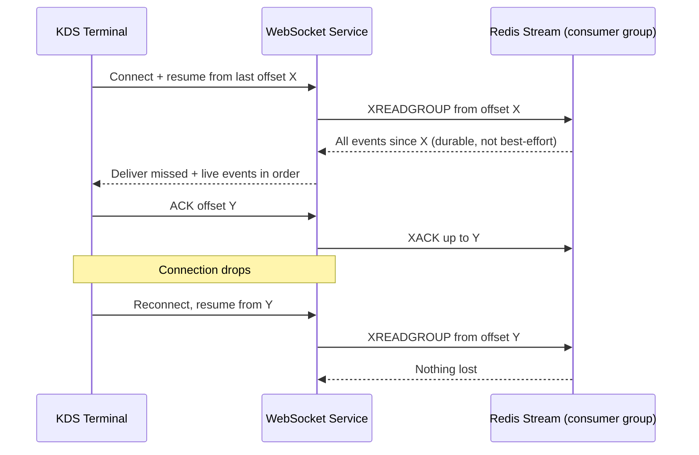

### D.6 Trade-offs

- Redis Streams carries more operational surface than plain Pub/Sub (consumer group management, offset tracking, retention sizing) — an acceptable and necessary cost given the correctness requirement.
- Bounded stream retention means a terminal offline longer than the retention window needs a full-state resync rather than an incremental replay — handled gracefully by falling back to a full `sync/pull` snapshot (Group A) beyond that window, a documented, deliberate fallback rather than a silent gap.

### D.7 Scalability Implications

- Consumer groups allow horizontal scaling of WebSocket service instances without any single instance needing to hold all connections' state — any instance can pick up any consumer's unacknowledged work on failover.
- Per-tenant:branch stream partitioning keeps any single stream's volume bounded and independent of total platform scale, avoiding a single global-event-log bottleneck.

### D.8 Security Implications

- Stream channel naming is still scoped per tenant/branch (unchanged principle from v1.0), and consumer group subscriptions are authorized exactly like any other resource access — the durability upgrade does not widen the blast radius of who can read which channel.

### D.9 Operational Implications

- New required dashboards: consumer group lag (per consumer type), stream memory footprint, and retention-window utilization — these are the concrete operational signals that replace the previously vague "sync health" concept with measurable numbers.

---

## Group E — Bounded-Context Backend Organization

### E.1 Root Cause

v1.0's backend folder structure (§3.3) organized code by architectural layer first (`domain/`, `application/`, `infrastructure/`, `presentation/`), with every future business module's entities, use cases, and repositories landing inside the same four flat folders.

### E.2 Why the v1.0 Design Was Insufficient

This produces a "big ball of layers" — clean in a diagram, unnavigable in practice once Menu, Inventory, Orders, CRM, Payroll, and Loyalty all share one `use_cases/` folder with no structural signal of ownership. It also made the extraction-to-microservices story in v1.0 §12.4 false as written: you cannot cleanly lift "Inventory" out of a flat folder containing every module's use cases interleaved with it.

### E.3 Improved Architecture

Restructure to **modules-first, layers-second** — each business capability is a self-contained vertical slice with its own four-layer stack:

```
src/restaurant_os_api/
├── modules/
│   ├── identity/        (auth, users, roles, permissions, sessions - Groups C)
│   │   ├── domain/
│   │   ├── application/
│   │   ├── infrastructure/
│   │   ├── presentation/
│   │   └── public/       ← the ONLY surface other modules may import
│   ├── orders/
│   │   ├── domain/  application/  infrastructure/  presentation/  public/
│   ├── inventory/
│   │   └── ... same shape
│   ├── billing/
│   ├── crm/
│   ├── sync/            (Group A's push/pull endpoints)
│   └── ...
│
├── platform/             (deliberately minimal shared kernel)
│   ├── outbox/           (Group B)
│   ├── events/           (Group D — stream publish/consume primitives)
│   ├── idempotency/      (Group B)
│   ├── tenancy/          (Group H — tenant context, directory resolution)
│   └── audit/            (Group F)
│
├── core/                  (config, logging, security primitives, DI — unchanged from v1.0 §5.1–5.4)
└── main.py
```

**The enforcement mechanism, not just the folder layout, is what makes this real.** The v1.0 CI architecture-boundary check (already enforcing the Domain→Application→Infrastructure→Presentation dependency rule) is extended with a second, equally mechanical rule: a module may import another module's `domain`, `application`, or `infrastructure` package **only via that module's `public/` contract folder** — direct cross-module imports of internals fail the build. Cross-module interaction otherwise happens exclusively through the `platform/events` domain-event bus (Group D). This is what gives the "move a folder, stand up a new service" extraction story real teeth: any module already only talks to its siblings through a narrow, explicit contract, so lifting it out later is a deployment change, not a rewrite.

`platform/` is kept intentionally small — only genuinely cross-cutting infrastructure lives there, specifically so it doesn't regrow into the same flat dumping ground one level up.

### E.4 Updated Architecture Sections

**Supersedes TAD v1.0 §3.3 (Backend Service Internal Structure) and §3.5 (Monorepo Structure Diagram, module-relationship portion) and §12.4 (Path to Microservices).**

### E.5 Updated Mermaid Diagrams

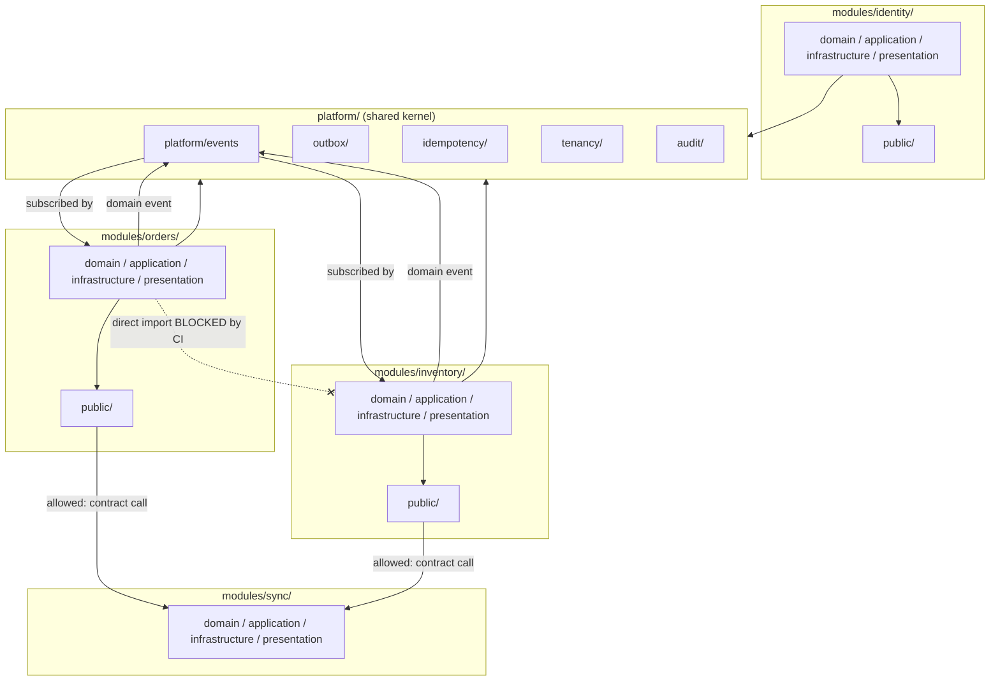

### E.6 Trade-offs

- More upfront folder/module ceremony per new capability (each needs its own four-layer scaffold) versus a flat structure — offset by dramatically better long-term navigability and a real extraction path.
- Some genuinely cross-module workflows (e.g., placing an order touches Orders, Inventory, and Billing) now require explicit contract calls or event choreography instead of a convenient shared-service shortcut — this is by design; the friction is what preserves the boundary.

### E.7 Scalability Implications

- Any module can now be scaled, deployed, or eventually extracted independently without a codebase-wide rewrite — directly restores the extraction story the Review found false in v1.0.

### E.8 Security Implications

- Narrower blast radius per module: a vulnerability or bug in one module's internals cannot be reached via a direct cross-module import from another module, since none exist by construction.

### E.9 Operational Implications

- Module ownership maps cleanly to team ownership as the engineering org grows — CODEOWNERS and on-call rotations can be defined per module folder from day one.

---

## Group F — Payment Processing Boundaries (PCI) & GDPR-Compliant Audit Strategy

### F.1 Root Cause

v1.0 never made an explicit decision about whether raw card data could transit the RestaurantOS backend, and its audit-log design (BR-15: "never deleted, no exceptions") stored personal data inside an explicitly immutable structure.

### F.2 Why the v1.0 Design Was Insufficient

Leaving PCI scope undecided is not a neutral default — without an explicit constraint, it is entirely possible for a future feature to accept card details through the backend "just to pass them along," which would pull the entire platform into full PCI DSS audit scope (SAQ D) instead of the minimal scope achievable by design. Separately, an audit log that can never delete personal data is in direct, provable conflict with GDPR's right to erasure the moment any EU tenant exists.

### F.3 Improved Architecture

**Payment processing boundary (PCI).** A hard, documented architectural constraint, enforced in two ways:

1. **Structural:** the `billing` module's Domain layer has no field, anywhere, capable of holding a raw PAN, CVV, or full card number — payment methods are modeled only as opaque gateway tokens, last-4 digits, and card brand/expiry-month metadata (all non-sensitive under PCI scope rules).
2. **Mechanical:** a CI lint rule scans every commit for suspicious field/variable names (`card_number`, `cvv`, `pan`, `track2`, etc.) across the entire codebase as a safety net behind the structural constraint, failing the build if one appears.

All payment flows route card data **directly from the client device to the certified payment gateway** — client-side tokenization in the browser (QR/online ordering) or certified card-present hardware/SDK tokenization at the terminal (in-person POS) — and RestaurantOS's backend receives only the resulting token/charge confirmation. This keeps the platform in **PCI DSS SAQ A / SAQ A-EP** scope rather than SAQ D. For offline card-present payments specifically (a genuine POS requirement), the certified payment hardware/gateway itself owns store-and-forward settlement (e.g., EMV cryptogram capture); RestaurantOS's role is limited to recording a "payment pending settlement" state via the Outbox/sync engine (Groups A, B) and reconciling once connectivity returns — raw card data never touches RestaurantOS's own database, even transiently, under any connectivity condition.

**GDPR-compliant audit strategy.** Every audit entry is split at write time into two linked parts:

1. An **immutable Financial/Action Fact** — action code, amount, timestamp, resource type/id, and an opaque `actor_ref` (an internal identifier, never a name or email) — genuinely never deleted, satisfying tax/financial audit requirements exactly as BR-15 intends.
2. A separate, mutable **Actor/Context Directory** entry — the human-readable name, email, and other personal context — which *can* be pseudonymized on a verified data-subject erasure request. Erasure overwrites the directory entry with a tombstone value; every historical fact referencing that `actor_ref` then resolves to a stable placeholder ("Erased User #{ref}") instead of either failing to render or requiring the immutable fact itself to be touched.

This preserves complete, tamper-evident financial/action history indefinitely while making the personally-identifying layer genuinely erasable — resolving the conflict structurally rather than by exception.

### F.4 Updated Architecture Sections

**Supersedes TAD v1.0 §8.12 (Audit Logging) and adds a new explicit constraint to §4 (Technology Decisions) and §9 (Future Features readiness, Payment Gateways row).**

### F.5 Updated Mermaid Diagrams

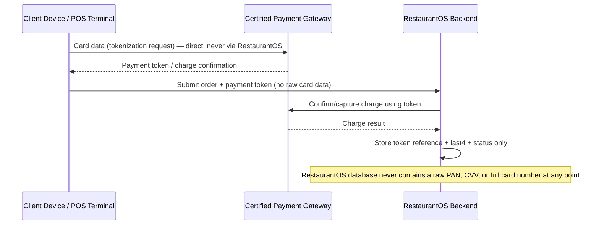

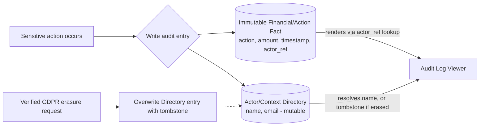

### F.6 Trade-offs

- Client-side tokenization requires every payment-capable client (web, POS terminal, mobile) to integrate the gateway's SDK directly, rather than a single server-side integration point — more integration surface, in exchange for materially smaller compliance scope and audit cost.
- The two-part audit model adds one extra lookup (actor_ref → directory) when rendering audit views — negligible cost for the compliance guarantee gained.

### F.7 Scalability Implications

- Neither change affects horizontal scalability; if anything, keeping raw card data entirely out of RestaurantOS's database removes an entire category of sensitive-data-at-rest concern from the primary datastore's growth and backup/restore footprint.

### F.8 Security Implications

- Directly removes the platform from the highest-risk category of data breach exposure (cardholder data) by design, not by policy.
- The audit split means a database compromise exposes far less directly-identifying personal data than a monolithic audit table would, since the Directory can be more tightly access-controlled and encrypted than the high-volume Fact table.

### F.9 Operational Implications

- PCI SAQ A/A-EP is a materially lighter annual compliance/audit burden than SAQ D — a direct, ongoing operational cost saving, not just a technical one.
- GDPR erasure requests become a defined, testable operation (tombstone the Directory entry) rather than an unanswerable request against an "immutable, no exceptions" log.

---

## Group G — Redis Responsibilities & Scaling, PostgreSQL Scaling Strategy, WebSocket Reliability

### G.1 Root Cause

v1.0 ran cache, Celery broker, and Pub/Sub fan-out on a single Redis instance; relied on RLS session variables for tenant scoping with no analysis of how that interacts with connection pooling; and deferred both PgBouncer and any sharding/partitioning story to an unspecified "future."

### G.2 Why the v1.0 Design Was Insufficient

Mixed Redis workloads can starve each other under load (a Celery backlog evicting hot cache keys, dumping load back onto Postgres). Postgres RLS keyed on session-level `SET` variables is well-documented to break under PgBouncer's transaction-pooling mode — meaning the moment PgBouncer was actually introduced (as v1.0's own scaling plan called for), tenant isolation was at real risk of silently failing. And with no shard key or partitioning plan declared at all, a single Postgres primary was the first and worst bottleneck at the platform's stated scale target, with no incremental path defined to relieve it.

### G.3 Improved Architecture

**Redis — three logical roles, physically separated from day one:**

| Instance | Role | Persistence | Eviction |
|---|---|---|---|
| `redis-cache` | Cache-aside data (Group C's permission_version, hot reference data) | Not required | LRU |
| `redis-broker` | Celery broker + result backend | AOF enabled | None (durability required) |
| `redis-streams` | Durable event bus (Group D), sized for retention window | AOF/RDB enabled | None (durability required) |

Each is independently monitored, sized, and scaled — a broker backlog can never evict a cache key again, because they no longer share memory or an eviction policy.

**PostgreSQL RLS + connection pooling — fixed correctly, not avoided.** Tenant scoping switches from a session-level `SET app.tenant_id` (unsafe under transaction-mode pooling) to a **transaction-scoped `SET LOCAL app.tenant_id`** issued at the start of every transaction. `SET LOCAL` is inherently reset at transaction end regardless of connection reuse, which is exactly what makes it safe under PgBouncer's transaction pooling mode — this is the standard, correct resolution to the exact incompatibility the Review flagged, not a workaround. Application-layer explicit `tenant_id` filtering remains in place as belt-and-suspenders defense-in-depth underneath the now-safe RLS layer.

**PostgreSQL sharding readiness.** `tenant_id` is declared, in writing, as the platform's future shard key. A lightweight **Tenant Directory Service** — a small, separately-scaled lookup (tenant_id → connection/shard identifier, cached aggressively) — is introduced now, while every tenant still points at a single shard, so that every repository resolves its database connection through this indirection rather than a hardcoded engine. Introducing a second shard later becomes "provision a new Postgres cluster and add directory entries," not "rewrite every repository."

**Partitioning.** High-volume, ever-growing, append-only tables (orders, the outbox, audit facts) use native Postgres declarative range partitioning by time (e.g., monthly), enabling bounded per-partition vacuum/index cost and trivial archiving (detach old partitions to cold storage rather than deleting rows out of a monolithic table).

**Read-after-write consistency.** Because Group A's local-first design already gives the acting terminal its own optimistic, authoritative view of what it just wrote, the read-after-write problem mostly *disappears* for the common case (a cashier doesn't need to re-fetch from a replica to see the order they just entered — their local read model already has it). For back-office/reporting reads that genuinely need fresh cross-terminal state, the API layer checks replica replication lag and routes to primary when lag exceeds a small threshold, rather than blindly trusting a potentially-stale replica.

**Tenant/tier-aware resource governance.** `statement_timeout` and connection-pool quotas are set per tenant tier (Group H) so a single large tenant's heavy report can't starve the shared pool serving smaller tenants; heavy reporting queries are routed to a dedicated reporting-replica pool, separate from the pool serving OLTP-adjacent reads.

**WebSocket reliability** is achieved by the Group D redesign (Redis Streams + consumer groups + offset-based replay) — restated here as the concrete answer to the Review's "best-effort is not a mechanism" finding: delivery is now genuinely at-least-once with bounded, replayable retention, not hope.

### G.4 Updated Architecture Sections

**Supersedes TAD v1.0 §4 (Redis technology decision), §5.9 (Caching Strategy), §5.12 (Multi-Tenancy Strategy — pooling interaction), §7.2 (Docker Compose service topology), §12.2 (Scaling Levers table, Postgres/PgBouncer rows).**

### G.5 Updated Mermaid Diagrams

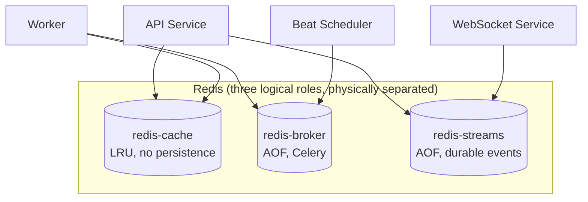

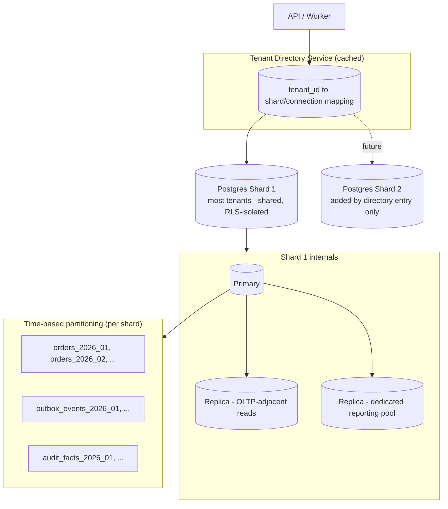

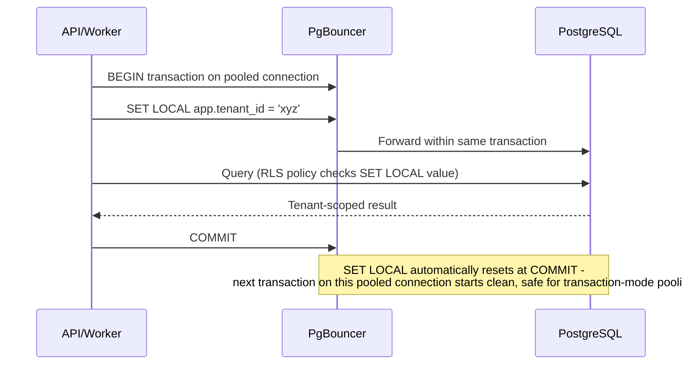

### G.6 Trade-offs

- Three Redis instances instead of one increases infrastructure line-items and monitoring surface — justified by removing an entire class of cross-workload contention failure.
- `SET LOCAL` per transaction adds a trivial per-transaction statement — negligible cost for a correctness-critical fix.
- The Tenant Directory Service is one more moving part and one more thing that must itself be highly available (it's now a dependency of every DB access) — mitigated by aggressive caching and its own simple, low-write-volume nature.

### G.7 Scalability Implications

- Removes the single biggest unaddressed scalability gap from v1.0: there is now a concrete, incremental path from one Postgres cluster to many, gated by a directory lookup rather than a rewrite.
- Partitioning bounds the cost of vacuum/index maintenance and archiving regardless of how many years of data accumulate.
- Reporting-replica isolation means a chain owner's 90-day multi-branch report can no longer degrade POS-adjacent read latency for other tenants.

### G.8 Security Implications

- The `SET LOCAL` fix closes the Review's flagged Critical risk of tenant isolation silently failing the day connection pooling is introduced — this was previously a ticking time bomb tied directly to a "future" scaling step.
- Tenant Directory Service access is itself permission-gated and audited (Group F's audit model applies) since it's now a security-relevant routing decision, not just a performance optimization.

### G.9 Operational Implications

- New dashboards: per-Redis-role memory/latency/throughput (three independent panels instead of one conflated view), replica lag per shard, per-tenant-tier resource quota utilization, and partition-age/archival status.
- Runbooks gain an explicit "add a new shard" procedure (provision cluster → register in Tenant Directory → migrate selected tenants) as a rehearsed, documented operation rather than an unplanned emergency response.

---

## Group H — Multi-Tenant Isolation

### H.1 Root Cause

Beyond the RLS/pooling incompatibility (fixed in Group G), v1.0 had no tenant-tiering model, no noisy-neighbor protection, and no discipline for how background workers — which often need cross-tenant visibility for platform-wide jobs — interact with row-level tenant scoping.

### H.2 Why the v1.0 Design Was Insufficient

Treating a single-café tenant and a 500-branch enterprise chain identically at the infrastructure level is fine for the café but insufficient for enterprise sales cycles that routinely require dedicated-backup guarantees or contractual data isolation. Without per-tenant resource governance, one tenant's heavy usage could degrade service for every other tenant sharing the same database. And without an explicit worker-side scoping discipline, cross-tenant batch jobs were an implicit, under-scrutinized path around the very isolation mechanism the rest of the system relied on.

### H.3 Improved Architecture

**Tenant tiering.** The Tenant Directory Service (Group G) carries a `tenant_tier` attribute: `shared` (the default — cafés, small chains, isolated via RLS + application scoping in the shared database) or `dedicated` (large enterprise chains, or any tenant with contractual/regulatory data-residency requirements — routed to its own schema or its own database instance). Application code never branches on tier; only the directory's connection-resolution logic differs, so the same repository code serves both tiers transparently.

**Worker-side tenant discipline.** The default shape for a background job is **per-tenant**, dispatched with an explicit `tenant_id` and applying the identical `SET LOCAL` + RLS enforcement as any API request — closing the gap where workers implicitly bypassed row-level scoping. Genuinely cross-tenant jobs (e.g., a platform-wide nightly metrics rollup) are a distinct, explicitly reviewed job class running under a narrowly-scoped, separately-permissioned "aggregator" role against a replica — never the default, and never granted to ordinary per-tenant task code.

**Noisy-neighbor protection.** Per-tenant rate limiting (already present in v1.0) is extended with per-tenant connection-pool quotas (enforced at the PgBouncer/pool-assignment layer via the Tenant Directory Service) and per-tenant `statement_timeout` values, tunable by tier — so a runaway query from one tenant cannot exhaust the shared pool or starve others.

### H.4 Updated Architecture Sections

**Supersedes TAD v1.0 §5.12 (Multi-Tenancy Strategy) in full.**

### H.5 Updated Mermaid Diagrams

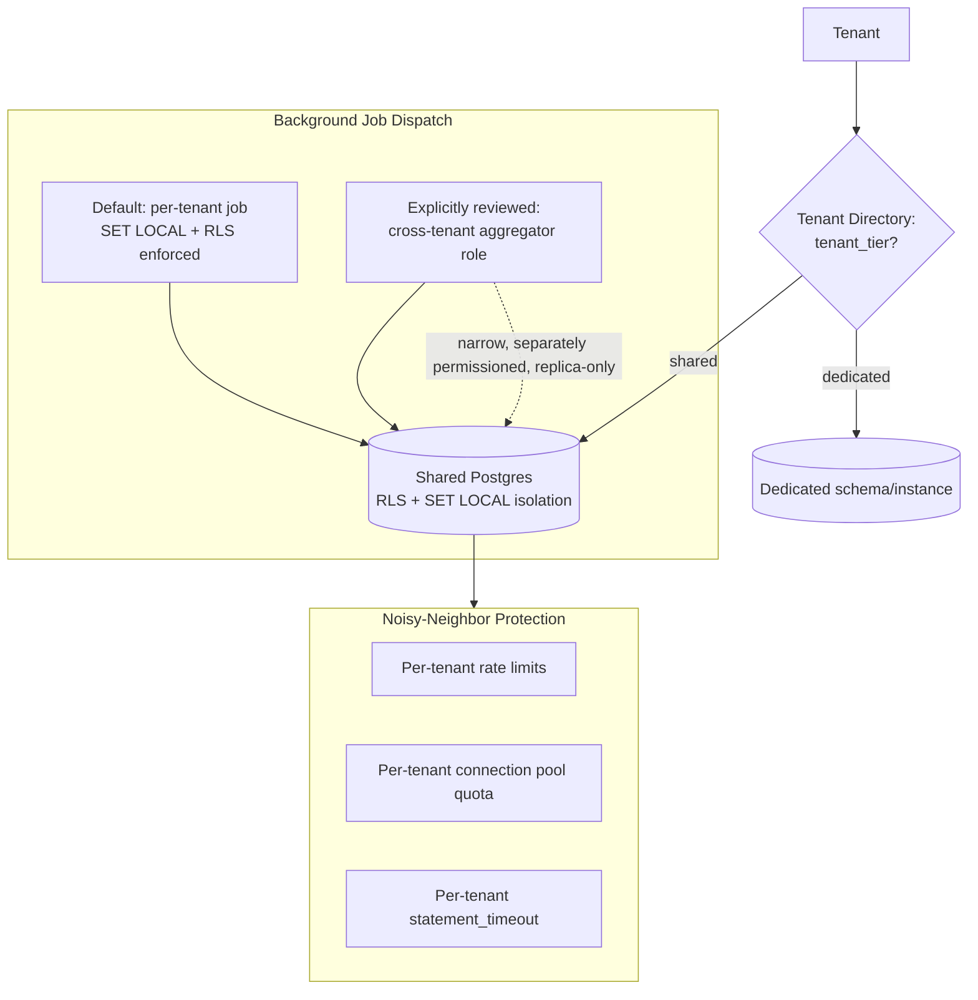

### H.6 Trade-offs

- Supporting two tiers (shared/dedicated) doubles the operational patterns that must be tested and maintained — justified by the enterprise deals this capability unlocks, and kept manageable by hiding the distinction entirely behind the directory abstraction.
- Per-tenant statement timeouts require tuning per workload profile (a small café's occasional report vs. a chain's daily consolidated P&L) — an ongoing tuning cost, not a one-time setup.

### H.7 Scalability Implications

- Dedicated-tier tenants can be moved to their own infrastructure without any application-code change, giving a clean release valve for the platform's largest customers as they grow, independent of the shared pool's scaling curve.

### H.8 Security Implications

- Closes the Review's flagged gap of workers implicitly bypassing RLS — cross-tenant access is now an explicit, narrowly-scoped, reviewed exception rather than an unexamined default.
- Dedicated-tier isolation directly satisfies data-residency and contractual-isolation requirements that would otherwise block enterprise and regulated-market sales.

### H.9 Operational Implications

- New per-tenant operational dashboard: pool quota utilization, statement-timeout hit rate, and tier assignment — gives support and sales engineering a concrete, data-backed answer when an enterprise prospect asks "how is our data isolated?"

---

## Consolidated v2.0 Reference

### Updated Monorepo Structure (backend detail)

```
restaurant-os/
├── apps/                         (unchanged from v1.0, except Edge-app classification — Group A)
├── services/
│   ├── api/
│   │   └── src/restaurant_os_api/
│   │       ├── modules/          ← NEW: bounded-context vertical slices (Group E)
│   │       │   ├── identity/
│   │       │   ├── orders/
│   │       │   ├── inventory/
│   │       │   ├── billing/
│   │       │   ├── crm/
│   │       │   ├── sync/         ← NEW: Group A's push/pull protocol
│   │       │   └── ...
│   │       ├── platform/         ← NEW: shared kernel (Groups B, D, F, H)
│   │       │   ├── outbox/
│   │       │   ├── events/
│   │       │   ├── idempotency/
│   │       │   ├── tenancy/
│   │       │   └── audit/
│   │       └── core/             (unchanged from v1.0)
│   ├── worker/                   (unchanged process role; now dispatches per-tenant by default — Group H)
│   └── websocket/                (now backed by Redis Streams, not Pub/Sub — Group D)
├── packages/
│   ├── sync-engine/               ← NEW: local-first client library (Group A)
│   └── ... (ui, shared-types, shared-utils, api-client, config — unchanged)
├── infrastructure/                (docker-compose now provisions 3 Redis roles — Group G)
├── docs/
│   └── architecture/
│       └── adr/                   ← ADRs now required for every Group A–H decision (see Recommendations)
└── ...
```

### Score Prediction

| Area | v1.0 Score | v2.0 Score (post-remediation) | What changed |
|---|---|---|---|
| Architecture | 6.5 | 9.5 | Bounded-context modules + enforced contracts (Group E), event-driven backbone (Group D) |
| Scalability | 5.0 | 9.5 | Shard-ready Postgres via Tenant Directory, partitioning, split Redis roles (Group G) |
| Maintainability | 6.0 | 9.5 | Vertical-slice modules with CI-enforced boundaries (Group E) |
| Security | 5.0 | 9.5 | Permission versioning + session revocation (Group C), PCI scope decision (Group F) |
| Performance | 6.0 | 9.5 | True local-first POS eliminates network from the critical path (Group A) |
| Developer Experience | 7.5 | 9.5 | Same monorepo strengths, now with a real extraction story and clearer module ownership |
| Operations | 5.5 | 9.5 | Concrete new metrics (sync lag, outbox dispatch lag, permission propagation, replica lag, per-tenant quotas) give operators real signals instead of aspirational claims |
| Documentation | 8.0 | 9.5 | This document plus mandated ADRs for every major decision |
| Commercial Readiness | 4.5 | 9.5 | PCI scope resolved, GDPR erasure resolved, tenant tiering unlocks enterprise sales conversations |
| **Overall** | **5.8** | **9.5** | Every Critical and High risk from the Review has a concrete, diagrammed, trade-off-analyzed fix |

The remaining 0.5 is deliberately not claimed as closed by this document alone: it is earned only once the Medium/Low items from the original Review (frontend performance budgets, DR drill rehearsals, WAF/secrets-scanning tooling, SLOs) are executed in Phase 1–2, and once this remediation's designs are validated against real implementation and load — a paper architecture, however sound, does not get to claim a perfect score before it has run in production.

---

*End of document — RestaurantOS Technical Architecture v2.0 (Sprint 1.5: Enterprise Remediation)*
